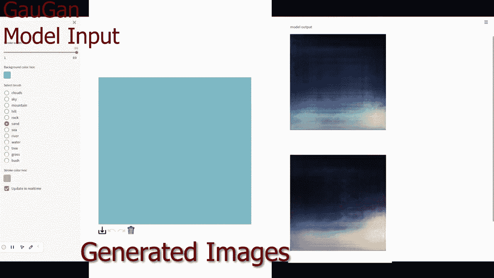
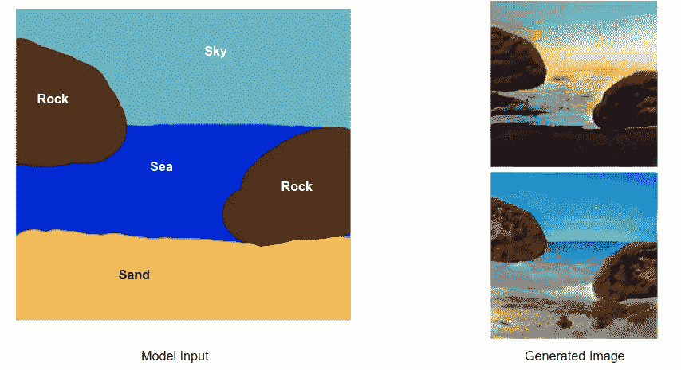
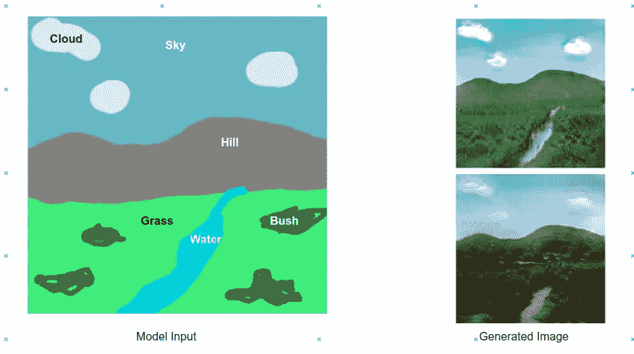
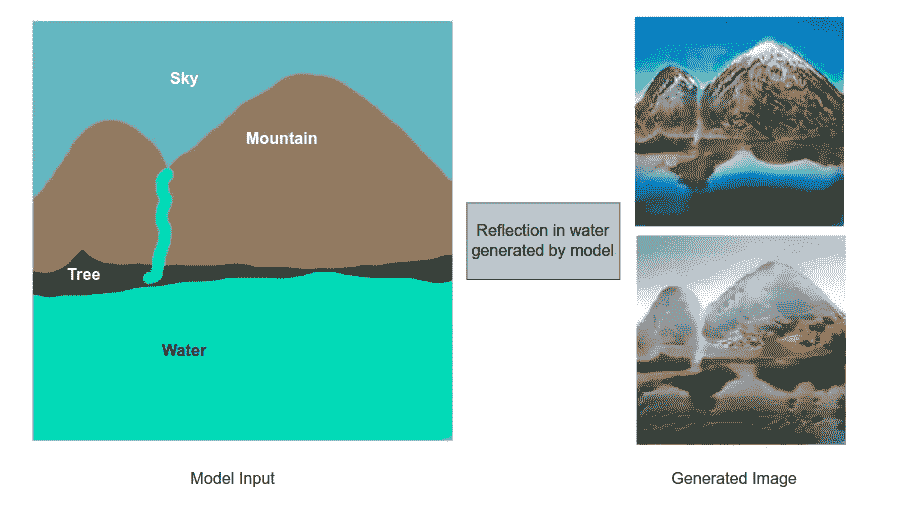
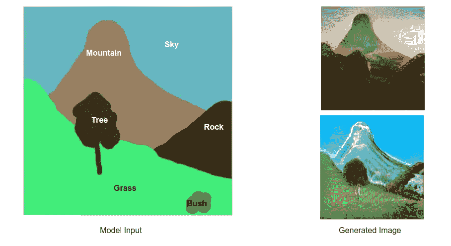

# GauGan:从图形生成照片级真实感图像

> 原文：<https://medium.com/analytics-vidhya/gaugan-generating-photorealistic-images-from-drawings-7eac091f6c7f?source=collection_archive---------2----------------------->

在自定义景观数据集上实现 NVIDIA 的 GauGan。从绘图中生成照片级真实感图像

生成对抗网络(GAN)已经被证明在产生惊人的生成模型方面非常强大，这些生成模型可以制作音乐、写诗，甚至生成看起来非常真实的人脸。

> *“机器学习近 10 年最有趣的想法”——阎乐存*

自 Ian Goodfellow 于 2014 年推出以来，GANs 在过去几年中一直非常受欢迎。

我认为 GAN 受欢迎的主要因素之一(除了它的有效性之外)是其设计的简单性和直观性。

GAN 通常包括 2 个神经网络:

1.发电机

2.鉴别器

古德费勒说，训练过程可以被认为是“*伪造者和警察之间的竞赛。"*伪造者想制造假币，让它看起来像真的，而警察想查看任何特定的钞票，并确定它是否是假的。**

在这里，生成器是试图生成一些假数据的伪造者。鉴别器学习如何确定生成的数据是否是假的。这个过程反复发生，鉴别器和生成器的工作都越来越好。也就是说，鉴别器变得非常擅长识别虚假数据。这将推动生成器生成看起来非常真实的数据。

> 在本文中，我将演示 NVIDIA 的 Gaugan 的自定义实现。我的方法是浪费时间去阅读这篇论文(使用空间自适应归一化的语义图像合成),并尝试按照论文中描述的那样建立模型。我使用 pytorch 来实现

# 高根

Gaugan 使用一种特殊的标准化技术来提高数据质量。该生成器能够将语义图(绘图)作为输入，并生成真实感图像作为输出。此外，它还能够进行多模式图像合成，这意味着它可以生成各种不同风格的图像。所以对于同一个图纸，它可以生成多个图像。

GauGan 生成器-将绘图转换为图像

请参考 [my Github](https://github.com/kvsnoufal/GauGanPytorch) 了解架构和实现的全部细节。

在我的实现中，我从 kaggle 下载了一个风景图像数据集，并使用一个预训练的语义分割模型(deeplab v2)来生成图像的语义图。这是我如何编译数据集的。

这个数据集然后被用来训练 gaugan。以下是一些结果:

这个模型是在我的家用电脑上，在有限的时间内，在一个仓促拼凑的数据集上进行训练的。通过适当地管理数据集，并在更大的数据集上对其进行训练，可以改善结果。

**Github 回购:**https://github.com/kvsnoufal/GauGanPytorch T2

**巨人的肩膀:**

1.  具有空间自适应归一化的语义图像合成([论文](https://arxiv.org/abs/1903.07291)
2.  官方 Github 实现:[https://github.com/NVlabs/SPADE](https://github.com/NVlabs/SPADE)
3.  在喀拉斯实施:[https://keras.io/examples/generative/gaugan/](https://keras.io/examples/generative/gaugan/)
4.  Flickr 风景数据集:[https://www.kaggle.com/datasets/arnaud58/landscape-pictures](https://www.kaggle.com/datasets/arnaud58/landscape-pictures)
5.  语义分割的 DeepLab 模型:[https://github.com/kazuto1011/deeplab-pytorch](https://github.com/kazuto1011/deeplab-pytorch)

> ***关于作者***
> 
> 我在阿联酋迪拜控股公司担任首席数据科学家。你可以在 kvsnoufal@gmail.com 联系我或者在 https://www.linkedin.com/in/kvsnoufal/联系我