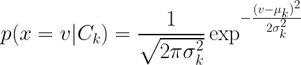

# C++中的高斯朴素贝叶斯分类器

> 原文：<https://medium.com/analytics-vidhya/gaussian-naive-bayes-classifier-in-c-846e9a22aefc?source=collection_archive---------9----------------------->


贝叶斯统计

# 目标

基于条件概率的贝叶斯定理在 C++中从头构建一个分类器，而不需要使用 Eigen 这样的外部第三方库！从头开始纯粹而有趣的编码。

# 介绍

高斯朴素贝叶斯(GNB)是一种使用[条件概率确定结果的概率方法。](https://en.wikipedia.org/wiki/Conditional_probability)顾名思义，它是“幼稚的”,因为它强烈假设“特征”都是相互独立的，并且具有由给定类别“c”和特征“x”的高斯分布定义的可能性。

# 该算法

这一节首先讨论条件概率的理论，然后讨论它的实现

## 理论

因为 GNB 是基于条件概率模型的，所以首先用简单的词语，然后用数学符号来表达手头的问题是非常简单的。

基本上，


让我们定义一些变量。

CK—K 个可能类别中的每一个
n —特征数量
x —特征

利用这一点，我们可以定义要分类的问题，


其中，每个“x”是独立的特征。这是条件概率的朴素贝叶斯定理的基本假设。利用这一点，基本方程可以用数学符号表示。[ [1](https://link.springer.com/chapter/10.1007/978-0-85729-495-1_4)


分数的分子很重要，因为分母只是一个归一化项。因此，它可以写成:


使用链式法则，它可以扩展为:


天真的条件独立性假设导致:


因此，联合概率模型简化为:


其中 N 是归一化因子


**分类**

为了建立分类器，使用计算出的概率的最大值来确定预测的类别。


**培训**

当训练数据以连续属性“x”为特征时，假设分布为**正态**。所以下一步就是计算每一类中 **x** 的方差(σ _k)和均值(μ_k)。哪里；



计算出的值将导致每个类别的**先验**概率。[ [1](https://link.springer.com/chapter/10.1007/978-0-85729-495-1_4)

## 履行

实现可以在这个[库](https://github.com/Aparajith-S/Gaussian_Naive_Bayes)中找到。

**注意:**在存储库中，可以找到分别在“classifier.h”和“classifier.cpp”中定义了 **GNB** 的源代码。从应用的角度来看，只需要 **GNB::训练(…)** 和 **GNB::预测(…)** 就可以了，但这不是我们的目标。目标是理解为了实现 GNB 分类器已经做了什么。

其中的函数

```
void CalcStatistics(const vector<vector<double>>& data,                               const vector<string>& labels);
```

负责计算先验概率。通过存储每类(即标签)C_k 的标准差(σ_k)和均值(μ_k)

**GNB::预测(…)** 函数接收测试样本并预测标签。

这将计算测试样本相对于所有标签的概率。

这当然需要使用之前讨论过的高斯分布即正态分布来计算概率。

```
double GNB::gaussian(double x, double mu, double sigma) const                       {                           double expr1 = 1.0 / sqrt(2 * M_PI);                             double expr2 = pow((x - mu) / sigma, 2)*-0.5;
return (expr1 / sigma) * exp(expr2);   
}
```

下一个重要的步骤是采用 argmax。这将完成分类器的实现

# 数据

GNB 适用于连续的要素输入。因此，使用不同车道中的车辆的轨迹数据，在道路上进行发现目标车辆的车道变换意图的实验。如图所示，有三种可能的标签。

‘保持’—保持车道，即不变道(黑色)
‘右’—向右变道(红色)
‘左’—向左变道(蓝色)


图 1:样本生成的数据

这些数据被分成两个文件，正如您在[存储库/数据](https://github.com/Aparajith-S/Gaussian_Naive_Bayes/tree/main/data)中看到的:

```
// load the train and test data
vector<vector<double> > X_train = Load_State("../data/train_states.txt");                         
vector<vector<double> > X_test  = Load_State("../data/test_states.txt");                         
vector<string> Y_train = Load_Label("../data/train_labels.txt");                         vector<string> Y_test  = Load_Label("../data/test_labels.txt");//Training
GNB gnb = GNB();                                                  gnb.train(X_train, Y_train);//Predictions
int score = 0;                         
for (int i = 0; i < X_test.size(); ++i) {
vector<double> coords = X_test[i];
string predicted = gnb.predict(coords);
//find accuracy.
if (predicted.compare(Y_test[i]) == 0) 
{
score += 1; 
}                         
}                                                 
float fraction_correct = float(score) / Y_test.size(); 
```

**fraction_correct** 给出分类器的精确度。

在构建和运行项目之后，人们应该可以看到分类器在准确性方面的性能。


# 摘要

因此，详细说明了简单高斯朴素贝叶斯分类器的设计和实现，并简要讨论了其在发现车道变换意图中的应用。

# 参考

1.  穆尔蒂·纳拉辛哈；德维诉苏谢拉。*模式识别:算法方法*。斯普林格科学&商业媒体，2011 年。
2.  朴素贝叶斯文本分类的事件模型比较。参加: *AAAI-98 文本分类学习研讨会*。1998.第 41 至 48 条。
3.  数据由一门课程提供[https://www . uda city . com/course/自驾-汽车-工程师-纳米学位- nd013](https://www.udacity.com/course/self-driving-car-engineer-nanodegree--nd013)