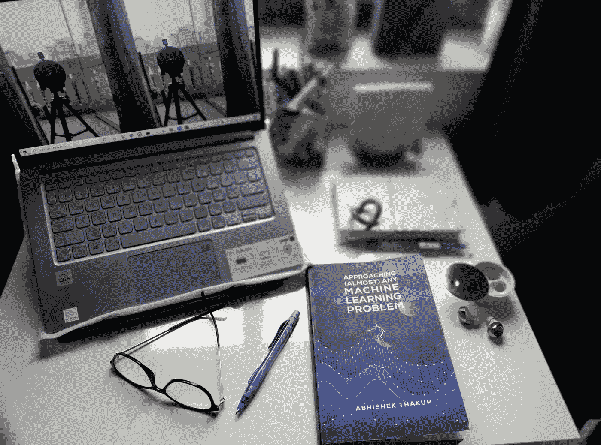
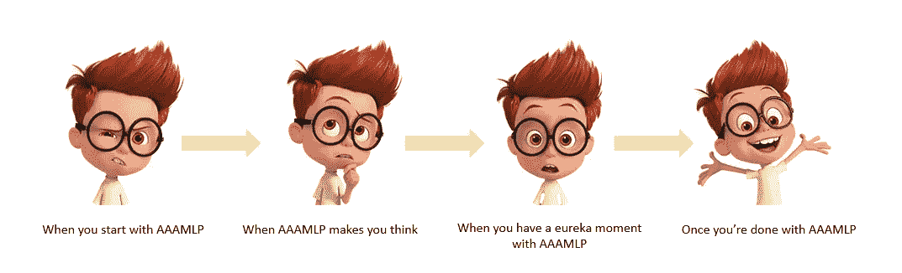
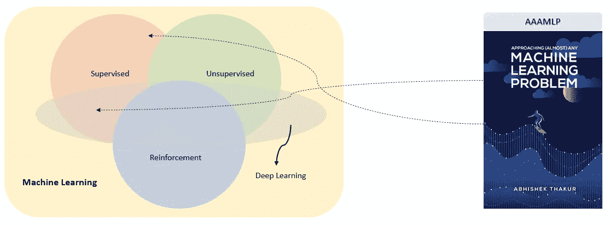

# #GeekyStories — 1.0 |“接近(几乎)任何机器学习问题(AAAMLP) — Abhishek Thakur”

> 原文：<https://medium.com/analytics-vidhya/geekystories-1-0-approaching-almost-any-machine-learning-problem-aaamlp-abhishek-thakur-897609f4fe7d?source=collection_archive---------4----------------------->

> “所以，这有点像一个带有 3 个号码盘的密码锁的手提箱。然而，一个 3 拨码的密码锁只有一个正确答案。这个模型有许多正确的答案。那么，你如何找到最佳参数？”阿布舍克·塔库尔

# 首先，这个#(标签)是怎么回事？

这是我开始的一个*回顾*系列，分享我在 ML/AI 领域提升理解和知识的经历——通过书籍(主要是)、GIT 知识库或研究论文或任何其他媒介(当然取决于我自己的旅程！).

我知道我的文章只是每天(而不是每小时或每秒)发表的无数文章中的一篇？)，它可能会在这两者之间迷失——但我想向每个人传达的是，从我接触的每本书(或任何其他媒体)中(因为“亲身体验”*双关语*)只是你是否应该花时间阅读的**决定**——*。*我想节省您的时间——根据您在 ML 旅程中所处的阶段。为什么？因为世界上发生了太多的事情，我们需要更多的头脑聚集在一起快速有效地解决问题。我们还有时间浪费吗？

这不是官方评论，我也不是专业作家。

我就是喜欢写作，喜欢机器学习。

**免责声明:**标题中的“1.0”只是表示这是该系列的第一篇综述。这并没有描绘出*顺序*，即人们应该在现场提高技能或学习的顺序。*这正是我探索的顺序。我会提到一本书或任何其他媒介能传递什么，不能传递什么——所以根据你的喜好来选择。*

随着我不断给这个系列添加评论——我将开始在每个评论的末尾添加链接，供您查看！

好了，谈够了，让我们开始干正事吧！

# AAAMLP 的书

我将开门见山地说——*它真的有助于读者推断如何* **处理(几乎)任何** *机器学习问题吗？*

答案是:有！确实如此。

如果我必须用一行写评论(就像我们看到的纽约最畅销的书评)，我会说:

去神秘化和彻底改变构建机器学习模型的整个体验，而没有遇到技术术语的恐惧——这是一部机器学习“故事书”。

首先，我将分解上面的**粗体**字来给你介绍这本书。

但是，在此之前，书中给出了一个小小的免责声明(不是真正的免责声明，但我确实对其中提到的想法产生了共鸣)——它说——*“如果你没有编码，你就没有学习”*(它作为一个介绍页底部的小注释给出，但这是你在阅读这本书时要记住的一件事——*阅读书中的每一行*)。

所以，重要的事情先来——*这是一本“边学边编码”的书*，充分利用这本书的最好方法就是完全照着做！(这确实也是成为 ML 专家的最好方法——另外，如果你正在使用这本书——你不能复制粘贴！我知道一种更严格的学习方法——但是相信我——当你编码的时候——它真的渗透进来了！)

现在，让我们回到**粗体**字。

# “接近”

首先要理解的是，这本书教读者— *如何看待或思考机器学习问题。*

所以…

## 什么不是？

这本书没有向你解释算法——它实际上*教你如何“处理”一个 ML 问题*,通过让你理解构建 ML 模型所涉及的不同方面，以及如何考虑这些方面中的每一个。

## 那是什么？

像这样的东西(**例子**)

1.  **当你要开始解决一个机器学习问题时，你首先要考虑的是什么？**该不该思考数据？如果是，那么你应该如何考虑这些数据——这是否取决于你首先考虑这些数据背后的目的(我知道这听起来很混乱)！例如，如果你为了交叉验证的目的而查看数据，你的思维过程会改变吗？当你考虑使用什么样的评估标准时，你的思维过程会有所不同吗？
2.  **您的机器学习问题是否仅包含创建一个单向或传统的管道**(即，在涉及几个预处理步骤后，您在训练集上训练您的模型，并在验证集上测试它)，并且您非常确定当该模型投入生产并投入使用时，新数据将完全符合您的管道？**或者您是否希望在训练**时数据中出现很少的“罕见类别”(可能在您的训练集中缺失但在您的新数据中出现的变量，或者在计数中很少)，因此您也需要考虑这一点？也许，通过连接训练集和测试集？如何知道你的数据中是否存在稀有类别的可能性？
3.  随机森林几乎是每个人的最爱——但是有时候(实际上是很多时候)——最简单的算法可以给出更好的结果，例如——逻辑回归。书中有一个例子可以反映这一点——所以我不担心说服你的想法，即使这是你第一次探索这些算法。

这些只是你可以嵌入到你的系统中的 1000 个(实际上是无数个)点中的 3 个简单点(不是机器学习系统！有点像你的身心系统)。它确实改变了你处理机器学习问题的方式。

**这是从你开始读这本书到你读完这本书的*过渡*:**

AAAMLP 之旅

# “(几乎)任何”

接下来要理解的是——虽然它说的是“(几乎)任何”但对我来说，它应该是*“几乎所有”*机器学习问题。

*(我想 Abhishek 可能想让标题中的词押韵，也不想听起来太自吹自擂，但我不介意在这里吹嘘它，所以..我是！)*

我为什么这么说？

一些事实。

是的，它不会以某种方式教你“一切”，它不会告诉你在每种情况下或每种类型的机器学习问题中使用什么，因为让我们接受它——无论我们如何将这种类型的问题分成所有不同的组——每个机器学习问题都有一些新的东西或可能包括额外的假设。所以，涵盖“一切”是不可能的。即使当我们将数据点聚类成组时——一个聚类中的每个数据点仅与同一聚类中的其他数据点“接近”或“相似”,因此与该聚类的质心“接近”或“相似”——而不是特别“相同”。

从技术的角度来看，这本书更多地围绕监督技术和问题，假设我们今天的大多数问题都是监督性质的。

也就是说，这绝不应该成为你不买这本书或觉得这本书不适合你的一个因素。我不确定是谁在读我的文章，但是我确信——你必须读这本书并使用它——如果你到目前为止还在读这篇文章的话。

现在，谈到它如何帮助解决“几乎所有”机器学习问题-

1.  AAAMLP 让你看到(第 2 章)——交叉验证**对所有机器学习问题有多重要，以及如果你跳过它或使用比如说“K-fold”而不是“分层 K-Fold”会发生什么。当然，它提到了分割数据、训练和测试你的模型的其他方式(他列出了“几乎”所有方式)，但它强调的是 *—* **“决定如何分割数据是多么重要”。****
2.  AAAMLP 让你看到(第 3 章)——对于所有机器学习问题来说，**评估指标**有多重要，以及如果你使用例如“准确性”而不是“AUC”会发生什么。当然，它提到了何时使用每种度量(分类与回归，两类与多类，单标签与多标签问题)，但它强调的是——**“决定——你将使用什么度量或置信度来验证模型——是多么重要”。**
3.  AAAMLP 让你看到(第 6 章)——数据集中的**类型变量**尤其是**分类变量**对于所有机器学习问题有多重要，以及如何处理它们。当然，它提到了何时使用每种数据编码方法(如果需要)，但它强调的是— **“决定如何预处理数据并将其构建到管道中，以便模型在看到新数据时不会失败，这是多么重要”。**
4.  AAAMLP 让你看到(第 7-8 章)-为所有机器学习问题提供**“足够”的功能**是多么重要，以及如何做到这一点(功能工程)和**通过删除不必要的附加功能**来建立平衡(功能选择)。当然，它提到了每种技术的重要潜在警告和警告，但它强调的是—“**理解它是多么重要—你应该在多大程度上使你的模型足够有意义，在哪个点上你应该停止使它变得复杂。”**
5.  AAAMLP 让您看到(第 9 章)—修改几个**【超参数】**是多么重要，就像它们被称为的那样，以识别一个*优化的模型*(找不到任何其他词抱歉！)以便给出更准确的预测并建立更稳健的模型。最重要的是，它强调的是— **“了解默认超参数并对其进行调整以使底层数据符合最佳算法是多么重要。”**
6.  AAAMLP 让你看到(第 10-12 章)——如何处理一个**图像分类**和**文本分类**的问题转移到**集合和堆叠**技术。它建立在不同的模型之上，并巧妙地引入深度学习(DL)技术来解决这些问题。最重要的是，它强调的是— **“解决此类问题的各种可能性是什么，以及 DL 轻松解决这些问题的力量和能力。”**

还有几章**其他章节**涉及**、【安排机器学习项目】、** ( *这一章实际上是我最喜欢的*)——这将帮助你构建你的项目，也模块化你的管道和**、【接近可复制代码和模型服务】**——这将帮助你了解 Docker 容器，并理解如何让你的模型更容易被其他在他们自己的系统上工作的人重用。

所以，你看**它涵盖了处理机器学习问题的“几乎所有”方面..只有更好！**

# 它是如何帮助我的？

1.  *对于一个开始*，其给了我一个**【重新开始】**地 ML。

我对 ML 并不陌生，但是有太多可以阅读的东西，太多学习 ML 的方法，你会迷失在什么是你的学习方法和什么是学习 ML 的正确方法之间。不仅如此，是否存在处理 ML 问题的**【单向】？当然不是。但是有没有一种“几乎”正确的方式接近它呢？也许吧，是的。这就是书给你的。**

**所以，这本书让我走上了正确的道路。我为什么这么说？嗯，我可能还不是一个 ML 方面的专家(即使在读完这本书之后)，但是我现在知道了，我接下来要做的是什么: **去追寻本书提出的在解决(几乎)任何 ML 问题时非常重要的东西。自然地，你会进入一个“ML 地带”——你开始把日常生活中的一切都视为 ML 问题，并想要解决它！现在有了正确的观点，我清楚地知道我还需要做什么。这难道不是一种解脱吗？****

***2。其次，* **它“诱惑着我”与初露头角的数据科学/机器学习爱好者分享我的学习**和旅程。**

**在过去的几周里，这本书一直是我的支持者，也是我强大的“ML 朋友”，在某种程度上，我开始意识到 *ML 作为一个领域的重要性，虽然熟练的技术和算法是至关重要的，但* *更重要的是你使用这些技术的方式。“学习”算法很容易，但从算法中“推断”却不容易，除非我们手头有正确的方法，并且“知道”我们在看什么。我几乎没见过教你这么做的书/材料。这让我想写作——这是我的#极客故事系列的第一本书。***

***3。第三*，它让我成为一个更好的**程序员！****

**它不仅帮助我在定义函数或创建结构化代码时简化了我的思维过程，而且我现在有了一个存储库，其中包含包装在不同类和函数中的小代码片段，可以执行任何(成熟的)机器学习问题的基本步骤。我所需要做的就是摆弄它，修改它以适应我正在构建的任何 ML 模型。很神奇，对吧？**

# **那么，在跳到这个之前，你需要有 ML 的先验知识吗？**

**嗯，**是也不是****

**正如在“方法”部分提到的，这本书不会向你解释算法。它有助于您确定构建稳定且健壮的 ML 模型的最佳方式。因此，一点意识(和一些耐心)肯定会有帮助。**

**也就是说，即使您是数据科学/ML 领域的新手，也不要担心！只要跟着 Abhishek 的代码走，它会带你经历一个 ML 问题的不同方面，你不会觉得一开始就钻研这本书是浪费时间！我对你的承诺。**

**如果有的话，它只会点燃你的好奇心荷尔蒙——甚至更多！**

**(我需要温习的东西很少，所以我把它们做了标记，以便在我有更多理解的时候再去温习。这本书的最后有几页供你记笔记:)好好利用它们吧！)**

# **我对 AAAMLP 的评分？**

****

## **为什么不是 4.5？**

**因为离 5 点太远了！这本书确实如标题所承诺的那样！**

**(这是一个没有经验的作者写的一篇文章——我希望我不会因为没有遵循给一本书评级的专业准则而受到惩罚！)**

## **如果我这么喜欢它，为什么不是 5？**

**这本书目前着眼于以下几点-**

****

**AAAMLP 的范围**

****我错过了无监督学习。**这仅仅是因为，*我也很想阅读 Abhishek 对无监督技术的看法*，因为我认为他在捕捉有监督和深度学习模型的工作方法方面做得非常好。**

# **你在哪里可以找到这本书？**

**如果你是一个**赌注登记经纪人**(喜欢逐字翻页，用铅笔/钢笔划线，为重要的东西画小星星)，当然，你会在亚马逊上找到它——对于印度——这里，对于其他人——这里。**

**如果你想要免费的**书**并且不介意在你的笔记本电脑上阅读**软拷贝**并且跟着编码(是的，它也是免费的——但是相信我得到硬拷贝会像金子一样)，你可以在这里找到它。**

# **下一步是什么？**

**虽然我将很快进入下一次阅读，但我计划重新开始几个开源项目——特别是文本和图像分类——因为 Abhishek 的书激起了我的兴趣(以及我个人对天文学的兴趣！).**

**请随时关注我的页面，我可能会发布一些你感兴趣的内容。**

**直到下一次，保持安全——保持微笑，微笑，甚至微笑(最后一个对我来说是绕口令)。**