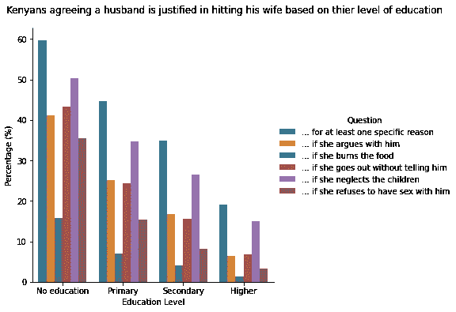
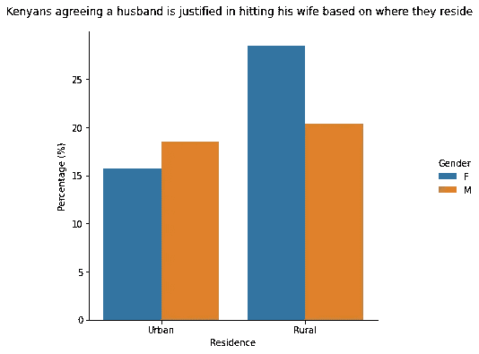
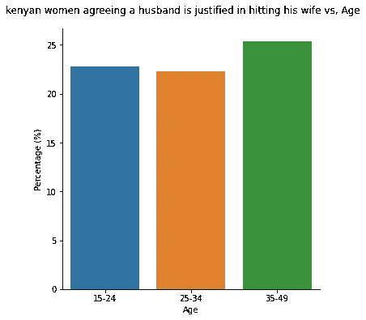
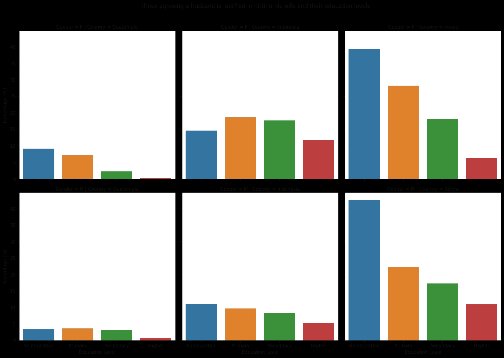

# 基于性别的暴力:肯尼亚与世界其他地方的比较。

> 原文：<https://medium.com/analytics-vidhya/gender-based-violence-how-kenya-compares-with-the-rest-of-the-world-12cf08118d50?source=collection_archive---------10----------------------->

图片来自:[国际自然保护联盟(IUCN)](https://www.iucn.org/news/gender/201811/16-days-activism-shine-a-spotlight-gender-based-violence-gbv-and-environment)

每当我们听到性别暴力，大多数人都认为是男性传播的。然而，正如我们将看到的，情况并非总是如此。性别暴力在社会中有多种表现形式。在大多数情况下，其受害者是妇女和女孩。

*-* ***性暴力:强奸、强迫性行为、不受欢迎的性挑逗、儿童性虐待、强迫婚姻、街头骚扰、跟踪、网络骚扰***

***-伴侣暴力:殴打、精神虐待、婚内强奸、杀害妇女***

***——以性出口为目的的人口贩运***

***——FGM***

***——童婚*** *。*

1993 年，联合国大会将暴力侵害妇女行为定义为 ***“导致或可能导致妇女遭受身体、性或心理伤害或痛苦的任何基于性别的暴力行为，包括威胁实施此类行为、胁迫或任意剥夺自由，无论发生在公共生活还是私人生活中。”；在这种情况下，我将根据教育水平和居住地等因素，重点关注身体虐待以及两性如何看待它。***

我将关注的国家是肯尼亚。我还会把它和其他两个不同大洲的国家进行比较。

> 联合国致力于通过大会 1993 年发布的《消除对妇女的暴力行为宣言》,确保消除世界上对妇女和女孩的暴力行为。

我将努力回答的问题:

1.  基于受教育程度，肯尼亚人认为丈夫打妻子是正当的，有哪些常见原因？
2.  在丈夫是否可以以任何理由打妻子的问题上，年龄或居住地会影响他们的正当性吗？
3.  *肯尼亚与南美的危地马拉和亚洲的印度尼西亚相比如何？*

# 第一个问题试图理解为什么大多数人认为一个男人打他的妻子是正当的，他找到了五个原因。

支持丈夫打妻子的理由

这些是:

> 如果她和他争吵
> 
> *-如果她烧焦了食物*
> 
> *-如果她没有告诉他就出去了*
> 
> *——如果她忽略了孩子*
> 
> *-如果她拒绝与他发生性关系*
> 
> *-至少有一个具体原因*

总体趋势和认同度随着被调查者的教育水平而降低。没有受过正规教育的人比受过小学、中学和高等教育的人更认同这些原因。

大多数受访者还认为，如果妻子忽视孩子，丈夫打妻子是合理的，而少数人认为，如果妻子烧焦了食物，就应该打她。

根据教育水平，如果一个女人拒绝与丈夫发生性关系，那么随着教育水平的提高，打她的理由明显减少。这些观点来自两种性别。

## 在第二部分中，我试图理解男性和女性对丈夫以住所为由打妻子的正当理由的感受。

从城市来看，更多的男性认为丈夫有理由以任何理由打妻子，而女性不同意。然而，这种差异并不像预期的那样显著。

比较居住地和两性对因任何原因殴打妻子的感受。

当谈到农村居民的反应时，更多的妇女认为男人打妻子是正当的。在这种情况下，百分比差异很大，因为同意这一观点的女性占受访者的 25%以上，而男性占 20%。在这种情况下，可以看到一个显著的差异，更多的男人认为丈夫没有理由打女人，而女人认为丈夫有理由打女人。*(我有偏见，并期望更多的男人站在赞同的一边)*

我关注的另一个重要方面是年龄如何影响受访者的立场。在这种情况下，我主要关注女性的回答。

不同年龄组的女性对丈夫出于任何原因打妻子的行为有什么不同的看法

从图表中可以看出，年轻女性不认为丈夫打妻子是正当的，而年龄在 35-49 岁之间的年长女性认为，如果妻子犯错，丈夫打妻子是正当的。

最后，我将肯尼亚与危地马拉和印度尼西亚等其他国家进行了比较。

将肯尼亚与危地马拉(南美)和印度尼西亚(亚洲)进行比较

从图表中可以看出，在肯尼亚，没有受过教育的妇女支持丈夫打妻子是正当的，而在印度尼西亚，受过小学和中学教育的许多妇女支持丈夫出于任何理由打妻子是正当的。

然而，在危地马拉，随着妇女教育水平的提高，这一趋势正在下降。然而，与男性相比，更多的女性认为丈夫是合理的。

## 承认

如果你喜欢请**喜欢** & **分享**这篇文章的人越多越好！

我也邀请你在这里查看我的 github 回购分析。