# 卷积神经网络概述

> 原文：<https://medium.com/analytics-vidhya/general-speaking-about-convolutional-neural-network-f656e576a110?source=collection_archive---------9----------------------->

上个月，我向一群物理学家介绍了 CNN 的工作原理。我尽可能简单地介绍了这一点，并收到了积极的反馈，所以我决定与更大的社区分享它。

1.  一般条款:

1.1.简单说说像素

看下图。一张 800 乘 800 的普通图片，总共有 640，000 个像素。这张简单的图像由 50 多万像素组成。

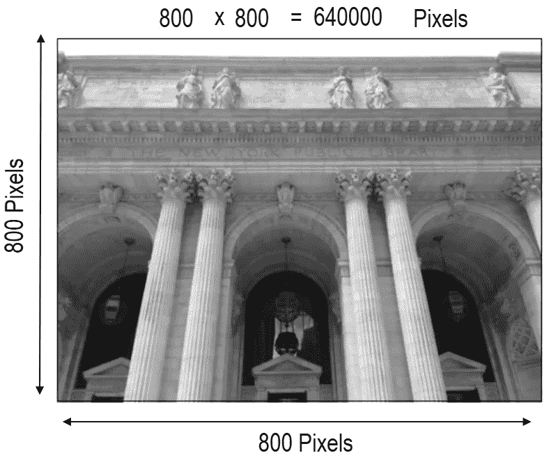

图 1 .常见图像尺寸

如果我们更仔细地观察图像的一部分(图 2)，可以清楚地看到每个物体都是由许多不同颜色的像素组成的。并且每个像素本身是具有从 0 到 255 的不同强度的红、绿和蓝三种颜色的组合。

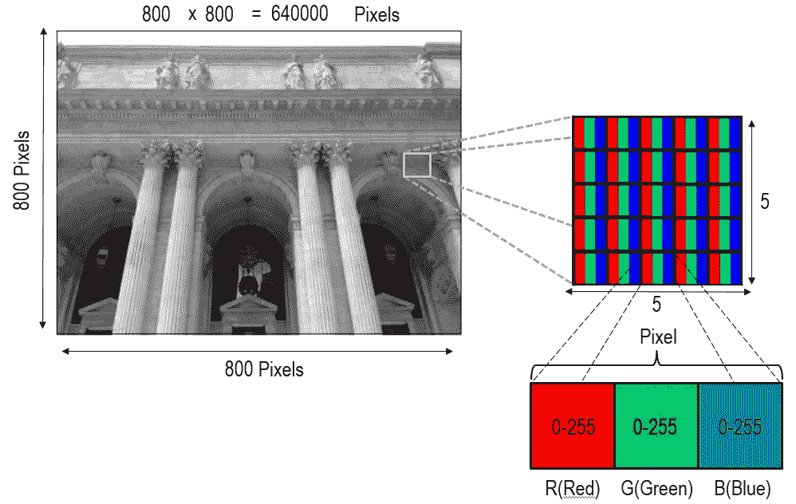

图 2 .图像及其像素

在每个像素中，通过组合从 0 到 255 的红色、绿色和蓝色中每种颜色的不同强度，可以产生各种颜色。在图 3 中，1 号形状显示了一种状态，其中只有红光以最大强度存在，其他颜色关闭，在这种情况下，整个像素将完全为红色。类似地，图 2、3 和 4 显示了如何创建紫色、黑色和白色。

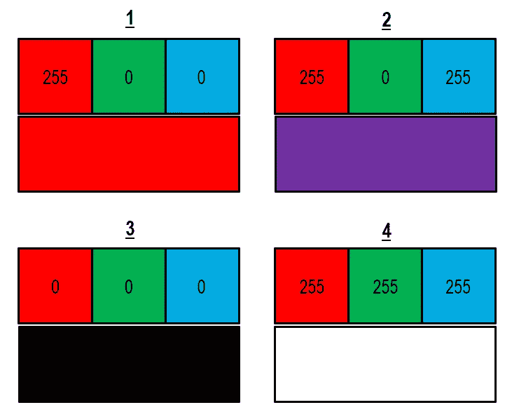

图 3 .通过像素产生不同的颜色

所以，当我们在谈论一个丰富多彩的形象时；在场景背后，我们有三个不同的数字矩阵，它们代表红色、绿色和蓝色的不同强度(图 4)。

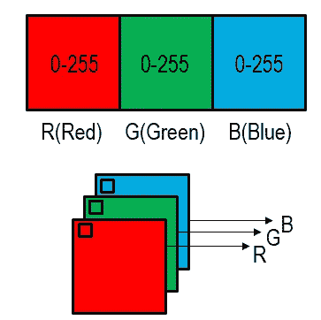

图 4 三个颜色通道

但是，当我们谈论黑白图像时，我们只有一个矩阵，没有必要进一步的维度。因为在黑白图像中，红色、绿色和蓝色的强度彼此相等(图 5)。为了更简单，我们将继续讨论黑白图像。

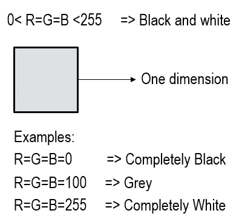

图 5 .黑白图像矩阵

现在，像素是如何工作的已经很清楚了，我们知道每幅图像背后都有一个数字矩阵(图 6 ),代表监视器屏幕像素的光强度。

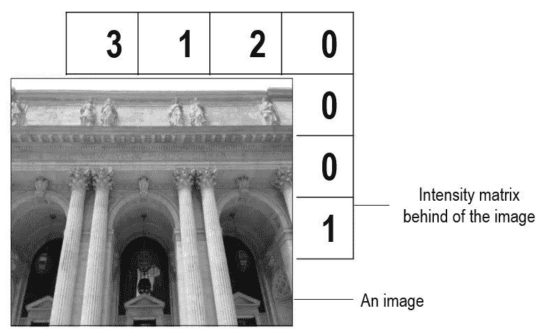

图 6 .图像及其强度矩阵

1.2.内核简介

内核是什么？维基百科说:“在图像处理中，内核、卷积矩阵或遮罩是一个小矩阵，用于模糊、锐化、浮雕、边缘检测等。”通常，可以使用内核对图片进行一些操作。在图 7 中，我们试图使用内核从原始图像生成一个图像(转换后的图像)。以这种方式，内核的所有数字在原始图像数字的第一部分上相乘，并且结果将是转换的图像强度的第一个数字。我们将对图 8、9 和 10 做同样的事情，但是移动内核并覆盖原始图像的所有部分。

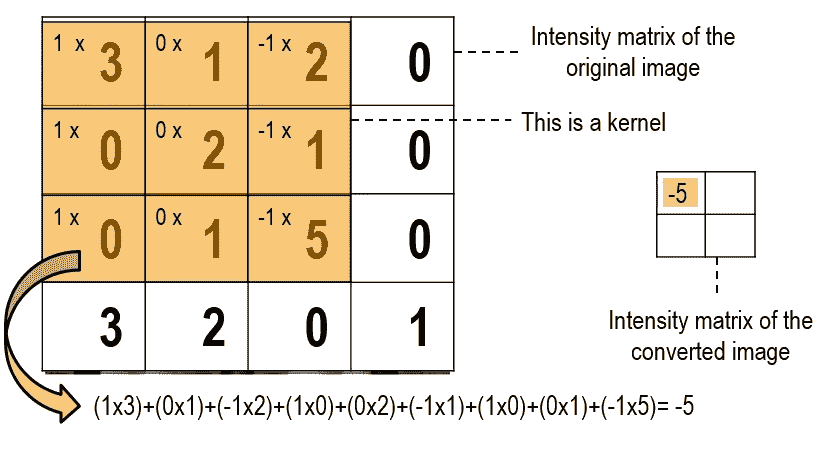

图 7 .内核功能步骤 1

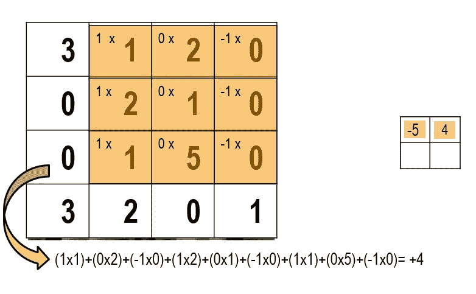

图 8 .内核功能步骤 2

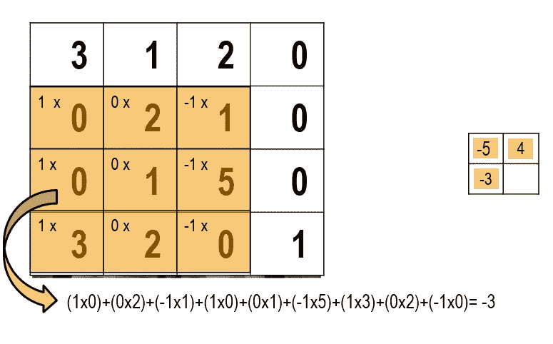

图 9 .内核功能步骤 3

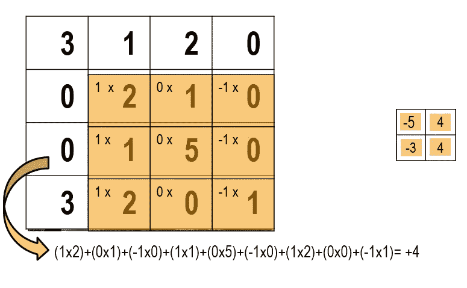

图 10 .内核功能步骤 4

您可以在图 11 中看到一个内核在图像上移动的例子。

图 11 .内核在原始图像上的移动示例

图 12 是图 11 图像的转换图像。在图 12 的右侧，有一个垂直内核。换句话说，第一列的所有数字都等于 1，第二列等于 0，最后一列是-1。使用这个内核，可以准确地看到垂直线，并删除水平线。这就是为什么你看不到红盒子里面的水平线。

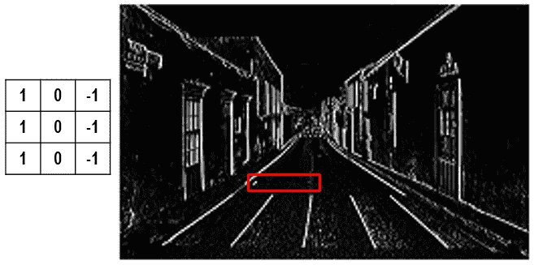

图 12 .垂直内核的功能

图 13 中的一切都是一样的，但是这个内核是水平的，这对于精确研究原始图像的水平线是一个很好的选择。同样，你看不到红框内的垂直线。

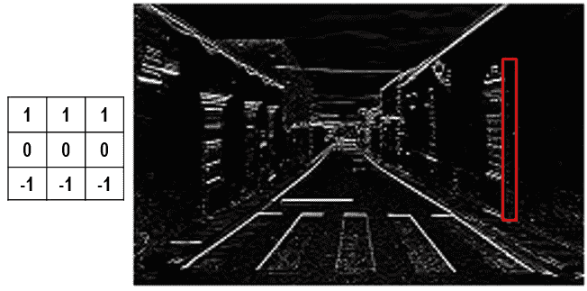

图 13 .水平内核的功能

使用不同的内核，可以生成各种类型的图像来研究图像的不同方面。在下面的三张图中，你可以看到更多不同内核的例子。另外，如果你有兴趣制作你的内核并在你的图片上试用，你可以使用这个网站:[https://setosa.io/ev/image-kernels/](https://setosa.io/ev/image-kernels/)

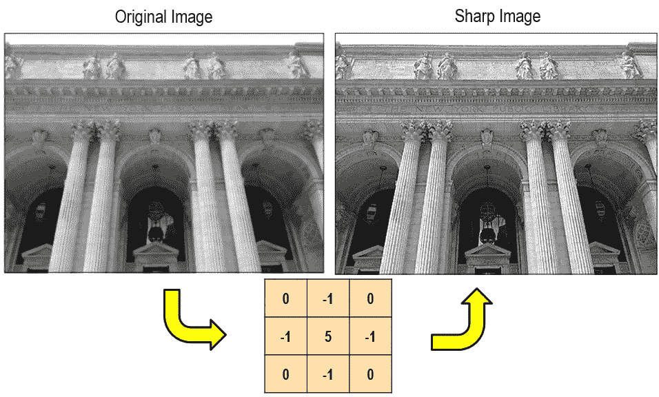

图 14 .内核能力的例子

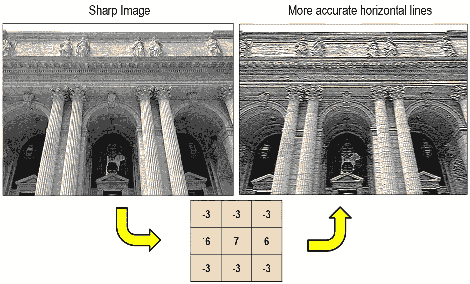

图 15 .内核能力的例子

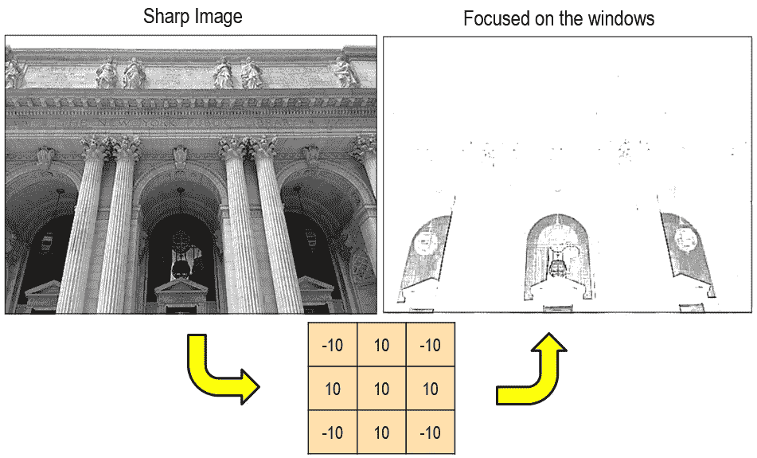

图 16 .内核能力的例子

2.卷积神经网络

在传统模型中，图像处理研究人员(大多数是电气工程师)一起研究不同的核组合，以根据他们的目标找到最佳的核组合。很明显，这非常耗时耗力，而且肯定不是所有有效的内核组件都能被识别。CNN 最重要的能力之一是，它可以根据定义的目标自动检查内核的不同组合(数千或数百万)，并使用最好的组合。图 17 显示了 CNN 模型的不同部分。第一部分是特征提取器。在这一部分中，模型能够获得图像并进行搜索以找到核的最佳组合，并基于最终目标提取最佳特征。展平图层是特征提取部分的输出。可以将展平图层视为一个表示输入图像关键特征的数字框。因此，CNN 的特征提取部分能够将输入图像转换成一盒有意义的数字。接下来，像神经网络这样的简单分类器能够根据这些数字进行分析和决策。

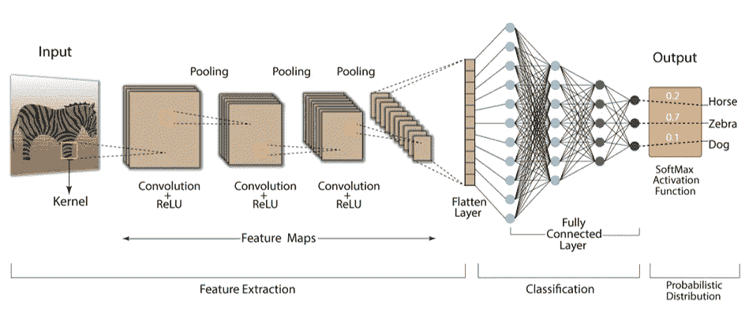

图 17 .卷积神经网络部分

第一个名为 AlexNet 的 CNN 模型于 2012 年推出(图 18)，成功赢得了 ImageNet 大规模视觉识别挑战赛(ILSVRC)。使用这种模式，与前一年相比，错误率降低了 10%以上。更重要的是，这个模型成为图像处理进一步飞跃的基础。第二次飞跃发生在 2015 年，当时微软推出了名为 ResNet 的模型。这个模型比人的眼睛更准确，并且由于其架构的一些创新，与以前的模型(GoogLeNet 有 22 层)相比，它能够使用大量的层(152 层)。

2014 年推出的 VGG16 是一款精确的模型，架构简单，易于实现。这些特征使得该模型成为其他领域的研究和科学工作的良好选择。

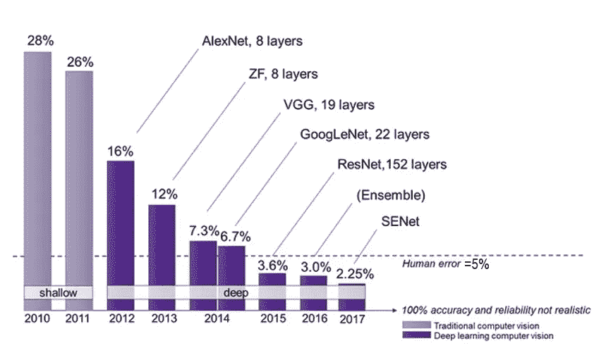

图 17 .基于年份的 ILSVRC 错误率

深度模型的使用一直有两个主要问题，对大型数据集的需求和解释它们如何工作的困难。基于图 18，使用深度模型有可能达到非常精确的结果，但是它需要大量的数据。否则，使用机器学习算法或经典统计会更加准确和合理。但是，使用迁移学习，CNN 模型中对大数据集的需求得到了很好的回答。这种能力使得 CNN 即使与其他类型的深度模型相比也非常强大和有用。

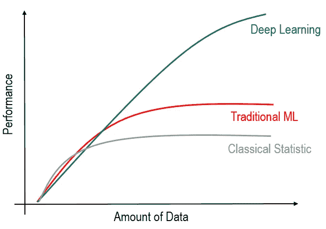

图 18 .基于数据量的不同方法

假设，如图 19 所示，开发了一个 CNN 模型来识别大量人的面部。在这种情况下，模型的第一层负责识别颜色、线条和一般的简单实体。中间层负责识别更复杂的实体，如眼睛、耳朵和嘴唇等面部组件。这个例子中的最后几层负责识别面部成分的组合，并且通常同时考虑所有面部成分。

当你想做另一个项目时，例如在汽车模型识别领域，你可以使用开发的模型的第一层来识别面部。因为这些层负责识别线条和颜色等简单的实体，顺便教他们是问题的一大部分。因此，现有模型的第一层，有时是在数十亿张图像上训练的，可以用于其他新问题，并可以显著提高新模型的性能。

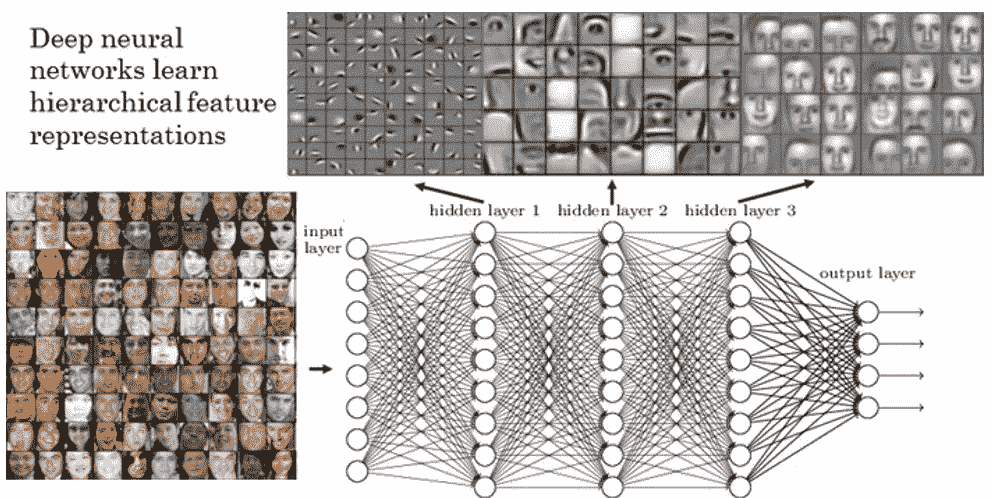

图 19 . CNN 模型的不同层

最后，你可以看一个视频，在这个视频中，我试着用我用迁移学习法开发的 CNN 模型玩超级马里奥。这个视频是两类分类问题的一个实用而简单的例子。所以，只有两类。扬眉=第一跳然后连续跑，皱眉=停下来不动

[https://youtu.be/_h15_uBuL70](https://youtu.be/_h15_uBuL70)