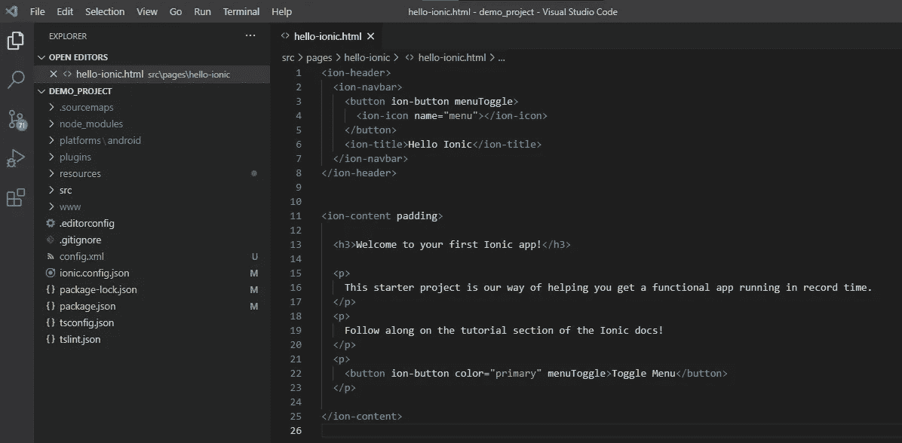
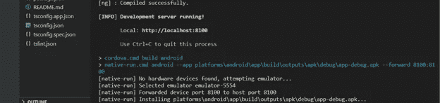

# 从离子项目中产生 APK

> 原文：<https://medium.com/analytics-vidhya/generate-apk-from-an-ionic-project-e5da08f7090?source=collection_archive---------2----------------------->

在这篇博客中，我将演示如何为你的 Ionic 应用程序创建一个 APK 文件(Android 应用程序包)。

**为什么要创造 APK**

图片提供:liveabout.com

人们可以直接在移动设备上运行 ionic 应用程序。为此，你必须将手机连接到系统，然后运行整个应用程序。

虽然这是在真实设备上测试应用程序的一种非常流行和简单的方法，但对于非开发人员来说可能很难。他们将不得不设置他们的系统来运行项目，这是一种非常耗时且效率非常低的方式。因此，APK 前来救援！

**APK 的好处**

1.  无需克隆或复制整个项目来运行应用程序
2.  无需安装或设置系统来运行应用程序
3.  APK 就像 word 文档一样可以共享
4.  APK 对于测试应用的团队来说是必要的
5.  在谷歌 Play 商店发布之前，你必须对 APK 进行“代码签名”

既然您已经确定了生成 APK 的需求，那么让我们看看如何去做。

**先决条件**

您必须下载并安装所需的工具，以便在您的系统中运行 ionic 应用程序。更多信息见[本](https://ionicframework.com/docs/intro/cli)。

**我们开始吧！**

1.  我正在使用我最喜欢的 Visual Studio 代码来设置和运行 ionic 应用程序。您可以选择自己喜欢的任何 IDE。

图片提供:nickjanetakis.com

2.如果您没有 ionic 应用程序，请使用以下命令创建一个:

> $ ionic 开始演示 _ 项目教程— **type=** ionic-angular

阅读[这篇](https://ionicframework.com/docs/v3/intro/tutorial/)写得很漂亮的文档来理解上面命令的详细含义。

3.使用以下命令运行此应用程序，以确保代码没有错误:

> 爱奥尼亚发球

4.您应该能够在浏览器中看到输出。

5.因为我们的代码没有错误(瞧！)，这是创造 APK 的最佳时机。

**遵循以下步骤:**

(a)确保您仍然在 ionic 项目目录中。

(b)类型:

> **ionic cordova 运行 android -l**

在命令行中。要了解科尔多瓦，请点击此[链接](https://cordova.apache.org/)。

如果出现错误，请首先尝试运行以下命令:

> **爱奥尼亚科尔多瓦效仿安卓**

运行命令后的项目结构。添加新文件夹(如 www)

(c)如果一切顺利(我发誓，第一次不会！)，您应该能够在终端上看到一条“ **Run Successful** ”消息，其中包含 APK 文件的路径。

(d)APK 文件总是存储在*<Your-Ionic-Project>\ platforms \ Android \ app \ build \ outputs \ apk \ debug \ app-debug . apk*中

已成功生成文件位置为的 APK

恭喜你，你已经为你的 Ionic 应用程序生成了 APK 文件。现在，继续与您的团队成员分享它，并将其安装在他们的 android 设备上，就像任何其他 Android 应用程序一样。

**需要注意的事情**

1.  '找不到有效的 Android SDK 根目录':要解决这个错误，您必须安装 Android SDK 并在系统环境变量中配置路径。
2.  JDK 8 版本(' 1.8)的需求检查失败。*')!“检测到的版本:15.0.1”:此错误是由 java 版本不匹配引起的。在这种情况下，科尔多瓦期待 JDK 8，因此错误。我更新了 java，问题解决了。

**结论**

您刚刚通过一个简单的命令为 ionic 应用程序生成了一个 APK。

您可以在移动设备上复制此 APK，并独立安装。这个 APK 可以上传或者与测试团队共享。此外，如果你想在模拟器上安装 APK，只需拖动 APK 文件，放在模拟器上，它就会被安装。

希望这个博客能帮到某个人，节省时间。

还有，你可以在 [Twitter](https://twitter.com/SwatiRajwal) 和 [LinkedIn](https://www.linkedin.com/in/swati-r-84682b12b/) 上问我问题！

谢谢你。