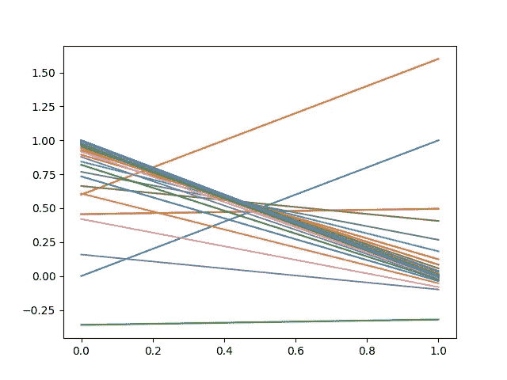
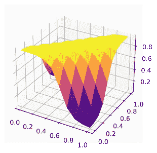
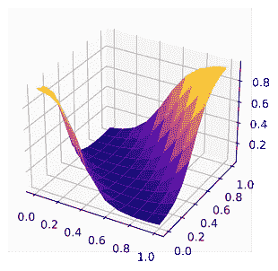

# 用 Pytorch 生成基本布尔计算模型

> 原文：<https://medium.com/analytics-vidhya/generate-basic-boolean-calculation-models-with-pytorch-5b7b880e7ef8?source=collection_archive---------8----------------------->

开发人员还没有被机器人取代。但是如果我们不注意，不整合这些新技术，我们可能会有一些不好的意外。


[附身摄影](https://unsplash.com/@possessedphotography?utm_source=unsplash&utm_medium=referral&utm_content=creditCopyText)在 [Unsplash](https://unsplash.com/s/photos/intelligence?utm_source=unsplash&utm_medium=referral&utm_content=creditCopyText) 上拍照

有许多神经网络被用来做非常复杂的事情的例子，比如对图像或文本进行分类，在国际象棋中击败大师。

但这不是我日常生活中经常做的事情。

我的日常生活就是编写代码 **if** **else** ， **for** ，将方形形状推入圆形管道，希望输入足够稳定，使我的算法**不会崩溃**。

为什么不直接告诉机器，如果我给它**这个**，它必须返回**那个**？不用发明任何东西，只要一点点**逻辑**，抽象到足以知道一辆自行车被**当作一辆自行车一样对待**。

# 告诉我不

让我们从一个非布尔计算开始。

我会用 Pytorch 来写我的机器学习算法。Pytorch 是最后的神经网络框架之一，具有动态计算图形能力，这意味着你可以编写数学函数，就像你实际在做一样，Pytorch 将能够从中生成图形。

这比传统的静态层更容易理解。

这是我的数据:

```
import torch

x = torch.tensor([[0.], [1.]])
y = torch.tensor([[1.], [0.]])
train = torch.utils.data.TensorDataset(x, y)
train_loader = torch.utils.data.DataLoader(train)
```

这意味着如果它收到 0，它必须返回 1，如果它收到 1，它必须返回 0。

可以做到这一点的最简单的模型是一个线性函数 y = weight * x + bias。代码如下:

```
class NeuralN(torch.nn.Module):

    def __init__(self):
        super(NeuralN, self).__init__()
        self.linear = torch.nn.Linear(1, 1)
        # force parameters to bias = 0 and weight = 1 for demonstration
        self.linear.weight.data.fill_(1)
        self.linear.bias.data.fill_(0)

    def forward(self, x):
        return self.linear(x)

model = NeuralN()
```

让我们训练它，并展示经典 2D 情节中的每一步:

```
loss_fn = torch.nn.MSELoss()x = np.linspace(0, 1, 20)
predicted_arr = []
for i in x:
    predicted = model(torch.tensor([i], dtype=torch.float32)).item()
    predicted_arr.append(predicted)
plt.plot(x, np.array(predicted_arr))

learning_rate = 0.3
for t in range(20):
    for i, (x_batch, y_batch) in enumerate(train_loader):
        y_pred = model(x_batch)
        loss = loss_fn(y_pred, y_batch)
        model.zero_grad()
        loss.backward()
        with torch.no_grad():
            for param in model.parameters():
                variation = learning_rate * param.grad
                param -= variation
        predicted_arr = []
        for i in x:
            predicted = model(torch.tensor([i], dtype=torch.float32)).item()
            predicted_arr.append(predicted)
        plt.plot(x, np.array(predicted_arr))

plt.show()
```



预测结果，逐步训练

第一条曲线是蓝色的，故意将**强制**为 y = x。

需要的 2 个衍生产品是:

*   相对于**偏差**的导数:2 * (y' -y)
*   相对于**重量**的导数:2 * (y' -y) * x

在第一步，x = 0，因此相对于重量的导数等于 0，并且**仅偏差被修改**为以下值:

2 *(y '-y)* learning _ rate = 2 *(0-1)* 0.3 =-0.6

该偏差是从**减去**得到的。那是橙色曲线，对应于

y = 0.6 + x。

接下来的步骤可以用同样的方法计算。几步就找到了所需的 NOT 函数:y = 1 -x。

# 不要告诉我(异或)

让我们来处理一个更难的布尔运算。


这并不困难

单层感知器不能对异或问题建模。但是更进一步，用**两层**和**乙状窦激活**功能，你会看到它可以完成这项工作。

下面是数据:

```
x = torch.tensor([[0., 0.], [1., 1.], [0., 1.], [1., 0.]])
y = torch.tensor([[1.], [1.], [0.], [0.]])
train = torch.utils.data.TensorDataset(x, y)
train_loader = torch.utils.data.DataLoader(train)
```

所以如果我们输入 0 和 0 或者 1 和 1，我们想要标签 1。其他输入返回 0。那是一个**非(XOR)。**

以下是我们建议的模型:

```
class NeuralN(torch.nn.Module):
    def __init__(self):
        super(NeuralN, self).__init__()
        self.linear1 = torch.nn.Linear(2, 2)
        self.sigmoid1 = torch.nn.Sigmoid()
        self.linear2 = torch.nn.Linear(2, 1)
        self.sigmoid2 = torch.nn.Sigmoid()
    def forward(self, x):
        x2 = self.linear1(x)
        x2 = self.sigmoid1(x2)
        x3 = self.linear2(x2)
        return self.sigmoid2(x3)
```

让我们训练我们的模型(代码可以更简洁，但是这个允许**一步一步地跟随训练**):

```
model = NeuralN()
loss_fn = torch.nn.MSELoss()
learning_rate = 1
for t in range(1000):
    for i, (x_batch, y_batch) in enumerate(train_loader):
        y_pred = model(x_batch)
        loss = loss_fn(y_pred, y_batch)
        model.zero_grad()
        loss.backward()
        with torch.no_grad():
            for param in model.parameters():
                variation = learning_rate * param.grad
                param -= variation
```

并用一个**表面** matplotlib 图形显示结果。我们将从创建一个由 0 和 1 之间的点组成的 **2D 网格**开始:

```
xdata = np.linspace(0,1,10)
ydata = np.linspace(0,1,10)
X,Y = np.meshgrid(xdata, ydata)
```

创建一个*矢量化*函数，将模型应用于输入(x，y)并生成表面图:

```
@np.vectorize
def predict(x,y):
    predicted = model(torch.tensor([x, y], dtype=torch.float32)).item()
    return predicted

Z = predict(X, Y)
ax = plt.axes(projection='3d')
ax.plot_surface(X, Y, Z, cmap='plasma')
```



这是你的！我们的小代码生成了一个模型，它可以回答 1 到 input (0，0)和 input (1，1)和 0 到 other。你可以在图上看到，这里生成的函数相当于**等于**。

但是第二次训练可以给出非常不同的东西，并且仍然是正确的:



# 是否矫枉过正？

当然可以！但是这里我们**知道了**我们想要生成的布尔运算。想象一个用**被遗忘的**语言编写的 40 行算法，有 10 个布尔输入参数，你还想为了理解它而阅读所有代码吗？

这种类型的**算法生成**可以为目前新兴的**零代码**工具提供新的工具。