# 使用 GAN 从 face 生成 Bitmoji

> 原文：<https://medium.com/analytics-vidhya/generate-bitmoji-from-face-using-gan-62c9ac47a6cd?source=collection_archive---------3----------------------->

## 你有没有想过社交媒体公司是如何从你的图片生成 bitmoji 的？看看 GAN 如何从一张图片创建 bitmoji。

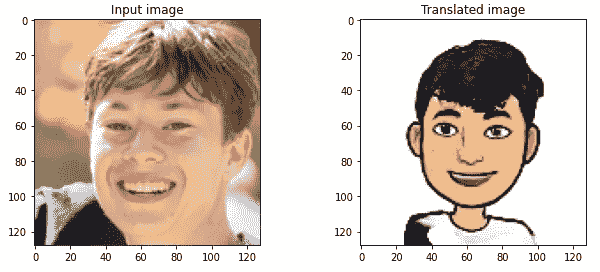

我们大多数人都创建了自己定制的 bitmoji，并在不同的社交媒体应用程序中使用它们。早期的 bitmoji 是可定制的，可添加或更改的属性数量有限。但是一两年后一切都变了。现在人们可以创造出看起来和自己一模一样的 bitmoji。这都要归功于深度学习模型的快速发展。但是他们是怎么做到的呢？好吧，让我们探索一下甘斯是如何为我们完成这项工作的。

> 生成对抗网络是过去 10 年机器学习中最有趣的想法”“ **Yann LeCun** 。

## GAN 快速概述

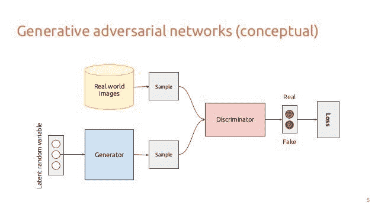

对甘的基本认识

**甘的**是一个令人兴奋且快速变化的领域，它兑现了生成模型的承诺，能够在一系列问题领域生成真实的例子。
最引人注目的是**图像到图像的翻译**任务，例如将夏天的照片翻译成冬天的照片或白天到夜晚的照片，以及生成甚至人类都无法辨别的物体、场景和人物的真实感照片。

甘的三个基本部分是-

1.  )**生成器** —使用生成器创建输出，使用随机噪声，或者在我们的情况下，使用随机正态噪声的内核初始化器，而不是正态 glorot uniform。
2.  )**鉴别器** —通过与鉴别器连接，同时传递真实(目标图像)和虚假的发生器生成输出，以检查真实或虚假。它扮演着批评家的角色。
3.  )**损失函数** —基于发电机输出和鉴别器输出创建损失函数。

但是正常的 GAN 需要成对的图像，即输入和期望的输出，以便它可以学习特征。

## 我说的成对和不成对是什么意思？

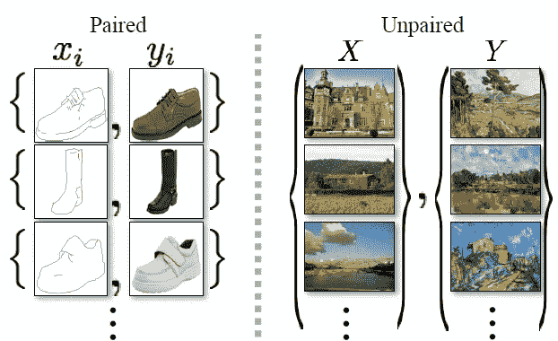

但是我们想从一张看起来相似的图片中生成 Bitmoji。对此，我们没有配对的数据集。此外，我们希望 GAN 能够自我学习，即无监督学习。那么有这样的 GAN 吗？

是的，有。它被称为 CycleGAN(也有其他的，但对于这一点，我们将坚持使用 CycleGAN)。

# CycleGAN

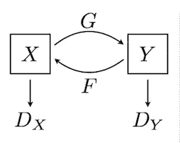

CycleGAN 的基本架构

想象一下 CycleGAN 有两个网络。它包括:

*   两个映射 ***G : X - > Y*** 和 ***F : Y - > X.***
*   相应的敌对歧视者 **Dx** 和 **Dy。**

**G 的作用:** G 试图**将** X 翻译成输出，通过 Dy 馈入，根据域 y 检查真假。

**F 的作用:** F 试图**将** Y 翻译成输出，输出通过 Dx 馈入，以检查它们是否与域 x 无法区分

## 损失函数

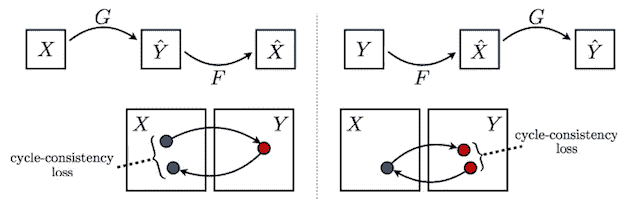

循环一致性损失

循环一致性损失是 CycleGAN 的真正优势所在。仅仅使用 g an 将图像从一个域转换到另一个域是不够的。一个完整的循环是，如果模型可以转换到另一个域，并且如果它将其恢复到原始状态，那么只有一个人可以说模型已经了解了手头任务的真正特征。这就是所谓的循环损耗。

这种损失使用直觉，即如果我们使用映射函数 **G** 将样本从域 **X** 转换到 **Y** ，然后使用函数 **F、**将其映射回 **X** ，我们离原始样本有多近。类似地，它计算将样本从 Y 转换到 X，然后再转换回 Y 所产生的损耗。这种循环损耗应**最小化**。

## CycleGAN 建筑

GAN 的生成器基本上是一个 UNET，具有应用于潜在空间的卷积瓶颈块。对于潜在空间特征提取，使用 Resnet 块。

块数对训练时间和结果有直接影响。对于这种情况，在不同深度的残余块上进行实验。当 resnet 块的深度为 5 时获得最佳结果，进一步增加对结果没有改善效果，只是增加了训练时间。

## 结果

该模型被训练了 30 个时期和总共 8k 个图像。甘唯一的缺点是训练时间太长，只有 30 个历元。

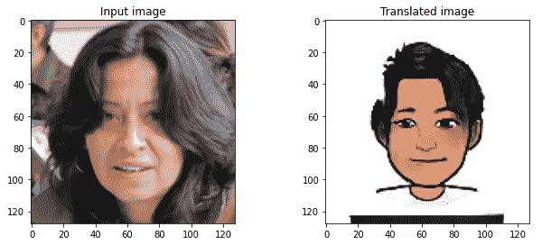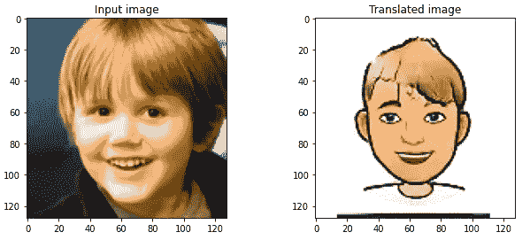

良好的结果

考虑到有限的数据和较少的训练时间，这个结果已经足够好了。但是所有的结果都不好。

图像翻译有时会不必要地将男性转换成女性。如果我们愿意的话，它可以被称为一个特性！但在这种情况下不会。

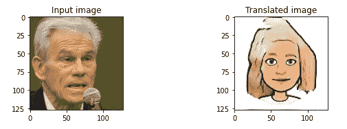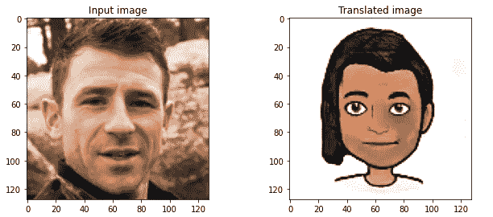

从左到右——a)男人变成女人。b .)只是离群失败

另一个问题是配件。bitmoji 数据集没有带配件数据集的面。因此，该模型考虑了头部的任何东西，如头发、帽子、头巾或耳机。此外，在某些情况下，阴影也成为一个问题，使输出位 moji 更暗。

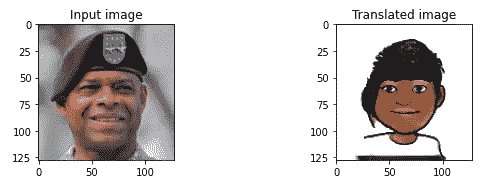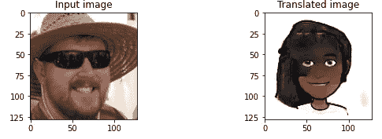

从左到右— a .)假设帽子为头发。b .)与配饰搭配不好。

## 未来的工作-

使用人脸点检测模型提取人脸点或网格，并将其级联到生成器中，以获得更加鲁棒和准确的结果。