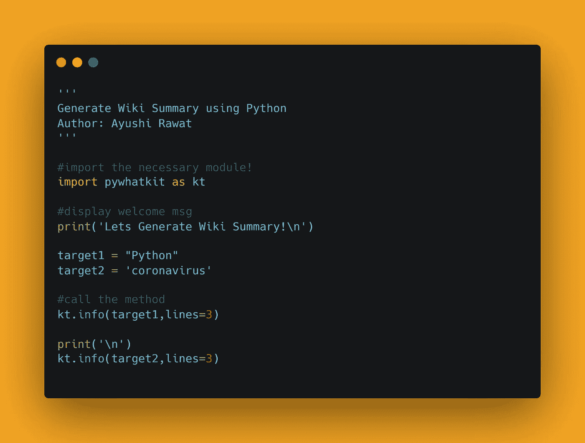
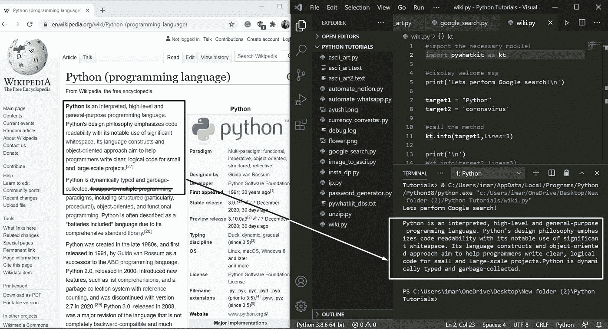
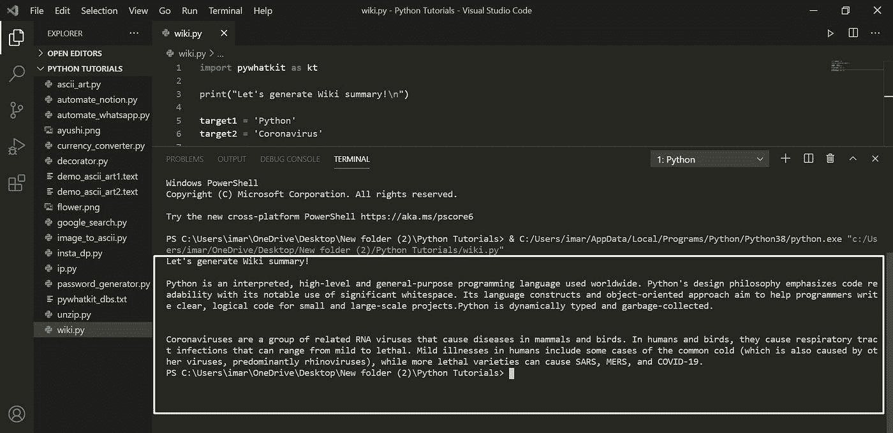

# 使用 Python 生成 Wiki 摘要

> 原文：<https://medium.com/analytics-vidhya/generate-wiki-summary-using-python-be6ccaad4421?source=collection_archive---------16----------------------->

你好世界！


在这篇博客文章中，我们将学习如何生成维基摘要。我们将看到 Python 中的实现。

[查看 python 终极资源库](https://github.com/ayushi7rawat/Ultimate-Python-Resource-Hub)。发现有用就掉颗星！有什么要补充的吗？开个 PR 就一样了！

你可以参考我的 YouTube 视频教程，看一个工作教程来更好的理解和一步一步的指导。

# 这个博客将会涵盖什么

```
1\. What is Wikipedia?
3\. Basics of pywhatkit Module
4\. Generating Wiki Summary using Python
```

*让我们开始吧！*

# 维基百科是什么？：

维基百科是一个免费、开放的内容在线百科全书，由一群被称为维基人的用户合作创建。任何在网站上注册的人都可以发表文章。

如果你想了解更多，可以参考 [Wiki 的维基百科页面](https://en.wikipedia.org/wiki/Wikipedia)。

# 使用的模块:

# pywhatkit 模块:

PyWhatKit 是一个 Python 库，具有各种有用的特性。这是一个易于使用的库，不需要你做一些额外的设置。

这个模块还有很多其他很酷的特性。请随意探索它们，或者如果你愿意，我可以写一篇关于它们的文章。

如果你想了解更多，可以参考 [pywhatkit 模块文档](https://github.com/Ankit404butfound/PyWhatKit)。

现在，您已经熟悉了 *Wikipedia* 的基础知识，并获得了 *pywhatkit 模块的基础知识，*我们可以前进到*编码部分。*

# 该编码了！

你可以在我的 [GitHub 库](https://github.com/ayushi7rawat/Youtube-Projects/tree/master/Turn%20any%20image%20to%20ASCII)找到所有代码。发现有用就掉颗星。



为了访问 Python 库，需要将其安装到 Python 环境中

```
pip install pywhatkit as kt 
```

现在，我们需要在 python 脚本中导入包。使用以下命令来完成此操作。

```
import pywhatkit as kt
```

现在我们已经使用命令`import pywhatkit as kt`导入了库，让我们继续。

让我们显示一条欢迎信息。同样，我们将使用`print`方法。

```
print("Lets Generate Wiki Summary!")
```

确定你想搜索什么，一旦你决定了，让我们把它储存在`target1`。

```
target1 = "Python"
```

最后，我们来调用`info`方法。

```
kt.info(target1,lines=3)
```

注意:这里我们传入两个参数:

*   第一个参数描述了用于生成维基摘要的搜索主题
*   第二个参数描述您想要的摘要行数

让我们看看输出的搜索结果。



```
OUTPUT:
Let's generate Wiki summary!Python is an interpreted, high-level and general-purpose programming language used worldwide. Python's design philosophy emphasizes code readability with its notable use of significant whitespace. Its language constructs and object-oriented approach aim to help programmers write clear, logical code for small and large-scale projects.Python is dynamically typed and garbage-collected.
```

让我们看看另一个例子。

```
target2 = 'coronavirus'
print('\n')
kt.info(target2,lines=3)
```



通过这些步骤，我们已经成功地使用 python 执行了 Google 搜索。就是这样！

很简单，不是吗？希望这篇教程有所帮助。我强烈推荐你去看看同样的 [YouTube 视频](https://www.youtube.com/watch?v=ixB2YHGSiAQ)，别忘了订阅我的频道。

您可以使用`pywhatkit`库，甚至探索更多的特性。

你可以在我的 [GitHub 库](https://github.com/ayushi7rawat/Youtube-Projects/tree/master/Turn%20any%20image%20to%20ASCII)找到所有代码。发现有用就掉颗星。

感谢您的阅读，我很乐意通过 [Twitter](https://twitter.com/ayushi7rawat) | [LinkedIn](https://www.linkedin.com/in/ayushi7rawat/) 与您联系。

请分享您的宝贵建议，感谢您的真诚反馈！

你绝对应该看看我的其他博客:

*   [Python 3.9:你需要知道的一切](https://ayushirawat.com/python-39-all-you-need-to-know)
*   [终极 Python 资源中心](https://ayushirawat.com/the-ultimate-python-resource-hub)
*   [GitHub CLI 1.0:你需要知道的一切](https://ayushirawat.com/github-cli-10-all-you-need-to-know)
*   [成为更好的程序员](https://ayushirawat.com/become-a-better-programmer)
*   [如何制作自己的谷歌 Chrome 扩展](https://ayushirawat.com/how-to-make-your-own-google-chrome-extension-1)
*   [使用 Python 从任何 pdf 创建您自己的有声读物](https://ayushirawat.com/create-your-own-audiobook-from-any-pdf-with-python)
*   [你很重要，你的心理健康也很重要！](https://ayushirawat.com/you-are-important-and-so-is-your-mental-health)

# 资源:

*   [en.wikipedia.org/wiki/Wikipedia](https://en.wikipedia.org/wiki/Wikipedia)
*   [pypi.org/project/pywhatkit](https://pypi.org/project/pywhatkit/)
*   [github.com/Ankit404butfound/PyWhatKit](https://github.com/Ankit404butfound/PyWhatKit)

在我的下一篇博客文章中再见，保重！！