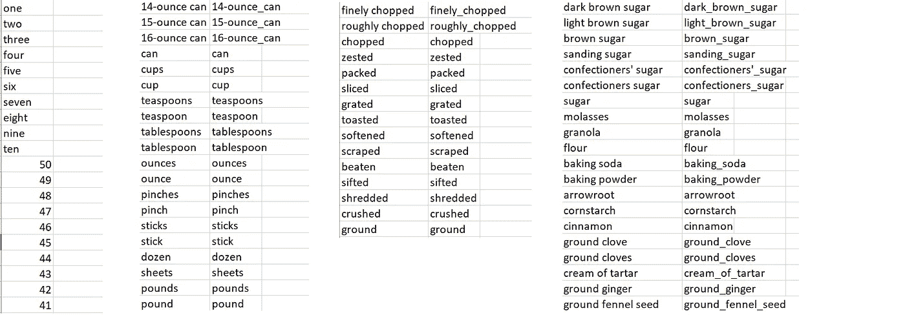
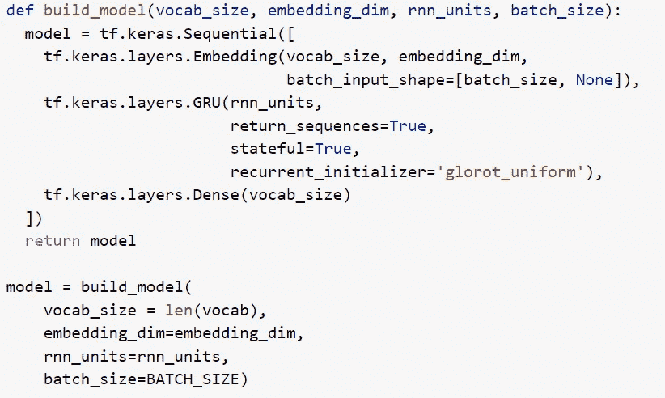
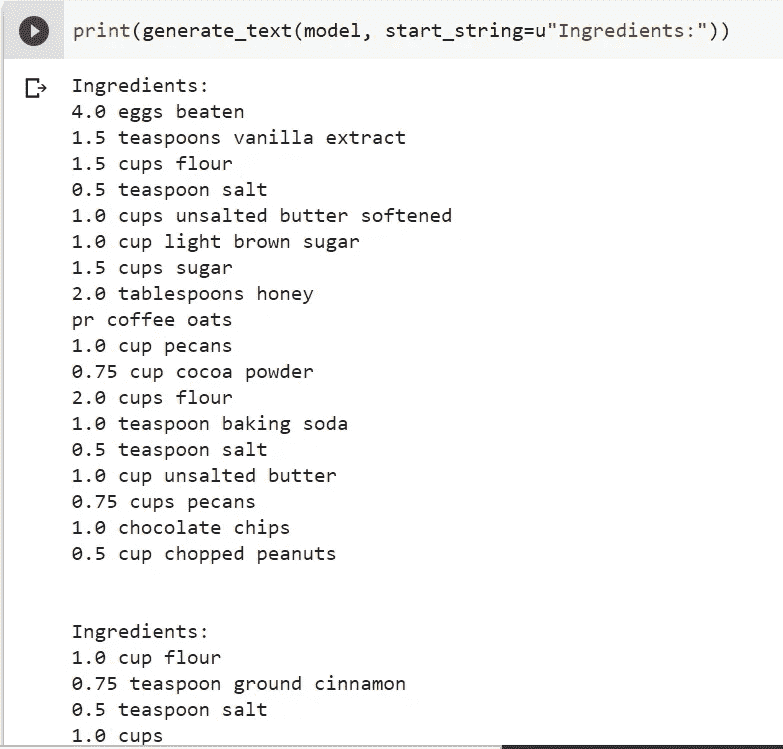
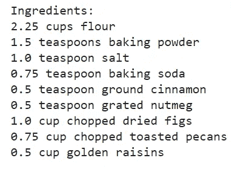
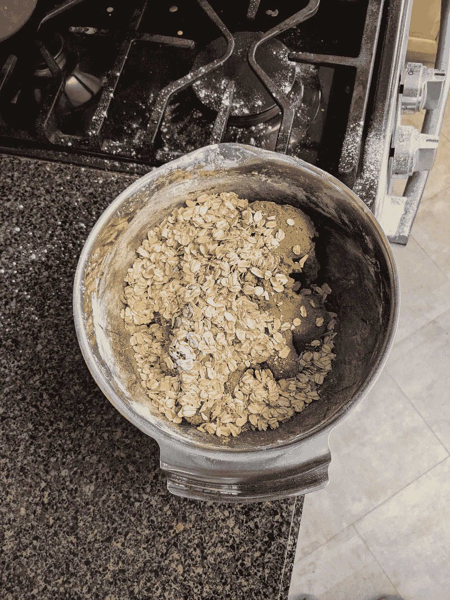
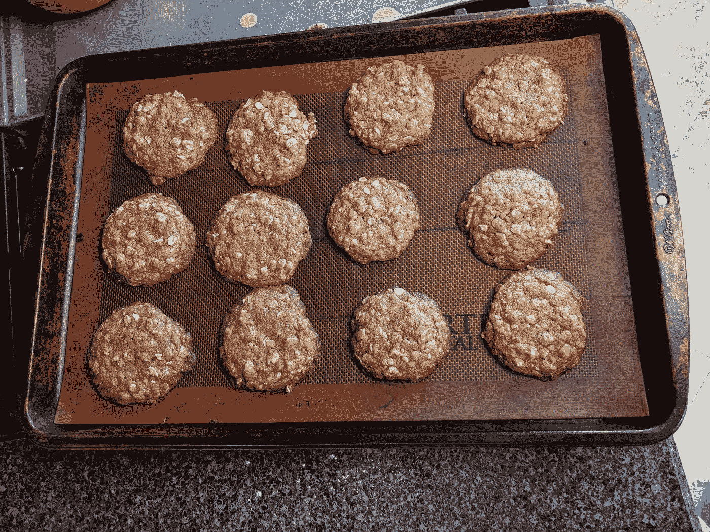
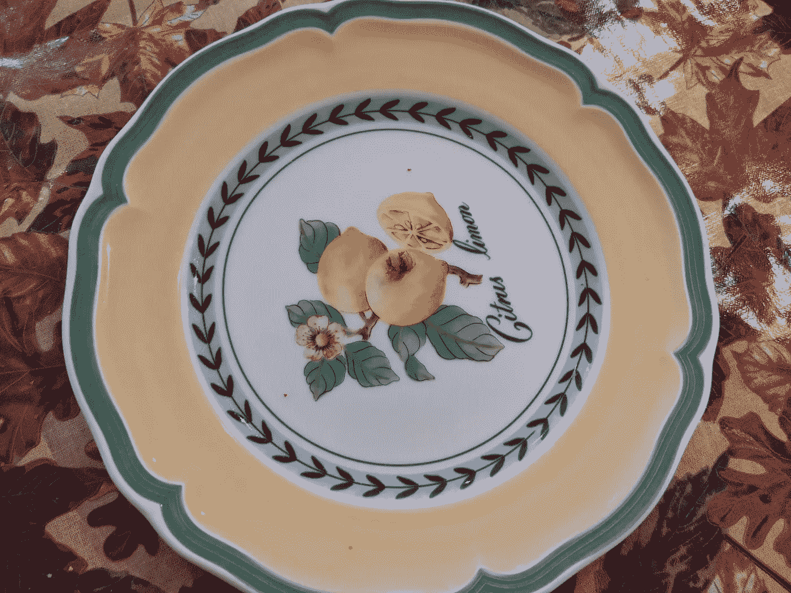
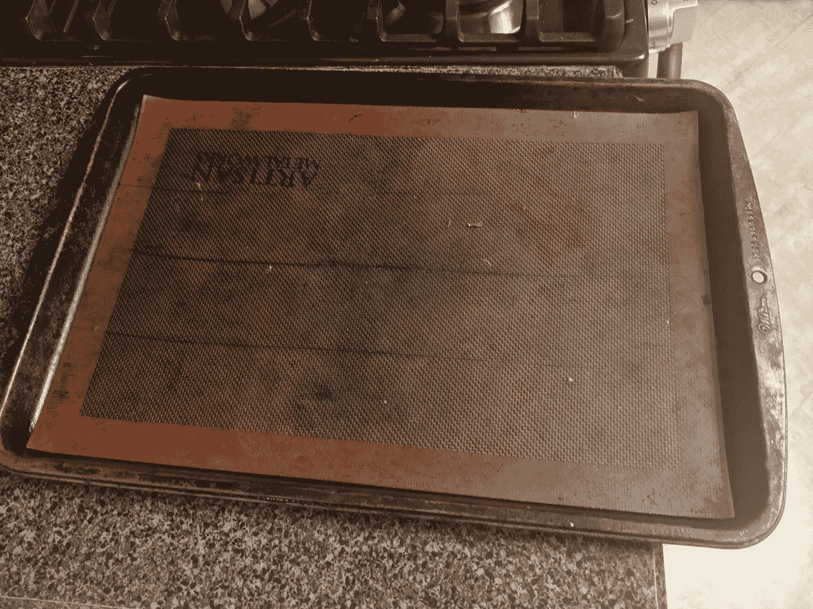

# 使用 NLP 生成甜点配料列表

> 原文：<https://medium.com/analytics-vidhya/generating-a-dessert-ingredients-list-12edd1740753?source=collection_archive---------9----------------------->

浏览一个美味的介绍性 NLP 项目。我们从来自 foodnetwork.com 的 150 种最美味的基础甜点食谱开始，清理并预处理配料表，然后使用基于角色的 RNN 生成新的配料表。

由[美食摄影师|詹妮弗·帕利安](https://unsplash.com/@foodess?utm_source=medium&utm_medium=referral)在 [Unsplash](https://unsplash.com?utm_source=medium&utm_medium=referral) 上拍摄的照片

# 背景

也许最著名的人工智能食物配方生成器是由 IBM 开发的[厨师沃森。据称，厨师沃森不仅创造了新的食谱(并就此写了一本](https://www.ibm.com/blogs/watson/2016/01/chef-watson-has-arrived-and-is-ready-to-help-you-cook/)[食谱](https://www.amazon.com/Cognitive-Cooking-Chef-Watson-Innovation/dp/149262571X)，还帮助厨师发现了新的风味组合。

还有其他人工智能配方生成器(参见令人捧腹的[人工智能怪异](https://aiweirdness.com/post/190569291992/ai-recipes-are-bad-and-a-proposal-for-making-them)，它利用了安德烈·卡帕西的[代码)。](https://github.com/karpathy/char-rnn)

对于我的第一个自然语言处理(NLP)项目，我想只根据我觉得美味的食谱训练一个神经网络，希望它能为我生成我理想的甜点。

一般来说，食谱有两部分:配料单和说明。解释方向和生成可信的方向可能很困难，因为存在微妙的语言歧义。例如，像“面粉”或“黄油”这样的词既可以用作名词，也可以用作动词，比如“融化黄油”或“给锅涂黄油”，找出这一点是[命名实体识别](https://en.wikipedia.org/wiki/Named-entity_recognition) (NER)中的一个练习。然而，配料表要简单得多，通常遵循一个基本模式:[基数][单位][可能是准备][成分]，例如 1 杯筛过的面粉。

在我的第一个 NLP 项目中，我想避免使用方向，所以我把自己限制在不需要自定义方向的基本食谱上。我的训练套餐中的甜点只有饼干、甜面包、布朗尼或布朗尼。在这样的食谱中，你通常将干的和湿的配料分别混合，然后混合并在 350 华氏度下烹饪，直到边缘变成棕色。如果你的面糊是湿的，那么你正在做蛋糕。如果面糊糊了，你就可以做布朗尼或布朗尼了。如果你的面糊很稠，那么恭喜你，你正在做饼干。

因此，我把注意力集中在成分表上。我提取、清理并预处理了配料表，然后将这些作为训练集来生成新的配料表。

完整的代码可以在 GitHub 上找到。在这里，我将向您介绍一些基础知识。

# 数据集

我们从定义 foodnetwork.com 上 150 种最美味的基础甜点食谱开始。

网页抓取的 URL

然后，我们从这些网站上搜集成分列表，丢弃任何次要成分列表，例如釉料，并将所有这些内容写入 csv。csv 中的每一行都包含一个菜谱的配料。

配料表的初步汇编

在清理条目以删除任何不需要的特殊字符之后，我们开始项目的下一个主要部分:标记。

# 磨尖

在下一节中，我们将解决训练集中的特殊措辞。为了做到这一点，我们必须能够识别和标记我们的集合中感兴趣的词，即基数、单位、制剂和成分。这个识别和标注感兴趣单词的过程被称为[标注](https://en.wikipedia.org/wiki/Part-of-speech_tagging)。

我们将指导我们的标记者忽略任何不是基数、单位、准备或成分的词。因此,“两杯糖”这一行将被标为[基数][单位][成分]，但“软黄油，用于润滑平底锅”将只被标为[成分]。

不幸的是，成分列表中的大多数单词不会被 NLTK POS(词性)标记器标记——只有枢机主教会被标记。关于 NLTK POS 标签的完整列表，请点击查看[。因此，我们必须制作自己的字典，并使用 NLTK Unigram 标记器来进行自定义标记。我做了四本字典:为枢机主教，单位，准备，和成分。这些是我手工创造的，因为甜点原料中没有太多不同的词。](https://pythonprogramming.net/natural-language-toolkit-nltk-part-speech-tagging/)

用于标记的字典

标记器希望标记单个单词，因此为了能够将多个单词标记在一起(例如“小苏打”)，首先我们遍历这些短语并在其中插入下划线。当标记完成后，我们删除下划线。

标记本身是使用 nltk(自然语言工具包)中 Unigram Tagger 的 tag 命令完成的。

标记枢机主教，单位，准备和成分

至此，我们的配料表训练集的标记已经完成。

# 解决歧义

为了简化 RNN 训练，我希望训练成分集的每一行都是标准形式[基数][单位][潜在准备][成分]。许多人确实是以这种方式开始的，但有很多情况下并没有这样，标记有助于解决这些问题。这是标记的主要目的——帮助过滤无关信息。非标准线的一些例子有:

*   **2 杯加 2 汤匙糖**。这是[基数][单位][无][基数][单位][成分]的形式，通过将第二个基数和单位转换为第一个单位，并加上:2.125 杯糖来解决。
*   **1 杯奶糖或花生酱片**。其形式为[基数][单位][成分][无][成分]。这里的一个困难是，第二种成分实际上是描述两种成分:它们指的是奶油糖果片或花生酱片。这个问题是通过选择第二种成分而不是第一种成分解决的。
*   **1 至 2 汤匙油**。这是[基数][无][基数][单位][成分]的形式，通过平均两个基数来解决。

还有几个更有问题的例子，每一次，tagger 都使我能够解决它们。

在我们解决了这些冲突之后，我们移除了任何剩余的未标记的单词。这给我们留下了一个干净的成分列表，在这里拍摄。

歧义消除后的成分和未加标签的单词被删除

# RNN

我们使用基于角色的 RNN，基于 TensorFlow.org 提供的 [Shakespeare generator](https://www.tensorflow.org/tutorials/text/text_generation) 示例，只有三层。

RNN 模式

在 TensorFlow 的例子中，他们能够在仅仅 10 个代之后生成可理解的类似莎士比亚的作品，但是配方生成器在 10 个代之后仍然在制作天书。

10 个时代后的 RNN

100 个时代后，它看起来更好。

100 个纪元后的 RNN

200 个纪元后更好。

200 个纪元后的 RNN

500 个时代后甚至更好。

500 年后的 RNN

# 测试我们的结果

RNN 生成的许多成分表都很容易理解——有实际的基数、单位、制剂和成分，大部分都有合理的数量——但它们合起来就是无意义的。也就是说，每条配料线都是有意义的，但通常它们加在一起并不能形成一个连贯的配方。

例如，这个食谱没有湿的成分。

没有湿配料的食谱

这个除了只有“巧克力”之外，还有两次半甜巧克力片。

含有大量巧克力的食谱

这个食谱看起来似乎合理，所以我用它来测试我们的结果！

花生燕麦饼干的生成配方

我混合了湿的成分，干的成分，然后混合并加入燕麦和花生。

混合配料

他们看起来不错！

人工智能饼干

关键时刻…

成功！

实际上，非常成功。

# **对未来的思考**

虽然我们的 RNN 有不错的结果，但它生成的许多成分列表并不一致(无论是比喻还是字面上)。他们通常没有一个合理的配方。

这并不奇怪；像我们这样的基于字符的 RNN 仅仅是把在训练集中一起看到的字符序列拼凑起来。这是一个固有的局部过程，几乎不能确保适当的全球意义。

这里没有简单的解决方法——很难从零开始生成一个完整的有意义的文本。未来尝试的一个想法是，除了已经在我们的神经网络中的 GRU 层之外，或者代替它，使用 LSTM 层。