# 使用 Pix2Pix GANs 生成 ASCII 图片

> 原文：<https://medium.com/analytics-vidhya/generating-ascii-art-with-pix2pix-gans-dbee268b156a?source=collection_archive---------12----------------------->

**简介**🎃ASCII 艺术是一个生成艺术系统，它用标准键盘上的字符重新创建图片。通常，使用 ASCII 字符的子集(95 个)。ASCII 艺术是在早期打印机无法产生高质量图形时发明的。ASCII 艺术的一个例子:

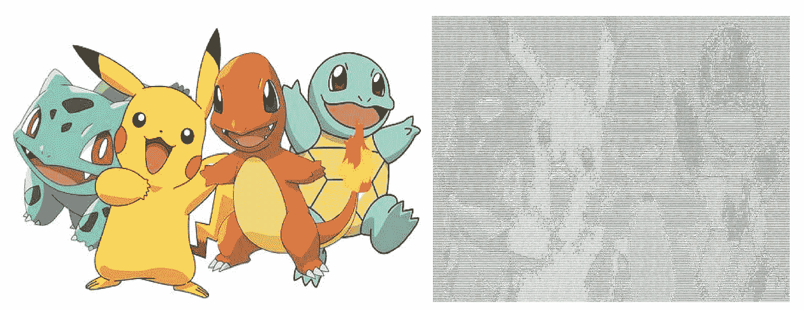

原图(左)，对应 ASCII 艺术(右)；来源:https://github.com/jojo96/asciimage

前几天写了一个将图像转换成 ASCII 画的 Python 库，[ASCII image](https://pypi.org/project/asciimage/)(一定要试一试；).输出是一个文本文件(。txt 或者。docx ),其中字符相互协调以重新创建输入。于是，这件事就这样成了！

之后偶然看到这篇关于 [***图片翻译***](https://machinelearningmastery.com/how-to-develop-a-pix2pix-gan-for-image-to-image-translation/) ***的精彩文章。*** 我想我也可以改编 pix2pix GANS 来创建 ASCII 艺术:该模型将在左侧获取一个彩色图像，如彩色神奇宝贝图像，并在右侧输出一个 ASCII 样式的图像。

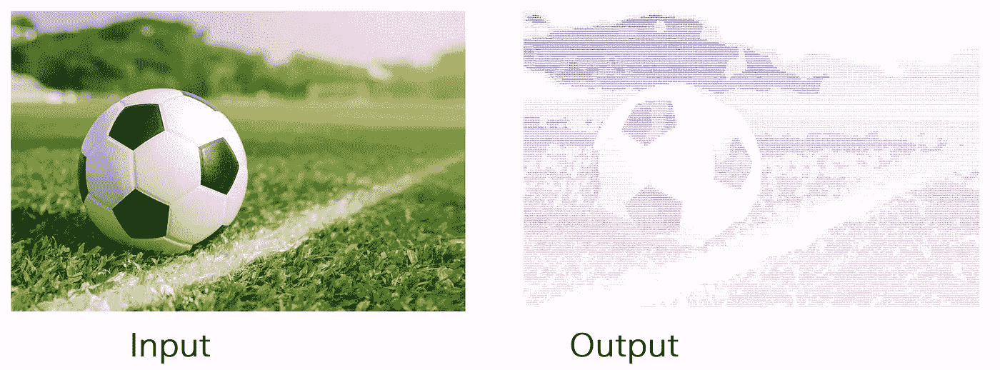

**生成训练数据:**

我搜索了与 ASCII 图像相关的预建数据集，但找不到任何数据集。所以，我修改了这篇文章中的代码:[用 Python 把照片转换成 ASCII 艺术](https://wshanshan.github.io/python/asciiart/)。

每个训练数据是一个 512X1024 的图像，应该是这样的:

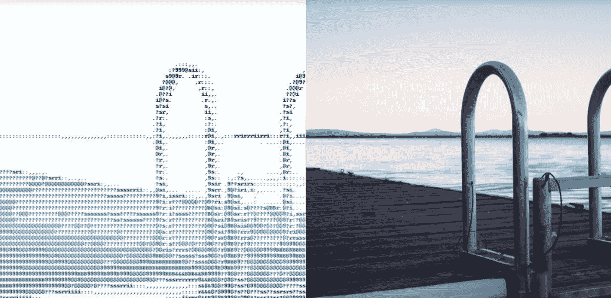

这是一张 512X1024 的图片。图像的左边部分(512X512)和图像的右边部分(512X512)形成一个训练对。

因此，**每个训练样本**都是使用:

1.  获得随机图像，
2.  创建它的 ASCII 等价物和
3.  将这两张图片并排放在一起

对于随机图像生成，我偶然发现了这个神奇的网站:[**Lorem Picsum**](https://picsum.photos/)**。可以这样用:**

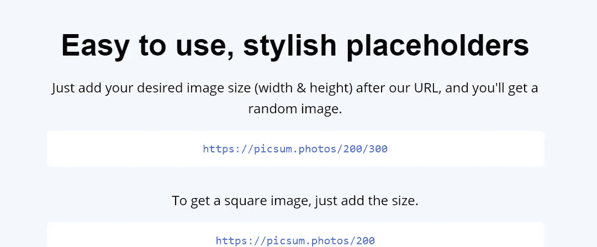

来源:[https://picsum.photos/](https://picsum.photos/)；查看网站了解更多选项

因此，随机图像捕获代码非常简单:

```
#Example of loading image automatically
#https://picsum.photos/
from PIL import Image
import requests
im = Image.open(requests.get('https://picsum.photos/512/512', stream=True).raw)
#https://picsum.photos/512/512: used 512 for getting 512X512 image
```

ASCII 生成函数如下所示:

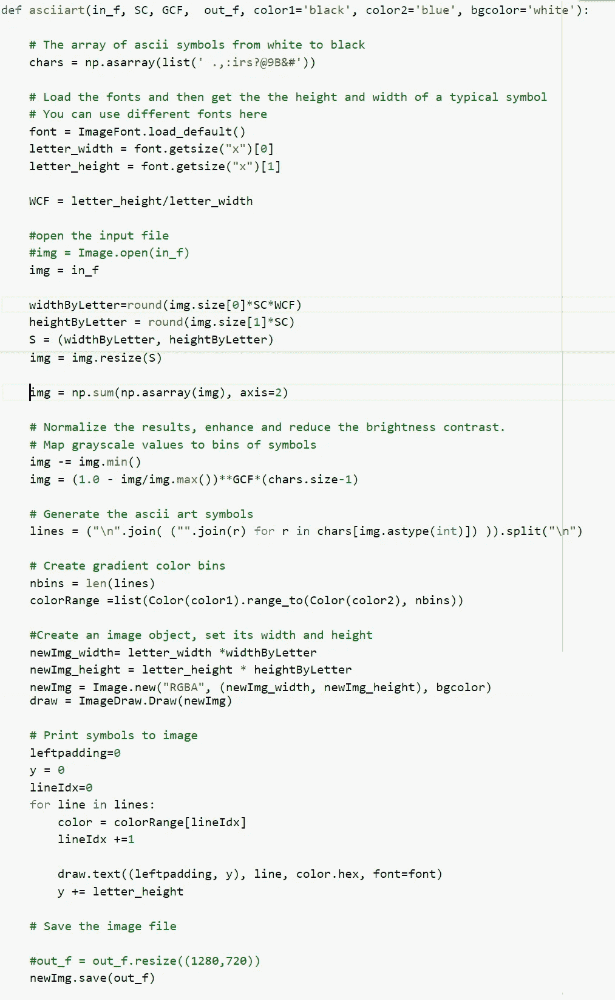

来源:[https://gist . github . com/wshanshan/c 825 efca 4501 a 491447056849 DD 207d 6](https://gist.github.com/wshanshan/c825efca4501a491447056849dd207d6)

**下一个函数用于生成训练样本:**

```
def imgGen(img1,count):
  inputf = img1  # Input image file name
  SC = 0.1    # pixel sampling rate in width
  GCF= 2      # contrast adjustment asciiart(inputf, SC, GCF, "results.png")#defaultColor,blk2blue      
  asciiart(inputf, SC, GCF, "results_pink.png","blue","pink") img = img1
  img2 = Image.open('results.png').resize(img.size)
  img2.save('result.png')
  img3 = Image.open('results_pink.png').resize(img.size)
  img3.save('resultp.png') images = [img2,img]#change
  widths, heights = zip(*(i.size for i in images))
  total_width = sum(widths)
  max_height = max(heights)
  new_im = Image.new('RGB', (total_width, max_height))
  x_offset = 0 for im in images:
    new_im.paste(im, (x_offset,0))
    x_offset += im.size[0]
  img4 = new_im.resize((1024,512))
  img4.save('w11'+str(count)+'.jpg') images = [img3,img]#change
  widths, heights = zip(*(i.size for i in images))
  total_width = sum(widths)
  max_height = max(heights)
  new_im = Image.new('RGB', (total_width, max_height))
  x_offset = 0

  for im in images:
    new_im.paste(im, (x_offset,0))
    x_offset += im.size[0]

  img5 = new_im.resize((1024,512))
  img5.save('w12'+str(count+1)+'.jpg')
```

现在，在循环中运行上述函数会生成完整的训练数据:

```
import os
count = 0
while count < 200:
   im = Image.open(requests.get('https://picsum.photos/512/512', stream=True).raw)
   imgGen(im,count)
   count += 1
```

您可以在这里访问完整的培训数据生成笔记本:[https://github . com/jojo 96/ASCIIGan/blob/main/notebooks/ascitraining data gen . ipynb](https://github.com/jojo96/ASCIIGan/blob/main/notebooks/AsciiTrainingDataGen.ipynb)

训练数据集也可以从 [Kaggle](https://www.kaggle.com/jojo096/imagetoasciiart) 下载。

生成训练数据样本后，我使用这个 split 函数来生成(图像，ascii art)对，然后进行一些训练:

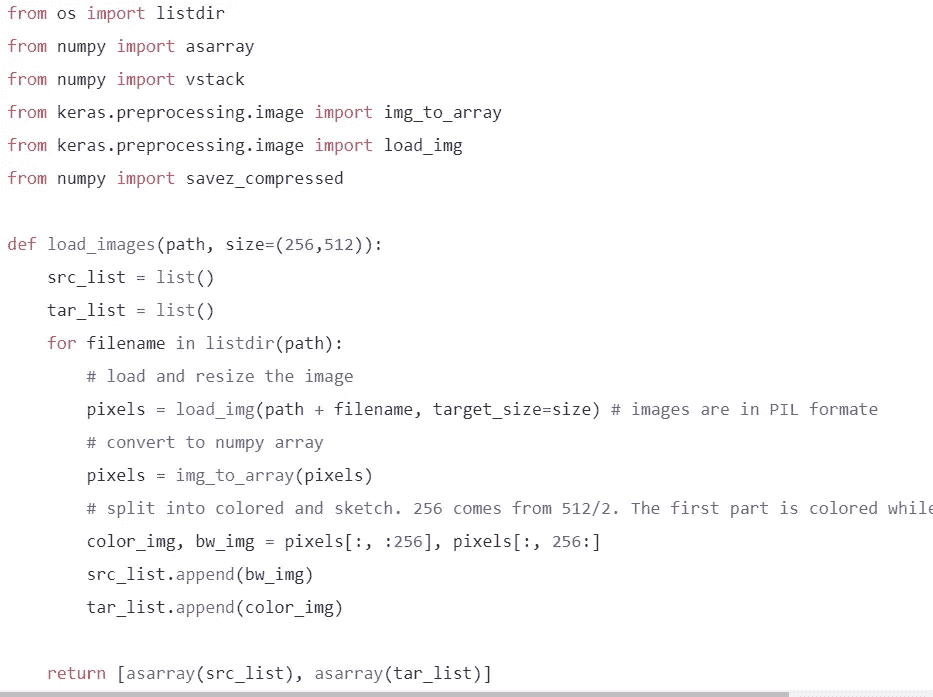

来源:[https://medium . com/swlh/build-a-pix 2 pix-gan-with-python-6db 841 b 302 c 7](/swlh/build-a-pix2pix-gan-with-python-6db841b302c7)

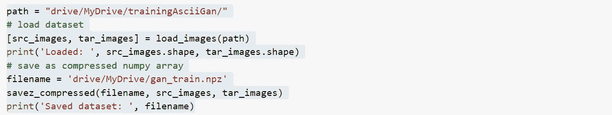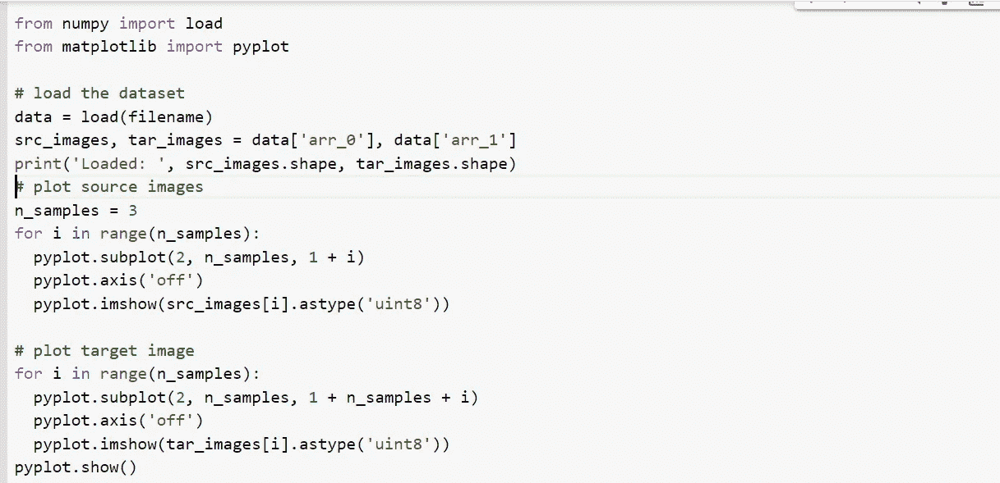

结果:

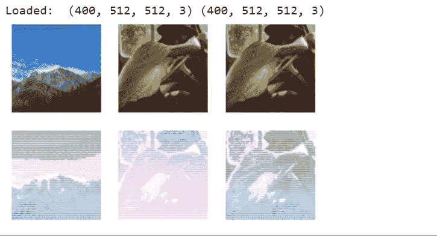

图像-ASCII 艺术对。顶行显示输入图像，底行显示相应的图像 ascii 对

**真实训练:**

生成训练图像对之后，我设置了 Pix2Pix GAN 用于图像翻译。这里，我们将普通图像转换为 ASCII 艺术。生成器生成逼真的图像，鉴别器将它们分类为真实的(如果来自数据集)或伪造的(生成的)。随着训练的进行，鉴别器的 art 或者更确切地说是 ASCII art 变得更好，而生成器创造出更好的赝品。Pix2Pix GAN 之前已经成功用于图像着色、将地图转换为卫星照片等任务。[1],[6]

**设置 GAN:**

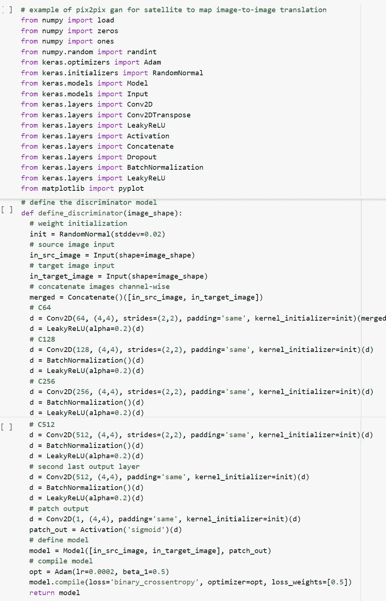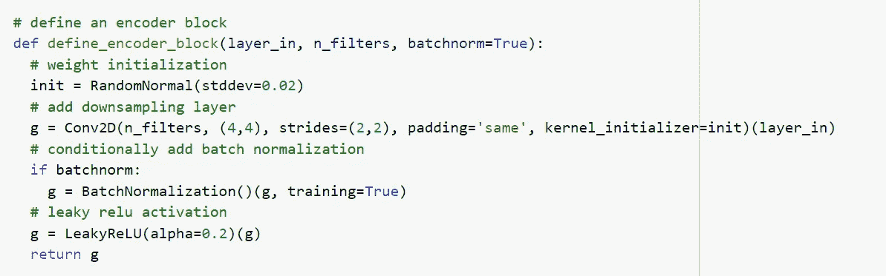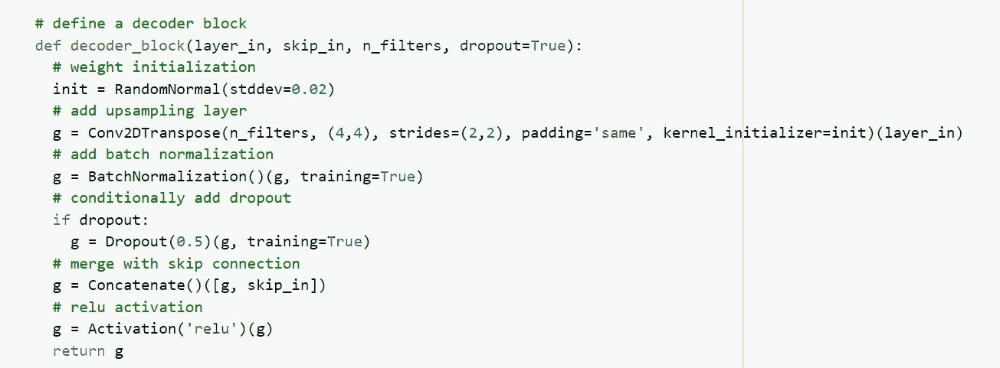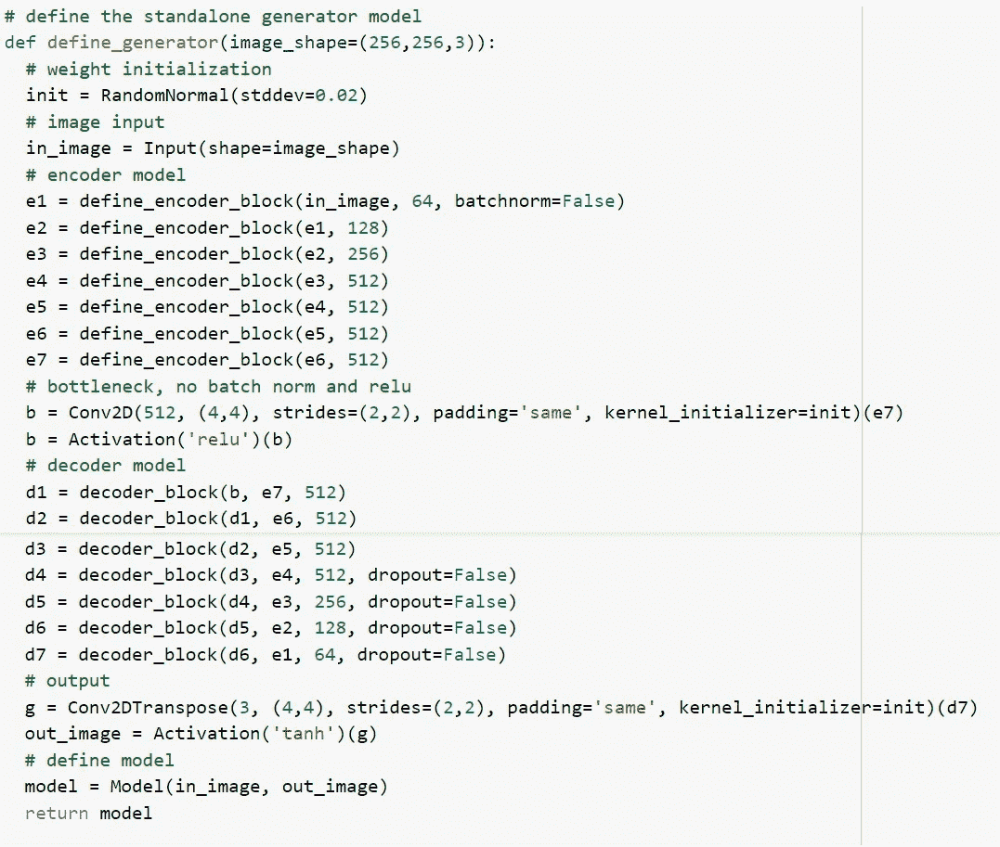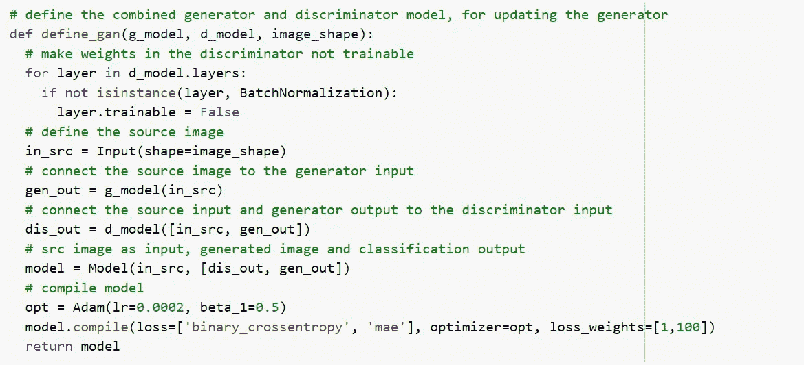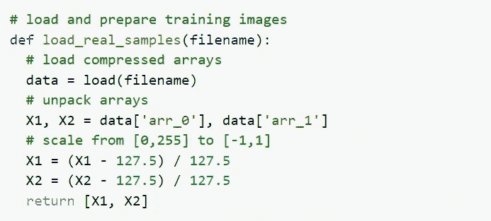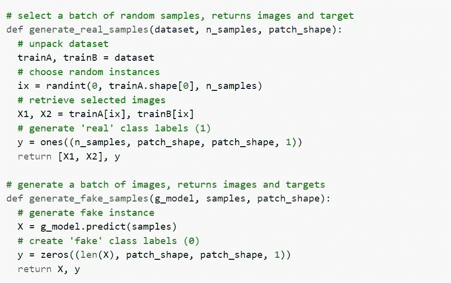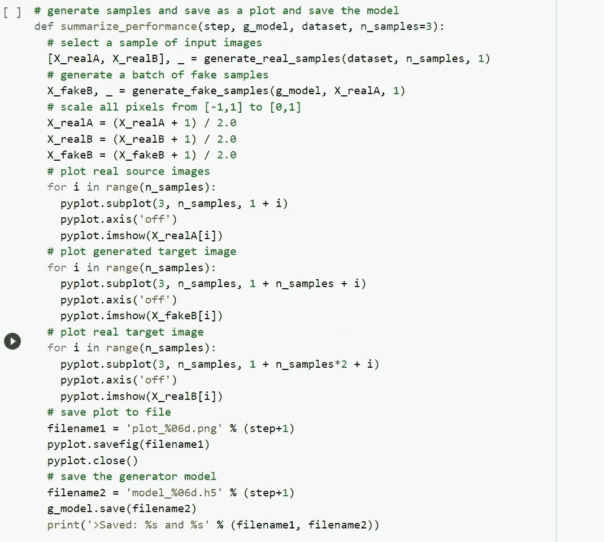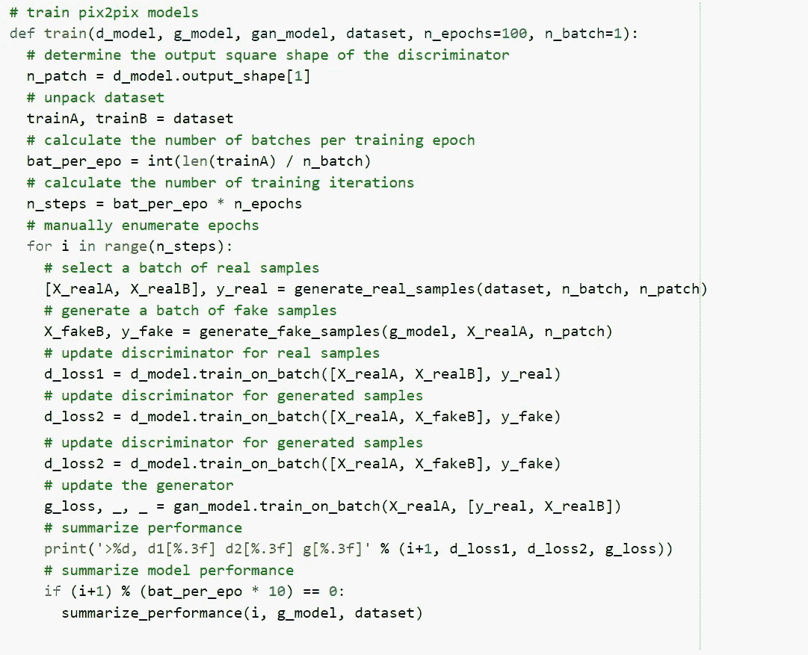

通过跑下面的街区开始训练:

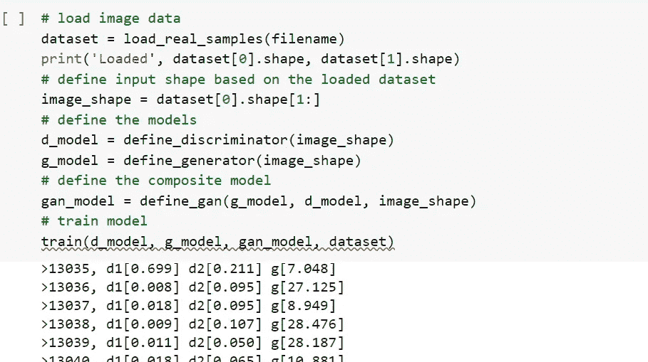

随着训练的进行，模型会在几次迭代后被保存。. h5 文件可以在以后用于生成 ASCII 图像。

**结果:**

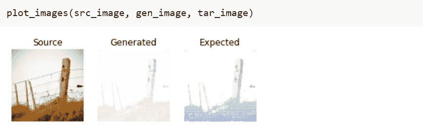

**使用训练模型的图像翻译:**

现在，既然我们已经训练了我们的甘，我们应该有几个训练有素的模型。我们可以使用这些模型通过使用任何输入图像来生成 ASCII 艺术。

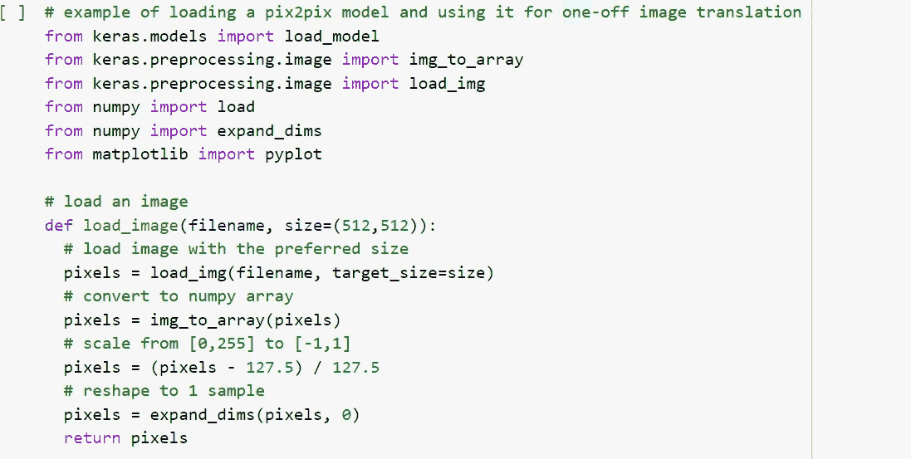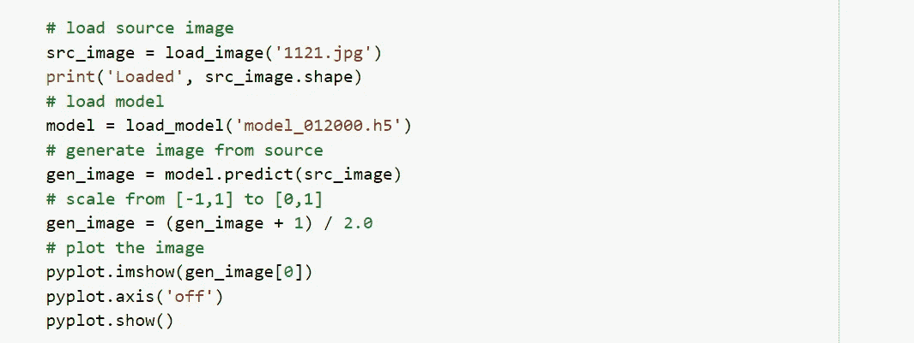

图像翻译结果:

输入:

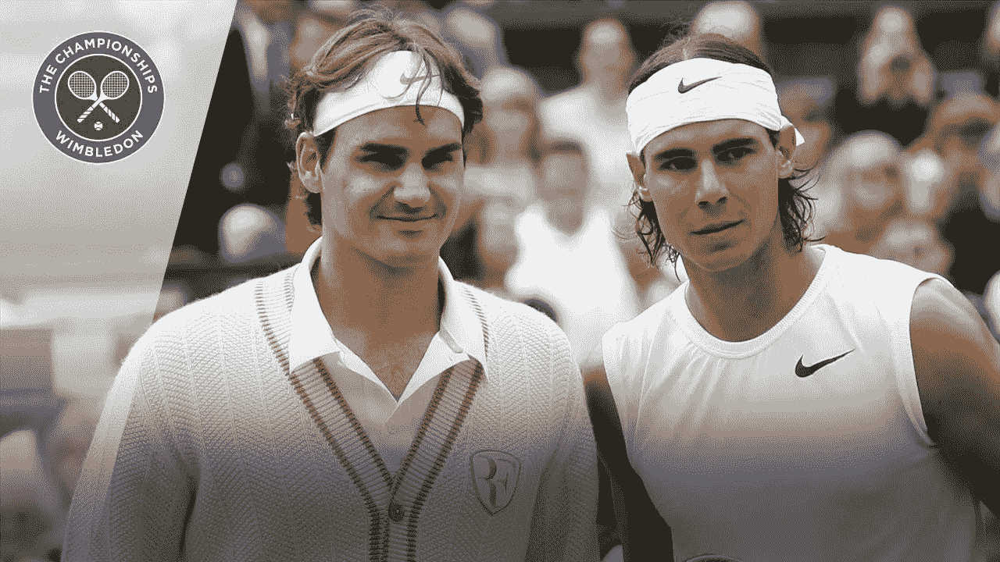

输出:

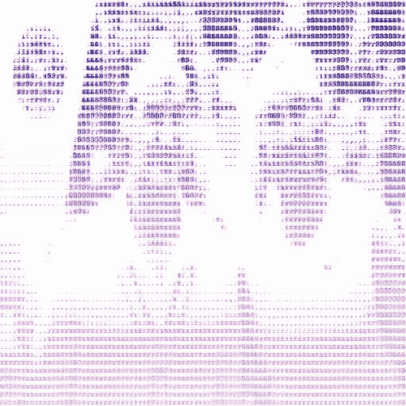

结果表明，我们得到了预期的 ASCII 艺术，但质量可以提高很多。我使用可用的 GPU，在免费的、精彩的、令人惊叹的 **Google Colab** 平台上训练我的模型。有了更多的计算能力，我们可以获得更大的训练数据集，并获得更好的结果。

**Streamlit app**

我还使用 Streamlit 部署了一个产生 ASCII 艺术的应用程序。你可以在这里尝试:[https://share.streamlit.io/jojo96/asciigan/main/asciiGan.py](https://share.streamlit.io/jojo96/asciigan/main/asciiGan.py)

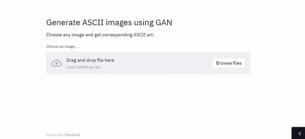

ASCII 艺术的 Streamlit 应用程序

*本文代码的灵感来源于[1]和[2]。要了解 pix2pix GANs，请随意参考这些帖子。streamlit 应用程序和其他所有东西的代码都可以在我的存储库中找到*[***https://github.com/jojo96/ASCIIGan***](https://github.com/jojo96/ASCIIGan)

💡**资源和参考资料**:

1.  如何开发用于图像到图像翻译的 Pix2Pix GAN[https://machine learning mastery . com/how-to-develop-a-pix2pix-gan-for-image-to-image-translation/](https://machinelearningmastery.com/how-to-develop-a-pix2pix-gan-for-image-to-image-translation/)
2.  用 Python 构建 Pix2Pix GAN[https://medium . com/swlh/build-a-pix 2 pix-gan-with-python-6db 841 b 302 c 7](/swlh/build-a-pix2pix-gan-with-python-6db841b302c7)
3.  [1947 年关于 ASCII 艺术的新闻广告](https://text-mode.tumblr.com/post/19507231028/news-article-from-1947-about-julius-nelson-a)
4.  [露丝和马文·萨克纳关于他们迈阿密海滩家/博物馆的纪录片，世界上最大的混凝土/视觉诗歌私人收藏](https://www.ubu.com/film/sackner_concrete.html)
5.  [ASCII 艺术的失落祖先](https://www.theatlantic.com/technology/archive/2014/01/the-lost-ancestors-of-ascii-art/283445/)(简史)
6.  Pix2pix:关键模型架构决策[https://Neptune . ai/blog/pix 2 pix-Key-Model-Architecture-Decisions](https://neptune.ai/blog/pix2pix-key-model-architecture-decisions)