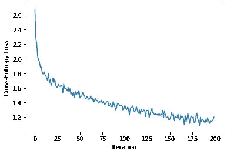

# 用 Pytorch 生成恐龙的名字

> 原文：<https://medium.com/analytics-vidhya/generating-dinosaur-names-with-pytorch-ee839e97bb76?source=collection_archive---------8----------------------->

## (深度学习的方式)


# 介绍

我进入深度学习已经有一段时间了，我的大部分经验都是围绕着计算机视觉任务，我处理的数据大多是图像。几个月前，我开始尝试序列数据(在停顿了很长时间之后)，到目前为止，这是一次很棒的经历。

然后，我决定写下我处理过的使用这种数据的各种任务。还有什么比从最基本、最有趣的任务开始更好的方法呢？使用序列对序列模型生成恐龙名称。

在本文中，我们将训练一个基于 RNN 的模型来生成恐龙的名字。本文期望您对 Python、RNN(递归神经网络)层和 Pytorch 或任何类似的深度学习框架有基本的了解。

本文中使用的完整代码位于这个 [Github 存储库](https://github.com/judahsemi/Dino-Name-Generator)中。就这样，让我们开始吧。

# 说明

那么，序列对序列模型到底是什么？它们是通常建立在 RNN 层上的模型，其基本工作流程是接收一系列数据，然后生成以某种方式连接到输入的不同序列。对于我们的任务，输入是一个字符序列，生成的输出是输入序列中的下一个字符。


在上面的图像中，一系列的正方形(总共)组成了我们的模型。模型下面的箭头(代表我们的数据序列)和最左边的箭头(我们模型的初始状态)一起构成了模型的输入。模型上面的(预测的下一个值)和最右边的(模型的当前状态)组成了模型的输出。

那么，我说的“模型的状态”是什么意思呢？嗯，你可以把它看作是模型能够从输入中提取的信息的编码。通常将模型的初始状态设置为零，因为它还没有处理任何输入数据。随着模型处理更多的输入(从左向右移动)，它的状态会不断更新(由中间的向右箭头表示)，直到输入数据结束。


上图是上一张图的组合。这样做的目的是，对于每个输出，我们不是从头开始整个过程，而是从上一个停止的地方继续，因为隐藏状态是相同的，并且一次性处理所有内容。请注意，每个输出值仅基于该点之前的序列历史进行预测，就像以前一样。

在开始之前，让我们导入将要使用的包。

下面是我们将要做的事情的概述:

1.  预处理数据
2.  转换和加载数据
3.  定义模型
4.  培训模式
5.  生成样本
6.  结论

# 预处理

我们要做的第一件事是获取并预处理我们的数据。你可以在这里下载我们将要使用的数据[。这是一个. txt 文件，在新的一行中包含每个恐龙的名字。它是相对干净的，所以预处理它是非常简单的。](https://gist.github.com/judahsemi/210d42e0410c122aa0e437861c46cf94)

我们首先加载文件，然后读取并转换成小写字符。接下来，我们将它按每行拆分，这将给出一个恐龙名称列表。最后，我们将每个名字拆分成一个字符列表，并在列表中添加一个 EOS(序列结束)标记(“<eos>”)。</eos>

文件“Aachenosaurus”中的第一个名称将是:

```
["a", "a", "c", "h", "e", "n", "o", "s", "a", "u", "r", "u", "s", "<EOS>"]
```

我们添加 EOS 标记的原因是当我们想要生成新名称时。这个想法是，我们的模型学习用这个标记来结束一个名字，当我们要生成新的名字时，这个标记将发出那个名字结束的信号。如果没有这个标记，我们就不知道我们的模型何时完成了名称的生成，并且我们可能会过早或过晚地停止它。如果最后两句话对你来说没有多大意义，等一下，它们以后会明白的。

在所有这些之后，我们创建我们的词汇表，这是我们的模型将被训练处理的所有独特字符(和标记)的列表。然后我们创建两个字典；第一个将我们词汇表中的每个条目映射到一个惟一的整数，而另一个则相反。我们很快就会用到它们。

# 数据加载

接下来我们要做的事情是转换和加载我们的数据。它分为两个部分，首先将我们的数据从字符串(字符)转换成整数，因为我们的模型只能理解数字。第二部分是我们将如何加载数据来训练模型的逻辑。我们将使用 Pytorch 的 Dataset 和 DataLoader 类来处理这两者。

首先，我们定义一个继承 Dataset 类的 Python 类。这个类将负责从我们的数据中提取样本。接下来，我们定义 __init__ 方法，该方法接收已经预处理过的数据，并使用我们之前创建的字典之一将每个字符转换为整数。现在我们的数据是我们的模型可以理解的类型。

但是我们还没有完成。Pytorch 的 Dataset 类要求我们定义另外两个方法。它们是 __len__ 方法(返回数据的长度)和 __getitem__ 方法(返回数据中特定索引处的样本)。实现 __len__ 方法就像对我们的数据调用 Python 的内置函数 len 并返回值一样简单。所以我们只剩下 __getitem__ 方法了。

__getitem__ 方法自动接收我们感兴趣的索引作为参数。然后，我们从数据中的该索引处获取样本，从样本中截取 X(从第一个值到倒数第二个值)和 Y(从第二个值到最后一个值)，将它们转换为张量并返回。

最后，我们创建一个数据加载器对象。这个对象为我们的数据集提供了一个很好的包装器，允许我们(非常容易地)做一些事情，比如移动我们的数据集，或者做一些更复杂的事情，比如合并多个数据集或者使用多个工人来加载我们的数据集。幸运的是，我们不会在这里处理任何复杂的情况。最后，我们将 batch_size 设置为 1，并将 shuffle 设置为 True。

有了这些，我们就可以开始研究我们的模型了。

# 模型

我们的模型很标准。它从嵌入层开始，接着是 LSTM 层(RNN 层的一种变体)，然后是下降层，最后是线性(完全连接)层。我将简要描述每一层的作用。

目前，字符在我们的数据集中的表示方式并不合适。例如，a 和 b 分别表示为 1 和 2。这将向我们的模型暗示 b 是 a 的两倍，a 比 b 小。我们知道，对于我们当前的任务，这是不正确的，甚至没有任何意义，但这就是我们的模型要做的。一维(单一数字)表示是不够的。

这就把我们带到了模型的第一层，嵌入层。这一层负责学习我们的词汇表中每个条目的多维表示，在我们当前任务的上下文中最好地向我们的模型描述它们。您可以将每个维度视为一个特性。

接下来的层，LSTM 层和线性层，负责预测给定字符序列的下一个字符，尽管 LSTM 层做了大部分繁重的工作。你也可以使用 RNN 层的其他变体，如 GRUs 或香草 RNN，来代替 LSTM 层，如果你愿意的话；这在这里没多大关系。

在定义了层之后，我们继续前进的方法，它所做的是把我们刚刚谈到的所有东西放在一起。它将 X 和我们模型的先前状态作为输入，然后将它们传递到每一层，最后返回它的预测和我们模型的当前状态。每次我们调用模型(model())时，这个方法都会被隐式调用。现在，记得我在开始时提到过，我们将模型的初始状态设置为零，这就是 init_state 方法的作用。

# 培养

当然，像现在这样使用我们的模型会产生无意义的东西，因为目前它不知道我们想要它做什么。在它对我们有用之前，我们必须先训练它。Pytorch 中的训练过程通常遵循类似的模式，不管任务是什么，现在我将介绍一下。

*   首先，我们将模型参数的梯度归零
*   然后，我们初始化模型的状态，并通过它执行向前传递
*   接下来，我们计算损失，并通过我们的模型进行反向传递
*   最后，我们剪切从后向过程中得到的梯度，并更新我们的模型参数
*   这个循环然后被重复进行。

我们用交叉熵损失、梯度裁剪值 0.25 来训练我们的模型，并且我们使用 Adam 优化器来更新我们的模型的参数。我们还跟踪每次迭代后的损失，并将它们存储在一个列表中。如果你对迭代和纪元之间的区别感到困惑，你可以在这里阅读它。

# 抽样

经过 60000 次迭代的训练，我们的损失现在减少到 1.1671 左右。



我们终于达到了我们一直训练的目标。是时候生成恐龙名字了。我们对模型进行采样的方式类似于我在本文开头给出的序列到序列模型的描述，除了一些修改。

我们从用种子初始化我们的模型开始；这可以是单个字符或一系列字符。然后，我们从模型中取出最后一个时间步长的输出，并从前 k 个最可能的字符中随机选择一个字符。然后，所选择的字符与模型的当前状态一起用于预测序列中的下一个值。然后重复这个过程，直到随机选择的字符是 EOS 标记，或者直到它达到我们指定的长度。

我们随机选择字符的原因是为了在我们生成的样本中引入某种多样性和随机性。如果我们每次都选择最可能的字符，我们可能会陷入一个循环，模型会不断重复生成一系列字符。

让我们看看这样的例子。

这将输出:

```
>>> Samples where the seed is a randomly chosen character.n => nicronyx<EOS>       r => reptitan<EOS>
b => bitcodon<EOS>       t => tariusaurus<EOS>
g => goblinodon<EOS>     v => viceratops<EOS>
a => anteletops<EOS>     w => wagnoraptor<EOS>
o => optimimus<EOS>      w => walkiesaurus<EOS>
```

根据我们的模型，如果有一种像蟒蛇一样的恐龙，它可能会被称为以下任何一种:

```
>>> Samples where the seed is a list of characters.python => pythonyx<EOS>
python => pythonykus<EOS>
python => pythongovenator<EOS>
```

# 结论

在本文中，我们讨论了序列到序列模型以及使用它们生成恐龙名字的过程。我们在这里讨论的方法非常通用，可以用于生成任何东西，比如人名、歌词、加密货币名称，甚至音乐。

你可以尝试一个令人兴奋的想法，那就是恐龙名字的条件生成。这与我们刚才所做的类似，除了我们不是随机想出一个名字，而是考虑它的特征，比如它是食肉动物，还是会飞，还是水生动物，并根据这些信息，我们生成一个更合适的名字。

你应该考虑的另一个想法是批量处理你的数据，我在[这篇文章](/analytics-vidhya/batching-strategies-for-lstm-input-6f18089b1735)中谈到过。它可以减少你的训练时间，增加你的模型提前收敛的机会。

感谢阅读！

[](https://unsplash.com/photos/-15ZMeUKtJM) [## 穆罕默德·图尔古特·柯克戈兹在 Unsplash 上拍摄的照片

### 下载这张由 Mehmet Turgut Kirkgoz (@tkirkgoz)拍摄的恐龙、动物、爬行动物和霸王龙的免费高清照片

unsplash.com](https://unsplash.com/photos/-15ZMeUKtJM)