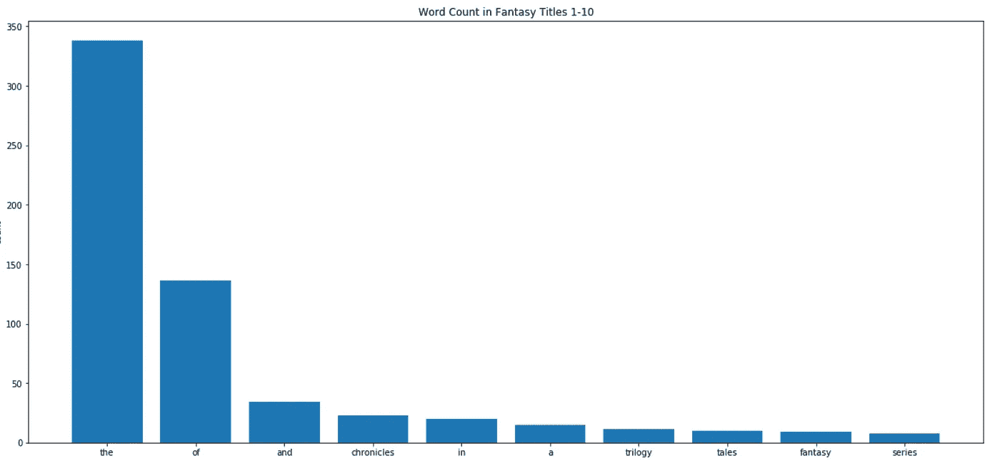
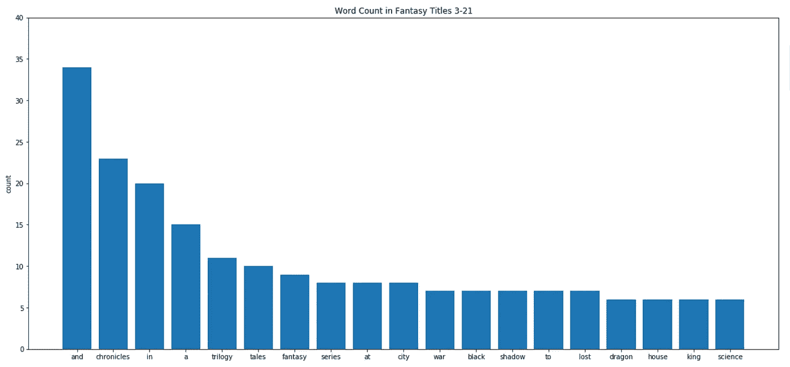
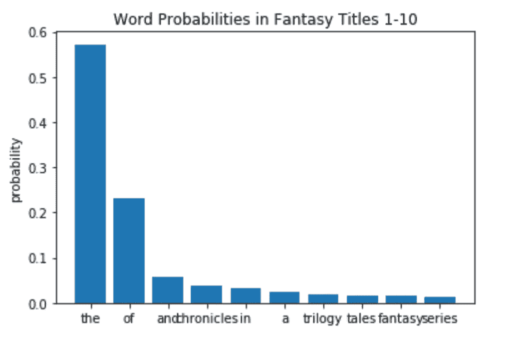
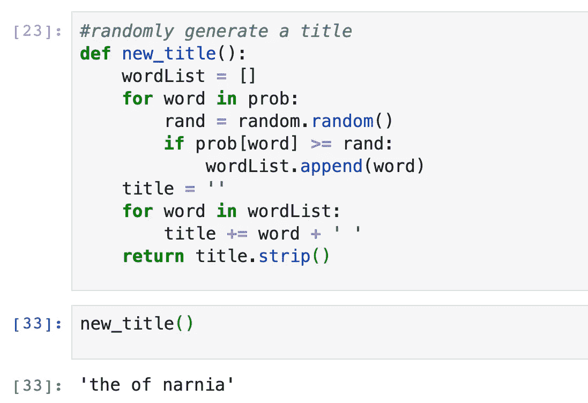
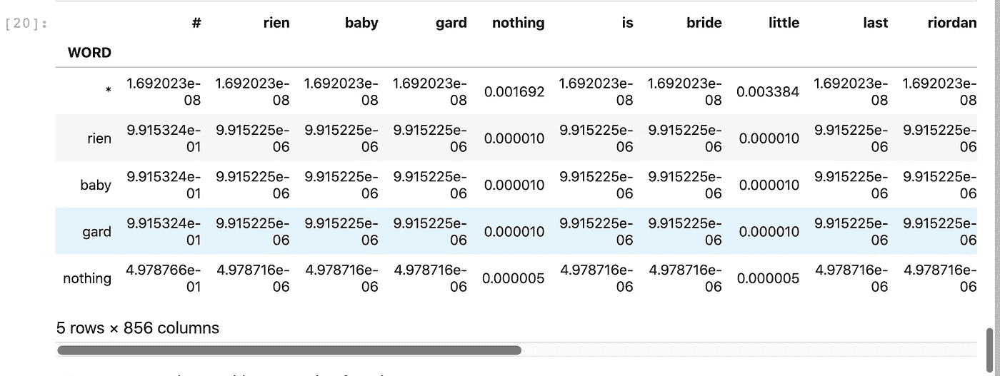
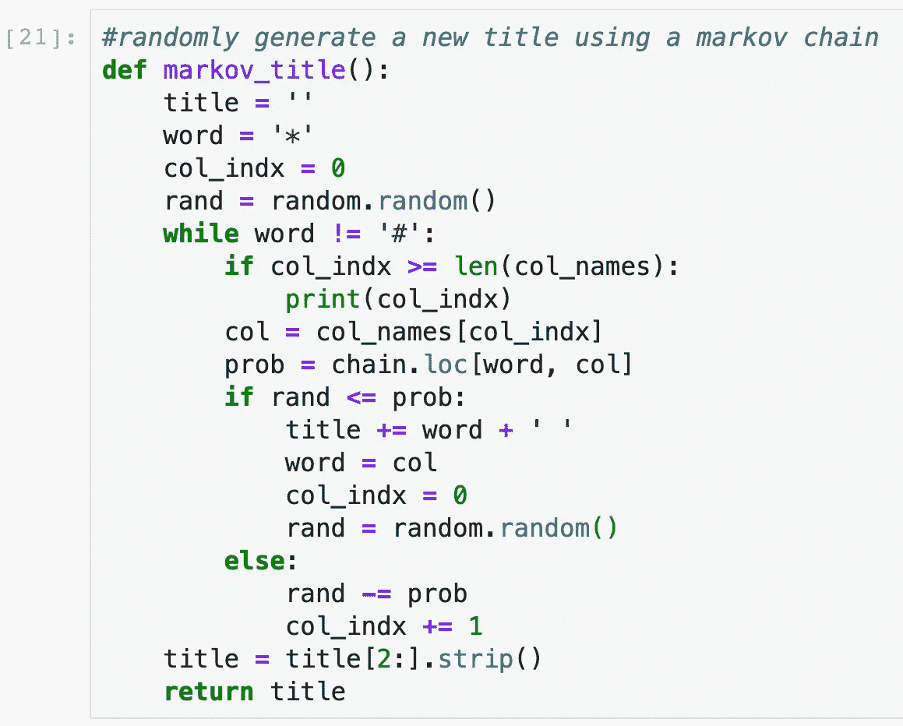

# 用马尔可夫链生成幻想标题

> 原文：<https://medium.com/analytics-vidhya/generating-fantasy-titles-with-a-markov-chain-87981ebc4cc5?source=collection_archive---------31----------------------->

## 其中我比较了概率幻想标题生成器和马尔可夫链生成的标题生成器。


图片由[com break](https://pixabay.com/users/comfreak-51581/?utm_source=link-attribution&utm_medium=referral&utm_campaign=image&utm_content=794978)来自 [Pixabay](https://pixabay.com/?utm_source=link-attribution&utm_medium=referral&utm_campaign=image&utm_content=794978)

我一直觉得奇幻类小说的命名惯例非常迷人——或许除了侦探小说，这类小说的命名风格是我读过的所有类型中最常见的。事实上，在我看来，它似乎是所有体裁中出现次数最多的标题词。所以我决定是时候做几个我自己的主题幻想作品了。

# **第一部分:概率方法**

为了生成大量听起来很奇幻的标题，我决定创建一个标题生成器。我查阅了维基百科的半全面的奇幻书籍清单，用作我的数据(尽管我注意到明显没有我个人最喜欢的书，*鲁莽*)。使用 webscrape 的 *requests* 包和解析 html 的 *Beautiful Soup* ，我在 fantasy 中创建了一个(几乎每个)标题列表。然后我统计了语料库中每个单词的每个实例。好奇玄幻片头最常见的词是什么？



*‘the’*是最常见的单词。这并不奇怪。的和*之后，似乎急剧下降。再来看看之后的常用词。*



我们到了。一些经典的玄幻词汇:*【传说】**【战争】**黑***龙*。*

*现在，为了创建我的标题生成器，我需要一个单词出现在幻想标题中的概率。一旦我有了这个，我就简单地从概率上选择一个单词样本，然后把它们放到一个标题中。*

*下面是将计数除以列表中标题的数量以获得概率后的相同曲线。*

**

*所以，在所有的奇幻游戏中，出现了超过一半。*

*现在是发电机:*

**

*这有一些明显的问题。*对*的一件事。我做了一个稍微细致一点的版本，不允许这样做——它不断改变单词的顺序，直到满足一组要求(例如，的*不能跟在*的*后面)。**

*以下是该过程生成的一些标题:*

```
*the regard young
the cycle solstice
in of chrestomanci unknown sorrow tree saga
the to shattered
dragonology night unicorn
series dirk desire
damiano
the power prince matilda mountain
the shadow science inkdeath nothing fortune
the taller ever*
```

*还是挺糟糕的。这个生成器有一些明显的局限性。首先，因为我们是基于概率来挑选每个单词的，所以同一个单词不能在一个标题中出现两次。但是我们可以想象，比如说，*‘the’，*这个词可能会在一些奇幻作品的标题中出现两次。其次，生成器没有语义感，像康加线一样把名词钉在一起。而且它不会采用常见的名称模式，比如标题格式为“*名词*或*名词”**

*那么，我们能做得更好吗？*

# *第二部分:马尔可夫链*

*马尔可夫链是通过矩阵描述事件的可能序列的过程。行代表当前状态(当前的*字，本例中为*)，列代表下一个状态。矩阵的行列元素是列跟随该行的概率。*

*下面是我为标题数据创建的马尔可夫转移矩阵。我通过以下过程创建了它:*

*   *对于每一个单词，我都把它后面标题中的每一个单词数了出来*
*   *转换矩阵的行代表每个单词加上一个我称为*的起始短语标记*
*   *矩阵的列表示每个单词加上一个我称为#的结束短语标记*
*   *在每个行-列元素中，我计算标题中该列单词跟随该行单词的次数*
*   *最后，我用行总和对每个元素进行归一化，以获得列字跟随行字的概率*

**

*幻想标题转换矩阵*

*我还在每一次计数中增加了一个很小的概率，这样任何单词出现的可能性都很小。这增加了一些噪声，希望能防止生成器过于频繁地创建真实的幻想标题。*

*这是发电机:*

**

*简而言之，我们首先将变量 *word* 设置为短语开始标记 *** 。然后，只要*单词*不是短语结束标记 *#* ，我们就在马尔可夫链中从一个状态移动到另一个状态。最后，我们将随机创建一条连接*和#的单词路径。这条路是我们的标题。*

*马尔可夫发生器做的怎么样？好吧，让我们来看看一些标题。*

```
*the city of fairy tale
tomoe gozen
gloriana or the fates of alvin maker
clockwork angel tower
the walls
lilith
the end of narnia
dungeons dragons
the anubis gates
the stress of fantasy*
```

*那听起来肯定更好！没有像上一个模型那样的废话。我绝对会读《童话之城》！*

*让我们再来看几个例子:*

```
*chimera
shadowplay
coraline
pellucidar
witch of honey
sangreal trilogy
brak the revenants
overtime
the golden cage
the well at the wolf leader
inkspell
septimus heap
chrestomanci
the kin of the fates of somebody the last unicorn
eragon
the vollplaen crock of atrix wolfe
vampire academy
the tree of night land
the kane chronicles
chernevog*
```

*也许你现在可以开始看到我们的马尔可夫模型的局限性——它们与概率模型的局限性非常不同。*

*限制一:一个单词的标题。它们出现了很多次，因为作为标题结尾出现的每个单词都很有可能在那里停下来。由于我们遵循马尔可夫链，而不是独立地挑选每个单词，所以我们经常碰到短语结尾，得出许多单个单词的标题。虽然有很多真正的一个词的幻想标题，我不认为有这么多。*

*限制二:复制真实的幻想标题。*凯罗琳*，*伊拉贡*，*凯恩编年史* *。问题是，我们正在沿着真实的奇幻小说铺设的道路前进——这意味着我们经常完全沿着这条道路前进，并重复实际的标题。我在系统中添加了额外的噪音来消除这个问题，但是很明显这个问题仍然经常发生。你可以添加更多的噪声来尝试解决这个问题，但在某些时候，标题看起来会非常随机，就像概率模型一样。**

*所以，综上所述，马尔可夫模型比概率模型好吗？嗯，是也不是。我觉得读起来更愉快，因为我通常可以解析标题。其中许多听起来像是我可能会在慵懒的夏日阅读的东西。但它也落入了概率模型避免的一些陷阱。概率模型几乎永远不会重新创建一个实际的标题。*

*那么，我们注定要在概率方法的随机性和马尔可夫方法的语法之间做出选择吗？我们的计算机生成的标题听起来会不会总是离真正的印刷标题太远或太近？*

*也许，也许。但是我们只是使用简单的方法。创建幻想标题生成器最有前途的方法是利用机器学习——让一个算法自学创建标题，并将它们与真实标题进行比较，以了解哪些标题是坏的，哪些是好的。所以打开传送门，勾勒出五芒星的轮廓。如果你想要真正(人工)激发灵感的标题，你必须召唤一个神经网络。*

**

*图片来自 [Pixabay](https://pixabay.com/?utm_source=link-attribution&utm_medium=referral&utm_campaign=image&utm_content=2514312)*

*想自己试着运行代码吗？在我的 repl.it [这里](https://replit.com/@QuinnTheobald/FantasyTitles#main.py)生成一些标题。*