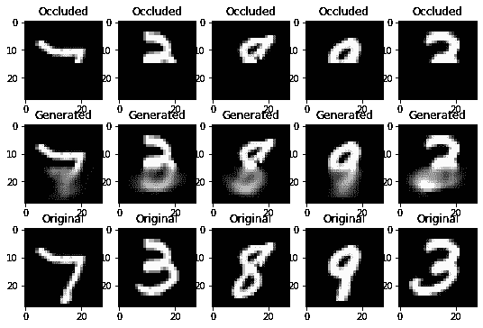

# 生成图像

> 原文：<https://medium.com/analytics-vidhya/generating-images-b8d54835de59?source=collection_archive---------13----------------------->

# **简介**

这篇博客讨论了用一个应用程序生成图像的问题。想法是通过模型为给定的样本图像生成相同的图像。应用程序是使用模型架构并完成遮挡(半填充)图像。一个基本的编码器-解码器和深度 CNN 编码器-解码器模型从零开始实现，在三个数据集上进行训练和分析。该分析还基于为每个数据集找到图像的良好大小的隐藏表示，其可用于应用。

# ***相关作品***

一些众所周知的图像生成方法是自动编码器、生成对抗网络(GANs)、自动回归模型(PixelRNN、PixelCNN)、DRAW。

[自回归模型](https://arxiv.org/pdf/1910.07737.pdf)试图通过估计数据密度来模拟数据分布。直观上，它用于预测给定的先前输入序列的下一个序列。

[生成对抗网络](https://arxiv.org/pdf/1406.2661.pdf)是生成模型。两个模型通过对抗过程同时训练。生成器学习生成真实的图像，而鉴别器学习区分
真实和虚假的图像。鉴别器的作用是决定图像是来自真实数据集还是来自生成器。

[深度再现细心作家(DRAW)](https://arxiv.org/pdf/1502.04623.pdf) 建筑反映了向更自然的图像创作模式迈进了一步，在这种模式下，场景的各个部分彼此独立地创建，近似的草图随着时间的推移而不断完善。一对递归神经网络形成了 DRAW 架构的基础:编码器网络压缩训练期间呈现的实际图像，解码器网络在接收代码后重建图像。从开始到结束使用随机梯度下降来训练组合系统，损失函数是数据对数似然性的变化上限。解码器和编码器是 DRAW 中的循环网络，因此可以进行代码样本序列的交换。解码器的先前输出被馈送到编码器，这允许它基于解码器到目前为止的行为发送代码。网络可以决定写什么，在哪里写，在哪里读。

填充被遮挡的图像依赖于先前的像素。换句话说，它是一个基于序列的问题，CNN 架构模型可能捕捉不到序列，但是 PixelRNN 是一种基于上一个像素预测下一个像素的模型。

我们将使用深度 CNN 编码器-解码器模型。由于填充遮挡图像是一个序列问题，我们可以通过将编码器作为 CNN，将 LSTM 作为解码器来修改模型。参考[LSTM 图像去噪](https://arxiv.org/pdf/1801.05141.pdf)

# **数据集描述:**

使用的三个数据集是 MINST digit、标记的野生人脸(LFW)深漏斗和 CIFAR-100。我们不关心所有数据集的标签。MNIST 的数据包含 60，000 个样本。LFW 数据集包含了 5749 个人的 13233 张脸。CIFAR-100 数据包含 60，000 个样本，其中 50，000 个作为训练数据，10，000 个作为测试数据。这些数据集用于各种图像识别任务，但我们将主要关注在将它们存储在较小的维度后重新创建它们。

# **型号:**

为了分析，创建了基本的编码器-解码器模型以及基于深度 CNN 的模型。

编码器和解码器的模型结构

**基本编解码器型号:**

基本编码器-解码器模型(基本模型)由编码器和解码器组成。编码器具有输入层、平坦层和密集层。我们将输入输入到输入层，然后将图像展平并输入到密集层。在密集层中，我们可以为图像的内部表示指定潜在维度值。解码器具有输入层、密集层和整形层。密集层的大小与输入图像的尺寸的乘积相同。解码器将潜在维度值作为解码器输入层的输入。它被送到致密层，最后，我们对图像进行整形，使其成为三维的。

基本模型的编码器图为

图 1.1 基本型号的编码器

基本模型的解码器图

图 1.2 基本模型的解码器

基本模型的代码如下

**深度 CNN 模型:**

该模型的架构与基本模型相同，即编码器-解码器。在编码器中，我们堆叠了四个卷积层和池层，使图像变平，并以密集层结束。在密集层中，我们提供了潜在维度值来表示。我们使用的激活函数是' *relu* '。每个卷积层的内核大小为(3，3)，填充也相同。每个卷积层的输出分别是 32、64、128、256。

在解码器中，我们要对卷积层进行撤销操作，即转置卷积。卷积层提取图像的一部分并产生一个数字，而转置卷积提取数字并产生图像的一部分。解码器的第一层有一个输入层，它采用编码器中指定的潜在维度的形状。接下来，将它连接到单元数等于原始图像大小的乘积的密集层。它随后被整形并被馈送到转置卷积层。我们堆叠四个 Conv2DTranspose 层，输出通道分别为 128、64、32 和 3。“relu”被用作前三层的激活函数，由于最后一层是我们的最终图像，我们在那里不包括任何激活函数。

深度 CNN 模型的代码和绘图(图 2)如下:

深度 CNN 模型的编码器

图 2.1 深度 CNN 模型的编码器

深度 CNN 模型的解码器

图 2.2 深度 CNN 模型的解码器

因为我们在训练模型时生成图像，所以我们给出训练数据来代替模型的输入和输出。

在用这些模型训练之后，我们为给定的样本重新创建了图像。应用部分是完成遮挡(半填充)图像。为此，我们创建了一个用于生成遮挡图像的函数，如图 3 所示。该任务的代码如下

图 3，(上)明斯特数据，(中)LFW 数据，(下)CIFAR 数据的遮挡图像

因此，在训练该模型时，我们将遮挡图像作为输入，将原始图像作为目标。

在推理过程中，我们首先将输入图像提供给编码器，然后将编码器产生的输出作为输入提供给解码器。解码器根据我们正在解决的问题预测所需的输出。我们绘制出这些输出的图表。

**结果:**

如上所述，对三个数据集进行分析。我们希望找到最小的潜在维度尺寸，同时生成良好的图像。下面我们包括重建图像的图像和半填充图像的完成，训练和验证错误的绘图。误差指标是*均方误差，*和“*亚当*”是优化器。我们用不同的潜在大小和不同的数据集展示了所有这些。结果适用于基本和深度 CNN 模型。

我们将从 MNIST 的数据开始；一些样品是

图 4，MNIST 数据样本。

# MNIST 基本模型的结果

潜在尺寸为 32 的基本模型的重建图像(图 5)对于测试数据具有 MSE = 0.017。

**重建，潜在尺寸= 32**

图 5

## 遮挡图像，潜像尺寸:32

对于测试数据，完成具有 32 的潜在尺寸的基本模型的遮挡图像(图 6)具有 MSE = 0.023。

图 6

# MNIST 深度模型的结果

## **重建，**潜在尺寸:32

潜在尺寸为 32 的深度模型的重建图像(图 7)对于测试数据具有 MSE = 0.0030。

图 7

## 遮挡，潜在尺寸:32

对于测试数据，完成潜在尺寸为 32 的深度模型的遮挡图像(图 8)具有 MSE = 0.015。

图 8

## 遮挡，潜在尺寸:128

对于测试数据，完成潜在尺寸为 128 的深度模型的遮挡图像(图 9)具有 MSE = 0.0147。

图 9

## 遮挡、潜在尺寸:512

对于测试数据，完成潜在尺寸为 512 的深度模型的遮挡图像(图 10)具有 MSE = 0.0146。

# LFW 基本模型的结果

现在我们展示 LFW 数据集的图像。一些样品是

图 11。LFW 数据的原始样本

## 重建，潜在尺寸:32

潜在尺寸为 32 的基本模型的重建图像(图 12)对于测试数据具有 MSE = 0.0056。

图 12

## 重建，潜在尺寸:32

对于测试数据，完成具有 32 的潜在尺寸的基本模型的遮挡图像(图 13)具有 MSE = 0.0078。

图 13。(左)(上)遮挡样本，(中)填充样本(下)基本模型的原始样本，(右)训练和验证误差曲线

# LFW 深度模型的结果

## 重建，潜在尺寸:16

潜在尺寸为 16 的深度模型的重建图像(图 14)对于测试数据具有 MSE = 0.0068 如您所见，当深度模型的潜在维度小于基本模型的潜在维度时，基本模型的性能优于深度模型。

图 14

## 重建，潜在尺寸:32

潜在尺寸为 32 的深度模型的重建图像(图 15)对于测试数据具有 MSE = 0.0052。

图 15

## 重建，潜在尺寸:64

潜在尺寸为 64 的深度模型的重建图像(图 16)对于测试数据具有 MSE = 0.0038。

图 16

## 遮挡、潜在尺寸:64，128，512

对于测试数据，完成具有 64 的潜在尺寸的深度模型的遮挡图像(图 17)具有 MSE = 0.0080，尺寸 128 具有 0.0076，尺寸 512 具有 0.0078。

图 17。(左)(上)遮挡样本，(中)完全填充样本(下)深度模型的原始样本，潜在大小分别为 64、128、512

最后，我们展示了 CIFAR 数据的结果；一些样品是

图 18 CIFAR-100 数据示例

# CIFAR 基本模型的结果

## 重建，潜在尺寸:32

潜在尺寸为 32 的基本模型的重建图像(图 19)对于测试数据具有 MSE = 0.0132。

## 遮挡，潜在尺寸:32

对于测试数据，完成具有 32 的潜在尺寸的基本模型的遮挡图像(图 21)具有 MSE = 0.0232。

# CIFAR 的深度模型结果

## 重建，潜在尺寸:32

潜在尺寸为 32 的深度模型的重建图像(图 20)对于测试数据具有 MSE = 0.011。

## 遮挡、潜在尺寸:64

对于测试数据，完成潜在尺寸为 64 的深度模型的遮挡图像(图 22)具有 MSE = 0.0234。

## 遮挡，潜在尺寸:128

对于测试数据，完成潜在尺寸为 128 的深度模型的遮挡图像(图 23)具有 MSE = 0.0231。

**结论:**与 MNIST 数据集的基本模型相比，深度模型的重建图像对于潜在尺寸 32 更好。对于给定的潜在值，深度模型的 MSE 之间的差异非常小。因此，该模型的 MNIST 数据的最小表示大小是 32，即，我们可以用这个大小几乎完美地完成遮挡图像。对于 LFW 数据集，重建对于潜在大小为 64 的深度模型更好。遮挡图像问题的最佳潜在尺寸值是具有尺寸为 32 的基本模型。最后，对于 CIFAR 数据，必须使用大小为 32 的深度模型进行重新创建，基本模型也可以很好地与深度模型一起完成图像。由于这是一个序列问题，我们可以通过将 LSTM 序列模型作为解码器的一部分来扩展这个模型，以获得更好的结果。

所有的代码都可以在 https://github.com/bodavijay24/Generating-Images 的[找到](https://github.com/bodavijay24/Generating-Images)

**参考文献:**

1.  直接关注 CNN-LSTM 编解码器的图像去噪和恢复([https://arxiv.org/pdf/1801.05141.pdf](https://arxiv.org/pdf/1801.05141.pdf)
2.  Gregor，k .、Danihelka，I .、Graves，A .、Rezende，D. J .、和
    Wierstra，D. Draw:用于图像生成的递归神经网络
    ，2015 年。
3.  拉德福德，a .，梅斯，l .，钦塔拉，s .利用深度卷积生成的无监督表示学习
    对抗网络，2016 年。
4.  van den Oord，a .，Kalchbrenner，n .，Vinyals，o .，Espeholt，
    L .，Graves，a .，和 Kavukcuoglu，k .，使用 pixelcnn 解码器生成条件图像
    ，2016 年。
5.  像素递归神经网络([http://proceedings.mlr.press/v48/oord16.pdf](http://proceedings.mlr.press/v48/oord16.pdf))