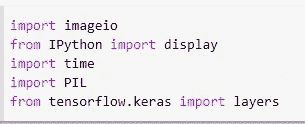
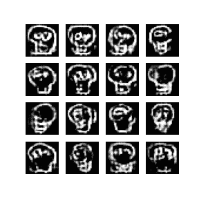

# 用 DCGAN 生成颅骨图像

> 原文：<https://medium.com/analytics-vidhya/generating-skull-image-with-dcgan-b4459a7289a8?source=collection_archive---------7----------------------->

马修·施瓦茨在 [Unsplash](https://unsplash.com?utm_source=medium&utm_medium=referral) 上的照片

如果我告诉你，在为数据世界做贡献的同时享受乐趣是一种有趣的方式，会怎么样？是啊！是真的。你听说过快，画！这是一款由谷歌开发的在线游戏，它收集玩家绘制的图片，然后使用神经网络人工智能，模型试图猜测这些图片代表什么。

现在，让我们开始吧！

首先，我们调用必要的库:

然后是一些日常家务:

正如你在这里看到的，我正在使用 Quick，Draw 的 skull.npy 数据集！数据集可以在这里获得[。数据集中总共有 126，174 幅图像。然后我们将图像标准化。](https://console.cloud.google.com/storage/browser/_details/quickdraw_dataset/full/numpy_bitmap/skull.npy)

现在让我们生成一个可视化的随机图像。

嗯。看起来很棒。接下来，我们定义我们的[缓冲区大小](https://stackoverflow.com/questions/64372390/what-does-buffer-size-do-in-tensorflow-dataset-shuffling)和批量大小，并创建我们的训练数据集。

接下来，我们应该开始构建我们的生成器和鉴别器。在此之前，让我们导入一些库。

这里将创建的生成器使用 Conv2DTranspose(上采样)层从种子生成图像。从密集层开始，将该种子作为输入，然后向上采样几次，直到它达到所需的 28x28x1 的图像大小。LeakyReLU 激活用于每一层，除了使用 tanh 的输出层。

让我们尝试使用生成器生成一个图像。注意，在这一点上，生成器还没有被训练。

嗯。显然需要做一些训练。继续构建我们的鉴别器模型。

该模型将用于将生成的图像分类为真实或伪造。正值代表实像，负值代表假像。

然后我们定义损失和优化器。

因为我们正在对真实和虚假图像(正值和负值)进行分类，所以使用了[二进制交叉熵](https://www.tensorflow.org/api_docs/python/tf/keras/losses/BinaryCrossentropy)。现在现在。为了评估我们的鉴别器模型在分类任务中的表现，我们需要通过将其对真实图像的预测与 1 的数组进行比较，以及将对伪图像(生成的)的预测与 0 的数组进行比较，来计算鉴别器损失。

one_like 返回与给定数组形状和类型相同的 1 的数组，zero_like 返回与给定数组形状和类型相同的 0 的数组。

然后，当然，我们将不得不评估我们的发电机的性能，是否足够好，在欺骗甄别。如果生成器运行良好，鉴别器将把假图像分类为真实图像(表示为 1)。

由于两个网络将被分别训练，所以优化器被分别定义。这里使用了 Adam 优化。

为了保存模型参数，我们将创建检查点。

好吧。我们即将开始训练我们的模型。这里通常的内务处理流程是:

首先，让我们尝试用 10 个纪元训练模型，看看它做得有多好。在此之前，让我们创建一个训练循环。

该循环从生成器接收随机种子作为输入并生成图像开始。然后，鉴别器试图对真实和伪造的图像进行分类。计算两个模型的损失，并使用梯度来更新模型。

> 人生就是不断完善自己！—简·康多尔

然后我们将保存这些生成的图像，用于我们的 gif 创建。

最后，创建一个训练函数。

好吧！我们终于在训练我们的模型了！从 10 个纪元开始。

让我们试着调用我们的 gif 来看看生成的图像是如何进行的。

很明显，只有 10 个时期，不足以生成一个基本的头骨图像。但是框架是有的。我们用 192 个纪元试试。

答！很多！更好！

看到生成的图像不断改进真的很有趣。甘确实是一个有趣的合作模式。

就是这样！尝试使用另一个数据集创建另一个模型。这个项目是使用[这里](https://www.tensorflow.org/tutorials/generative/dcgan)的代码创建的。

完整代码[此处](https://github.com/gyiernahfufie/DCGAN-for-Skull-Image/blob/main/DCGAN_Skull_Generator.ipynb)。