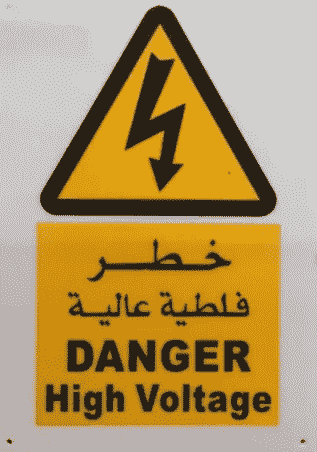
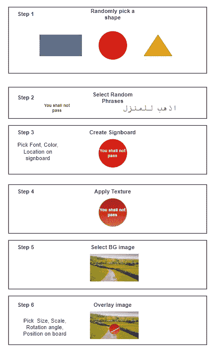
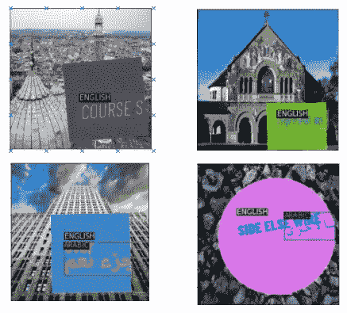
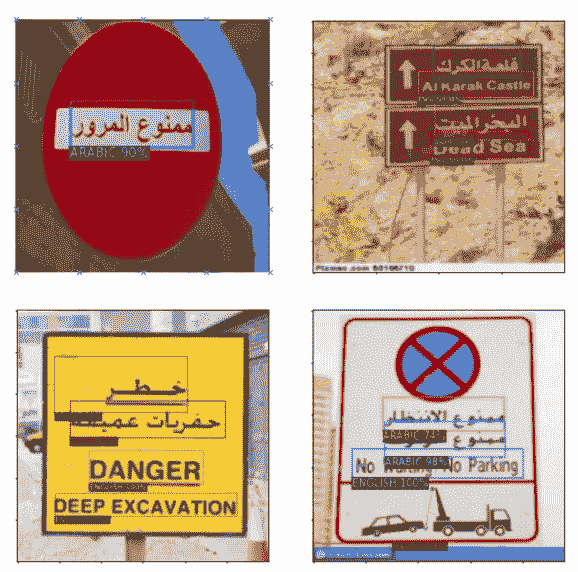
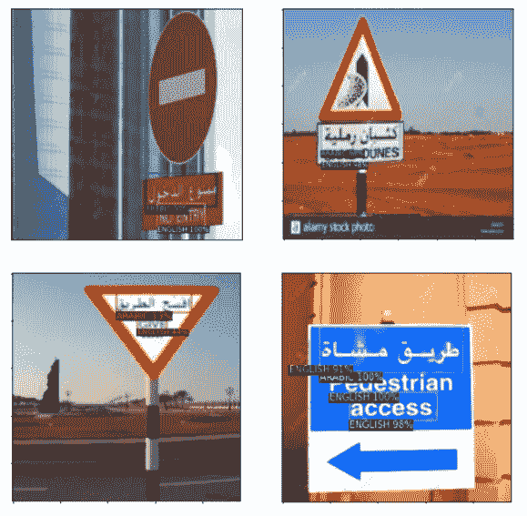

# 生成用于对象检测的合成数据集

> 原文：<https://medium.com/analytics-vidhya/generating-synthetic-dataset-for-object-detection-cbf6a17fa47d?source=collection_archive---------7----------------------->

使用 OpenCV 生成文本本地化数据集，用于训练对象检测模型(更快的 R-CNN)并在真实数据集上评估该模型

数据目前是深度学习的主要限制因素。好的数据来之不易。收集和标记数据是艰苦的体力劳动。这是昂贵的，耗时的和困难的。

> 不是谁的算法最好谁就赢了。而是谁拥有最多的数据
> 
> 吴恩达

这个问题的一个“次优”解决方案是以编程方式生成合成数据。假数据无疑不如真实数据。然而，在缺乏或缺乏真实数据的情况下，这是最好的选择。

## 介绍

在本文中，我将使用 detectron2 构建一个对象检测模型，用于检测招牌上的英语和阿拉伯语文本。典型地，为了建立多类对象检测模型，我们每类需要大约 300 幅训练图像。通过批量下载图像并手动标记来创建这样的数据集将需要大约 6 个小时的人工工作。这可能会给我们最好的结果。出于实验目的，我决定不采用这种方法。相反，我以编程方式创建了一个合成数据集。

合成数据集包括矩形或圆形的“告示牌”，带有一些英语或阿拉伯语文本，随机放置在背景图像上。文本的边界框坐标也可用于每个图像。

## *方法:*

1.  为阿拉伯语和英语文本创建包含图像和边界框坐标的合成数据集。
2.  在合成数据集上训练更快的 RCNN 模型
3.  收集一些英语和阿拉伯语标牌的真实例子，并对模型进行评估

## 合成数据集

创建数据集涉及的步骤:

1.  选择招牌形状
2.  选择一个阿拉伯语和英语短语—随机选择 1-4 个单词，组成一个短语
3.  创建标志牌—选择标志牌上文本的字体和位置
4.  选择纹理—在招牌上覆盖纹理
5.  选择背景图像
6.  选择缩放、旋转、将图像放在背景上

虚假图像

## 训练更快的 R-CNN

脸书的 detectron2 软件包可用于快速训练和评估对象检测模型。查看 [github](https://github.com/kvsnoufal/signboard_text_detection) 上的培训脚本，了解完整实施。

## **评测**

在一些真实图像上评估模型:

真实数据上的快速 R-CNN 评估

真实数据上的快速 R-CNN 评估

对于这个小评估来说，这似乎做得相当不错。

尽管合成数据如此明显地粗糙、仓促拼凑并且明显是假的，该模型仍然设法从中学习基本的文本本地化。它能够检测我们测试的真实图像中的文本，并正确地对它们进行分类。

> 请注意，我没有遵循任何科学方法来确保这些结果的无偏性或统计相关性。这不是一个学术研究，只是一个轶事。通常，合成数据用于增加和平衡真实生活数据集，而不是取代它们。

我的 [github](https://github.com/kvsnoufal/signboard_text_detection) 上有完整的代码。

## **巨人的肩膀:**

1.  https://www.youtube.com/watch?v=pnntrewH0xg 与 YOLO[的扑克牌检测](https://www.youtube.com/watch?v=pnntrewH0xg)
2.  探测器 2:[https://github.com/facebookresearch/detectron2](https://github.com/facebookresearch/detectron2)
3.  [https://towards data science . com/object-detection-in-6-steps-using-detector 2-705 b 92575578](https://towardsdatascience.com/object-detection-in-6-steps-using-detectron2-705b92575578)

## **关于作者**

> *我在阿联酋迪拜控股公司工作，是一名数据科学家。你可以在 kvsnoufal@gmail.com 联系我或者在 https://www.linkedin.com/in/kvsnoufal/联系我*