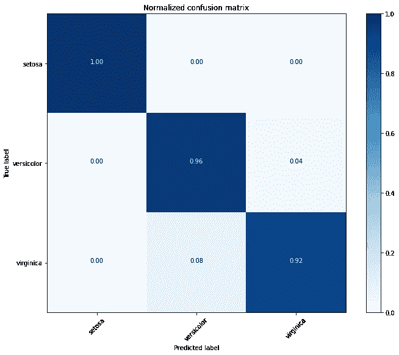

# 交叉验证中级联混淆矩阵的生成

> 原文：<https://medium.com/analytics-vidhya/generation-of-a-concatenated-confusion-matrix-in-cross-validation-912485c4a972?source=collection_archive---------2----------------------->


[Unsplash](https://unsplash.com/) 上 [Petalz_R](https://unsplash.com/@petalz_r/) 的照片

在我们预处理数据和开发模型之后，我们需要评估模型的有效性。考虑到这一点，混淆矩阵是一个评估指标，我们可以在其中评估我们的模型在机器学习中的性能。然而，当我们执行交叉验证(例如:留一交叉验证、k 倍交叉验证)以将数据集归纳为独立数据时，我们可能需要生成平均准确度或混淆矩阵。因此，这篇博客的主要目的是在使用交叉验证的同时生成一个串联的混淆矩阵。

# 虹膜数据集

我们将使用 IRIS 数据集来实现。这是一个关于三种花的简单数据集，如鸢尾、杂色鸢尾和海滨鸢尾。

我们将首先加载数据集并研究属性。

```
**import** **itertools**

**import** **matplotlib.pyplot** **as** **plt**
**import** **numpy** **as** **np**
**from** **sklearn** **import** svm, datasets
**from** **sklearn.metrics** **import** confusion_matrix
**from** **sklearn.model_selection** **import** KFold*# import IRIS dataset to play with*
iris = datasets.load_iris()data = iris.data
target = iris.targetclass_names = iris.target_names
class_nameslabels, counts = np.unique(target, return_counts=**True**)
```

我们可以通过下面的代码片段检索数据集的统计信息。

```
print(iris.DESCR)
```

我们将通过 10 倍的 [**K 倍交叉验证**](https://en.wikipedia.org/wiki/Cross-validation_(statistics)) 来评估我们的模型。下面的代码将我们的数据集分成训练和测试折叠，并将评估我们的模型性能 10 次。

> 诡计！！！
> 在每个 fold 中，我们将得到每个 fold 中的实际测试标签( ***test_y*** )和预测标签(***predicted _ labels***)，并将它们分别追加到数组*和***predicted _ targets***中。*

*这里我们将通过[支持向量机](https://en.wikipedia.org/wiki/Support-vector_machine)来拟合我们的数据集。*

```
***def** evaluate_model(data_x, data_y):
    k_fold = KFold(10, shuffle=**True**, random_state=1)

    predicted_targets = np.array([])
    actual_targets = np.array([])

    **for** train_ix, test_ix **in** k_fold.split(data_x):
        train_x, train_y, test_x, test_y = data_x[train_ix], data_y[train_ix], data_x[test_ix], data_y[test_ix]

        *# Fit the classifier*
        classifier = svm.SVC().fit(train_x, train_y)

        *# Predict the labels of the test set samples*
        predicted_labels = classifier.predict(test_x)

        predicted_targets = np.append(predicted_targets, predicted_labels)
        actual_targets = np.append(actual_targets, test_y)

    **return** predicted_targets, actual_targets*
```

*在下面的代码中，我们将把我们生成的***actual _ targets***和***predicted _ targets***数组馈送给**plot _ confusion _ matrix()**函数。*

```
***def** plot_confusion_matrix(predicted_labels_list, y_test_list):
    cnf_matrix = confusion_matrix(y_test_list, predicted_labels_list)
    np.set_printoptions(precision=2)

    *# Plot non-normalized confusion matrix*
    plt.figure()
    generate_confusion_matrix(cnf_matrix, classes=class_names, title='Confusion matrix, without normalization')
    plt.show()

    *# Plot normalized confusion matrix*
    plt.figure()
    generate_confusion_matrix(cnf_matrix, classes=class_names, normalize=**True**, title='Normalized confusion matrix')
    plt.show()*
```

*我们下面的代码负责生成规范化或非规范化的混淆矩阵。*

```
***def** generate_confusion_matrix(cnf_matrix, classes, normalize=**False**, title='Confusion matrix'):
    **if** normalize:
        cnf_matrix = cnf_matrix.astype('float') / cnf_matrix.sum(axis=1)[:, np.newaxis]
        print("Normalized confusion matrix")
    **else**:
        print('Confusion matrix, without normalization')

    plt.imshow(cnf_matrix, interpolation='nearest', cmap=plt.get_cmap('Blues'))
    plt.title(title)
    plt.colorbar()

    tick_marks = np.arange(len(classes))
    plt.xticks(tick_marks, classes, rotation=45)
    plt.yticks(tick_marks, classes)

    fmt = '.2f' **if** normalize **else** 'd'
    thresh = cnf_matrix.max() / 2.

    **for** i, j **in** itertools.product(range(cnf_matrix.shape[0]), range(cnf_matrix.shape[1])):
        plt.text(j, i, format(cnf_matrix[i, j], fmt), horizontalalignment="center",
                 color="white" **if** cnf_matrix[i, j] > thresh **else** "black")

    plt.tight_layout()
    plt.ylabel('True label')
    plt.xlabel('Predicted label')

    **return** cnf_matrix*
```

*代码执行如下:*

```
*predicted_target, actual_target = evaluate_model(data, target)
plot_confusion_matrix(predicted_target, actual_target)*
```

*我们的代码将通过交叉验证来考虑每个折叠中测试数据的预测，从而输出以下连接的混淆矩阵。*

**

*无归一化的混淆矩阵*

**

*归一化混淆矩阵*

*我希望这篇文章能为你提供串联混淆矩阵的一些基本实现。*

*如果你认为它有价值，请随意在任何平台上分享这个博客。*

*你可以在这里找到我的完整代码。*

*快乐学习！！*

*您可以通过以下方式联系到我:*

*领英:【https://www.linkedin.com/in/rukshanisomarathna/ *

*GitHub:【https://github.com/Rukshani *