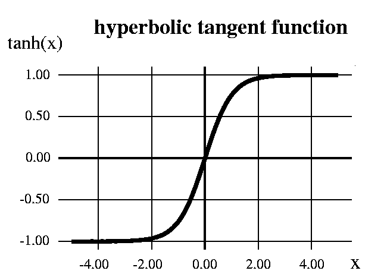

# 生成对抗网络

> 原文：<https://medium.com/analytics-vidhya/generative-adversarial-network-gan-92c614ba9e64?source=collection_archive---------2----------------------->

*通过创建一个生成类似于 MNIST 数据库中的手写数字图像的模型来理解。*

【甘】

## ***创成式建模简介:***

**——[*来源*](https://machinelearningmastery.com/what-are-generative-adversarial-networks-gans/) *。***

*要了解生成模型的威力，只需访问 thispersondoesnotexist.com 的***。每次你重新加载页面，一个人的脸的新图像会在运行中生成。结果相当令人着迷。**

**深度神经网络主要用于监督学习:分类或回归。然而，生成对抗网络或 GANs 将神经网络用于一个非常不同的目的:生成建模**

***虽然有许多方法用于生成建模，但生成对抗网络采用以下方法:***

**

***氮化镓工艺***

*有两个神经网络:一个生成器和一个鉴别器。给定随机向量/矩阵，生成器生成“假”样本，鉴别器尝试检测给定样本是“真”(从训练数据中选取)还是“假”(由生成器生成)。训练是一前一后进行的:我们训练鉴别器几个时期，然后训练生成器几个时期，然后重复。这样，生成器和鉴别器都能更好地完成各自的工作。*

*然而，众所周知，GANs 很难训练，并且对超参数、激活函数和正则化极其敏感。我们将训练一个 GAN 来生成类似于 MNIST 数据库中的手写数字图像。*

**

*手写数字的图像*

*这是我们将要做的事情*

*   **定义问题陈述**
*   **加载数据(通过变换和归一化)**
*   **非标准化，用于样品的目视检查**
*   **定义鉴频器网络**
*   **研究激活功能:泄漏 ReLU**
*   **定义发电机网络**
*   **解释输出激活功能:TanH**
*   **看一些样本输出**
*   **为鉴别器和发生器的训练定义损失、优化器和辅助函数**
*   **训练模型**

1.  ****定义问题陈述:*** *训练 GAN 生成类似于来自数据库的手写数字的图像。**
2.  ****加载数据(带转换和归一化):*** *我们首先使用* `*torchvision.datasets*` *中的* `*MNIST*` *助手类下载并导入数据作为 PyTorch 数据集。**

*代码解释上面写的行*

****3。反规格化，用于样本的目视检查:*** *因为我们已经规格化了图像数据集，所以我们需要定义一个助手来反规格化图像以查看它们。该功能对于查看生成的图像也很有用。**

****4。定义鉴别器网络:*** *鉴别器将一幅图像作为输入，并试图将其分类为* `*“real”*` *或* `*“generated”*` *。在这个意义上，它就像任何其他神经网络一样。虽然我们可以使用 CNN 作为鉴别器，但为了简单起见，我们使用了一个具有 3 个线性层的简单前馈网络。我们将把每个 28x28 的图像视为大小为 784 的向量。就像任何其他二进制分类模型一样，鉴别器的输出是 0 和 1 之间的单个数字，它可以被解释为输入图像是假的(即生成的)的概率。**

*定义鉴别器*

****5。研究激活函数:Leaky ReLU:*** 我们对鉴别器使用的是 Leaky ReLU 激活。与常规 ReLU 功能不同，泄漏 ReLU 允许负值的小梯度信号通过。因此，它使来自鉴别器的梯度更强地流入发生器。在反向推进过程中，它不是传递 0 的梯度(坡度),而是传递一个小的负梯度。*

**

*鉴别器的激活功能*

***6*。定义生成器网络:*** *生成器的输入通常是一个向量或矩阵，用作生成图像的种子。同样，为了保持简单，我们将使用一个具有 3 层的前馈神经网络，输出将是一个大小为 784 的向量，它可以转换为 28x28 px 的图像。ReLU 激活用于发生器，但输出层除外，它使用 Tanh 函数。我们走* `***latent_size=64***`*

****7。解释输出激活函数:TanH:*** *在生成器中，w* e 正在使用生成器输出层的 TanH 激活函数。因为我们已经观察到，使用有界激活允许模型更快地学习以饱和和覆盖训练分布的颜色空间。*

**

*Tanh 函数*

**注意，由于 TanH 激活的输出位于* `*[-1,1]*` *的范围内，我们对训练数据集中的图像应用了相同的变换。**

****8。看一些示例输出:*** *让我们使用生成器生成一个输出向量，并通过对输出* ***进行变换和反规格化来将其视为图像。****

**正如所料，发电机的输出基本上是随机噪声。现在我们需要定义一个助手函数来训练我们的模型。**

****9。*定义损耗、优化器、辅助函数进行训练:** *现在我们需要定义损耗和优化器函数来训练我们的鉴别器和生成器。由于鉴别器是二进制分类模型，我们可以使用二进制交叉熵损失函数来量化它能够区分真实图像和生成图像的程度。**

**

*在生成器和鉴别器的优化器中，我们也将学习率设置为 0.0002 来训练我们的模型。*

> ***答*。*鉴别器训练:**以下是训练鉴别器的步骤。*

*   **如果图像是从真实的 MNIST 数据集中选取的，我们希望鉴别器输出 1，如果是生成的，输出 0。**
*   **我们首先传递一批真实图像，并计算损失，将目标标签设置为 1。**
*   **然后，我们使用生成器生成一批假图像，将它们传递到鉴别器，并计算损失，将目标标签设置为 0。**
*   **最后，我们将两个损失相加，并使用总损失来执行梯度下降，以调整鉴别器的权重。**

**需要注意的是，我们* ***在训练鉴别器时不改变生成器模型*** *的权重(* `*d_optimizer*` *只影响* `*D.parameters()*` *)。这是我们如何为鉴别器定义训练函数的代码。我们还定义了* `***reset_grad***` *函数，在训练每个历元之前将梯度重置为零。**

> ***b .生成器训练:** 由于生成器的输出是图像，我们如何训练生成器并不明显。这就是我们使用一个相当优雅的技巧的地方，即使用鉴别器作为损失函数的一部分。它是这样工作的:*

*   **我们用生成器生成一批图像，把它们传入鉴别器。**
*   **我们通过将目标标签设置为 1(即真实)来计算损失。我们这样做是因为生成器的目的是“愚弄”鉴别器。**
*   **我们使用损失来执行梯度下降，即改变生成器的权重，因此它在生成真实图像方面变得更好。**

*下面是它的代码。*

*10。*训练模型:* *现在我们完成了训练模型的所有工作，现在我们已经准备好训练模型了。在每个时期，我们首先训练鉴别器，然后是生成器。如果您没有使用 GPU，培训可能需要一段时间。**

*下面是它的代码。*

*训练我们模型的代码*

**如果你的硬件系统中没有安装 GPU，你可以使用谷歌 colab***这是一个免费的谷歌数据科学和机器学习服务，你可以在谷歌 colab 上的 jupyter 笔记本中将运行时改为 GPU。***

***现在我们已经训练了我们的模型，我们可以将中间生成的图像保存到任何文件，我们可以看到我们的图像如何变得像来自随机噪声的 MNIST 数据集的图像。***

***这里有一个视频链接，介绍图像是如何变化的***

# **总结:**

**下面是我们为训练生成性对抗网络所做的总结。**

**我们已经训练了一个模型，该模型获取一组真实图像，并生成一些与真实图像相似的假图像。对于这项工作，我们首先从 MNIST 数据集中加载数据，查看数据集中的图像，定义一个鉴别器来区分真实图像和生成的图像，定义一个生成器来生成图像，然后训练鉴别器和生成器，最后使用一些超参数(如历元数和学习率)来训练我们的完整模型，就这样。**

# **未来工作:**

***作为一项练习，你应该尝试独立应用每项技术，看看每项技术对性能和最终输出的影响有多大。当你尝试不同的实验时，你会开始培养选择正确架构的直觉，你会越来越好。***

***为了得到你的帮助，我在参考资料中分享了帮助笔记本。***

# ****参考文献:****

1.  **[我的木星笔记本本项目的生成对抗网络](https://jovian.ai/bhupendrasingh62435/06-mnist-gan)**

**2.[*Jovian.ai 教程*](https://jovian.ai/learn/deep-learning-with-pytorch-zero-to-gans)**

**3. [*具体视频讲解如何创建生成性对抗网络*](https://youtu.be/79IvwU3G5_Q?list=PLyMom0n-MBroupZiLfVSZqK5asX8KfoHL)**

** [## bhupendrasingh 62435/06-mnist-gan-Jovian

### 在 06-mnist-gan 笔记本上与 bhupendrasingh62435 协作。

jovian.ai](https://jovian.ai/bhupendrasingh62435/06-mnist-gan) 

如果你喜欢这个，并且发现了一些有趣的东西，你可以为我鼓掌，你也可以和你的朋友分享这些东西

# 感谢您的阅读，祝您好运。**