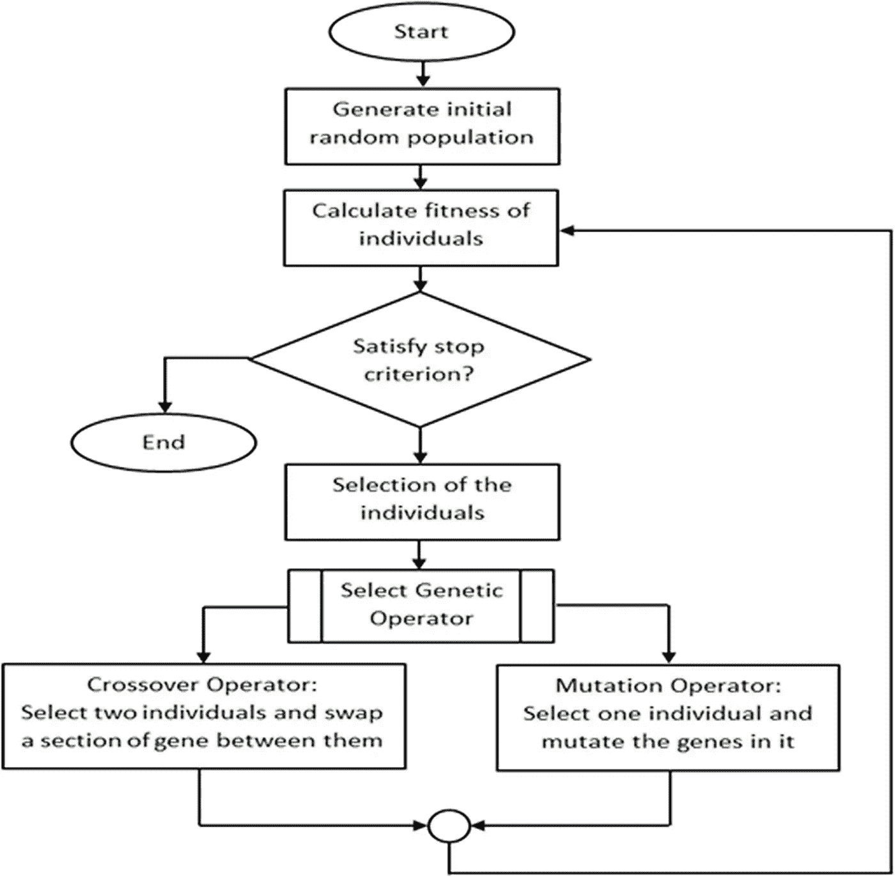
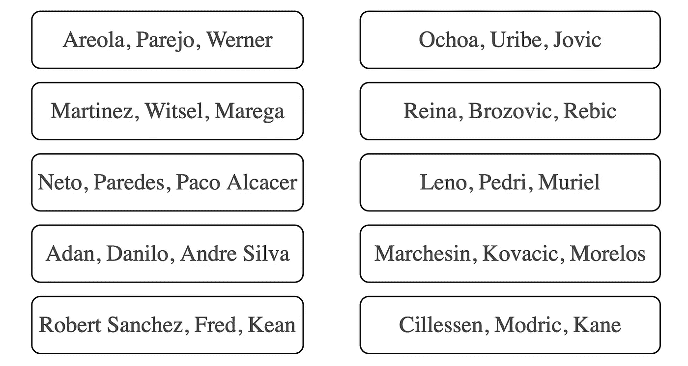
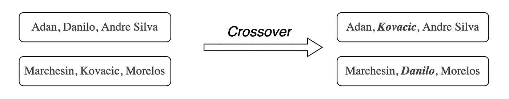
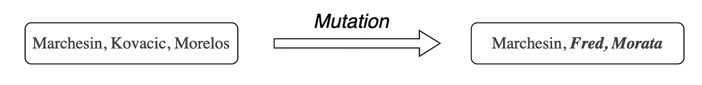
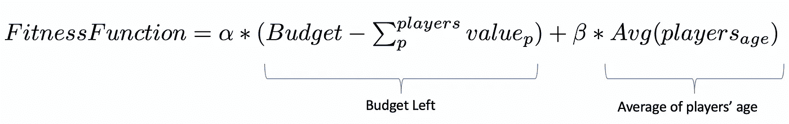
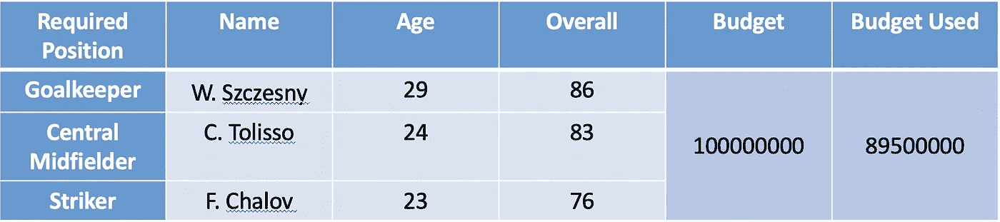
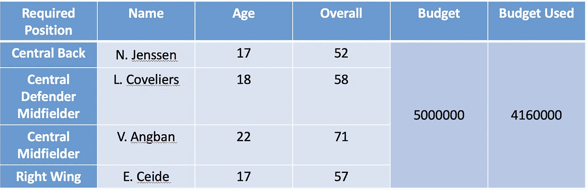

# 球员侦察的遗传算法

> 原文：<https://medium.com/analytics-vidhya/genetic-algorithm-for-player-scouting-4a1e5669bcba?source=collection_archive---------1----------------------->

# 足球运动员侦察

为了做出最好的签约，有很多努力去寻找和评估最好的球员来签约。传统上，球员球探被雇佣来寻找和报道全世界最有前途的球员，这样俱乐部就可以获得一个更有价值的阵容。

为了帮助完成这项任务，本文介绍了一种不同的方法，使用遗传算法。

> 遗传算法将帮助决定在不同的预设标准下签约的最佳球员。

# 遗传算法

遗传算法是机器学习模型中的一个子集，它对应于应用自然选择原则的元启发式算法。其思想是，给定一组初始候选项，执行“进化搜索”，目标是为给定问题找到最优解。为了实现这一点，在每次迭代中应用不同的机制来生成新的候选池(例如变异、交叉和精英化)，从而确定问题的最佳候选解。

来自 https://doi.org/10.1371/journal.pone.0122827.g001[的](https://doi.org/10.1371/journal.pone.0122827.g001)

在上图中，我们可以看到一个遗传算法如何工作的通用流程图。

# 遗传算法在球员选拔中的应用

遗传搜索的思想可以被用于球员侦察，以识别满足不同要求的最佳球员。

我实现的解决这个任务的代码可以在[https://github . com/danielazevedo/Football-Analytics/blob/master/genetic _ algorithms _ _ Player _ scouting/Player _ scouting _ genetic _ approach . ipynb](https://github.com/danielazevedo/Football-Analytics/blob/master/genetic_algorithms__Player_scouting/player_scouting_genetic_approach.ipynb)中找到。

## 资料组

使用的数据集是 **FIFA 2020 比赛统计**:([https://www . ka ggle . com/stefanoleone 992/FIFA-20-complete-player-dataset](https://www.kaggle.com/stefanoleone992/fifa-20-complete-player-dataset))。唯一使用的信息是**球员的名字、位置和价值。**

## 例子

用一个例子应该更容易理解这个想法。假设一个给定的俱乐部想要签下 3 名球员:**一名门将，一名中场和一名前锋**，并且它有一个**具体的预算来使用**。还要考虑年龄因素，这意味着年轻球员的解决方案更有价值。

接下来，我们将经历不同的实现步骤(使用这个例子)，这些步骤结合起来，将构成我们的方法。

# 表现

为了表示不同的解决方案，将使用 python 列表。一种可能的解决方案可以是，例如:

> **【布冯、弗雷德、伊布】**

请注意，球员的位置应该是固定的顺序，在这种情况下*【门将、中场、前锋】*。

# 原始群体

最初，我们的候选人将是随机的。因此，我们应该生成一组不同的随机候选项，比如说 10 个。

随机候选人的初始池

# 变化性

如上所述，这个想法是在**每次迭代**我们使用随机性改变候选人的池。这将增加候选人才库的可变性和搜索空间。

为此，我们使用交叉和变异技术。可能有不同的实现方式，不过我们会保持简单:

**交叉:**随机选择两个不同的候选解，交换相同位置的玩家(位置也是随机选择的)。

交叉示例

**变异:**选择一个候选人，替换其他有效玩家的随机位置。

突变的例子

# 候选人选择

如前所述，在每次迭代中，我们将有不同的候选人。因此，为了具有某种类型的收敛，在每次迭代中，我们将**选择最佳候选来向前移动用于下一次迭代**，并且剩余的被移除。候选人选择可以有不同的方法，如*轮盘选择*和*锦标赛选择。*

使用**适应度函数对候选方案进行评估，**根据我们施加的约束条件，该函数应反映给定解决方案有多好。

我们的目标将是最小化适应度函数(根据问题约束可以是最大化)，因此，最佳候选将是具有较低适应度值的那些，即最适合我们的问题的**。**

# 适应度函数

最重要的任务之一是定义*适应度函数*，它告诉我们一个给定的候选解决方案基于我们的问题有多好。

在本例中，我们需要考虑两个重要的约束条件:

1.  **预算使用**。我们想最大限度地减少剩下的预算
2.  **球员年龄**。我们希望最大限度地降低球员的平均年龄

因此，我们的适应度函数可以定义如下:

其中α代表给予第一个约束(预算)的权重，β代表给予第二个约束(玩家年龄)的权重。权重越高，相应的约束就越重要。

> 应根据俱乐部的搜索要求确定限制条件。另一个要添加的约束可能是剩余球员的合同年数、不同国籍的人数、我们球队中同一位置的球员人数、他们目前所踢的足球联赛等等…

# 运行算法…

因此，如通用流程图所示，对于给定的迭代次数，顺序地和迭代地执行上述步骤。

这个想法是，候选人的池在每次迭代中都会发生变化，并且会不断地得到更好的候选人，也就是说，最符合我们的问题定义。

在不同迭代中具有最低适应值的候选解应该被认为是最佳解，因为它更好地满足了我们的限制。

> 因此，根据我们预先制定的标准，具有最低健康值的解决方案包括推荐给俱乐部的最佳球员集

# 一些例子

## 示例 1:

*   **所需位置:**【门将、中场、前锋】
*   **预算:** 100 万
*   **标准:**预算完成度:0.8 (α)|年龄:0.2 (β)

最佳解决方案—示例 1

这是上面使用的例子，我们可以看到选择的球员是**【w . szczsny，C.Tolisso，F . Chalov】**

## 示例 2:

*   **所需位置:**【中后卫、中后卫中场、中前卫、右翼】
*   预算: 500 万
*   **标准:**预算完成度:0.6 (α)|年龄:0.4 (β)

在第二个例子中，年龄标准被赋予更大的权重。因此，最好的解决方案主要由年轻球员组成。

# 结束语

在这篇文章中，我介绍了一种**遗传算法**，它能够帮助**球员物色**，为符合特定约束的预定义位置搜索一组**优化的球员，这些约束可以根据不同的俱乐部需求和招募标准进行调整。**

希望你觉得这篇文章有趣！更多足球数据科学相关工作，请访问我的 repo:[https://github.com/danielazevedo/Football-Analytics](https://github.com/danielazevedo/Football-Analytics)。