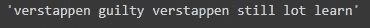

# 进入 NLP 的平缓开始

> 原文：<https://medium.com/analytics-vidhya/gentle-start-into-nlp-70caf9256302?source=collection_archive---------7----------------------->

你们中的许多人都在谈论自然语言处理，文本挖掘，文本处理等等，那么什么是自然语言处理呢？

马库斯·温克勒在 [Unsplash](https://unsplash.com?utm_source=medium&utm_medium=referral) 上的照片

**自然语言处理**或者你可以称之为 NLP 是人工智能的一个分支，它关注的是如何让机器能够阅读、理解人类语言并对其做出反应。因为机器只知道数字或二进制，所以使用 NLP 可以使机器更好地了解人类语言。

但是在我们进入 NLP 之前，我们必须知道什么是**文本挖掘**，以及 NLP 和文本挖掘之间的区别。

**文本挖掘**是检查大量文档集合以发现新信息或帮助回答特定问题的过程，文本挖掘侧重于从具有有限水平的模式分析和结构匹配的文本数据中提取有意义的信息。NLP 关注机器如何阅读、解释和处理人类语言，包括文本和语音。

在您了解了 NLP 和文本挖掘之间的区别之后，我们将进入文本处理这一步，因为您可能知道，文本是非结构化数据，因为它包含许多不相关的数据，所以必须清理数据，清理文本中的数据有几个步骤。

我有一个这样的例子

> @F1 Verstappen 有罪！Verstappen 还有很多东西要学！😟😟👎

*   标记化

标记化是将句子拆分成单词的过程。

标记化示例

*   案例折叠

格折叠是将句子转换成小写形式的过程。

案例折叠示例

*   移除表情符号和标点符号

这是一个让句子不包含任何表情符号和标点符号的过程。

移除表情符号和标点符号示例

*   停止单词删除

这是一个去除频繁出现但没有重要意义的单词的过程。例如:is、has、a、and、the 等。如果不去除停用词，可能会导致偏差。

停用字词删除示例

*   词干化和词汇化

这是一种文本规范化技术，将单词还原成它的根形式。

词干和词汇化示例

在我们确保文本足够清晰之后，我们可以进入**特征工程**，在 NLP 中有几种技术可以用于特征工程。

*   TF-IDF

**术语频率-逆文档频率**是基于单词在文档中出现的次数来测量单词在语料库的集合中的文档/类别中的重要性，但是随着单词在语料库中的频率而偏移。

TF-IDF 公式

以上是 TF-IDF 计算每个单词权重的公式。

*   弓

**单词袋**是一种基于单词在文档中的出现来衡量单词重要性的技术。

弓的弱点:

1.  丢弃词序可能会忽略上下文，进而忽略文档中单词的含义
2.  在一个非常大的语料库中，会有许多零分复合向量矩阵
3.  高频词在文档中占主导地位，但可能不包含太多的“信息包含”

*   单词嵌入

**嵌入**的词是具有相同意义的词，在向量空间(实值向量)中具有相同的表示。

单词嵌入示例

*   命名实体关系

**命名实体识别(NER)** 是一种算法，用于识别文本中的命名实体，并将它们分类到预定义的类别中。

实体可以是人、组织、位置、时间、数量、货币值、百分比等名称。

NER 主要用于理解文本主体的主题或主题，并根据相关性或相似性快速对文本进行分组。

NER 的例子

*   词性—标注

**词性标注**是给文本或语料库中的单词加上标签或标记的过程。词性标注对于构建词素是必不可少的，词素是用来将一个词简化为其词根形式的。

词性标注示例

有 4 种标记技术:

1.  基于词汇:在训练语料库中给词性标签分配一个单词
2.  基于规则:根据规则分配 POS 标签
3.  概率性:根据特定标签序列出现的概率分配位置标签
4.  深度学习:使用神经网络分配 POS 标签

谢谢你看我的文章，希望对你有帮助！

照片由 [Cintya Marisa](https://unsplash.com/@cccintyaaa?utm_source=medium&utm_medium=referral) 在 [Unsplash](https://unsplash.com?utm_source=medium&utm_medium=referral) 上拍摄