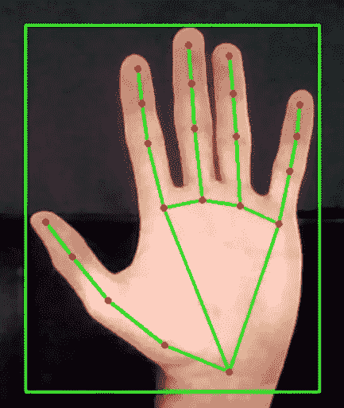

# 用 Python 实现 FireTV 的手势控制

> 原文：<https://medium.com/analytics-vidhya/gesture-control-of-your-firetv-with-python-7d3d6c9a503b?source=collection_archive---------6----------------------->



这篇文章是我关于 FireTV 的 python 控制的文章的延续。使用手势控制是一种有趣的方式来激活一个远程免费的消防棒按钮！因此，在本文中，我将介绍如何使用 OpenCV 和 mediapipe 设置一个基本的手部检测器，然后如何将它集成到第一篇文章中显示的 fire-stick 控制器类中。

首先，我们想在一个新的类中初始化一个基本的手检测器。为此，我们需要导入 mediapipe、OpenCV 和数学库。

```
import mediapipe as mp
import cv2
import math
```

我们需要定义一个可以调用的手检测对象，并初始化 mediapipe 参数，以便在图像/视频流中进行手检测。mediapipe 中的手部检测需要几个参数，我们将重点关注的是:模式、要找到的最大手部、检测置信度和跟踪置信度。所以开始的代码看起来会像这样:

```
class handDetector():
   def __init__(self,mode=False,maxHands=2,
                detectCon=0.8,trackCon=0.5):
      self.mode=mode
      self.maxHands=maxHands
      self.detectCon=detectCon
      self.trackCon=trackCon self.mpHands = mp.solutions.hands
      self.hands = self.mpHands.Hands(self.mode,self.maxHands,
                                      self.detectCon,self.trackCon)
      self.mpDraw = mp.solutions.drawing_utils  
      (Draws mediapipes hand landmarks on the image)
```

接下来，我们需要添加一个方法来处理和检测手的图像。做到这一点非常简单，但有几个要点需要记住。Mediapipe 需要 RGB 格式的图像颜色数据，而 OpenCV 摄像机的输入是 BGR 格式，因此我们称之为“手动处理器”的新方法的第一部分将如下开始:

```
def handProcessor(self,img):
   imgRGB = cv2.cvtColor(img,cv2.COLOR_BGR2RGB)
```

所以现在我们有了图像的 RGB 版本。下一点是使用 mediapipes 处理功能，并将手的扫描标志绘制到我们的图像上，这意味着我们将在我们的方法中添加以下行:

```
self.results = self.results = self.hands.process(imgRGB)if self.results.multi_hand_landmarks:
   for self.landmarks in self.results.multi_hand_landmarks:
      self.mpDraw.draw_landmarks(img,self.landmarks,
                                 self.mpHands.HAND_CONNECTIONS)
return img
```

目前，我们在图像中找到的地标不能被打印，因为它们是它们自己的对象，所以如果我们想要获得数字坐标值，这些对象需要被解压缩。为此，我们将添加另一个方法调用“findCoords ”,它将返回地标的坐标列表，以及手周围边界框的坐标，这在以后可能会派上用场。完整的方法看起来像:

```
def findCoords(self,img,handNo):
   self.lMarkList = []
   xList = []
   yList = []
   bbox = [] if self.results.multi_hand_landmarks:
      myHand = self.results.multi_hand_landmarks[handNo]
      for ID,LM in enumerate(myHand.landmark):
         h,w,c = img.shape
         cx,cy = int(LM.x*w),int(LM.y*h)
         self.lMarkList.append([ID,cx,cy])
         xList.append(cx)
         yList.append(cy)
         cv2.circle(img,(cx,cy),0,(255,0,255),cv2.FILLED)

      xmin,xmax = min(xList),max(xList)
      ymin,ymax = min(yList),max(yList)
      bbox = xmin,ymin,xmax,ymax
      cv2.rectangle(img,(bbox[0],bbox[1]),(bbox[2],bbox[3]),
                    (0,255,0),2)
   return self.lMarkList,bbox
```

当调用这个方法时，输出是手部标志的 x 和 y 坐标列表，然后是手部周围边界框的角坐标。边界框对于缩放坐标以标准化点之间的距离非常有用，尤其是当手与相机的距离变化时。不过，这不是我在这篇文章中要讨论的内容。

因此，我们将添加到手部检测器类的最后一个有用的方法是 digitStatus 方法。这将做的是返回一个 0 或 1 的列表，分别表示手指/拇指是向上还是向下，这非常容易。主要要注意的是，每个指尖的地标 id 都是[4，8，12，16，20]。

为了确定手指是向上还是向下，我们将获取每个手指的指尖的位置，并且如果指尖的 y 坐标大于相关联的指节界标的坐标，那么我们将声明手指向下。我们正在检查 y 坐标是否更大，因为图像的顶部是 y=0，底部是更高的 y 坐标(图像的最大尺寸)。由于角度的原因，拇指是使用不同的标志完成的，但几乎是相同的，所以看看这里的方法:

```
def digitStatus(self):
   fingers = []
   self.fingerTips = [4,8,12,16,20] #thumb
   if self.lMarkList[self.fingerTips[0]][2]< self.lMarkList[self.fingerTips[0]-1][2]:
      fingers.append(1)
   else:
      fingers.append(0) #fingers
   for ID in range(1,5):
      if self.lMarkList[self.fingerTips[ID]][2] < self.lMarkList[self.fingerTips[ID]-2][2]:
         fingers.append(1)
      else:
         fingers.append(0)
   return fingers
```

我们的手部检测课程到此结束！下一步是从网络摄像头打开一个视频流，应用我们的手部探测器，并将其与我们在上一篇文章中制作的荧光棒控制器相连接。

如果您已经编写了 fire-stick 控制器类的代码，那么您可以将它粘贴到这个文档中，或者导入包含它的文件，只要最适合您就行。我们想写我们的“main”函数来保存现在的主要进程，所以首先我们需要打开我们的网络摄像头，并创建一个手部探测器和消防棒控制器的实例。

```
def main():
   cap = cv2.VideoCapture(0)
   detector = handDetector()
   fireStick = FireStickController()
   fireStick.addDevice(fireStickIP)  #Define your fire-stick IP here
```

接下来，我们需要一个连续的循环，检查网络摄像头的饲料和处理图像。因此，我们可以使用 while 循环来实现这一点，要么使用“while True”，要么使用“while cap.isOpened()”。这个循环中最基本的要素是:

```
while True:
   success,img = cap.read()
   img = cv2.flip(img,flipCode=1) #this just flips the video in the y-axis and is not necessary if you dont want to img = detector.handProcessor(img)
   lMarkList,bbox = detector.findCoords(img)
```

这就是获得连续进料和不断手工处理进料所需要的一切。为了能够查看提要，您只需要在 while 循环的末尾添加以下内容:

```
cv2.imshow('Feed',img)
cv2.waitKey(1)
```

然后在 while 循环之外添加:

```
cap.release()
cv2.destroyAllWindows()
```

所以这是你可以用手势添加所有火棒控制的部分。在 while 循环的中间，您将需要一个 IF 语句来检查地标列表是否为空。如果它不是空的，那么你知道它在检测指针，所以看起来像这样:

```
while True:
   success,img = cap.read()
   img = cv2.flip(img,flipCode=1) #this just flips the video in the y-axis and is not necessary if you dont want toimg = detector.handProcessor(img)
   lMarkList,bbox = detector.findCoords(img) if len(lMarkList)!=0:

      ###CONTROLLING CODE### cv2.imshow('Feed',img)
   cv2.waitKey(1)
cv2.release()
cv2.destroyAllWindows()
```

对于我们的火棒控制器代码，它对你是完全开放的，你想用什么手势控制哪个遥控按钮。我将介绍一个非常简单的示例，并让您尝试其余的部分！

所以当我用食指在手掌上轻点时，我想暂停/播放我正在看的任何东西，而这只需要两行代码。我们需要添加到控制代码部分的是:

```
if detector.digitStatus()==[1,0,1,1,1]:
   fireStick.playPause()
```

其中 playPause 方法是我在上一篇文章中添加到 fire-stick 控制器类中的一个方法。IF 语句所做的只是检查是否只有食指按下，然后通过 adb 服务器向 fire-stick 发送播放/暂停命令。

最后一步是在底部添加常用的代码:

```
if __name__=='__main__':
   main()
```

就是这样！你可以添加各种不同的手势来控制不同的功能，这完全取决于你的想象力。我希望你能从这段代码中得到一些乐趣，并根据你的需要修改它，或者只是为了修改它而修改它！

以下是上一篇关于用 python 基本控制火棍的文章的链接，以防你错过:[https://medium . com/@ toma Clarke 16/controlling-you-fire-TV-with-python-d5e 102669066](/@tomaclarke16/controlling-you-fire-tv-with-python-d5e102669066)