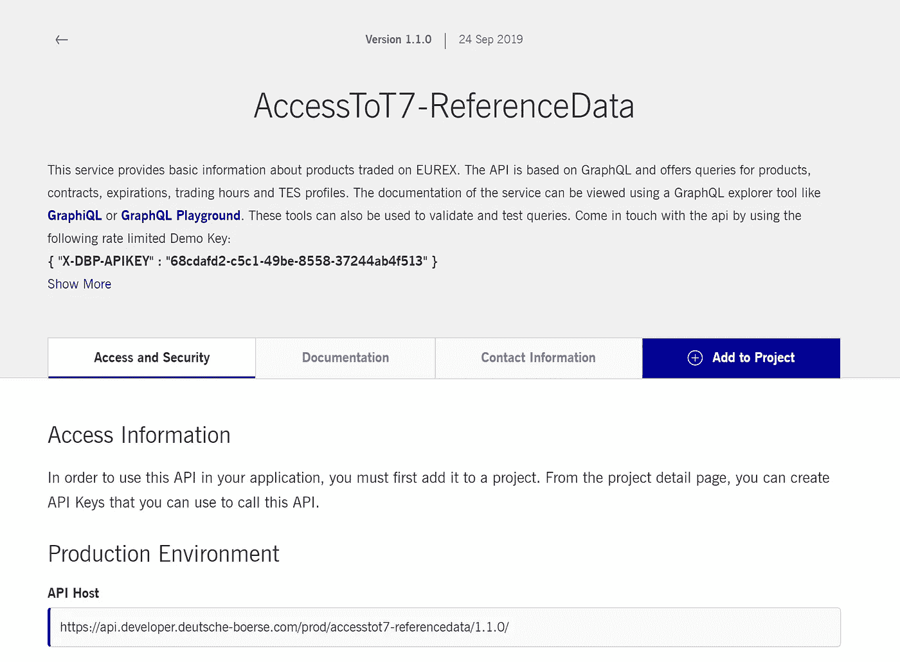

# 使用 Python 和 GraphQL 在 5 分钟内获得 Eurex 交易假期等更多信息

> 原文：<https://medium.com/analytics-vidhya/get-eurex-trading-holidays-and-more-in-5-mins-using-python-and-graphql-c4fdec4f4417?source=collection_archive---------11----------------------->


克里斯·利维拉尼在 [Unsplash](https://unsplash.com?utm_source=medium&utm_medium=referral) 上的照片

作为一个在金融交易所密切工作的人，交易时间表是需要处理的许多重要信息之一。大多数交易所在其网站上提供交易日历，有些显示的格式不够理想。例如，我是一个对原始数据和数字感兴趣的人，像 PDF 或前端用户界面(如下所示)这样的格式可能不太有用，因为它们不能为我提供编写脚本和自动化警报的灵活性。


一个基于用户界面的交易日历的例子:漂亮，但不是我喜欢的。

所以当我第一次从我的同事那里听说 Eurex 正在把它的 T7 参考数据放到一个 API 上时，我非常激动！在本文中，我将向您介绍这个 API 和您可以从中获取的一些信息，以及如何使用 GraphQL 和 Python 利用这个 API 来获得无缝体验。系好安全带。

**那么，GraphQL 是什么？**

根据[正式的](https://graphql.org/learn/)定义，“GraphQL 是一种用于 API 的查询语言，是一种服务器端运行时，通过使用您为数据定义的类型系统来执行查询……(而且它)不依赖于任何特定的数据库或存储引擎，而是由您现有的代码和数据支持”。使用基于 GraphQL 的 API 是一个好主意，因为它有几个好处

1.  GraphQL 是一种相对容易掌握的语言，网上有写得很好的文档，可以平滑学习曲线
2.  它可以通过 Chrome 扩展“GraphQL Playground for Chrome”轻松访问，任何人都可以轻松下载并访问该 API，没有任何技术困难
3.  它有一个“[自省](https://graphql.org/learn/introspection/)”功能，供最终用户导航 API 的模式；它很直观，没有麻烦，人们不需要挖掘文档来了解可用的内容


Chrome 的 GraphQL 游乐场

**那么如何访问 Eurex 的参考数据 API 呢？**

轻松点。首先，你可以在 [DBG 开发者门户](https://console.developer.deutsche-boerse.com/apis)上找到公开可用的 API 列表。从那里，转到“AccessToT7-ReferenceData”并注册一个 API 密钥。虽然网页提供了演示密钥，但建议用户申请一个，以便对数据的访问限制更少。



API 密钥和主机 URL 可在网页上找到

接下来，使用 API 键和主机 URL，转到 GraphQL Playground，在顶栏的 URL 字段中插入主机 URL(见下文),并在“HTTP Header”下插入 API 键。此时，您的环境应该已经设置好了，您可以开始在左边的控制台上编写脚本了。


一旦建立了环境，就从自省开始理解 API 的模式。

在处理 API 时，首先要做的一件事是了解哪些数据对您可用。因此，我们应该从反省开始。通过编写上面的脚本，您能够探索可用的数据。

一旦你确定了你感兴趣的数据，你就需要进一步了解细节。对于这个例子，我正在查找“Holidays ”,我编写了查询来显示数据和可用字段的描述。通过内省，我了解到数据“假期”由未来 2 年所有产品的所有交易假期和交换假期(当产品的清算和交易不可用时)组成。


内省还允许我们查看感兴趣的数据的细节。

有了这些信息，我现在可以开始做我的查询！作为一个例子，我将从查询 EURO STOXX 50 指数期货(交易所代码 FESX，彭博代码 VGA Index)的交易假期开始，如下所示。


**GraphQL 和 Python 的完美结合**

虽然看起来很简单，但是使用 GraphQL Playground 本身可能还不够，因为它是一个非常基于接口的解决方案。对于像我这样的一些用户来说，当插入另一个程序时，必须立即检索产品列表的交易假期，以便于处理。理想的情况是以我们需要的格式在 GraphQL 和后端之间建立一个连接。

所以 Python 来了！通过使用“请求”包，我们能够通过 POST 请求在 GraphQL API 和 Python 之间建立连接。只需定义 URL 头、API 键和查询，您就可以在几秒钟内检索到信息。如果您正在寻找多个产品，您可以应用循环并将它们合并到一个数据框架中，以便进一步操作。在下面的例子中，我编写了一个简单的查询，查询 Eurex 的 3 个产品的交易假期，即

*   KOSPI 200 期权的每日到期期货(OKS2)，
*   迷你 KOSPI 200 期货(FMK2)的每日到期期货，以及
*   KOSPI 200 期货的每日到期期货(FBK2)


通过 Python 对 GraphQL API 的 POST 请求的简单实现

**一个实际例子——为产品列表提取交易假期**

欧洲期货交易所上市的商品超过 1，900 种，要记住所有商品的交易代码是很困难的，如果不是不可能的话。实际上，如果我在交易 MSCI 产品套件和一些基准产品，我会希望快速提取代码，以便我可以进行下一步工作，比如检索交易假期。这可以通过使用 GraphQL API 轻松完成，查询如下:

```
query {
ProductInfos(filter: { Name: { contains: "MSCI" } }) {
date
data {
 Product,
 Name,
 ProductISIN,
 ProductLine,
  ProductType
}}}
```

在我的例子中，我提取了基准产品、MSCI 套件和 KOSPI 套件的交易假期。为了可视化交易假期，我选择使用 Seaborn 软件包提供的热图。为了便于演示，我挑选了 18 种产品的样本来构建热图，如下所示。


交易假期矩阵——深蓝色区域表示交易假期。

根据上面的热图，我们可以很容易地判断出哪些产品将无法交易。值得注意的一个有趣现象是，KOSPI 产品套件比其他产品套件有更多的交易假期。这是因为欧洲期货交易所 KOSPI 套件是欧洲期货交易所和 KRX 的合作产品([欧洲期货交易所-KRX 交易所](https://www.eurex.com/ec-en/clear/eurex-krx-link))，因此交易会受到两个交易所节假日的影响。

**超越交易假期……**

T7 参考数据 API 提供了大量的参考数据来满足客户的需求。除了交易假期外，人们还可以了解交易所上市的每种产品的合约规格。另一个特别有用的信息是产品的交易时间。

使用下面的查询，可以提取连续交易的开始和结束时间。将查询与 Python 配对，您还可以根据您选择的时区调整时间，甚至可以将数据连接到前端程序，根据您的喜好可视化时间表。

```
query {
TradingHours(filter: { Product: { eq: "OKS2" } }) {
date
data {
 Product,
 StartContinuosTrading,
  EndOpeningAuction,
 EndContinuosTrading,
 EndClosingAuction,
  StartTES,
  EndTES
}}}
```


提取选定产品的交易时间，转换为新加坡时间(GMT +8)

从上面我们可以看到，基准产品的交易时间是新加坡/香港时间上午 8:15T+0 到上午 5:00T+1。Eurex KOSPI 产品的交易时间要晚得多，在 KRX 的收盘时间之后，从 T+0 的下午 4:50 到 T+1 的凌晨 4:00。

**结论——欧洲期货交易所 T7 参考数据 API**

通过这个简单的演练，我们可以将使用 API 的方法总结如下:

1.  下载 Chrome 的 GraphQL Playground 扩展
2.  转到 DBG 开发者门户并检索 API 密钥和主机 URL
3.  在操场上设置 API 键和主机 URL
4.  应用内省来探索可用的数据，并查看感兴趣的数据的更多细节，包括可用的字段
5.  在操场上编写测试查询脚本，以确保查询脚本能够工作
6.  使用 POST 请求连接到 Python 上的 GraphQL API，以提取您需要的数据

Eurex 在其参考数据上提供的 API 确实有助于轻松提取其产品的关键信息，这确实为用户带来了价值。我希望这个演练有助于您理解它是如何工作的，以及如何利用它来为自己谋利。

如果你想了解更多关于我在这个项目上写的代码，你可以在我的 GitHub 上找到，如下所示:

[](https://github.com/Finsinyur/EurexT7ReferenceData) [## Finsinyur/EurexT7ReferenceData

### 这是一个关于如何使用 Python 访问 Eurex T7 参考数据的文档。欧洲期货交易所 T7 参考数据可通过…

github.com](https://github.com/Finsinyur/EurexT7ReferenceData) 

编码快乐！:)

*免责声明:作者是一名商业分析师，在德意志交易所集团旗下的金融衍生品交易所 Eurex 工作。这篇文章完全是以个人身份写的，唯一的目的是为了教育。*