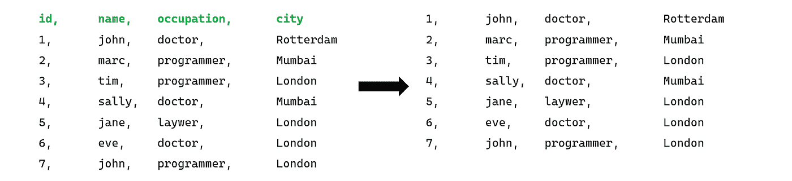

# 数据科学 Bash 入门

> 原文：<https://medium.com/analytics-vidhya/get-started-with-bash-for-data-science-7cc9db19deed?source=collection_archive---------14----------------------->

## *编程中最被低估的语言*

## **简介**

当浏览 medium 上的编程相关文章时，似乎所有文章都有一个共同点:选择的语言是 Python。现在我个人对此并无异议。事实上，我自己就是一个相当大的 Python 迷。

然而，有许多优秀的语言和工具因此有被忽视的风险。这就是为什么本文将讨论 bash，在我看来，它是编程中最被低估和忽视的语言之一。

本文将介绍如何开始使用 bash *，*，主要关注基本语法，并附有一个简单的例子。阅读完本文后，您将了解 bash 的基本机制是如何工作的，以及如何在数据科学环境中实现它们。

## **加载数据**

数据科学的目标是从数据中提取知识。因此，为了展示 bash 如何在数据科学中实现，我们需要一些虚拟数据来处理。对于本文，我们将使用这个简单的 csv 文件(点击[此处](https://gist.github.com/TimoKats/1b01c6f1f892f33d8a784d82b8df1f82)获取源代码),并使用 bash 找出这个数据集中最常见的城市。请记住，在现实生活中，您可能会使用比这大得多的数据集。

data.csv

如果我们想要加载整个数据集，我们使用“cat data.csv”命令。如果我们想加载前 *n* 行，我们使用命令‘head-n filename . CSV’。如果我们想要加载最后的 *n* 行，我们使用命令‘tail-n filename . CSV’。

在这个例子中，我们需要除了表头以外的所有数据。因此我们将加载最后 7 行，这将是命令 **tail -7 data.csv** 。

**tail -7 data.csv 的效果**

既然文件已经加载，我们实际上可以开始从这个数据集中提取一些知识了！为了做到这一点，我们需要能够使用这个新加载的数据作为输入。bash 中有一个很好的工具，叫做“管道化”。

## **bash 中的流水线操作**

流水线本质上是人类蜈蚣的编程等价物。从左到右，一个部分的输出将自动成为另一个部分的输入。当这些操作链接在一起时，就有可能用一行代码完成多个操作。这是 bash 相对于其他语言的最大优势之一。

bash 中的管道

如果您想在 bash 中这样做，您需要在操作之间使用“|”操作符。对于本例，我们将使用它从数据集中选择特定的字段。

## **使用流水线选择数据**

如果你想选择特定的数据，最好使用“剪切”命令。cut 命令(除了其他选项之外)可以选择一个分隔符来分割数据，然后选择字段。为此，请使用-d(分隔符)和-f(字段)标志。因为这是一个逗号分隔的文件，我们将使用'，'作为分隔符。

如果我们将所有这些放在一起(包括数据的加载和剪切)来从数据集中选择城市，我们最终会得到以下管道: **tail -7 'data.csv' | cut -d '，'-f 4**

**的效果 tail -7 'data.csv' | cut -d '，'-f 4**

## **对选中的数据进行操作**

既然我们已经加载并选择了数据，我们实际上可以通过回答本文前面提到的研究问题(找出哪些城市最常见并对它们进行排序)来尝试从中提取一些知识。

直觉上，第一步应该是先计算城市数，然后排序，但这不是 bash 中的最佳路线。为了统计 bash 中某个东西的实例数量，最好先进行排序(sort ),然后通过删除所有双精度值(uniq -c)来进行计数。我们可以通过使用流水线再次组合这些操作。这会产生以下代码: **tail -7 'data.csv' | cut -d '，'-f 4 | sort | uniq -c**

**tail -7 'data.csv' | cut -d '，'-f 4 | sort | uniq -c 的效果**

使用 bash 可以正确回答本文前面提到的问题！显然鹿特丹只有我一个人…

## **总之**

Bash 通常是数据科学和编程的一个很好的工具。通过内置命令和管道，它创造了一种不同的解决问题的方法，这在当今的编程世界中是令人耳目一新的。然而，它确实缺少(例如)Python 所具有的许多功能。

本文只展示了 bash 的一小部分功能，如果你想看到所有可能的命令，请查看:[https://ss64.com/bash/](https://ss64.com/bash/)。

## **代码**

下面是本文的代码。[这个](https://gist.github.com/TimoKats/1b01c6f1f892f33d8a784d82b8df1f82)是数据集的链接，供那些想更多地使用它的人使用。