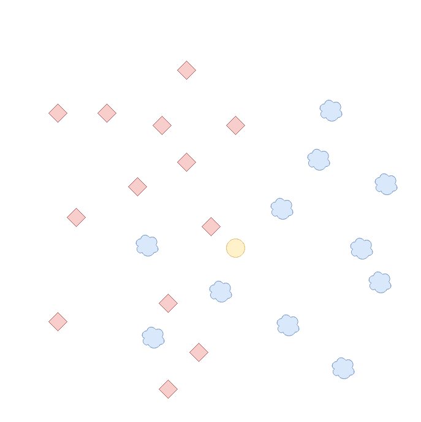
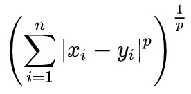
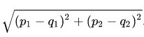
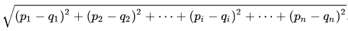

# 了解你的 k 近邻

> 原文：<https://medium.com/analytics-vidhya/get-to-know-your-k-nearest-neighbor-821029bf19a6?source=collection_archive---------21----------------------->

# 简单有效

k-最近邻算法(k-NN)是一种受监督的、基于实例的非参数算法，它利用特征空间中的 k 个最近的实例。受监督意味着它需要输入标签(目标值)和训练数据，以便学习一个函数，该函数将基于过去的配对从输入充分生成未来的输出。基于实例转化为使用特定训练集中实例之间的比较，而不是用于未来数据的泛化。最后，非参数表示算法的自力性，因为其结构是基于现有数据及其内部关系推断的，而不需要大量使用预先确定的模型参数。

我们的穷圈属于哪里？

# 何时使用它

它既可以用于回归，也可以用于分类。

*   分类:每个对象被分配到其 k 个最近邻中最常见的类别。
*   回归:代替对象本身，输出由一个值组成，该值是其 k 个最近邻居的所有值的平均值。

# 为什么使用它

由于它倾向于对拓扑上接近的对象进行分离和重新分组，因此对于多个类非常有用。因此，它可以通过生成数据集的近似子组来整理数据集，这反过来使分析师能够更好地了解数据类别，同时在可视化聚类后提供关于聚类的大量密度信息。

# 什么是 k？

如上所述，k 代表了一个预先确定的度量，即在决定将我们的对象分类到哪里时，我们将考虑多少个相近的例子。之后，下一个大问题是‘多少‘k’是好的？坦率地说，试错法(几乎)总是一个强有力的盟友。记住直觉，即必须消除方差，以便离群值不会影响结果(小“k”)，同时考虑平衡，不让一组特定的对象支配该领域(大“k”)，这有助于确定最佳解决方案的模式。

# 距离

存在几种数学方法来执行该算法，并且它们的区别基于距离度量。下面是三种最常用的:

*   **Manhattan**:**| x1 x2 |+| y1 y2 |**，本质上是为点 a1 的坐标为(x1，y1)和点 a2 的坐标为(x2，y2)的平面定义的简单形式，后者代表前者的最近邻。
*   **闵可夫斯基**:它的基本原理是可以用长度表示为向量的距离。以地图为例，我们可以看到，如果我们测量城市之间的距离，就不能有任何负值——方向只有正值，因此向量是范数——长度是我们测量的基础，多个城市可以连接在一起形成复杂的路线。本质上，这个宏观的例子可以缩小为数据点。

*   **欧几里德**:经典表述方式:两点坐标的绝对数值差(这里分别为‘p’和‘q ’)等于它们的距离。

> **更高维度的欧几里德变异**。

# 结论

这种有效的算法是我们大学数据科学课上最先教授的算法之一，主要是因为它的重要性，其次是因为它易于理解。总之，它是每个数据科学家的工具箱中的一个有用的补充，并且仍然在各种项目中扮演着重要的角色，因此了解它是有好处的。