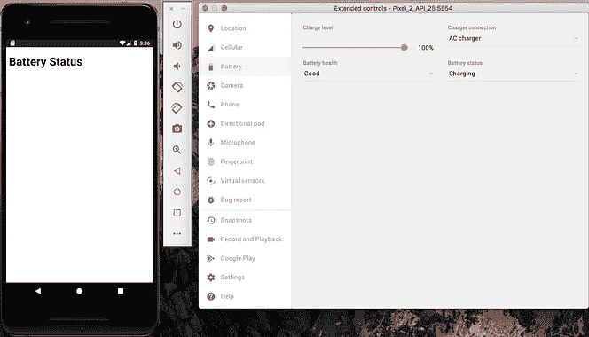
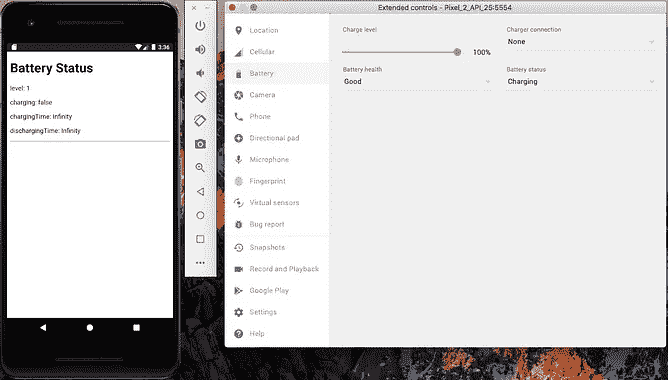
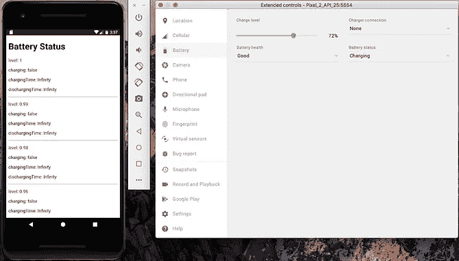
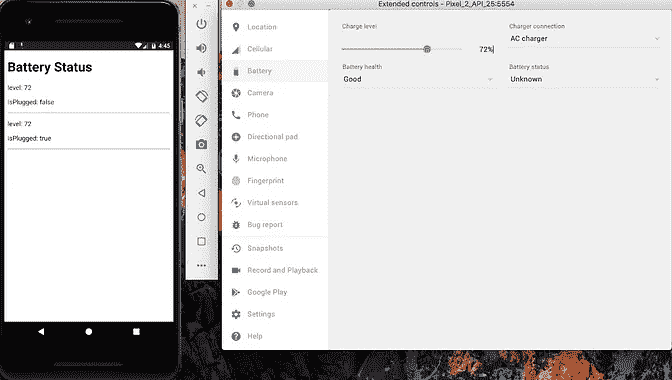

# 使用 Cordova 获取电池状态！

> 原文：<https://medium.com/analytics-vidhya/getting-battery-status-using-cordova-28c4832c40c0?source=collection_archive---------36----------------------->

有两个 ***插件使用 Cordova 获取电池状态*** ，第一个叫做[phonegap-plugin-battery-status](https://www.npmjs.com/package/phonegap-plugin-battery-status)，第二个叫做[Cordova-plugin-battery-status](https://www.npmjs.com/package/cordova-plugin-battery-status)。

# phonegap-插件-电池-状态

`phonegap-plugin-battery-status`插件被弃用，但 ***仍在工作*** 。

可以用 ***来获取*** 的信息，比如电池是否正在充电:`onchargingchange`，电池的电量是多少:`onlevelchange`，设备充电还有多少时间:`onchargingtimechange`，设备放电还有多少时间:`ondischargingtimechange`。最后两个信息只能在 android 上获得。

创建演示应用程序:

```
$ cordova create demo-pg-battery-status com.twiserandom.mobileapps.demo.pgBatteryStatus "Pg Battery Status" 
$ cd demo-pg-battery-status
$ cordova platform add ios
$ cordova platform add android
$ cordova plugin add phonegap-plugin-battery-status
```

编辑`www/index.html`如下所示:

```
<!DOCTYPE html><html>
    <head>
        <meta charset="utf-8">
        <meta http-equiv="Content-Security-Policy" content="default-src 'self' data: gap: [https://ssl.gstatic.com](https://ssl.gstatic.com) 'unsafe-eval'; style-src 'self' 'unsafe-inline'; media-src *; img-src 'self' data: content:;">
        <meta name="format-detection" content="telephone=no">
        <meta name="msapplication-tap-highlight" content="no">
        <meta name="viewport" content="initial-scale=1, width=device-width, viewport-fit=cover">
        <meta name="color-scheme" content="light dark">
        <title>Demo Phonegap Plugin Battery Status</title>
    </head>
    <body>
        <div class="app">
            <div id="console">
                <h1>Battery Status</h1>
            </div>
        </div>
        <script src="cordova.js"></script>
        <script src="js/index.js"></script>
    </body>
</html>
```

并编辑`www/js/index.js`，看起来像这样:

```
document.addEventListener('deviceready', onDeviceReady, false);function onDeviceReady() {
    let console = document.getElementById("console");
    function logStatusObject(){
        console.innerHTML += `<p>level: ${this.level}</p>`;
        console.innerHTML += `<p>charging: ${this.charging}</p>`;
        console.innerHTML += `<p>chargingTime: ${this.chargingTime}</p>`;
        console.innerHTML += `<p>dischargingTime: ${this.dischargingTime}</p>`;
        console.innerHTML += "<hr/>"; }
    navigator
        .getBattery()
        .then(
            function (battery) {
                battery.onchargingchange = logStatusObject;
                battery.onlevelchange = logStatusObject;
                battery.onchargingtimechange = logStatusObject;
                battery.ondischargingtimechange = logStatusObject;
            }); }
```

运行，应用程序使用:

```
$ cordova emulate android
```

并检查使用插件获得的状态消息。



# 科尔多瓦-插件-电池-状态

该插件可用于 ***获取关于*** 的信息，当电池达到临界水平:`batterycritical`，或低水平: `batterylow`，当电池电量变化:`batterystatus`，或当手机正在被插入或拔出:`batterystatus`。

创建应用程序:

```
$ cordova create demo-cp-battery-status com.twiserandom.mobileapps.demoCpBatteryCtatus  "Demo Cp Battery Status"
$ cd demo-cp-battery-status
$ cordova platform add ios
$ cordova platform add android
$ cordova plugin add cordova-plugin-battery-status
```

编辑`www/index.html`如下所示:

```
<!DOCTYPE html><html><head>
    <meta charset="utf-8">
    <meta http-equiv="Content-Security-Policy"
        content="default-src 'self' data: gap: [https://ssl.gstatic.com](https://ssl.gstatic.com) 'unsafe-eval'; style-src 'self' 'unsafe-inline'; media-src *; img-src 'self' data: content:;">
    <meta name="format-detection" content="telephone=no">
    <meta name="msapplication-tap-highlight" content="no">
    <meta name="viewport" content="initial-scale=1, width=device-width, viewport-fit=cover">
    <meta name="color-scheme" content="light dark">
    <title>Demo Cordova Plugin Battery Status</title>
</head><body>
    <div class="app">
        <div id="console">
            <h1>Battery Status</h1>
        </div>
    </div>
    <script src="cordova.js"></script>
    <script src="js/index.js"></script>
</body></html>
```

编辑`www/js/index.js`如下所示:

```
document.addEventListener('deviceready', onDeviceReady, false);function onDeviceReady() {
    let console = document.getElementById("console");
    function logStatusObject(status){
        console.innerHTML += `<p>level: ${status.level}</p>`;
        console.innerHTML += `<p>isPlugged: ${status.isPlugged}</p>`;
        console.innerHTML += "<hr/>"; }
    window.addEventListener("batterystatus", logStatusObject, false);
    window.addEventListener("batterylow", logStatusObject, false);
    window.addEventListener("batterycritical", logStatusObject, false); }
```

运行，应用程序使用:

```
$ cordova emulate android
```



# 获取电池读数可以用来跟踪用户活动吗？

嗯 ***很可能，通过使用差分分析*** ，在一定程度上可以知道用户在做什么。

[研究](https://scholar.google.com/scholar?as_ylo=2017&q=Energy++Consumption++in++Smartphones&hl=en)了一部手机会消耗多少电池，[基于](https://core.ac.uk/download/pdf/146499153.pdf)用户正在做的事情。例如，*如果他在*看电影，那么电池消耗率是这样，如果他在听音乐，那么电池消耗率是这样，如果他在使用社交媒体，那么就是这样…

给定所做的研究，可以基于 电池电量的变化率 ***进行分析，当电话被插入或拔出时，利用一定程度的知识来构建用户一直在做什么。***

*原载于 2021 年 1 月 10 日 https://twiserandom.com*[](https://twiserandom.com/cordova/getting-battery-status-using-cordova/)**。**