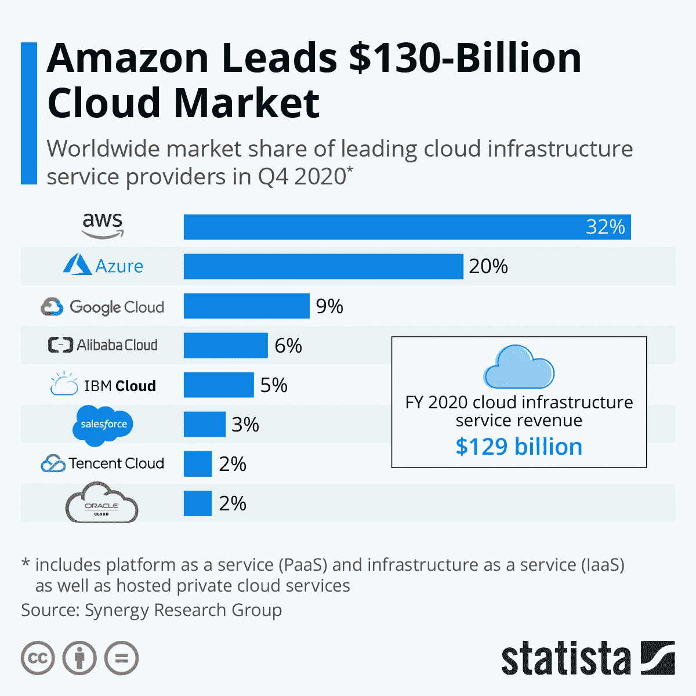

# 获得云认证:AWS vs Azure vs GCP

> 原文：<https://medium.com/analytics-vidhya/getting-cloud-certified-aws-vs-azure-vs-gcp-1bbe343bce97?source=collection_archive---------5----------------------->

## 在过去的十年里，一场风暴正在酝酿。云不再是过去那种神秘的技术，而是现在运行未来项目或业务的最佳方式。我最近完成了三大云提供商的基础认证。这是我从几个拙劣的云双关语中学到的东西的总结。

在 [Unsplash](https://unsplash.com/s/photos/cloud?utm_source=unsplash&utm_medium=referral&utm_content=creditCopyText) 上由 [Daniel Páscoa](https://unsplash.com/@dpascoa?utm_source=unsplash&utm_medium=referral&utm_content=creditCopyText) 拍照

# **谁是主要的云提供商？**

云市场由三大巨头主导。亚马逊的亚马逊网络服务(AWS)是“rains”supreme，其次是微软的 Azure，最后是谷歌的谷歌云平台(GCP)。在我之前使用过的 GCP 之后，可能会有一些值得尊敬的提名，例如 IBM，但在很大程度上，这三个是最受认可的。

[https://www . statista . com/chart/18819/world wide-market-share-of-leading-cloud-infra structure-service-providers/](https://www.statista.com/chart/18819/worldwide-market-share-of-leading-cloud-infrastructure-service-providers/)

# **有哪些认证，我是如何准备的？**

每个提供商都有几个认证途径或途径来鼓励用户提高他们在自己平台上的技能。虽然这些课程侧重于提供商的技术以及如何使用他们的平台，但它们都涵盖了什么是云计算的基础知识以及所涉及的最佳实践。

这些认证绝不是对无止境的云计算探索的戏剧性深入。然而，这是一个让我湿脚的好机会，正是带着这些略湿的脚，我开始了直接进入[平流层](https://en.wikipedia.org/wiki/Stratosphere)的旅程(根据我的研究，云确实主要形成于对流层，平流层之前更接近地球的一层，但直接进入[对流层](https://en.wikipedia.org/wiki/Troposphere)的表达虽然在一篇关于云技术的文章中更准确，但并不具有隐喻性的冲击力)。

**谷歌云平台**[谷歌云平台基础:核心基础设施](https://www.coursera.org/learn/gcp-fundamentals)

 [## 谷歌云平台基础:核心基础设施

### 本课程向您介绍使用谷歌云平台(GCP)的重要概念和术语。你…

www.coursera.org](https://www.coursera.org/learn/gcp-fundamentals) 

这是 Coursera 提供的六门课程之一，让你准备好参加谷歌提供的真正的[云工程师助理考试](https://cloud.google.com/certification/cloud-engineer)，我没有参加。这是我第一次调查获得任何云培训，这是由我想主持一个我一直忙于构建的个人项目这一事实引发的。谷歌似乎是一个不错的选择，因为我在 YouTube 上听说过很多他们的产品。

**微软 Azure**[考试 AZ-900:微软 Azure 基础](https://docs.microsoft.com/en-us/learn/certifications/exams/az-900)

有大量的 Udemy 课程可以用来准备 AZ-900 考试。在这一点上，我已经完成了谷歌基础，我坚持使用持续时间最短和最近更新的一个。

 [## AZ-900 考试准备:微软 Azure 基础(2021 年 2 月)

### 涵盖截至 2021 年 1 月的所有 AZ-900 考试目标。加入已经注册的 30，000 多名学生的行列…

www.udemy.com](https://www.udemy.com/course/az-900-azure-exam-prep-understanding-cloud-concepts/) 

该课程附带了一个实验室模拟器，您可以在其中模拟出 Azure 上某些资源的供应。我补充了一些 Udemy 过去的论文，以便为最终的认证做更好的准备。我有一个客户约定，这门课程是必修的，所以我更有动力确保我通过了这个认证，而其他的课程主要只是为了纯粹的享受。

**亚马逊网络服务**AWS 认证云从业者

AWS Udemy 球场市场在某种程度上由夏羽·马瑞克一人主导，这是有充分理由的。

 [## [新]终极 AWS 认证云从业者- 2021

### 夏羽是一名解决方案架构师、顾问和软件开发人员，他对所有事物都有特殊的兴趣…

www.udemy.com](https://www.udemy.com/course/aws-certified-cloud-practitioner-new/) 

这个课程，虽然比 GCP 和 Azure 的课程要长得多，但还是很好地组织起来，为我准备了更多的考试。它确实很好地结合了理论和实践，让您熟悉 AWS。

# 查看一些“卷云”的细节…

## 1.**云产品的基本知识并没有什么不同**

从初学者的角度来看，出于某种原因，我预计每个云提供商的产品会有很大的不同，但我错了。所有培训都将以非常相似的云介绍以及云的价值开始。接下来是一些更详细的基础知识，如不同类型的云计算(公共云与私有云和混合云)以及不同的服务模式(IaaS、Paas 和 SaaS)。然后，很大一部分将花费在提供商管理其平台的管理方面。最后，在产品方面，培训都花了大量时间来介绍云在虚拟机、存储、数据库和网络方面提供的基本产品。把这个放在上下文中，或者类似的东西，AWS 现在有 200 多个产品，所以你不可能对所有这些服务有深入的了解。

## **2。每个提供商最大的亮点是什么**

简单的谷歌搜索显示，AWS 成立于 2006 年，GCP 成立于 2008 年，最后是 Azure 成立于 2010 年。记住这一点， **AWS** 是最早的游戏，它真正显示了他们的产品的广泛排列。我认为答案是，如果你想在云中做一些事情，AWS 有一个解决方案。不仅如此，他们甚至在服务的基础上提供服务，使得任何知识水平的人都能使用他们的套件。

**Azure** 确实提到了很多关于他们高度的安全性和对法规的遵从性。公司非常熟悉微软，可能已经在使用他们的很多产品或服务器。因此，他们非常适合接管希望开始云计算之旅的大型企业。

GCP 的定位似乎与上述两位大相径庭。我首先使用 YouTube 来了解一些基本的云概念，这些视频似乎总是由谷歌制作的。在撰写本文时，看看每个频道的订阅者数量就知道为什么了:

****:**198k**

******:**465k****

****[**谷歌云科技**](https://www.youtube.com/user/googlecloudplatform) **:** 675k****

****我觉得这个挺有意思的。Google 非常关注开源，我认为他们确实提供了非常好的在线内容和说明，但是他们并没有像上面两者一样成为众多企业的首选。GCP 的门户网站非常容易使用，而且没有 Azure 或 AWS 那么强大。他们的产品非常简单直观，但这可能意味着他们更适合周末爱好者，而不是跨国公司。****

## ******3。云管理很重要******

****在这些课程中，我确实意识到云资源的行政和管理方面将变得多么重要。当你想到云时，你倾向于认为它本质上是技术性的，这在一定程度上是正确的。了解不同的资源规范以及云架构中不同产品之间的交互方式非常重要。不可低估的部分是设置云的管理方面需要多少时间和考虑。资源组、账单明细、价格提醒、预算、许可、供应、标记、认证和安全只是您或您的公司可能需要考虑的一些管理负担。云确实带来了按需访问无限资源的好处，但这并不意味着它仍然没有仔细的规划和管理。****

## ******4。你永远也记不住所有的东西******

****我的意思是对于‘哭出来的云’，空间还在增长，产品也在不断开发。你永远无法记住所有不同的产品以及它们之间的交互方式。相反，你可以专注于云提供的基础，然后从那里扩展。根据您在工作中使用云的目的来识别云可能会更好，例如，如果您从事数据工程，您可能会从有哪些基本存储选项开始，您可以查看不同的云数据库，然后您可以比较 ETL 工具。或者，如果您是一名普通的 web 开发人员，您可能会对用于托管 web 应用程序的不同级别的服务更感兴趣，从纯粹的基础设施产品(如虚拟机)到完全托管的代码产品，提供商将代表您处理所有后端需求。****

********

****[https://www . Reddit . com/r/Linux memes/comments/6 C4 hcf/what _ are _ clouds _ made _ of/](https://www.reddit.com/r/linuxmemes/comments/6c4hcf/what_are_clouds_made_of/)****

******从哪里开始学习云？******

****我个人对未来的云学习者的建议是，在转向其他提供商之前，最好先了解一家提供商。我不喜欢选择一个，但是我建议从 AWS 开始。初学者云认证是一个不错的开始，但你将真正通过走出去，尝试真正的服务来学习。AWS 在这方面做得很好，因为他们特意明确提到了他们的免费级合格产品供您使用以及限制。GCP 和 Azure 在注册时提供很大的折扣，但它们只持续一段时间。我记得很久以前就已经注册了折扣，所以当我有动力去做认证的时候它已经被使用了。一旦你理解了其中一个的基础，你就理解了其他的基础；唯一的问题是产品名称会略有变化。****

****希望听到您对学习云的想法或旅程🙂****