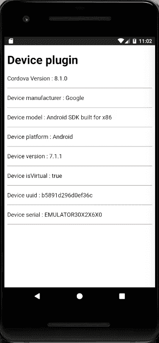
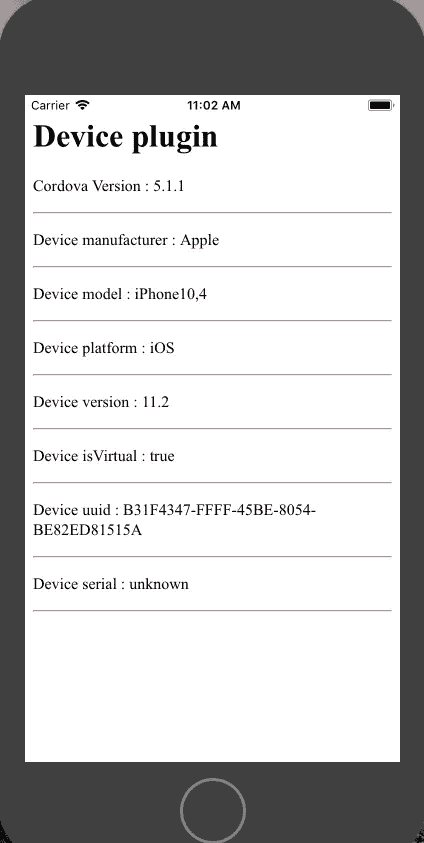

# 使用 cordova 获取设备信息！

> 原文：<https://medium.com/analytics-vidhya/getting-device-information-using-cordova-84b2b458140f?source=collection_archive---------31----------------------->

cordova [设备](https://www.npmjs.com/package/cordova-plugin-device)插件， ***可用于获取*** 移动设备的硬件和软件信息。

# 使用设备插件可以获得的信息

***插件增加了*** 一个全局`device`对象，当`deviceready`事件被触发时可以访问该对象。附加到设备对象的属性有:

`device.cordova`:手机上运行的 cordova 版本。

`device.version`:设备制造商。

`device.model`:设备或型号的名称。

`device.platform`:操作系统的名称。

`device.version`:操作系统的版本。

`device.isVirtual`:判断设备是否在模拟器中运行。

`device.uuid`:设备通用唯一标识符。 ***为 android cordova*** *返回*`ANDROID_ID`。对于 android 版本低于 8 的设备，这是一个 64 位随机数，在设备首次启动时生成。对于 android 版本等于 8 或更高的 android 设备，这是一个 64 位数字，对于签名密钥、用户和设备的每个组合都是唯一的。当设备复位时，`ANDROID_ID`可能会改变，对于 android 版本 8 或更高版本，当 apk 签名密钥改变时，它也可能会改变。
***对于 iOS 来说，这是*** 一个厂商生成的唯一标识符，对于所有的厂商应用，当所有的厂商应用都被删除后，会重新生成厂商唯一标识符。

`device.serial`设备硬件序列号，这仅适用于 android。

# 演示应用程序

使用以下命令创建应用程序:

```
$ cordova create demo-device com.twiserandom.mobileapps.demoDevice  "Demo Device Plugin"
$ cd demo-device
$ cordova platform add ios
$ cordova platform add android
$ cordova plugin add cordova-plugin-device
```

编辑`www/index.html`如下所示:

```
<!DOCTYPE html><html>
    <head>
        <meta charset="utf-8">
        <meta http-equiv="Content-Security-Policy" content="default-src 'self' data: gap: [https://ssl.gstatic.com](https://ssl.gstatic.com) 'unsafe-eval'; style-src 'self' 'unsafe-inline'; media-src *; img-src 'self' data: content:;">
        <meta name="format-detection" content="telephone=no">
        <meta name="msapplication-tap-highlight" content="no">
        <meta name="viewport" content="initial-scale=1, width=device-width, viewport-fit=cover">
        <meta name="color-scheme" content="light dark">
        <title>Demo Device Plugin</title>
    </head>
    <body>
        <div class="app">
            <div id="console">
                <h1>Device plugin</h1>
            </div>
        </div>
        <script src="cordova.js"></script>
        <script src="js/index.js"></script>
    </body>
</html>
```

编辑`www/js/index.js`如下所示:

```
document.addEventListener('deviceready', onDeviceReady, false);function onDeviceReady() {
    let console = document.getElementById("console");
    function logToConsole(key , value){
        console.innerHTML += `<p>${key} : ${value}</p>`;
        console.innerHTML += "<hr/>"; }
    logToConsole("Cordova Version" , device.cordova );
    logToConsole("Device manufacturer" , device.manufacturer );
    logToConsole("Device model" , device.model );
    logToConsole("Device platform" , device.platform );
    logToConsole("Device version" , device.version );
    logToConsole("Device isVirtual" , device.isVirtual );
    logToConsole("Device uuid" , device.uuid );
    logToConsole("Device serial" , device.serial ); }
```

在模拟器上运行应用程序，如下所示:

```
$ cordova emulate android 
# For android$ cordova emulate ios
# For iOS
```



# 这样的插件可以用来建模用户信息吗？

可以通过设备型号和厂商来了解 ***用户购买的是什么设备*** 。对谁购买了哪种设备、这个人所属的人群类别、这个人赚了多少钱、他的年龄以及其他人口统计数据的研究是一种反向分析，也是可以进行的。

设备操作系统及其版本可用于评估设备是否会被黑客攻击，或者是否在该设备上发现了安全漏洞。它还可以用来获取人口统计信息，例如，什么样的人购买 android 或 iOS，或者使用 chrome 或 firefox …一个 ***用户建模*** ，以推送服务也许。

uuid 和设备序列号**T5**用于跟踪用户的喜好、他正在做什么，并从多个来源获取信息。

*原载于 2021 年 1 月 10 日 https://twiserandom.com**的* [*。*](https://twiserandom.com/cordova/getting-device-information-using-cordova/)