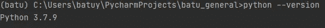

# 通过 Python (LyricsGenius)获取歌词

> 原文：<https://medium.com/analytics-vidhya/getting-lyrics-of-songs-via-python-lyricsgenius-23e5dd5992e3?source=collection_archive---------2----------------------->


LyricsGenius 是一个 python 库，通过它的 API 可以更容易地从 Genius.com 下载任何歌词。

在开始编码之前，来自 genius 的 API key 是必须的。因此，通过这个[链接](https://genius.com/developers)创建 API 很容易。

创建完 API，就开始编码吧。


LyricsGenius 使用 Python 3。对于安装，

首先，检查您的 python 版本。

```
python --version
```



其次，下载 python 库。

```
#If python --version is Python3, 
pip install lyricsgenius
#If python --version is Python2,
pip3 install lyricsgenius
```

对于最新版本，尝试安装 Github 链接。

```
pip install git+https://github.com/johnwmillr/LyricsGenius.git
```

现在，您已经准备好使用 lyricsgenius 了。导入库和模块。

```
#api_key is your TOKEN from Genius Developers. It will look like that.api_key = 
"XXX-XXXX7XXXXXYUeXXXXXMXXWsUXXXXX7BXXXXX3_XXXXXsY_aBXXXXXzXX"
genius = lg.Genius(api_key)
```

对于 Genius 搜索的额外说明，下面的示例中有一些参数。

```
genius = lg.Genius(api_key, skip_non_songs=True, excluded_terms=["(Remix)", "(Live)"], remove_section_headers=True)
```

下一步是搜索艺术家的歌词。

```
#Searches all of "Pop Smoke"'s songs.
artist = genius.search_artist("Pop Smoke")#Searches 5 of "Pop Smoke"'s songs.
artist = genius.search_artist("Pop Smoke",max_songs=5)#Searches 5 of "Pop Smoke"'s songs via its Title.
artist = genius.search_artist("Pop Smoke",max_songs=5,sort="title")# Sorts = popularity release_date title
```

的*输出*

*artist = genius . search _ artist(" Pop Smoke "，max_songs=5，sort="title")*

*是:*

```
Searching for songs by Pop Smoke...

Song 1: "Dior"
Song 2: "Mood Swings"
Song 3: "Welcome to the Party"
Song 4: "For the Night"
Song 5: "Hello"

Reached user-specified song limit (5).
Done. Found 5 songs.
```

对于看到的歌曲:

```
songs = artist.songs
print(songs)
```

输出:

```
[('Dior', 'Pop Smoke'), ('Mood Swings', 'Pop Smoke'), ('Welcome to the Party', 'Pop Smoke'), ('For the Night', 'Pop Smoke'), ('Hello', 'Pop Smoke')]
```

对于受限或非受限歌曲中的特定歌曲:

```
song = artist.song("Dior")
print(song)
```

输出:

```
"Dior" by Pop Smoke:
    Traphouse Mob
    Huh,  roll another one
    Said  I'm never lackin', always pistol packing
    With them automa...
```

对于“歌曲”变量的歌词:

```
print(song.lyrics)
```

输出:

```
Traphouse Mob
Huh,  roll another one
Said  I'm never lackin', always pistol packing
With them automatics, we gon' send him to heaven
Wait, wait, wait, wait, ayy, ayy, woo (Aw, shit), huh
Oh,  you feelin' sturdy, huh? (You feelin' sturdy, man)
Shake  somethin'
Shake it, shake it, shake it

She  like the way that I dance
She like the way that I move
She like the way that I rock
She like the way that I woo
And  she let it clap for a nigga
(She let it clap for a nigga)
And she throw it back for a nigga
(Yeah, she throw it back for a nigga)
Mike Amiri, Mike Amiri
Billie Jean, Billie Jean (Uh)
Christian Dior, Dior
I'm up in all the stores
When it rains, it pours
She like the way I rrr
Mike Amiri, Mike Amiri
Billie Jean, Billie Jean (Uh)
Christian Dior, Dior
I'm up in all the stores
When it rains, it pours
She like the way I rrr

When I walk in the spot, thirty on me
Buy out the club, niggas know that I'm paid
Bitch, I'm a thot, get me lit
I can't fuck with these niggas 'cause niggas is gay
All on my page suckin' dick
All in my comments and screamin' my name
While I'm in the club, throwin' them hundreds and fifties and ones and ones
Pop Smoke, they know I'm wildin'
If I'm on the island, I'm snatchin' the cell
Brody got locked, denied his bail
Until he free, I'm raisin' hell
Tell my shooters call me FaceTime
For all the times we had to face time
Free D-Nice, he doin' state time
If you need the glizzy, you could take mine
Please don't come out your mouth, you know I'm like that
I'll make a movie like TNT
Glock-30 on me, ask who really want it
I bet I air it like BNB
Nappy Blue wildin' in my section
And I keep that .38 for the weapon
Remember when I came home from corrections
All the bad bitches in my direction

She like the way that I dance
She like the way that I move
She like the way that I rock
She like the way that I woo
And she let it clap for a nigga
(She let it clap for a nigga)
And she throw it back for a nigga
(Yeah, she throw it back for a nigga)
Mike Amiri, Mike Amiri
Billie Jean, Billie Jean (Uh)
Christian Dior, Dior
I'm up in all the stores
When it rains, it pours
She like the way I rrr
Mike Amiri, Mike Amiri
Billie Jean, Billie Jean (Uh)
Christian Dior, Dior
I'm up in all the stores
When it rains, it pours
She like the way I rrr
```

代码示例的完整用法

```
def get_lyrics(artists, song_limit):
    c = 0
    for artist in artists:
        try:
            songs = (genius.search_artist(artist, max_songs=song_limit, sort='popularity')).songs
            song_lyrics_list = [song.lyrics for song in songs]
            file = open(f"{artist}_lyrics_of_{len(song_lyrics_list)}_songs.txt", "w", encoding='utf-8')
            file.write("\n \n \n \n \n".join(song_lyrics_list))
            c += 1
            print(f"Songs grabbed:{len(song_lyrics_list)}")
            file.close()
            print("___________________________________________________\n\n\n\n")
        except:
            print(f"some exception at {artist}: {c}")# Sorts = popularity release_date titleapi_key = "YOUR_API_KEY"
import lyricsgenius as lggenius = lg.Genius(api_key, skip_non_songs=True, excluded_terms=["(Remix)", "(Live)"], remove_section_headers=True)art = ["Pop Smoke","Weekend"]
lyrics = get_lyrics(art, 5)
#
```

感谢阅读这篇文章。希望对你有帮助。