# 开始使用 Amazon Rekognition 并使用他们的 SDK

> 原文：<https://medium.com/analytics-vidhya/getting-started-on-amazon-rekognition-and-using-their-sdks-9b8e7dee3048?source=collection_archive---------9----------------------->

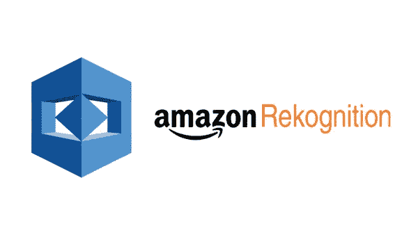

在这篇博客中，我将展示如何使用 **Amazon Rekognition 服务**来分析项目中的图像和视频。

如果你还没听说过这项服务，下面是对这项服务的简要描述，它将帮助你入门。

> **Amazon Rekognition** 使用成熟的、高度可扩展的深度学习技术，无需使用机器学习专业知识，就可以轻松地将**图像和视频分析**添加到您的应用程序中。通过 Amazon Rekognition，您可以**识别图像和视频中的对象、人物、文本、场景和活动**、**以及检测任何不适当的内容**。Amazon Rekognition 还提供高度精确的面部分析和面部搜索功能，您可以使用这些功能扫描、分析和比较面部，用于各种用户验证、人数统计和公共安全用例。

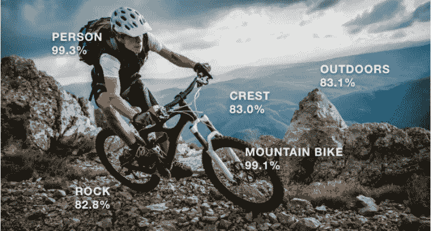

为了让您更好地了解该服务是如何工作的，我将从 AWS Web 控制台展示一个简短的演示，然后在您的应用程序中使用它们。

**✨来自门户网站的简短演示:**

**步骤 1:** ***访问服务仪表板:*** 登录您的 AWS 控制台，搜索 Amazon Rekognition。选择 Amazon Rekognition 后，您将进入该服务的仪表板。

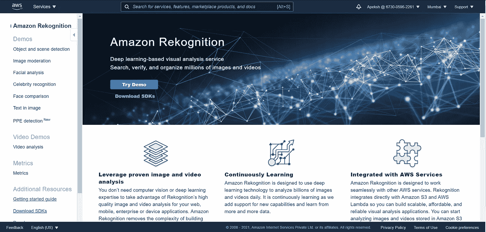

**第二步:** ***从给出的 demo 中解读*** :在左侧可以看到可以尝试的各种选项。点击**物体和场景检测**。现在，您可以看到左侧是一个示例图像，上面绘制了不同的边界框，而在右侧，您可以看到图像中存在的各种对象标签。

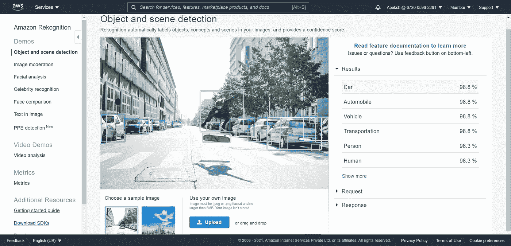

**第三步:** ***上传你的自定义图片，获得结果:*** 你可以上传任意自定义图片，也可以提供源图片的 URL，他们会给你标有边框的标签图片。下面是一个例子，我上传了一个自定义图像，他们为我分析并标记了图像。

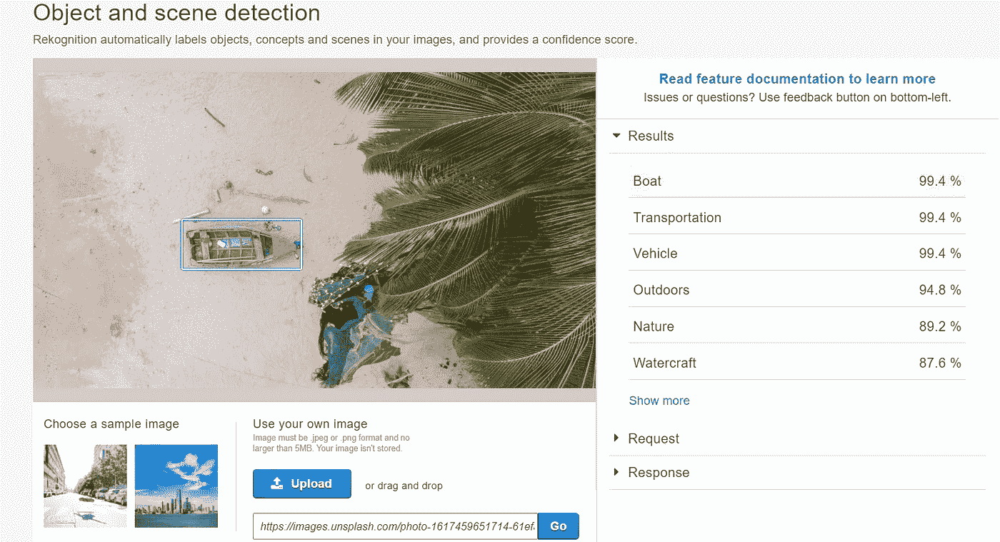

## 解释

那么你看到亚马逊 Rekognition 让图像和视频分析变得多么容易了吗？通过 Amazon Rekognition，你可以识别成千上万的物体(如自行车、电话、建筑)、场景(如停车场、海滩、城市)、人脸等。在你的图像和视频中。您只需要提供您想要检测的物体或场景的照片，其余的由服务处理。

## **如何使用**

现在您一定想知道如何在您的应用程序中使用它们。所以好消息是他们在几乎所有主要的编程语言中都有自己的 API，并且随时可以使用。

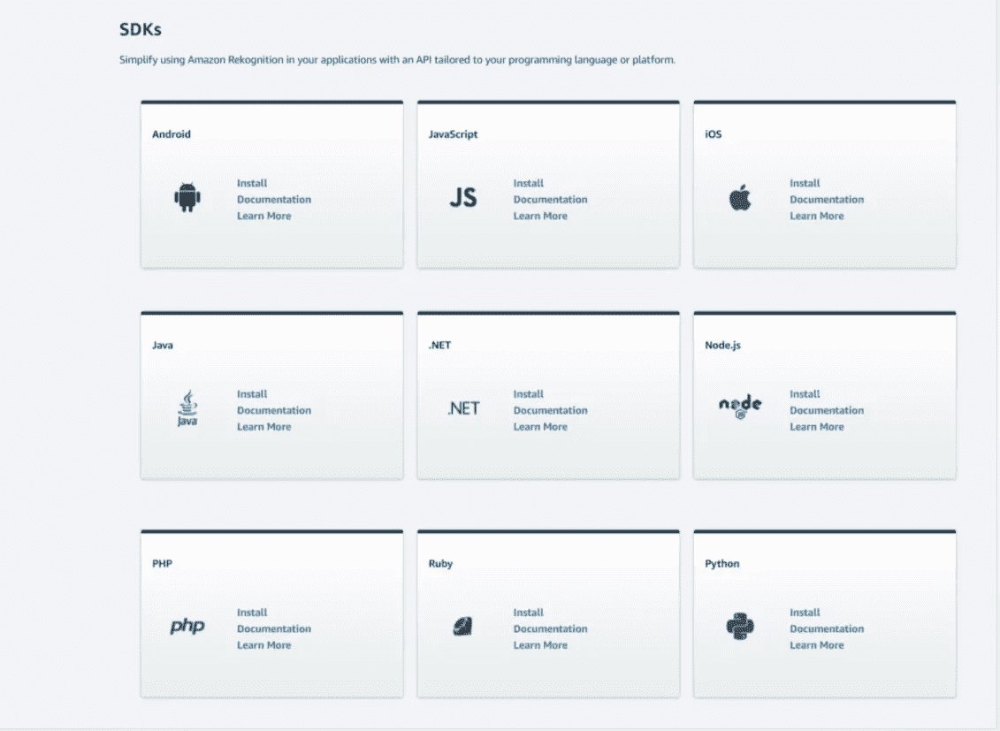

通过查看他们的文档，你可以很容易地开始使用他们各自语言的 API。

## ✨Let's 制造:

现在我将构建一个小项目，从中你可以了解如何在你的项目中使用他们的 API。我将使用 python 语言，该项目的工作流程将是:

1.  单击网络摄像头中的图像。
2.  上传到 S3 桶。
3.  将请求发送到 Amazon Rekognition 服务，以检测我们项目中的标签。
4.  获得响应并根据您的需要处理它们。在这个项目中，我将在检测到的物体上绘制一个边界框。

## 先决条件:

在继续之前，这些是您可能已经完成的一些先决条件。

**第一步:**建立一个 **AWS** 账户，创建一个 IAM 用户。

**第二步:**设置**AWS**CLI 和 **AWS** 和**SDK**。

如果您在配置它们时有任何问题，可以参考我的这篇 [***文章***](/analytics-vidhya/configure-aws-cli-and-execute-commands-fc16a17b0aa2) ***。***

## 我们开始吧:

为此，我用 **jupyter 笔记本**作为我的 IDE 来给你们一个更好的视角

**第一步:*从网络摄像头拍摄照片:*** 为了拍摄图像，我正在使用 python 的`**opencv**`库。您可以使用 **pip** 或任何其他 python 发布平台(如 **Anaconda)进行安装。**

```
**# To install opencv package** pip install opencv-python
```

现在，下面的代码将使用 OpenCV 从网络摄像头拍摄一张照片，并将其存储在当前目录中:

```
**# To click a photograph from webcam**
import cv2
cam = cv2.VideoCapture(0)
ret, photo = cam.read()
cv2.imwrite("apeksh.jpg", photo)  
cam.release()
```

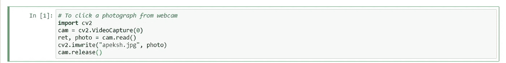

在我的例子中，点击的照片如下所示:


**第二步:*上传到 S3 桶:*** 现在，我们将上传这个图像到我们的 S3 桶。为了上传，我们将使用他们的`**boto3**` 库连接到 AWS S3 API。像安装 OpenCV 包一样安装 boto3 库。

```
**# To install boto3 SDK**
pip install boto3
```

下面的代码将把图像上传到你的 S3 桶:

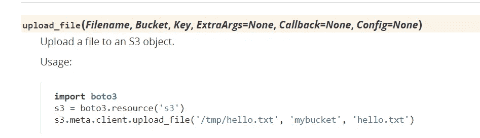

```
**# To upload the image you clicked to S3 bucket**
import boto3
s3 = boto3.client('s3')
s3.upload_file("apeksh.jpg","trial12g","myPhoto.jpg")
```

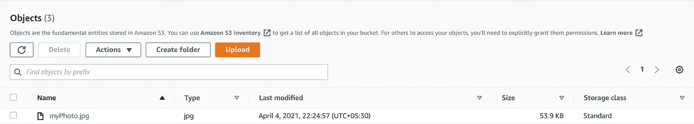

> **注意:**如果你没有在他们的 SDK 中设置 AWS 概要文件，这个命令会给出一个错误。这就是我在先决条件中提到配置 SDK 的原因。

**步骤 3:** ***发送请求:*** 现在，我们将把请求发送到 Amazon Rekognition，以 ***检测我们上传到 S3 桶中的图像中的标签*** 。

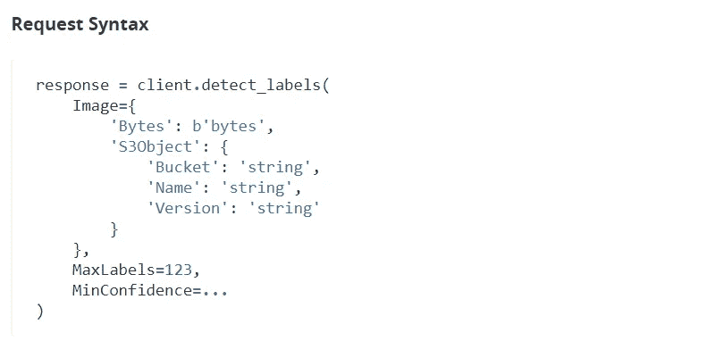

```
**# To send the request to AWS rekognition service**
rekognition = boto3.client('rekognition')
response = rekognition.detect_labels(
    Image={
        'S3Object': {
            'Bucket': 'trial12g',
            'Name': 'myPhoto.jpg',
        }
    },
    MaxLabels=5,
    MinConfidence=80)
```

**第四步:** ***分析结果:*** 您可以打印输出来查看响应，并对您的数据做相应的进一步处理。

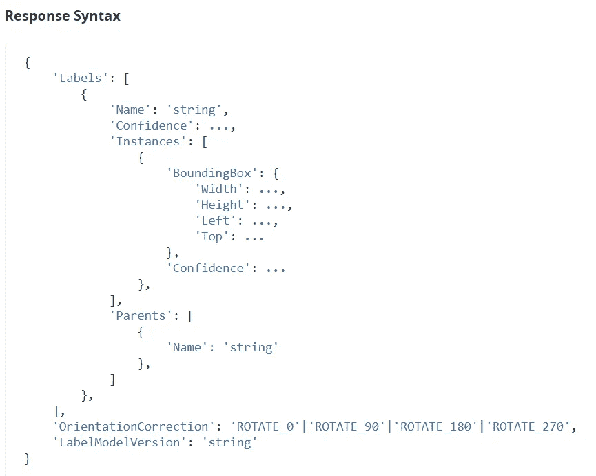

对我的图像的响应如下所示:

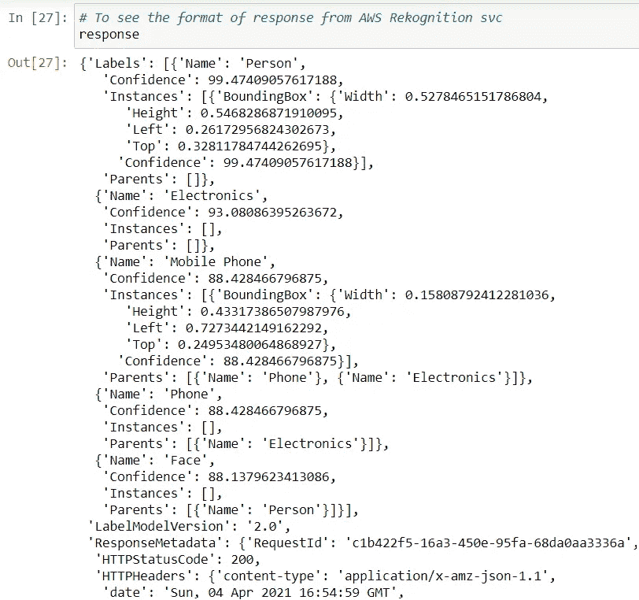

**第五步:*根据自己的需要处理数据:*** 现在，在得到响应后，就可以根据自己的需要处理数据，得到想要的结果了。在我的例子中，我将简单地在正确检测到的标签上画一个有界的框。

所以首先我分析了他们给我的四个尺寸，分别是**左**、**上**、**高**、**宽**。为了绘制矩形，cv2 有一个函数需要**起点**和**终点**的坐标。


为了得到正确的坐标，这里有一个他们在文档中展示的例子

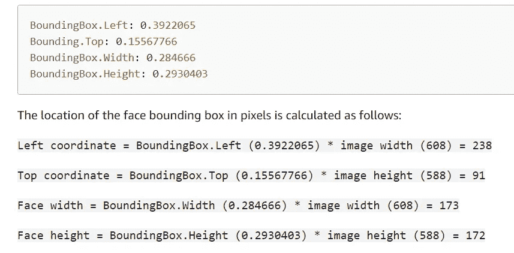

因此，我按照这个得到我的正确坐标，并创建了满足我需要的代码。下面是我的代码，供你参考。

## 💎输出:

您可以看到图像与对象绑定在一起，就像我们在 AWS 门户上看到的一样。

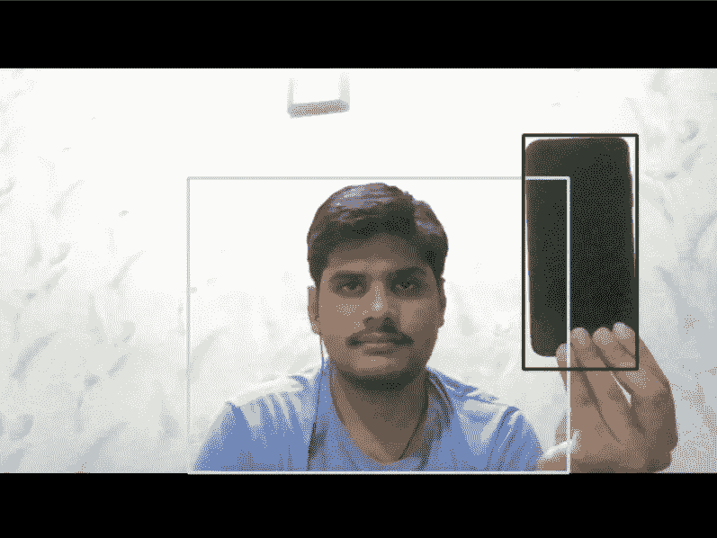

## 🎯结论:

在这篇文章中，我试图展示如何使用亚马逊 Rekognition 并使用他们的 SDK 与你的应用集成。我希望现在你已经对如何使用这项服务有了一个基本的概念。在这个演示中，我只展示了一个**检测标签**的函数。但是现在你可以尝试他们的其他方法，比如检测人脸，在图像中搜索文本等等。他们的工作方式相似，如果你遇到困难，可以参考他们的文档。

> 这就是我们的博客。希望你们喜欢。下一篇博客再见。在那之前继续学习。

[](https://github.com/Apeksh742/Amazon-Rekognition-code) [## apeksh 742/Amazon-Rekognition-code

### 在 GitHub 上创建一个帐户，为 Apeksh742/Amazon-Rekognition 代码开发做出贡献。

github.com](https://github.com/Apeksh742/Amazon-Rekognition-code) [](https://www.linkedin.com/in/apeksh-agarwal-0543bb192/) [## apeksh Agarwal-Intern-Linux world Informatics Pvt Ltd | LinkedIn

### 我正在斋浦尔工程学院和研究中心攻读计算机科学的 B.Tech。我在…做过几个项目

www.linkedin.com](https://www.linkedin.com/in/apeksh-agarwal-0543bb192/)