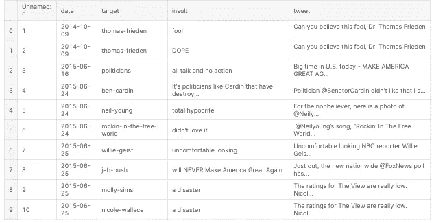
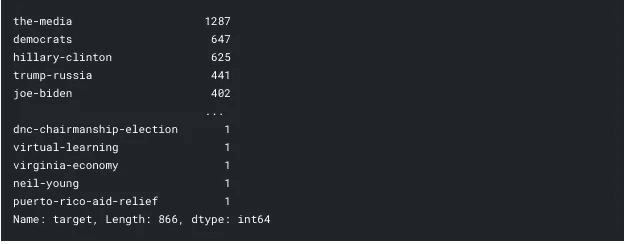
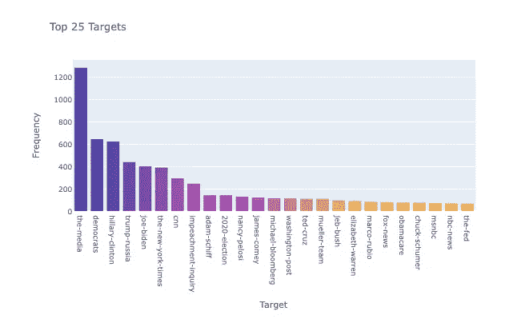
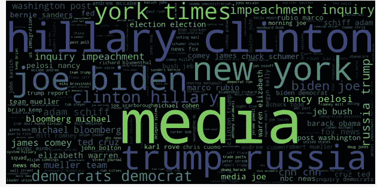
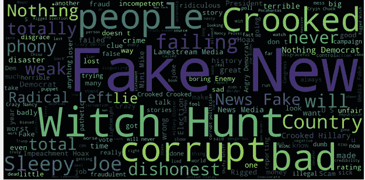
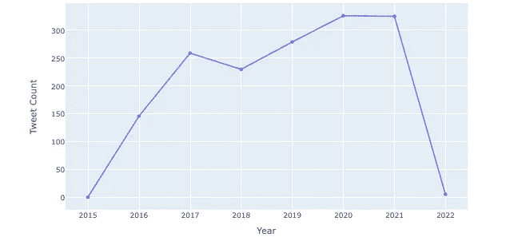
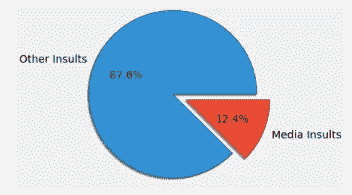
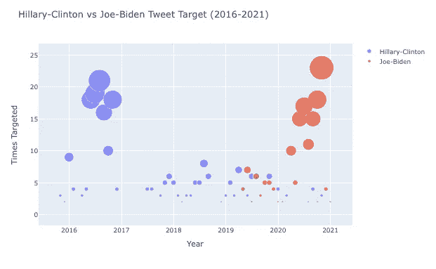

# Kaggle 入门…

> 原文：<https://medium.com/analytics-vidhya/getting-started-on-kaggle-5be7d9be46e3?source=collection_archive---------16----------------------->

## 我的第一个 Kaggle 笔记本提交

因此，经过一个月的修改 python 的概念，了解了一些 Python 数据处理和可视化库的基础，如 *NumPy、Pandas、Matplotlib、*等。我决定在 Kaggle 上创建自己的账户，用**真实数据**开始我的数据分析之旅。

注册后，我开始研究一些流行的数据集，人们已经提交了他们的笔记本。我调查了其中的一些(高评级)。他们一直在用 seaborn，Plotly 等。有更好的可视化和易于编码的绘图。

我又花了一周时间沉浸在 Seaborn 和 Plotly 的概念中。做完基础工作后，我开始有点自信了。[所有川普的推特辱骂(2015–2021)](https://www.kaggle.com/ayushggarg/all-trumps-twitter-insults-20152021)在当时相当有名。

我首先导入了所有基本的东西，比如 numpy、pandas、matplotlib、plotly、plotly.offline 等等。后面是数据(在。csv)在数据帧中。

准确地说，这是我在牢房里执行的任务:

```
import numpy as np 
import pandas as pd 
from matplotlib import pyplot as plt
import seaborn as sns
import chart_studio.plotly as py
import cufflinks as cf
import plotly.graph_objs as go
from wordcloud import WordCloud, STOPWORDS, ImageColorGenerator
from PIL import Image
%matplotlib inline

from plotly.offline import download_plotlyjs, plot, init_notebook_mode, iplot
init_notebook_mode(connected=True)*# initiate notebook for offline plot*
cf.go_offline()
```

感谢您导入我的。csv 数据转换成数据帧:

```
trump_df = pd.read_csv("../input/all-trumps-twitter-insults-20152021/trump_insult_tweets_2014_to_2021.csv")
trump_df.head(10)
```

这是我在执行上述单元格时得到的结果:



特朗普推特辱骂数据框(导入)

然后，我检查了数据框的形状(trump_df.shape ),后面是空值(如果有的话)( trump_df.isnull()。sum())。在那里，我发现了一个有 10360 行、5 列的形状，在目标列中有 2 个空值。

现在，在数据清理下，我删除了目标中包含空数据的两行，因为我可以观察到这不会影响由 10360 行组成的整体数据。

```
trump_df.dropna(inplace=True)
trump_df.shape
```

然后我通过运行 **trump_df.target.unique()进行观察。形状**只有 866 行是唯一的。因此，许多人/目标/社区多次成为目标。

运行此代码以获得唯一的目标计数:

```
unique_targetcounts = trump_df.target.value_counts()
unique_targetcounts
```



唯一目标计数

然后，可视化前 25 名目标人员/社区:

```
trace = go.Bar(x=unique_targetcounts.index[:25], y=unique_targetcounts,
              marker=dict(
                  opacity=0.8,
                  color=np.arange(25)
              ))

fig = go.Figure(data=[trace])
fig.update_layout(title="Top 25 Targets")
fig.update_xaxes(title="Target")
fig.update_yaxes(title="Frequency")

iplot(fig)
```



显示前 25 个目标的条形图

然后为了更好的可视化所有的目标，我试着在 WordCloud 上绘制它们，这是我从别人的笔记本上学来的。

你只需要运行几行代码，你就可以得到一个奇妙的单词可视化。

```
target_text = " ".join(trump_df.target)
wordcloud = WordCloud(width=1400, height=700).generate(text=target_text)
plt.figure(figsize=(30,18))
plt.imshow(wordcloud, interpolation="bilinear")
plt.axis("off")
plt.show()
```



WordCloud 显示热门目标

这种视觉化是在下一个层次上(我感觉到了),我最终也把它用在了顶级侮辱上。

```
insult_text = " ".join(trump_df.insult)
wordcloud = WordCloud(width=1400, height=700).generate(text=insult_text)
plt.figure(figsize=(30,18))
plt.imshow(wordcloud, interpolation="bilinear")
plt.axis("off")
plt.show()
```



WordCloud 显示顶级侮辱

我可以从上面的文字云观察到，常用的侮辱是假的，新闻，腐败的人，不诚实的，等等。他试图宣布所有批评他们的东西都是虚假和腐败的——主要是媒体。

然后我试图计算出从 2016 年到 2020 年每年有多少条推文。为此，我必须处理时间序列、索引设置等。

```
*# set date as index and then convert it from str into DateTime*trump_df.set_index(trump_df.date, inplace=True)
trump_df.index = pd.to_datetime(trump_df.index, format="%Y/%m/**%d**")
trump_df.index
```

每年发布的推文数量的可视化:

```
datecount_data = trump_df.index.value_counts().resample("Y").count()
datecount_datacountsbydate = trump_df.index.value_counts().resample("m").count()
trace1 = go.Scatter(x=datecount_data.index, y=datecount_data)
fig = go.Figure(data=[trace1])

fig.update_xaxes(title="Year")
fig.update_yaxes(title="Tweet Count")

iplot(fig)
```



每年发布的推文数量

然后我试着想象在媒体上被侮辱的百分比是多少。为此，我决定使用饼状图。

```
*# filtering tweets where target is "the-media"*media_insults = trump_df.target[trump_df.target == "the-media"].count()
other_insults = trump_df.target.count() - media_insults*# visualization of other insults vs The Media insults*explode=[0, 0.2]
plt.style.use('fivethirtyeight')
plt.pie([other_insults, media_insults],labels=["Other Insults", "Media Insults"], explode=explode, 
        shadow=True, wedgeprops={"edgecolor" : "#2d2d2d"},
       radius=1.2, autopct="**%1.1f%%**")

plt.show()
```



馅饼阴谋显示媒体侮辱

然后我试着想象希拉里·克林顿和乔·拜登在推特上受到多少侮辱。

```
hillary_clinton_target = trump_df.index[trump_df.target == "hillary-clinton"].value_counts().resample("m").count()
joe_biden_target = trump_df.index[trump_df.target == "joe-biden"].value_counts().resample("m").count()trace1 = go.Scatter(x=hillary_clinton_target.index, y=hillary_clinton_target, 
                    mode="markers", name="Hillary-Clinton", marker=dict(
                    size=hillary_clinton_target*2
                    ))
trace2 = go.Scatter(x=joe_biden_target.index, y=joe_biden_target, 
                    mode="markers", name="Joe-Biden", marker=dict(
                    size=joe_biden_target*2
                    ))

fig = go.Figure(data=[trace1, trace2])

fig.update_layout(title="Hillary-Clinton vs Joe-Biden Tweet Target (2016-2021)")
fig.update_xaxes(title="Year")
fig.update_yaxes(title="Times Targeted")

iplot(fig)
```



对希拉里·克林顿和乔·拜登的侮辱次数

我能够观察到从希拉里-克林顿(2016 年选举)到乔-拜登(2020 年选举)的转变。

这是我出版的第一本笔记本，从那以后我又出版了两本。提供的解释足够好，得到了很多感谢的评论，并在我的笔记本上加了一枚银质徽章。

您可以在此处找到该笔记本:

[](https://www.kaggle.com/rahul253801/eda-of-trump-s-twitter-insults) [## 特朗普推特辱骂的埃达

### 用 Kaggle 笔记本探索和运行机器学习代码|使用特朗普所有推特辱骂的数据(2015-2021)

www.kaggle.com](https://www.kaggle.com/rahul253801/eda-of-trump-s-twitter-insults) 

如果你在评论中遇到任何困难，请告诉我。