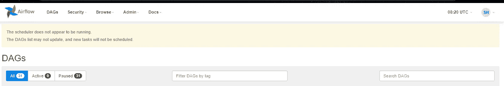

# 气流入门

> 原文：<https://medium.com/analytics-vidhya/getting-started-with-airflow-b0042cae3ebf?source=collection_archive---------0----------------------->

## 如何使用 BashOperator、PythonOperator 和 MySqlOperator 在 Linux 机器上设置气流并创建基本工作流


由[阿尔瓦罗·雷耶斯](https://unsplash.com/@alvarordesign?utm_source=medium&utm_medium=referral)在 [Unsplash](https://unsplash.com?utm_source=medium&utm_medium=referral) 上拍摄的照片

[](https://airflow.apache.org/) [## 主页

### 没有更多的命令行或 XML 魔术！使用标准 Python 功能创建工作流，包括日期时间…

airflow.apache.org](https://airflow.apache.org/) 

> Airflow 是一个由社区创建的平台，用于以编程方式创作、安排和监控工作流。

在部署和监控工作流时，Airflow 是一个强大的工具。它使用标准的 Python 特性来创建工作流，包括用于调度的日期时间格式和用于动态生成任务的循环。这使得在构建工作流时很容易保持充分的灵活性。

它还附带了一个非常易于使用的 UI，并提供了许多即插即用的操作器，可以随时在 SQL Servers、GCP、AWS 和许多其他第三方服务上执行任务。

下面的文章将给出一个在 Linux 机器上安装和使用气流的演练。我在一台 Windows 10 笔记本电脑上通过 WSL 使用了 **Ubuntu 20.04** ，尽管这些步骤可以在任何基于 Linux 的机器上运行。**气流 2.1.3** 和 **Python 3.8.10** 已用于此设置。

# 检查 Python 安装

确保您已经在机器上安装了 Python。运行下面的命令查看 Python 的版本。

```
python3 --version
```


检查 Python 安装

你可以参考这里的文档来安装 Python-[https://docs.python-guide.org/starting/install3/linux/](https://docs.python-guide.org/starting/install3/linux/)

## 安装 pip

通过运行以下命令检查是否安装了 pip:

```
pip --version
```

如果尚未安装，请使用以下方法安装:

```
sudo apt install python3-pip
```

# 安装气流

对于这个设置，我们将使用 Airflow 版本 2.1.3。对 1.10 版的支持将于 2021 年 6 月结束，因此建议使用 2 版。

**注意**:本指南将气流直接安装到 Python 的基础环境中。如果您想将其安装在虚拟环境中，请使用 [venv](https://mothergeo-py.readthedocs.io/en/latest/development/how-to/venv.html) 创建适当的环境，并在运行以下命令之前切换到该环境。

## 安装气流

Airflow 需要一个主目录，默认为 *~/airflow* ，但是您可以将其设置为您选择的任何目录。您也可以在*中添加下面一行。bashrc* 文件，所以它会在你每次打开终端时被设置。

```
export AIRFLOW_HOME=~/airflow
```

为气流和 Python 版本设置变量。然后在 *pip* 命令中使用它们来确保正确安装所有相应的依赖项。如果你直接运行*pip install Apache-air flow = = 2 . 1 . 3*可能会导致一些包版本的问题，比如 SQLAlchemy。

```
AIRFLOW_VERSION=2.1.3PYTHON_VERSION="$(python3 --version | cut -d " " -f 2 | cut -d "." -f 1-2)"CONSTRAINT_URL="https://raw.githubusercontent.com/apache/airflow/constraints-${AIRFLOW_VERSION}/constraints-${PYTHON_VERSION}.txt"
```

对于我们的例子，变量 *PYTHON_VERSION* 将被设置为 3.8。

现在，运行安装命令，该命令将使用上面设置的变量来使用我们的 Python 3.8 获得 Airflow 2.1.3。

```
pip install "apache-airflow==${AIRFLOW_VERSION}" --constraint "${CONSTRAINT_URL}"
```

## 初始化气流数据库

```
airflow db init
```

## 创建用户

使用以下命令创建登录 Airflow WebUI 的用户密码。如果希望多人使用，您可以添加多个用户，并赋予不同的用户权限。

**管理员**

出现提示时，运行以下命令并设置密码。

```
airflow users create \
    --username admin \
    --firstname Sherlock \
    --lastname Holmes \
    --role Admin \
    --email sherlock@221-b-bakerstreet.org
```

**用户**

```
airflow users create \
    --username jw \
    --firstname James \
    --lastname Watson \
    --role User \
    --email watson@221-b-bakerstreet.org
```

> N **注意**:具有“用户”角色的用户将对某些气流功能具有有限的访问权限。请以“管理员”的身份执行以下步骤。

## 启动服务器

在终端中使用以下命令启动 web 服务器。根据需要更新端口值。

```
airflow webserver --port 8080
```

该终端必须保持开启，以便 web 服务器继续运行。


正在启动 web 服务器

导航到 *localhost:8080* 以访问 WebUI。使用我们之前创建的用户名-密码登录。


WebUI 登录页面

您将得到以下警告:



调度程序警告

**启动调度程序**

我们还必须在一个单独的终端中启动一个气流调度程序作业，该作业将跟踪 DAG 调度并按时运行它们。

```
airflow scheduler
```


气流调度程序

# 更新配置

气流配置保存在气流主目录下的 airflow.cfg 文件中。其中一些配置可以更新，使一些事情变得更容易。

导航到 airflow 主目录:

```
cd $AIRFLOW_HOME
vim airflow.cfg
```

## **dag_dir_list_interval**

```
# How often (in seconds) to scan the DAGs directory for new files. Default to 5 minutes.
dag_dir_list_interval = 300
```

配置中的该值决定了在 WebUI 上扫描和更新新添加的 DAG 文件的频率。默认值设置为 5 分钟，这意味着添加新的 DAG 后，您可能需要等待 5 分钟才能让它显示在 WebUI 上。如果需要，可以将其设置为较低的值。

## **最小文件进程间隔**

```
# Number of seconds after which a DAG file is parsed. The DAG file is parsed every
# ``min_file_process_interval`` number of seconds. Updates to DAGs are reflected after
# this interval. Keeping this number low will increase CPU usage.
min_file_process_interval = 30
```

配置中的该值决定了在 WebUI 上扫描和更新现有 DAG 文件的频率。默认值设置为 30 秒，这意味着在更新 DAG 代码后，您可能需要等待 30 秒，以使更改显示在 WebUI 上。如果需要，可以将其设置为较低的值。

# 创建 Dag

## 示例 Dag

Airflow 附带了各种示例 Dag，您可以在登录时在 WebUI 上看到它们。这些可以作为通过气流创建和编排不同类型任务的参考。

通过单击 DAG 名称左侧的单选按钮来启用它，从而取消暂停 DAG。单击 DAG 名称，查看当前选项卡上的各种详细信息。


打开 DAG


DAG 详细信息-图表视图

> 注意:如果示例 Dag 未暂停，有时气流调度程序会抛出一些错误。如果您遇到任何问题，请暂停它们。

## 达格袋

我们可以通过创建定义 DAG 的 python 脚本来创建自己的 DAG，并将它们保存在 *$AIRFLOW_HOME/dags* 目录中。该目录的位置设置在 *dags_folder* 下的 airflow.cfg 配置文件中，如果需要可以更新。

```
mkdir $AIRFLOW_HOME/dags
cd $AIRFLOW_HOME/dags
```

## 经营者

我们将介绍以下 3 个运算符，并创建一个使用它们的 DAG:

1.  bash 运算符
2.  python 运算符
3.  MySqlOperator

**BashOperator**

这个操作符在 Bash shell 上执行命令。下面是语法的一个例子。

```
bash1 = BashOperator(
    task_id='bash1',
    bash_command='echo "BashOperator on Airflow" > bash1_op.txt'
)
```

我们还可以通过调用. sh 文件来执行 shell 脚本。

```
bash2 = BashOperator(
    task_id='bash2',
    bash_command='/home/vijayp/test.sh'
)
```

这也可以用来执行 python 文件。

```
bash_python = BashOperator(
    task_id='bash_python',
    bash_command='python3 /home/vijayp/test.py'
)
```

**python 运算符**

此运算符可用于调用在 DAG 文件或另一个 python 脚本中定义的 python 函数。

```
def hello_world():
    print('Hello World')
    return 'This gets printed in the logs'

python1= PythonOperator(
    task_id='python1',
    python_callable=hello_world
)
```

如果您在另一个脚本中定义了函数，请将其导入 DAG 文件，然后将其传递给 PythonOperator。

```
from my_script import my_funcpython2= PythonOperator(
    task_id='python2',
    python_callable=my_func
)
```

**MySqlOperator**

要通过 Airflow 连接到 MySQL 数据库并使用这个操作符，我们需要安装下面的包。安装后重新启动气流。

```
sudo apt install libmysqlclient-devpip install apache-airflow-providers-mysql
```

我们还需要运行一个 MySQL 服务器来连接它。我已经使用[https://www.freesqldatabase.com/](https://www.freesqldatabase.com/account/)快速创建了一个免费的数据库，并在 Airflow 中使用了连接细节。

**向气流添加 SQL 连接**

安装上述软件包后，我们需要在 Airflow 中保存 MySQL 服务器的连接细节。

在 WebUI 上，转到*管理>连接*


添加连接

使用以下设置添加新连接。填写您的数据库凭据。


mySQL 连接

## DAG 文件

我们现在将创建一个使用上述三个运算符的 DAG，并计划它每小时运行一次。我们需要在代码中添加以下内容:

**所需进口**

我们将导入上面看到的所有 3 个操作符。

```
# importing the required libraries
from datetime import timedelta, datetime
from airflow import DAG
from airflow.operators.python_operator import PythonOperator
from airflow.operators.bash_operator import BashOperator
from airflow.providers.mysql.operators.mysql import MySqlOperator
```

**定义 DAG 属性**

```
default_args = {
    'owner': 'sherlock',
    'depends_on_past': False,
    'start_date': datetime(2021,9,1),
    'email': ['[sherlock@221-b-bakerstreet.org](mailto:sherlock@221-b-bakerstreet.org)'],
    'email_on_failure': False,
    'email_on_retry': False,
    'retries': 1,
    'retry_delay': timedelta(minutes=1)
}# define the DAG
dag = DAG(
    'airflow_get_started',
    default_args=default_args,
    description='Getting Started with Airflow',
    schedule_interval=timedelta(hours=1), # run every hour
    catchup=False # do not perform a backfill of missing runs
)
```

**Python operator 的 Python 函数**

```
def hello_world():
    print('Hello World')
    return 'This gets printed in the logs'
```

**定义步骤**

```
# define steps
python1= PythonOperator(
    task_id='python1',
    python_callable=hello_world,
    dag=dag
)bash1 = BashOperator(
    task_id='bash1',
    bash_command='echo "BashOperator on Airflow" > bash1_op.txt',
    dag=dag
)mysql1 = MySqlOperator(
    task_id='mysql1',
    mysql_conn_id='mysql_conn', # name of the connection we defined in Admin > Connections
    sql="""INSERT INTO sql4438199.airflow_tb values (5);""", # sql command; can also be path to a sql script
    dag=dag
)
```

**创建流程图的步骤**

```
python1 >> bash1 >> mysql1
```

**添加 DAG**

将以上所有片段保存到一个位于 *$AIRFLOW_HOME/dags* 目录下的. py 文件中


添加 DAG 文件

这将在 WebUI 上显示一段时间，具体取决于 airflow.cfg 中设置的时间。单击单选按钮以取消暂停 DAG。


取消暂停 DAG

它应该立即开始第一次运行，然后每小时运行一次。


首轮放映

您可以浏览不同的视图，以获得有关 DAG 及其运行的详细信息。点击任意步骤并点击*日志*查看日志。


**输出**

BashOperator 创建了 bash_op1.txt 文件。


PythonOperator 的输出可以在日志中看到。


MySQLOperator 将行插入到表 *airflow_tb 中。*


此处提供 DAG 代码文件以供参考:

感谢您阅读这篇文章。如果您有任何问题或任何意见，请通过评论联系我。

你可以在[我的 git repo 这里](https://github.com/patilvijay23/MLinPython)找到 python/pyspark 相关参考资料。