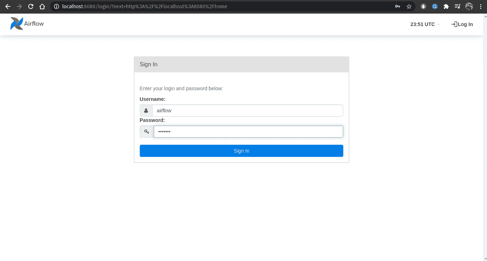

# 10 分钟后开始使用气流…

> 原文：<https://medium.com/analytics-vidhya/getting-started-with-airflow-in-10-minutes-f7c5eef8ebfc?source=collection_archive---------9----------------------->


## 带有 Docker 的 Apache Airflow 2.0.1

技术进步的激增要求更快的开发和更快的部署。这就是 CI/CD(持续集成/持续部署)渠道的切入点。但是，是什么构成了 CI/CD 管道的主干？工作流或流程编排管道！这就是气流的来源。

> 大数据带来更大的责任…

[***气流***](https://airflow.apache.org/) 是一个以编程方式创作、调度和监控工作流的平台。它是动态的、可扩展的、优雅的和可伸缩的。气流的中心思想是**有向无环图(Dag)**在**执行器** *、*的帮助下执行*任务*。现在，这个博客不是要描述气流是如何工作的，但是如果你是气流的新手，我会在这里放一个链接来解释它的概念。为了忠实于本文的标题，我将尽量保持简洁，以实现我们的目标——用 Docker 运行 Airflow 2.0。本文假设您熟悉 Docker 和 Docker-compose。好吧，如果你不熟悉 Docker，你必须设置一个气流服务器并运行，只要按照这篇文章一步一步来，我保证你会很快完成。

# 设置 Docker

1.  确保您的系统中没有以前安装的 docker。

```
$ sudo apt-get remove docker docker-engine docker.io containerd runc
```

2.更新 apt 包。

```
$ sudo apt-get update
```

3.为 apt 启用 HTTS。

```
$ sudo apt-get install apt-transport-https ca-certificates curl gnupg-agent software-properties-common
```

4.添加 docker 标识密钥。

```
$ curl -fsSL https://download.docker.com/linux/ubuntu/gpg \
  | sudo apt-key add - \
  && sudo apt-key fingerprint 0EBFCD88OK
pub rsa4096 2017-02-22 [SCEA]
9DC8 5822 9FC7 DD38 854A E2D8 8D81 803C 0EBF CD88
uid [ unknown] Docker Release (CE deb) <docker@docker.com>
sub rsa4096 2017-02-22 [S]
```

5.将稳定发布库添加到您的包管理器中

```
$ sudo add-apt-repository \
 "deb [arch=amd64] https://download.docker.com/linux/ubuntu \
 $(lsb_release -cs) \ stable"
```

6.安装最新稳定的 docker 版本

```
$ sudo apt-get update && sudo apt-get install docker-ce docker-ce-cli containerd.io
```

7.验证安装

```
$ sudo docker run hello-world
```


为了运行 hello-world 映像，它从远程存储库中获取数据。当映像不在您的系统中时，会出现这种情况。下次运行这个程序时，它将从系统中获取数据

```
$ sudo docker images
```


系统中所有 docker 图像的列表

```
$ sudo docker ps -a
```


系统中所有 docker 容器列表

10.安装 docker-compose

```
$ sudo curl -L "https://github.com/docker/compose/releases/download/1.29.1/docker-compose-$(uname -s)-$(uname -m)" -o /usr/local/bin/docker-compose$ sudo chmod +x /usr/local/bin/docker-compose
```

如果所有的步骤都进行到这一步..太棒了。我们都准备好气流设置了！

# 设置气流

我们将使用官方的 Apache Airflow docker 图像。这使用 docker-compose 来构建图像。气流不是一个独立的服务。它需要许多其他服务才能运行。所有这些服务都是 dockered 的(比如说，我刚刚创建了这个动词),您不需要显式地担心它们中的任何一个！

***我们开始吧！***

1.  创建一个文件夹调用器 **airflow-docker** 并在文件夹内移动。

```
$ mkdir airflow-docker
$ cd airflow-docker
```

2.要在 Docker Compose 上部署 Airflow，您应该获取 docker-compose.yaml 文件。

```
$ curl -LfO 'https://airflow.apache.org/docs/apache-airflow/2.0.1/docker-compose.yaml'
```


这将把 *docker-compose.yaml* 文件下载到您的目录中。让我们理解这个 docker-compose 文件的重要部分。

## 服务

这一部分是任何 docker-compose 文件中最重要的部分，它描述了运行映像所需的所有服务。

正如我们在这里看到的，有多种服务，如 **postgres** 、 **redis** 、 **airflow-webserver、airflow-scheduler、airflow-worker** 和 **airflow-init** 。

docker-compose.yaml 中的服务

对于每个服务，我们可以看到它们的属性，比如它们各自的映像名称和它们下面描述的端口。这种编写 docker-compose 的方式避免了您亲自完成所有这些任务，而 airflow-init 会为您初始化所有其他服务。首先，您可以看到气流-web 服务器与端口 8000 绑定在一起。

## 卷

这些卷应该被*安装*到 docker 容器气流路径，这样对本地文件的任何更改都可以直接复制到实际的容器气流路径文件夹中。挂载是 docker 中一个非常重要的概念，有助于保持 CI/CD 管道的有效性。

docker-compose.yaml 中的卷

3.这使我们进入下一步。正如我们所看到的，默认情况下文件夹的名称是 **dags、logs** 和 **plugins** ，我们需要在当前目录下创建这些文件夹。

```
$ mkdir dags logs plugins
```

当前文件夹结构应该如下所示:


当前文件夹结构

4.要在 Mac OS 或 Linux 中授予 root 权限，您需要运行以下命令:

```
$ echo -e "AIRFLOW_UID=$(id -u)\nAIRFLOW_GID=0" > .env
```

这将创建一个新文件。env 并把上面提到的东西写进去。

5.初始化气流

```
$ sudo docker-compose up airflow-init
```


第一次初始化气流

这需要一些时间。


一旦所有层被拉动，你将能够看到标记为*完成*的 *airflow-docker_redis_1，airflow-docker_postgres_1，airflow-docker_airflow-init_1。*

现在，使用下面的命令，您可以看到系统中的所有图像。请注意，在设置 docker 时，我们已经有了 hello-world 图像。

```
$ sudo docker images
```


我们有三个新形象:**雷迪斯**、**波斯特格里斯**和**阿帕奇/气流。**

6.启动气流

最后，我们将开始气流。这意味着我们将启动 Airflow 及其所有依赖服务，如 redis、postgres、webserver、worker 和 scheduler。

```
$ sudo docker-compose up
```


气流启动并运行

现在，要检查所有服务是否正在运行，请键入以下命令来查看所有正在运行的容器。

```
$ sudo docker ps
```


所有运行的容器

如我们所见，我们有以下容器:

*   apache/airflow:运行于 [http://localhost:8080](http://localhost:8080)
*   postgres:13
*   redis:最新

7.转到用户界面

由于我们已经在 [http://localhost:8080](http://localhost:8080) 上启动并运行了 web 服务器，只需转到该地址，您就会看到下面的屏幕



气流登录页面

在用户名和密码中输入*气流*

并点击*签到*

> 恭喜你！您已经设置并运行了您的第一台 Airflow 服务器。

您将能够看到许多已经存在的 Dag。这些是默认情况下出现在 Apache Airflow 图像中的 Dag 示例。


气流 Web 用户界面

这种设置过程之所以成为可能，是因为 docker 的美丽，与编排管道的简单性相结合。Apache Airflow 通过减少我们自己维护一切的开销，为以连续方式开发、集成和部署更大的生态系统铺平了道路。我将在以后的文章中详细讨论气流背后的概念以及如何创建你的第一个 DAG。

我希望你喜欢它。如果您在阅读本文或设置气流时遇到任何困难，请联系我。此外，请鼓掌，评论和关注我，如果你觉得这很有用，我会为大家创造更多的内容！