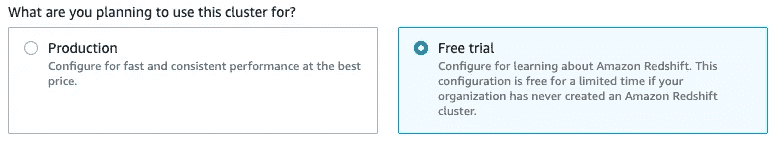
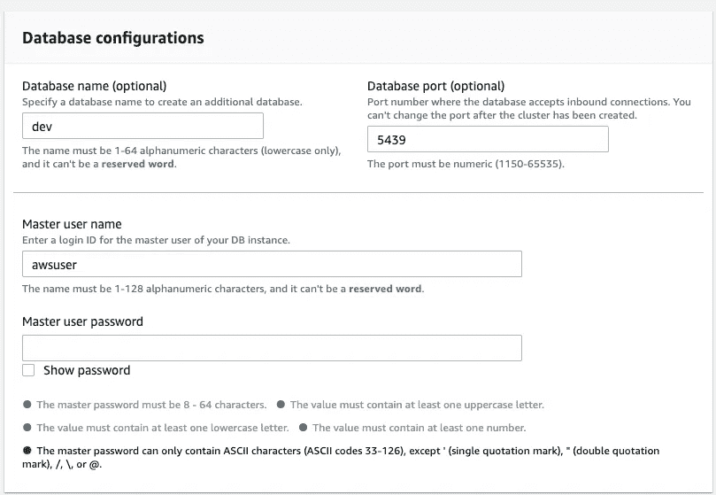
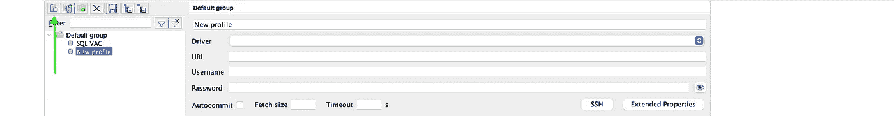

# AWS 入门—红移

> 原文：<https://medium.com/analytics-vidhya/getting-started-with-aws-redshift-43450cd6286c?source=collection_archive---------6----------------------->

约书亚·索蒂诺在 [Unsplash](https://unsplash.com?utm_source=medium&utm_medium=referral) 上拍摄的照片

在这篇博客中，我们将着重于在 AWS Redshift 上创建一个数据仓库，并从我们的本地机器上建立一个到它的连接。

注意:这个博客将涵盖创建集群和开始编写基本查询的**介绍性信息**。它旨在成为您迈向数据仓库之旅的**起点**的一站。

# 亚马逊红移

在我们开始实现之前，理解我们打算使用的技术总是一个好主意。有了这么多的数据库服务，为什么我们还需要额外的技术来完成同样的操作呢？

我很高兴你这样问，原因如下:

> Amazon Redshift 是一个完全托管的、Pb 级的数据仓库服务。— [亚马逊文档](https://docs.aws.amazon.com/redshift/latest/mgmt/welcome.html)

**完全托管**:亚马逊将其红移为由 AWS 维护的完全托管服务。这意味着我们不必担心管理集群、处理几个节点之间的查询以及 Redshift 中类似的低级任务。我们可以创建一个集群，并轻松地开始使用数据仓库。

**Pb 级**:内部数据仓库的一个主要问题是猜测我们在不久的将来可能需要的数据存储量，以避免资源利用不足/过度。借助 Amazon redshift，我们可以从一个拥有数百 GB 存储空间的小型数据仓库开始，并根据需要在计算或存储方面进行扩展。

除了这些好处，我们还获得了并行处理的优势和数据可靠性的优势，这是因为 amazon redshift 的体系结构，如果不手动提供它，我们可能无法使用 MySQL、PostgreSQL 或任何其他常见的 RDBMS，这是一个繁琐的过程。

现在我们已经了解了红移的好处，让我们开始实现吧。

1.从 AWS 控制台，我们转到**红移**主窗口。需要记住的一点是，这项服务是针对*地区*的。因此，我们可以选择希望我们的集群在哪个区域启动。

2.从红移主页点击**创建集群**。

3.在顶部输入字段**集群标识符**中，为集群命名。

4.那么从集群类型上，我们可以选择**生产** / **免费试用**。为了这个博客的目的，我们将使用免费试用。A.W.S .还根据我们选择的选项给出了估计成本。但是，根据您的帐户状态，您可能有资格免费使用 2 个月的有限时间。

5.在生产情况下，可以选择**节点类型**。节点类型取决于您的使用要求，即 ram、存储以及您可能需要的其他要求。然后，您可以选择集群中您可能需要的**数量的节点**。然而，对于免费试用，我们将获得一个带有 **1 节点**的 **dc2.large** 节点类型。

6.从**数据库配置**窗口，我们可以分配一个**数据库名称**，一个**数据库端口号**。最后，我们可以给出一个**主用户名**和**主用户密码。**将我们的本地系统连接到 AWS Redshift 时，所有这些配置都是必需的。

7.在**集群权限**窗口中，我们可以根据需要选择 **IAM 角色**。

8.我们改变和**我们需要的附加配置**。为了便于说明，我们将使用默认的。

9.点击**创建集群**。

AWS 可能需要几分钟来提供这些资源，但是一旦完成，我们就可以开始使用数据库了。

# 远程访问的配置

一旦数据库被创建并可用，我们现在就可以连接到数据库。现在，我们将从本地机器连接到数据库，但是在我们可以访问它之前，我们需要将我们的 IP 地址添加到集群使用的安全组中。如果不这样做，我们就无法访问红移数据库，最终会得到如下错误:

> 设置/关闭连接时出错:操作超时。

因此为了避免这种情况，

10.去你的红移星团。

11.点击**属性**选项卡。

12.向下滚动到**网络和安全**设置，并点击**公共访问**旁边的**编辑**

13.点击**启用**，然后**保存**更改**。**修改这些更改可能需要一些时间。

14.然后在 **VPC 安全组**下，选择您的安全组(蓝色链接)。

15.链接打开后，点击**入站规则**，然后点击**编辑入站规则。**

16.点击**添加规则**。

17.将 **Type** 设置为 **Custom TCP** (默认)， **Port range** 设置为我们在**步骤 6** ， **Source** 设置为 **My IP，**并在它右边的字段中输入***your-IP-address*/32**。

您可以在终端中使用"***ipconfig getifaddr en0 "***命令找到您的 IP 地址。

18.点击**保存规则**，现在我们可以开始了。

# **访问集群**

现在我们已经有了所有的配置集，让我们尝试使用 SQL Workbench/J 建立连接。

**注意:** SQL Workbench/J 与 MySQL Workbench 不同。

19.下载 [JDBC 驱动](https://docs.aws.amazon.com/redshift/latest/mgmt/configure-jdbc-connection.html#download-jdbc-driver)并解压。

20.下载并安装 [SQL Workbench/J](https://adoptopenjdk.net/)

21.安装 SQL 工作台。对于 mac 用户，请遵循此处给出的[步骤。](https://www.sql-workbench.eu/macos-binary.html)

22.打开 SQL Workbench，点击屏幕左下方的**管理驱动**。

23.点击**创建新条目。**

24.给司机起个**名**。

25.在库字段，点击旁边的**文件夹图标**，浏览我们下载解压的驱动。

26.从**第 19 步**浏览到解压后的文件夹表单文件夹，选择*驱动名*。jar 文件并点击**选择**。

27.点击 **OK** 将工作台连接到驱动器上。

28.现在，点击**创建一个新的连接配置文件**。

29.给配置文件命名，并从**驱动程序**下拉列表中，选择我们刚刚在**步骤 27** 中创建的驱动程序。

30.然后，从我们从 AWS 创建的集群中，复制 **JDBC URL、**和粘贴到 URL 字段中。

31.在**步骤 6 中添加集群的用户名和密码。**

32.最后，根据需要配置任何进一步的选项，为了便于说明，我们将保持 rest 为默认设置。

33.最后，点击 **OK** 连接您的集群。

如果您遵循了每一步，您现在可能连接到我们刚刚创建的红移数据库。

为了证实这一点，我们可以通过编写一个简单的查询来进行测试，比如创建一个表。

它应该执行并给出执行时间作为输出。

恭喜你！！我们终于知道如何设置我们的红移星团。接下来，我们将研究使用 python 执行一些查询，向数据库添加一些数据。

在那之前，继续摇摆。

如果你喜欢这个博客，并且想看看我关于机器学习和人工智能的其他博客，[点击这里](https://vachan15.medium.com/index-link-to-all-my-blogs-98efca323fa8)。