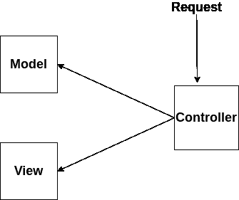
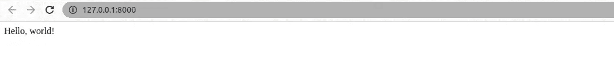

# Django 入门

> 原文：<https://medium.com/analytics-vidhya/getting-started-with-django-9a789daae5e9?source=collection_archive---------10----------------------->


克里斯托夫·高尔在 [Unsplash](https://unsplash.com?utm_source=medium&utm_medium=referral) 上拍摄的照片

**姜戈是什么？**

*   Django 是一个高级 Python Web 框架，支持快速开发安全且可维护的网站。
*   它遵循**模型视图控制器(MVC)** 设计模式。
*   Django 是为了满足快速移动的新房间期限而发明的。
*   始于 2003 年，是一个内部项目。
*   在 2005 年作为开源项目发布。

**什么是 Web 框架？**

*   web 框架是服务器端应用程序框架，旨在支持动态网站的开发。Django 是 python 可用的框架之一。

**为什么是姜戈？**

*   快的
*   安全的
*   可攀登的

**姜戈的设计理念**

*   较少代码
*   快速发展
*   不要重复自己(干)
*   功能独立

**Django 用在哪里？**

*   美国国家航空航天局
*   油管（国外视频网站）
*   拼趣
*   浏览器名
*   照片墙

**什么是模型视图控制器？**

*   MVC 是用于创建 web 应用程序的设计模式。
*   它由三部分组成。

1.**模式**:数据的存储和维护。

2.**视图**:向用户显示请求的数据部分。

3.**控制器**:调节模型和视图的交互。



**MVC 设计模式**

注意:Django 严格遵循 MVC 模式，但它有自己的实现。Django 为开发提供模型、视图和**模板**。

## **安装 Django**

*   打开终端，键入以下命令进行安装。

```
pip install Django==3.1.7 
```

*   或者，如果您想安装虚拟环境，然后使用以下命令。

```
pipenv install django
```

*   要激活项目的 virtualenv，请使用以下命令

```
pipenv shell
```

*   检查姜戈的版本

```
django-admin --version
```

*   要创建项目:

```
django-admin startproject project_name
```

*   创建 Django 应用程序

```
python manage.py startapp app_name
```

*   启动开发服务器

```
python manage.py runserver 
```

*   **让我们在 Django 创建我们的 Hello World 应用程序**

为此，我们需要更新一些文件

*   让我们从更新设置开始。py

```
INSTALLED_APPS = [
    'django.contrib.admin',
    'django.contrib.auth',
    'django.contrib.contenttypes',
    'django.contrib.sessions',
    'django.contrib.messages',
    'django.contrib.staticfiles',
    'boardsapp'
]
```

这里，我们需要用您创建的应用程序名称更新 settings.py 文件。这里我的 app 名字叫 boardsapp。

*   让我们更新视图. py

```
from django.http import HttpResponse

def index(response):
    return HttpResponse('Hello World')
```

基本上，我们在这里说，每当调用视图函数时，返回文本“Hello World”

*   现在我们需要配置我们的网址。

```
from django.contrib import admin
from django.urls import path
from helloworld import views

urlpatterns = [
    path('admin/', admin.site.urls),
    path('', views.index)
]
```

我们已经在第二行从 helloworld 导入了视图，然后为我们的应用程序创建了新的 url 模式。

我们现在已经有了所有需要的代码。为了确认一切正常，重启 Django 服务器:

```
 python manage.py runserver
```

如果你刷新浏览器的 [http://127.0.0.1:8000/](http://127.0.0.1:8000/) ，它现在会显示文本“Hello，world！”



这篇文章将让您快速了解 Django。感谢您的阅读。请尝试一下，玩得开心并分享您的反馈！


由[考特尼·海杰](https://unsplash.com/@cmhedger?utm_source=medium&utm_medium=referral)在 [Unsplash](https://unsplash.com?utm_source=medium&utm_medium=referral) 上拍摄的照片