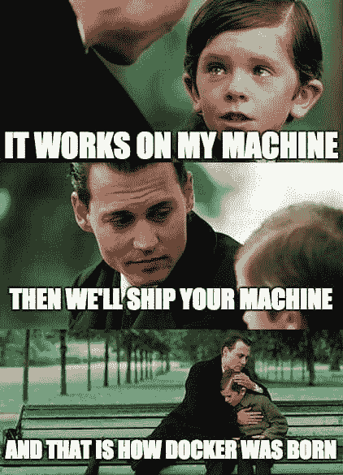
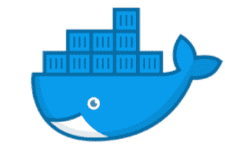
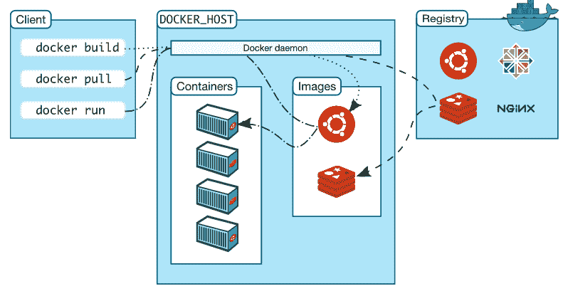

# Docker 入门

> 原文：<https://medium.com/analytics-vidhya/getting-started-with-docker-e8b62122884?source=collection_archive---------7----------------------->

应用程序运行业务。它们变得如此重要，以至于很难想象一个跨国公司在没有应用程序的情况下，其所有客户和员工都分散在不同的地方。

应用程序运行在服务器上。在 2000 年代中期，我们通常在一台服务器上运行一个物理应用。因此，如果企业需要新的应用程序(考虑到所有企业都在扩张，这是非常可能的)，他们将不得不购买新的服务器，并且必须投资与其相关的巨额成本，如电力、冷却等。预先确定服务器的大小和速度是非常不可预测的，说实话，没有人知道这一点。

让我们回想一下 2000 年代，如果一家公司必须为即将推出的新应用程序购买新服务器，显然它绝不会想让客户和公司的声誉受到影响，因此，它不会在所需的服务器上妥协。但是，这将导致服务器仅利用 5–10%的服务器能力，从而导致大量超负荷运行。这明显是浪费公司的资金！

因此，引入了虚拟化的概念。它使 tones 的应用程序运行在同一个物理服务器上！因此，每次启动新的应用程序时，我们都不需要新的服务器！我们可以把新的应用程序放在现有的服务器上。将虚拟机视为物理服务器硬件的一部分。因此，每个都有一部分 CPU、内存和物理服务器磁盘空间。每个虚拟机都必须分配一个操作系统和**来运行**，它消耗的资源与上面提到的相同。对于每个操作系统，我们都必须承担与操作系统许可证、安全性、更新等相关的成本。

# 容器

如前所述，Hyper-V、KVM 和 Xen 等虚拟机管理程序对系统的要求非常高，而另一方面，容器利用操作系统。因此，它们在系统资源方面效率极高。

*集装箱 vs 虚拟机*

容器非常类似于虚拟机，但是有一个重大的变化！**主机操作系统。**如上图所示，操作系统“窃取”的资源现在已经得到处理。有了一个完美调优的容器系统，您可以拥有 4 到 6 倍于在相同硬件上使用 Xen 或 KVM 虚拟机的服务器应用程序实例数量。

它还有助于快速、一致地交付您的应用程序，因为容器非常适合持续集成和持续交付工作流。Docker 容器可以在开发人员的本地桌面、数据中心的物理或虚拟机、云提供商或混合环境中运行。哇，不用再抱怨在不同的设置上运行相同的代码时版本不匹配了！

“…但它在我的机器上工作！”是我们在开发环境中经常听到的。当代码中断时，避免这种情况的解决方案是引入一个名为“容器”的蓝筹解决方案，它将所有依赖项打包(因此是平台独立的)。

# 码头工人

Docker 是一个软件平台，供开发人员和系统管理员使用容器(通过容器化)开发、部署和运行应用程序。

码头工人

为了更好地解释这个定义，我们必须考虑什么是容器。一个*容器*使用共享操作系统提供了一个轻量级的执行环境，但是在一个与主机上所有其他进程隔离的环境中运行。它源于它的蓝图——码头工人形象！

*Docker image* 作为一组写在 YAML 文件中的指令来构建容器。当我们建造集装箱时，它是一个起点。

整个过程如下所示。

*客户端、Docker 主机和注册表如何交互*

Docker 客户端是 Docker 用户与 Docker 交互的主要方式。当一个命令运行时，它被发送到负责执行它们的 *Docker 守护进程*。 *Docker 注册表*与 GitHub 非常相似。docker 注册表用于存储用户可以从中提取和运行容器的图像。虽然我们可以有自己的私有注册中心，但 Docker hub 是一个公共注册中心，Docker 的配置方式是，当命令运行时，它会默认自动查看 Docker Hub。