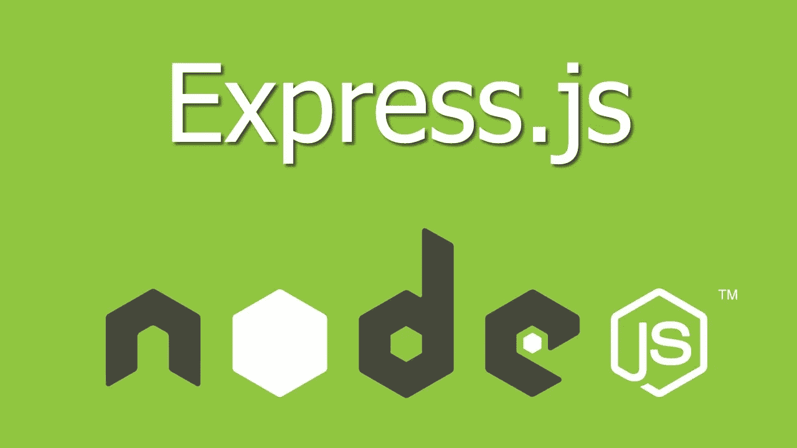

# Express.js 入门

> 原文：<https://medium.com/analytics-vidhya/getting-started-with-express-js-58e2f309916d?source=collection_archive---------23----------------------->

图片来源:谷歌图片

Express 是一个 Node.js 框架，具有一系列特性，让您在创建 web 和移动应用程序时体验愉悦。在这篇博客中，我将谈论使用 Express 来创建 web 应用程序。

## 先决条件:

1.  基本的 JavaScript 理解。
2.  一定是知道 Node.js

# **我们开始吧**