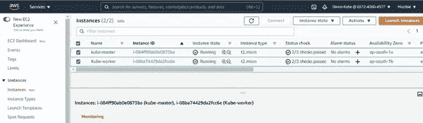
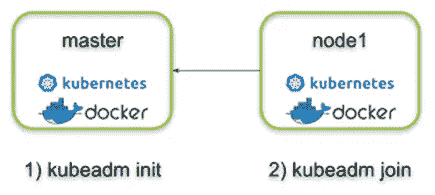
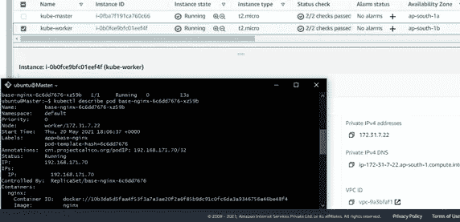

# KUBERNETES 入门

> 原文：<https://medium.com/analytics-vidhya/getting-started-with-kubernetes-f64471da5aa3?source=collection_archive---------14----------------------->

## **什么是 KUBERNETES？**

在我们进入 Kubernetes 及其有用性之前，有必要熟悉两个概念:不可变的基础设施和容器。

**不可变的基础设施**是一种实践，其中服务器一旦被部署，就永远不会被修改。如果需要更改，不要直接在服务器上进行。相反，您将从一个基本映像构建一个新的服务器，其中包含了您需要的所有更改。这样，我们可以简单地用新服务器替换旧服务器，而无需任何额外的修改。

**容器**提供了一种打包代码、运行时、系统工具、系统库和配置的方法。这个版本是一个轻量级的独立可执行文件。这样，无论你的应用程序在哪里运行，它的行为都是一样的。).集装箱化并不是一个新概念，但随着微服务和 Docker 的兴起，它变得非常流行。

有了这些概念，我们现在就能够将 **Kubernetes** 描述为协调计算、网络和存储基础设施工作负载的容器或微服务平台。您可以定义您的应用程序应该如何运行，以及它们应该与其他应用程序或外部世界交互的方式。您可以扩大或缩小您的服务，执行平滑的滚动更新，并在不同版本的应用程序之间切换流量，以测试功能或回滚有问题的部署。Kubernetes 提供了接口和可组合平台原语，允许您以高度的灵活性、功能和可靠性来定义和管理您的应用程序。

## **目标**

前一段时间，我在 Docker Swarm 上工作，这是一个很棒的工具，它通过创建一个 Docker 主机集群，指数级地增加了 Docker 的功能。类似地，Kubernetes 是 Google 创建的一个开源平台，用于容器部署操作、扩展和缩减，以及跨主机集群的自动化。

尽管这两个开源编排平台提供了许多相同的功能，但这两个平台的操作方式还是有一些基本的区别。

因此，我在这里整合或讨论使用 Kubernetes 创建和部署服务的步骤，以方便像我一样的其他极客访问。你可以看看我的另一个博客，我在那里讨论过[*Docker Swarm*](/analytics-vidhya/docker-swarm-creating-deploying-services-a0da071339d3)*。*

## **步骤 1:安装 kubenetes**

安装 Kubernetes 的方法有很多。本练习中使用的 Kubeadm 是安装 Kubernetes 的一般方法。它可以在各种公共云和私有云上使用。但是，它也可以在裸机上使用。 **Minikube** 是一种安装 Kubernetes 的虚拟化方法。 **Kops** 是在亚马逊网络服务上安装 Kubernetes 的工具。kops 实用程序为 Kubernetes 实施了许多企业标准。比如处理器、实例大小。所以，我们不能利用 kops 的自由层。Kops 也利用了其他 AWS 资源，Kubernetes 用于 Google 云平台。因此，有一个在 Google Cloud 上安装 Kubernetes 的工具。

在这篇博客中，我们将看看在 Amazon Web Services 上安装 Kubernetes，而不是用 Kops。因此，我们能够使用 AWS 自由层。在这些步骤中，可以在任何环境下工作，AWS、Azure、Google Cloud、裸机等等。

因此，我们将从 AWS 控制台开始，我们将启动实例。我们将创建两个实例，一个名为 *Kube-Master* 和 *Kube-Worker* 。我们将选择 Ubuntu server 18.04 LTS，64 位，并选择 t2.micro 实例，这实际上不在 Kubernetes 的要求范围内，但可以使用。

EC2 实例

如您所见，我们的实例现在已经就绪！

现在，当我们准备好连接时，我们将选择每个实例，单击“连接”，我们将有机会进行连接。

有多种方法可以连接到实例。我们将使用 Git Bash 进行连接。因此，请查阅文档，但也有其他连接方式。我所做的是，我只是改变了主节点和工作节点的主机名。这样，我们可以很容易地将它们区分开来。

/*etc*/*hostname*是存储节点名称的目录。使用，

> vim /etc/hostname

对目录进行更改。我们现在将安装 kubeadm。

遵循这些命令并在主服务器和工作服务器上执行它们，如果您已经使用另一个用户登录，那么我们可以使用下面的命令切换到根用户: *sudo su*

> sudo apt-get 更新
> 
> sudo apt-get 安装 docker.io
> 
> sudo apt-get install-y apt-transport-https ca-certificates curl
> 
> sudo curl-fsSLo/usr/share/keyrings/kubernetes-archive-keyring . gpg https://packages.cloud.google.com/apt/doc/apt-key.gpg
> 
> echo " deb[signed-by =/usr/share/keyrings/kubernetes-archive-keyring . gpg]https://apt.kubernetes.io/·库伯内特-xenial main " | sudo tee/etc/apt/sources . list . d/kubernetes . list
> 
> sudo apt-get 更新
> 
> sudo apt-get install-y kube let kube ADM kube CTL
> 
> sudo apt-mark hold kube let kube ADM kube CTL

在主节点和工作节点上安装 kubeadm

## **步骤 2:初始化集群**

现在，我们将初始化集群，然后我们将在主节点上运行大部分内容。

有一点很重要，我们必须回到控制台，获取主节点的私有 IP 地址。因此，我们将选择我们的主节点，并在描述下，我们将获得私有 IP。

复制主节点的私有 IPv4 地址

下面是我们将用于初始化的命令:

> kube ADM init—-API server-advertise-address =<private_instance_ip>—-pod-network-CIDR =</private_instance_ip>

你可以看到我们传入的参数。因为我们将要使用的网络插件，我们有一些特定的参数。

飞行前检查失败

由于我们使用的是自由层，我们将无法通过飞行前检查，即飞行前状态。因此，我们要做的是，抑制这些错误和警告。我们将传递这个标志来抑制 CPU 数量和内存限制错误，

> --忽略-预检-错误=<parameters></parameters>

通过飞行前检查

初始化完成

如果集群初始化成功，我们将看到一个集群加入命令。worker 节点将使用这个命令来加入 Kubernetes 集群，因此复制这个命令并保存起来以供将来使用。要开始使用集群，我们必须在主节点上设置环境变量。

要在主节点上临时设置环境变量，请运行以下命令:

> mkdir -p $HOME/。库贝
> 
> sudo CP-I/etc/kubernetes/admin . conf $ HOME/。kube/配置
> 
> sudo chown $(id -u):$(id -g) $HOME/。kube/配置

或者，如果您是 root 用户，您可以运行:

> 导出 kube config =/etc/kubernetes/admin . conf

## **步骤 3:将 worker 节点加入 kubernetes 集群**

SSH 进入 Worker 节点，并在该节点上运行 kubeadm init 生成的命令。

节点已加入群集

在创建集群并加入工作节点之后，我们必须确保一切都正常工作。要查看和验证集群状态，我们可以在主节点上使用 kubectl 命令

***ku bectl get Nodes****查看我们的节点(master 和 worker)的状态是否准备好。*

**

*我们得到这个“未就绪”状态。我们得到这个未就绪状态的原因是因为我们还没有安装我们的网络插件。*

*可以部署多种网络接口。对于这个简单的例子，我使用了印花布。只需从您的一个节点应用这个清单。*

> **库贝克特尔应用-f https://docs.projectcalico.org/v3.9/manifests/calico.yaml**

*再次运行 kubectl get nodes。*

**

*然后我们可以看到 pod 现在已经“就绪”。*

## ***步骤 4:测试 kubernetes 集群***

*现在我们已经有了一个集群，让我们看看 Kubernetes 提供的一些特性。*

*让我们部署一个应用程序。Nginx 是 Kubernetes 的学习应用之一。对于这个练习来说，没问题。nginx 是测试应用程序之一，它是一个 web 服务器。因此，我们要做的是为 nginx 创建一个部署。*

*我们将调用部署基础——nginx，使用*

> *创建部署— —图片<>*

*在本例中，映像名是 nginx，我们的部署名是 base-nginx。然后创建一个部署。*

*运行一个命令来获取 pod:***ku bectl get pods***，我们可以看到到目前为止我们有一个 pod 在运行。*

**

*我们还可以描述 pod 以列出详细信息，包括 pod 运行的节点。因此，当我们运行此命令时，我们将选择列出的一个单元。我们实际上可以看到 pod 正在工作节点上运行，因为我们将看到工作节点的私有 IP 地址。*

**

*在工作节点上运行的 Pod*

*为了访问应用程序，我们需要一个服务。服务是用户和运行端口之间的附加抽象层。因此，我们将使用服务来公开部署，在本例中，它的类型是 **NodePort** 。所以，我们需要输入*

> *kubectl 创建服务节点端口*

*这就是服务的类型。这是将您的服务公开为可在集群外部访问的最基本选项，在集群中每个节点上的特定端口(称为节点端口)上。*

*让服务名称与您的部署名称相同是一个很好的做法，我们会说— TCP，公开端口，然后是执行端口，因为 nginx 有一个端口 80，它也在端口 80 上运行。所以，我们想公开 80，这个应用程序运行在端口 80 上。*

*这里我们可以看到 kubectl 创建了 NodePort 类型的服务。服务名是 base-nginx，我们在这里可以看到——TCP 暴露端口和执行端口。您可以在这里看到，获得部署，我们看到部署名称，我们希望服务具有相同的名称，因此我们可以在这里看到我们在这里运行命令。*

**

*同样，我们想要做的是，我们还想要获取我们的应用程序映射到的端口。如果我们运行前面运行过的命令 kubectl get services，我们可以找到我们的服务，并且可以查看我们的端口映射。*

*现在，我们想建立一个网址。URL 将是节点的公共 IP 地址或公共 DNS 名称、冒号和端口，即我们刚刚看到的服务端口，即映射端口。在本例中，端口是 30462。*

*我们把网址放在浏览器中，我们可以看到 nginx 的主页。所以，这是我们的工人节点用完了。您可以对工作节点的公共 DNS 名称做同样的事情，我们可以在第页看到 ngnix。*

**

*使用公共 DNS 名称*

**

*使用公共 IP*

*Kubernetes 的一大好处是它可以自我修复或自我康复。如果我们删除一个 pod 或一个复制副本，将会模拟 pod 丢失或复制副本故障。所以，我们会运行命令，**再次得到吊舱**。然后，我们将**运行 kubectl delete pod** 并传递完整的 pod 名称。*

**

*自愈*

*如果我们运行 *kubectl get pods* ，我们将在这里看到清单，并注意到我们在那里有了一个新的 pod 名称。我们失去了一个分离舱，但现在我们有了一个新的复制品。它是自动提出来的。*

## ***结论***

*这样，我们成功地在 AWS 上的单一主 Kubernetes 集群上配置和部署了 NGINX。我们还研究了 kubernetes 的一个主要特征，即自愈能力。*

*Kubeadm 是一种替代方法，但在 AWS 上仍然推荐 kops。Kubeadm 建立了一个最小可行的集群，但是不能提供您的基础设施，这是与 kops 的主要区别之一。另一个不同之处是 Kubeadm 不仅可以用作安装程序，还可以用作构建块。*

**为改进和提高的范围提供您的宝贵反馈。**