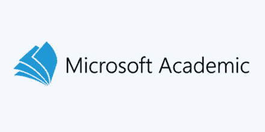
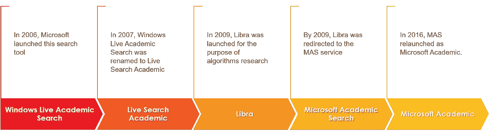
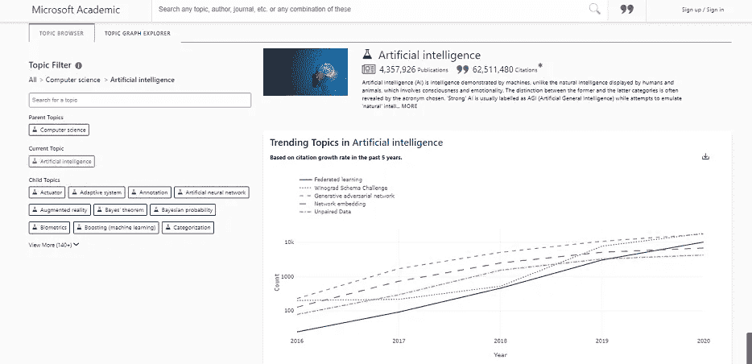
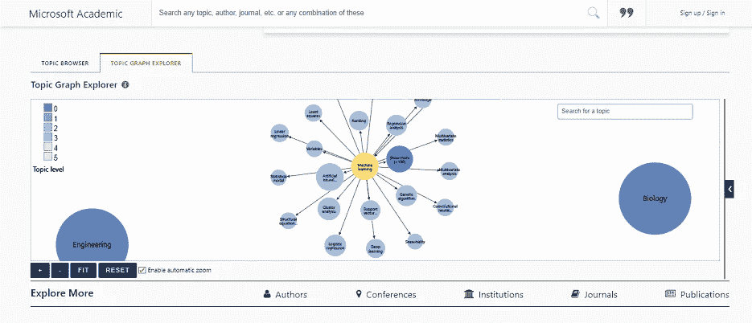
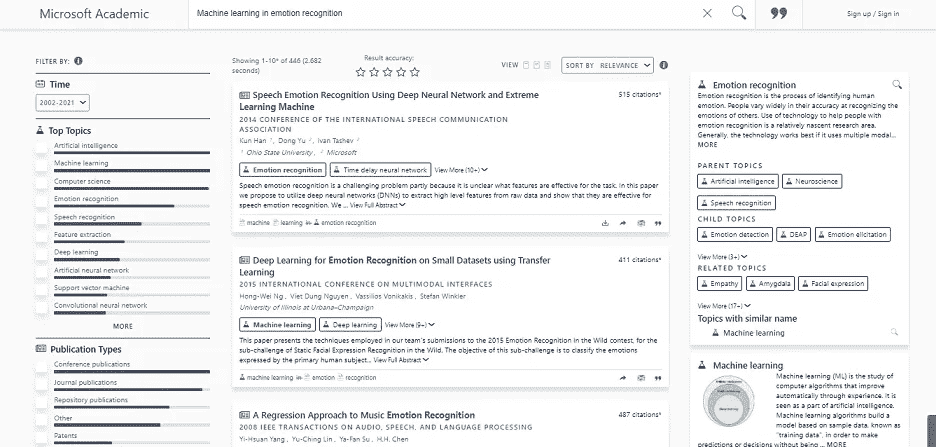
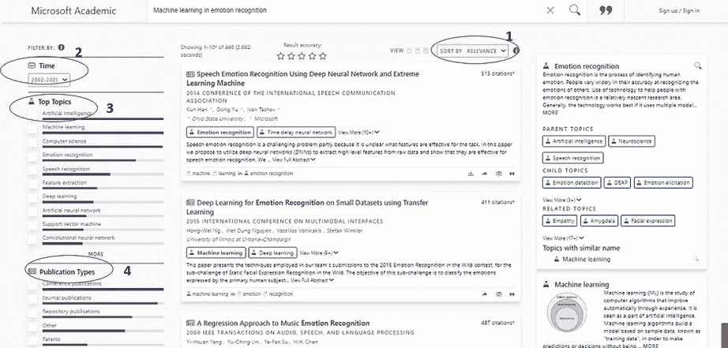

# Microsoft Academic 入门

> 原文：<https://medium.com/analytics-vidhya/getting-started-with-microsoft-academic-fbf999695006?source=collection_archive---------14----------------------->

一步一步的指导初学者了解搜索工具，并开始使用它。

图片提供:[链接](https://www.google.com/url?sa=i&url=https%3A%2F%2Fwww.gjphm.org%2Findex.php%2Fgjphm%2Fannouncement%2Fview%2F7&psig=AOvVaw29g52ux6sPnIj89WxC_fga&ust=1614286207633000&source=images&cd=vfe&ved=0CAIQjRxqFwoTCLCszq2zg-8CFQAAAAAdAAAAABAD)

## 什么是微软学术

这是一个免费的公开的学术搜索引擎，由微软研究院开发。

图 1:自 2006 年以来的微软学术时间轴

在撰写本文时，这个搜索引擎中有 4527 个会议、251，367，233 个出版物和大约 49002 个期刊。我建议你访问微软[学院的](https://academic.microsoft.com/home)网站，看看指标(可能与我上面提到的有所不同)。

## 让我们开始吧:热门话题

作为一名好奇的 CS 学生，我总是喜欢以最快的方式了解当前的主题或研究领域。在 Microsoft Academics 中，*Topics*[*Analytics*](https://academic.microsoft.com/topics/)*提供了所有*主题(艺术、生物、化学、商业、医学等等)中的趋势主题的整洁和清晰的可视化。).通过使用适当的过滤器，你可以理解你感兴趣领域的主题。**

**关于主题[分析](https://academic.microsoft.com/topics/)有两个有趣的标签:**

1.  ****主题浏览器**:包含选择或搜索主题(或子主题)的选项，结果将是一个带有必要信息的易于理解的图表。比如题目是*计算机科学*，子题目是*人工智能*(图 [2](https://cdn-images-1.medium.com/max/720/1*PzZSL9ensxzW0N2TcR5SGg.png) )。您可以使用图表右上角的 download 按钮轻松下载 CSV 文件，进行自己的操作。**
2.  ****主题图浏览器**:这允许可视化导航到主题图。主题层次用颜色编码，节点的大小表示出版物的数量。搜索一个你感兴趣的主题，你会发现一大群与你感兴趣的主题相关的领域(图 [3](https://cdn-images-1.medium.com/max/800/1*vIp5T5kpXE6EAxwYtrlOVA.png) )。单击节点以进一步展开它。**

****

**图 2:人工智能的热门话题(查询日期- 25.02.2021)**

****

**图 3:机器学习中的趋势领域(查询日期- 25.02.2021)**

**花些时间去理解这种强大的可视化的重要性。**

**两个选项卡的底部页面包含更多信息，如*作者、会议、机构、期刊、出版物*，以提供趋势主题的整体视图。在一把伞下提供如此大量的信息是令人惊奇的。**

## **查找具体的调查研究**

**虽然上述过滤器非常有助于深入了解某个领域中研究主题的总体趋势，但您可能希望搜索特定的研究并独立获取有关单个研究的信息。你可以通过在顶部搜索栏搜索非常特殊和独特的关键词来做到这一点(你也可以得到建议)。**

****

**图 4:微软学术网站“情感识别中的机器学习”的搜索结果**

**在结果页面上(图 [4](https://cdn-images-1.medium.com/max/800/1*SKGqeZ2MM5CeCxxDtVxBBQ.png) ，您可以检索每个研究/检查的大量信息，如-**

1.  **引用次数**
2.  **出版年份**
3.  **作者**
4.  **出版商和期刊**
5.  **摘要**
6.  **下载论文的选项(不适用于所有论文)**
7.  **将出版物添加到阅读列表中(供以后学习)**
8.  **将论文添加到引用列表中，以便日后查阅或在您的研究工作中引用。**

**这些信息有助于您决定是否要进一步分析论文。它也让你了解正在考虑的主题。**

## **Microsoft 学术筛选器**

****

**图 5:各种微软学术过滤器**

1.  *****对搜索结果进行排序:*** 默认情况下，搜索结果按照相关性的顺序显示。但是你可以根据其他标准对搜索结果进行排序，比如显著性(匹配查询的每个结果的影响力的量度)，最新的优先，最早的优先，最有价值的引用**
2.  *****时间:*** 假设你希望做某个题目的年度回顾。时间过滤器帮助您进行查询，并将结果集减少到与提到的年份或年份范围相匹配的项目。**
3.  *****热门话题:*** 您搜索的研究可能属于许多“热门话题”，包括许多与您搜索的话题相关的孤立领域。它还在顶部显示最相关和最受欢迎的内容，帮助您进一步了解它的受欢迎程度。**
4.  *****出版物类型:*** 另一个重要的过滤器，允许用户从许多出版物类型中进行选择，如会议出版物、期刊出版物、知识库出版物、专利、论文、书籍、书籍章节。**
5.  *****顶级作者:*** 这显示了在你刚刚搜索的领域做出最大贡献的作者。您可以选择前一位或多位作者，只查看他们的作品。**
6.  *****热门期刊:*** 所有热门期刊，其中发表了与您的搜索主题相关的论文/研究，都显示在这里，高度热门位于顶部。由此，一个人可以理解杂志的目标。在研究领域，这是一条非常重要的信息，也就是你希望发表论文的期刊。从列表中选择一个或两个期刊，以查看在这些期刊中发表的所有工作。**
7.  *****排名靠前的机构:*** 对你要搜索的主题贡献最大的机构会在这里列出。**
8.  *****顶级会议:*** 如果您希望查看发表研究论文的顶级学术会议，您可以使用此过滤器。您可以检查您希望参加的会议，并观察会议接受的论文模式。同样，像所有其他过滤器，这是一个非常方便的方式来减少搜索和节省时间吨。**

## **快速回顾**

**在这篇博客中，我们讨论了使用微软学术软件的一些好处**

1.  **优秀过滤器的可用性(顶级研究所、作者、会议、主题、出版物类型)**
2.  **相关信息以统一的格式显示在一页上。**
3.  **非常愉快的可视化使用只需点击。它是用户友好的。**
4.  **能够轻松找到许多热门领域的热门话题**

## **结论**

**这个博客让我们深入了解微软的学术。提供了各种过滤器，允许用户根据需求减少搜索集和查询。**

**此外，请注意，为了本文的简洁和篇幅，我没有包括许多其他特性。这个博客旨在帮助你理解这个平台，并以一种建设性的方式开始使用它。**

**还有，你可以在 [Twitter](https://twitter.com/SwatiRajwal) 和 [LinkedIn](https://www.linkedin.com/in/swati-r-84682b12b/) 上问我一个问题！**

## **谢谢你。**