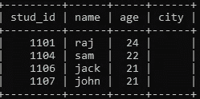

# MySQL 入门

> 原文：<https://medium.com/analytics-vidhya/getting-started-with-mysql-d6d8c99550aa?source=collection_archive---------7----------------------->


MySQL 是基于 SQL —结构化查询语言的开源关系数据库管理系统。该应用程序**被**用于多种用途，包括数据仓库、电子商务和日志应用。然而，最常见的**对 **MySQL** 的使用**是为了一个网络数据库。

# **数据库**

## 显示

要查看所有现有的数据库，您可以使用以下语法

```
show databases;
```


## 创造

我们可以在 MySQL 中使用以下语法的 **CREATE DATABASE** 语句创建一个新的数据库:

```
create database db_name;
```


创建新数据库后

## **删除**

要删除数据库，我们可以使用下面的语法

```
drop database db_name;
```


删除数据库后

## 挑选

要选择一个数据库，我们必须使用“使用”关键字，然后它将返回一个声明“数据库已更改”

```
use studentdb;
```

# 桌子

表格用于以行和列的形式组织数据，并用于以结构格式存储和显示记录。它类似于电子表格应用程序中的工作表。

## 创造

为了创建一个表，我们必须通过指定列和列要存储的数据类型来创建它。

```
create table student_table(stud_id int NOT NULL AUTO_INCREMENT,name varchar(30) NOT NULL,age int NOT NULL,PRIMARY KEY(stud_id));
```

这里，自动递增用于指定 id，它将自动递增，它也是主键，这意味着在该列中不能有任何重复的值。

## 形容

为了知道表的列的信息和数据类型，我们使用 describe 关键字。

```
Describe student_table;
```


## 视角

像数据库一样，我们也可以使用 show tables 命令来查看表，这里唯一的表是 student_table。

```
show tables;
```

## **插入记录**

我们可以使用 insert into 命令将任何记录插入到数据库中，值的数据类型应该与列的数据类型相匹配。

我们也可以一次插入许多值，语法如下。

```
insert into student_table(stud_id,name,age)values (1101,'tom',23);#multiple valuesinsert into student_table values(1104,'sam',22),(1106,'jack',21),(1107,'john',21);
```

## **查看记录**

为了查看我们插入的记录，我们可以使用下面给出的命令。

```
select * from student_table;
```


## **更换**

为了替换任何记录，我们必须使用 where 子句

```
update student_tableset age = 24,name = 'raj'where stud_id = 1101;
```


更换后

## **删除记录**

我们可以删除单行或整个表格，或者使用下面的命令限制顺序。

```
delete from student_table where id=1102;#single rowdelete from student_table;#entire tabledelete from student_table order by stud_id limit 2; #limiting
```

## **选择列**

用于选择整个表格

```
select * from student_table;
```

特定的行和列意味着使用 where 子句进行筛选。

```
select name,age from student_table;
```


## **添加新列**

我们可以使用 alter 关键字同时添加一列或多列。

```
alter table student_table add column city varchar(30) NOT NULL;alter table student_tableadd column stud_class varchar(30) default null after age,add column stud_marks int default null after age;
```


添加新列后

## **删除一列:**

这里我们从表中删除了 stud_marks 和 stud_class。

```
alter table student_tabledrop column stud_marks,drop column stud_city;
```



删除列后

# 索引

**索引**用于快速定位数据，而不必在每次访问**数据库**表时搜索**数据库**表中的每一行。**索引**可以使用**数据库**表的一列或多列来创建，为快速随机查找和高效访问有序记录提供基础。

有两种类型的索引——聚集索引和非聚集索引

```
create index stud_index ON student_table(stud_name);
```

# **分组依据:**

Group by 语句用于对具有相同值的行进行分组。它通常与聚合函数一起使用，例如:AVG()、MAX()、COUNT()、MIN()等。关于 group by 子句需要记住的一点是，元组是根据元组属性值之间的相似性进行分组的。

```
select name,count(age) as n_age from student_table GROUP By name;
```


```
select count(name),stud_id from student_table GROUP BY stud_id;
```


# **排序依据**

Order by 关键字按升序或降序对结果集进行排序。默认情况下，该子句按升序对结果集进行排序。为了对结果集进行降序排序，使用了 DESC 关键字。

```
select stud_id,name from student_table order by age asc;
```


```
select stud_id,name,age from student_table where stud_id>1103 order by age desc;
```


# **重复密钥更新时插入**

在**重复键更新**上的插入是 **MySQL 对 SQL 标准的插入语句的**扩展。当您向表中插入新行时，如果该行在唯一索引或主键中导致**重复**， **MySQL** 将发出错误。如果使用现有行的当前值更新现有行，则受影响的行数为 0。