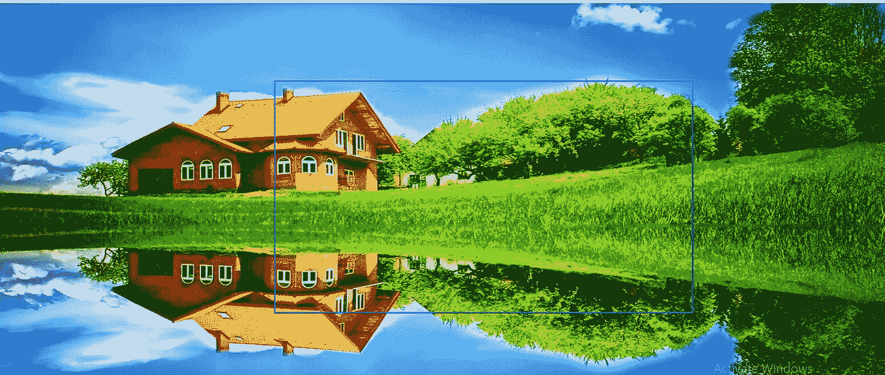

# OpenCV 入门

> 原文：<https://medium.com/analytics-vidhya/getting-started-with-opencv-90846451da51?source=collection_archive---------18----------------------->

在这篇博客中，我将写一篇关于 OpenCV 的简介，它可以用在哪里，如何开始使用 OpenCV，用它对图像的不同操作等等。我还将分享我的 jupyter 笔记本的链接，您可以在那里参考。


# **OpenCV 是什么？**

OpenCV 是一个 Python 库，旨在解决计算机视觉问题。OpenCV 最初是由英特尔在 1999 年开发的，但后来得到了 Willow Garage 的支持。

OpenCV 支持多种编程语言，如 C++、Python、Java 等。支持多种平台，包括 Windows、Linux 和 MacOS。

OpenCV Python 只不过是用于 Python 的原始 C++库的包装类。使用这种方法，所有 OpenCV 数组结构都可以与 NumPy 数组相互转换。

这使得它更容易与其他使用 NumPy 的库集成。比如 SciPy、Matplotlib 等库。


在本教程中，我们将介绍 OpenCV 在 Mac、Windows 和 Linux 上的安装、图像操作、图像算法、图像平滑和使用 OpenCV 的几何变换。所以事不宜迟，我们开始吧。

# 装置

**注意**:由于我们将在 Python 语言中使用 OpenCV，这意味着您已经在您的工作站上安装了 Python(版本 3)。根据您的操作系统，执行以下命令之一在您的系统上安装 OpenCV 库:

**窗户**

```
$ pip install opencv-python
```

**MacOS**

```
$ brew install opencv3 --with-contrib --with-python3
```

**Linux**

```
$ sudo apt-get install libopencv-dev python-opencv 
```

# **本博客将涵盖以下主题:**

1.  读取图像
2.  提取像素的 RGB 值
3.  提取感兴趣区域(ROI)
4.  调整图像大小
5.  旋转图像
6.  画一个矩形
7.  显示文本


# **原始图像**

这是我们将在整个博客过程中处理的原始图像。

让我们从使用 OpenCV 读取图像的简单任务开始。

# **读取图像-**


# **提取像素的 RGB 值-**


# **提取感兴趣区域(ROI)——**


**运行上面的查询**后，输出图像如下所示

# **调整图像大小-**


**由于窗口大小的原因，捕获的屏幕截图不是完整的图像，但是当您运行它时，您将看到完整的缩小图像**

这种方法的问题是不能保持图像的纵横比。所以我们需要做一些额外的工作来保持一个合适的纵横比。


# **旋转图像-**


一幅图像被大屏幕拍摄无法捕捉整个图像。你可以随时访问我的 jupyter 笔记本，链接如下。

旋转图像需要很多步骤。所以，我来详细解释一下。

这里使用的两个主要功能是

*   getRotationMatrix2D()
*   瓦尔帕芬

**getrotationmatrix 2d()**
它需要 3 个参数

*   **中心** —图像的中心坐标
*   **角度** —图像应该旋转的角度(以度为单位)
*   **比例** —比例因子

它返回一个 2*3 的矩阵，由从 alpha 和 beta 得到的值组成
alpha = scale * cos(angle)
beta = scale * sine(angle)


**沃帕芬()**

函数 warpAffine 使用旋转矩阵变换源图像:

```
dst(x, y) = src(M11X + M12Y + M13, M21X + M22Y + M23)
```

这里 M 是旋转矩阵，如上所述。
它计算图像的新 x，y 坐标并进行转换。

# **绘制矩形-**

这是一个就地操作。

```
# We are copying the original image, as it is an in-place operation.output **=** image.copy()# Using the rectangle() function to create a rectangle.rectangle **=** cv2.rectangle(output, (1500, 900),(600, 400), (255, 0, 0), 2)#Displaying Imagecv2_imshow(rectangle)
```



它需要 5 个参数-

*   图像
*   左上角坐标
*   右下角坐标
*   颜色(BGR 格式)
*   线条宽度

# **显示文本-**

这也是一种就地操作

```
# Copying the original imageoutput = image.copy()# Adding the text using putText() functiontext = cv2.putText(output, 'OpenCV', (500, 300),cv2.FONT_HERSHEY_SIMPLEX, 4, (0, 0, 0), 2)#Displaying Imagecv2_imshow(text)
```


关于 OpenCV 的更多信息和操作，您可以随时访问下面的网站。

[](https://opencv-python-tutroals.readthedocs.io/en/latest/py_tutorials/py_core/py_table_of_contents_core/py_table_of_contents_core.html) [## 核心操作- OpenCV-Python 教程 1 文档

### 编辑描述

opencv-python-tutro als . readthedocs . io](https://opencv-python-tutroals.readthedocs.io/en/latest/py_tutorials/py_core/py_table_of_contents_core/py_table_of_contents_core.html) 

这是我的笔记本，你可以查一下参考资料。

[](https://github.com/Shag10/Machine-Learning/blob/master/Internity_Internship/Day-5/OpenCV.ipynb) [## shag 10/机器学习

### 这个库包含机器学习算法的基础。基于监督学习的算法…

github.com](https://github.com/Shag10/Machine-Learning/blob/master/Internity_Internship/Day-5/OpenCV.ipynb) 

我试图为初学者提供 OpenCv 的所有重要信息。 **希望你能在这里找到有用的东西。谢谢你一直读到最后。如果你喜欢我的博客，请点击下面的按钮。让我知道我的博客是否真的有用。**