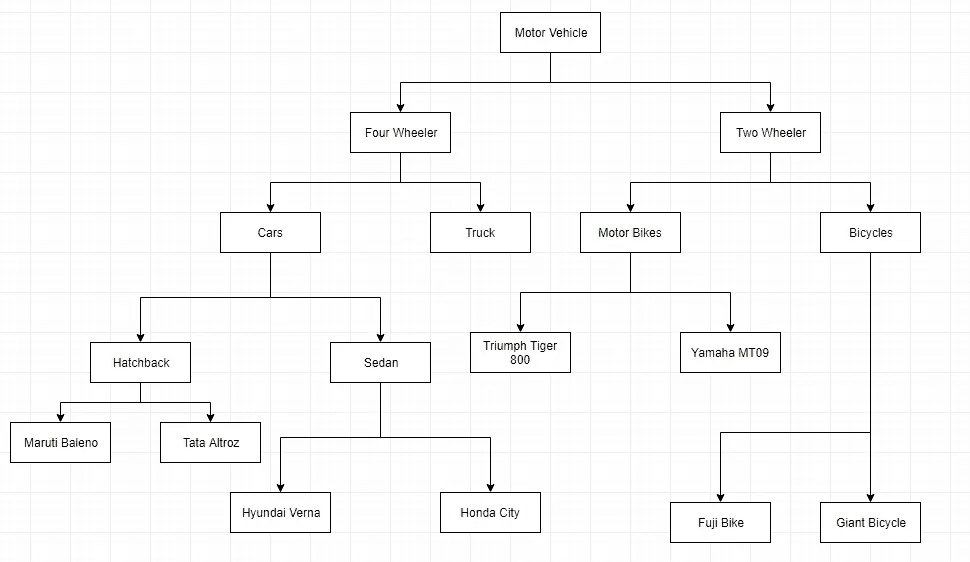
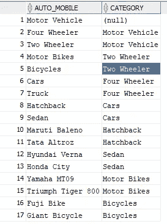
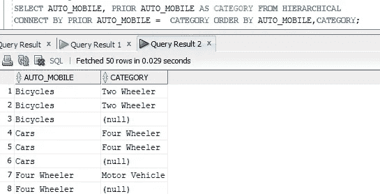
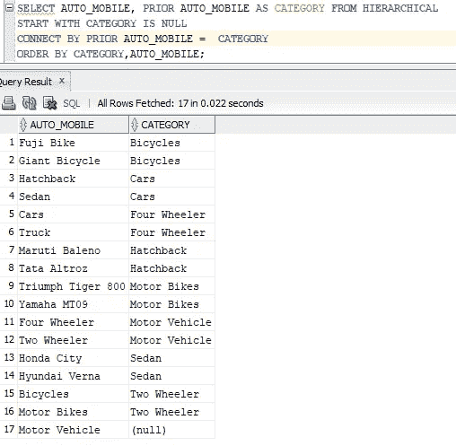
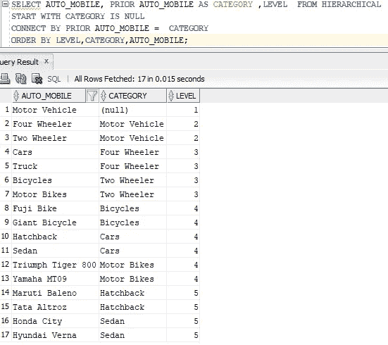

# Oracle 分层查询入门

> 原文：<https://medium.com/analytics-vidhya/getting-started-with-oracle-hierarchical-queries-d687ebecde5b?source=collection_archive---------9----------------------->

在这篇文章中，我们将通过例子学习如何编写 oracle 分层查询

**数据:**下面是我们将用来理解分层查询的数据

**树/层次结构的几个术语:**

**根**——层级中的第一个节点/点被称为根，在这种情况下，汽车是我们的根。

**子节点**——每个节点的下级被称为子节点，就像四轮车、两轮车是机动车的子节点一样。

**父** —机动车是四轮车的父&像这样的两轮车是轿车&卡车的父

**级别** —根是 1 级，根的子代是 2 级，孙代是 3 级，依此类推。

**叶子** —没有子节点的数据点/节点称为叶子，如富士自行车、捷安特自行车、Tata Altroz 等等。

**定义关系**

等级制度就是两点之间的关系。每个数据点都应该连接到另一个类似的父子关系。所以在编写层次查询之前，你需要知道的第一件事是你的数据点之间的关系。

我们使用的数据有两列*汽车 _ 移动* & *类别*。如果您查看表格格式的数据&树形视图，您一定会发现行的*类别*列应该等于父行的 *AUTO_MOBILE* 列，以创建分层视图。既然我们已经定义了数据点之间的关系。是时候在我们的查询中表示相同的内容了。因此，我们将使用术语 **CONNECT BY** &来定义关系，以引用我们将使用 **PRIOR 的父行。**请参考下面的查询

如果你看到上面的结果，这是部分好的，但不是一个适当的层次结构，因为你可能已经观察到，我们得到了自行车，汽车的多个记录&可能也是其他记录。因为在使用 connect by 子句后，每一行都认为自己是层次结构的根&我们将获得该特定数据点的每一个可能关系的每一行，例如，一个自行车记录认为自己是根，第二个两轮车的子记录认为自己是根，第三个汽车的孙子记录认为自己是根。有时这可能是您的要求，但这里我们将创建具有单一根的层次结构，即机动车辆。

现在，我们必须使我们的层次适当的汽车作为根。

**定义层次的起点:**

一切都有起点，我们的等级制度也是如此。只是它还不知道罢了。所以我们必须在查询中使用一个名为 **START WITH 的子句来告诉它。**

通过查看数据，你可以知道机动车是我们的根&因为它的*类别*是空的。这将是我们的开始条件，即**类别为空**

**显示电平**

正如我前面提到的，每个数据点/节点在层次中都有自己的级别。因此，为了在查询结果中显示级别，我们可以使用如下所示的 level 伪列。

现在，您可以看到每个数据点/节点的级别。请参考我们数据部分的树形图，并与此数据进行比较，以清楚了解水平。

这三个子句足以开始使用层次查询。我将在下一篇文章中介绍一些其他层次化子句/函数。

不断学习，不断分享