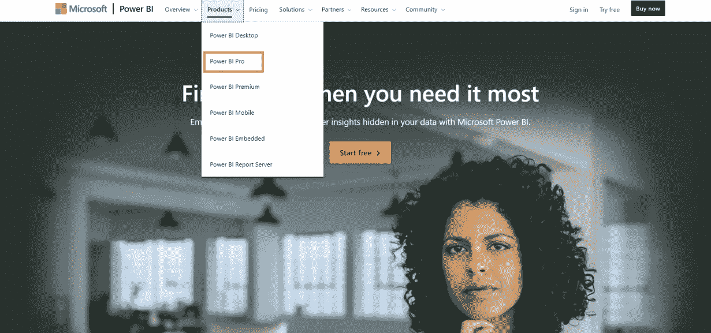
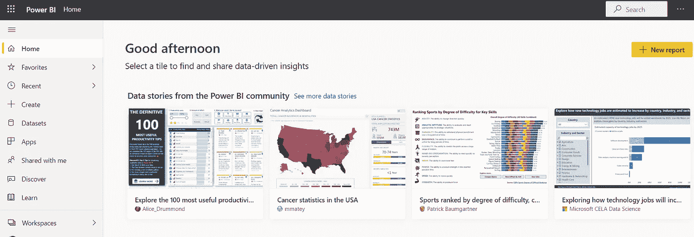

# Power BI 入门

> 原文：<https://medium.com/analytics-vidhya/getting-started-with-power-bi-8ca6860b4466?source=collection_archive---------31----------------------->

## 第一部分

## Microsoft Power BI 学习系列

作为一名数据分析师，必须深入研究错综复杂的数据。但是如果你对提供给你的数据不清楚，这样做是很困难的。了解数据的最好方法是创造可视化。

**数据可视化**是**数据**的图形化表示。通过使用图表、图形和地图等视觉元素，人们可以看到并理解**数据**中的趋势、异常值和模式。为此，数据可视化工具应运而生。

**数据可视化**工具提供了一种创建可视化的便捷方式。有各种各样的工具和技术可以做到这一点。但是为什么不说说最好的呢？

# 背景调查

2021 年 2 月，微软被定位为 2021 年 **Gartner 分析和商业智能平台魔力象限**的领导者。而且这已经不是第一次发生，而是连续第 14 年了。其中显而易见的原因是微软的流行工具 **Power BI。**

# 什么是 Power BI？

Power BI 围绕着商业智能的理念。因此，首先了解商业智能是至关重要的。

**商业智能**纯粹是将商业决策与业务及其环境的事实联系起来。这种想法不仅有助于深入了解业务背后的数据，还能让组织做出更好的业务和管理决策。为了帮助解决这一问题，Power BI 应运而生。

Power BI 由微软设计的强大工具组成，最终用户可以访问这些工具。Power BI 允许用户创建可视化效果，他们可以发布、操作并与同事共享。

# 为什么要 Power BI？

如果您是一名有抱负的数据分析师或数据科学家，那么与那些试图使用更难使用、功能更弱、协作性更差的工具来分析数据的人相比，learning Power BI 会给您带来优势。

# 先决条件

为了顺利使用 Power BI 工具，这里列出了开始使用之前需要满足的先决条件。

*   **足够的内存:**建议最低 1GB 内存(如果是 1.5GB 就更好了)
*   **CPU:** 一般建议 1GHz 以上。如果您有 x86 或 x64 位处理器，那就更好了。
*   **显示:**需要注意显示设置，这样你的视觉效果才不会偏离屏幕边缘。通常，1600 x 900 或 1440 x 900 的分辨率是首选。尽管它已经存在于大多数系统中，所以几乎没有必要改变它。
*   **Windows 版本:** Power BI 计划在 Windows 7 或 Windows Server 2008 R2 或更高版本上运行。

# Power BI 的组件

作为几个服务、工具和应用程序的集合，这个平台有三种不同的格式。这些是:

*   **Power BI Desktop** :用于创建和共享报表。
*   **Power BI 移动应用:**该版本广泛用于访问仪表盘和报告，并在 Windows、iOS 和 Android 上使用。
*   **Power BI 服务**:Power BI 服务一般用于在线查看报表。

# 注册 Power BI Pro

第一步:要开始使用 Power BI，您需要访问网站:[https://powerbi.microsoft.com/en-us/](https://powerbi.microsoft.com/en-us/)

第二步:点击产品-> Power BI Pro

[https://powerbi.microsoft.com/en-us/](https://powerbi.microsoft.com/en-us/)

第三步:下一步是点击网站上给出的'**免费试用'**按钮。之后，你应该通过你的工作电子邮件地址创建一个账户。

[https://powerbi.microsoft.com/en-us/power-bi-pro/](https://powerbi.microsoft.com/en-us/power-bi-pro/)

步骤 4:注册 Power BI 后，您将被重定向到 Power BI 仪表板，在那里您可以启动您的数据可视化之旅。

注册后的仪表板

这就是这篇博客的'**什么'**部分。“**如何”**部分从[第二部分](https://hemshree.medium.com/power-bi-data-sources-cc1227443d7)开始。

 [## Power BI 数据源

### Microsoft Power BI 学习系列

hemshree.medium.com](https://hemshree.medium.com/power-bi-data-sources-cc1227443d7) 

如果你有什么建议，欢迎和我分享！