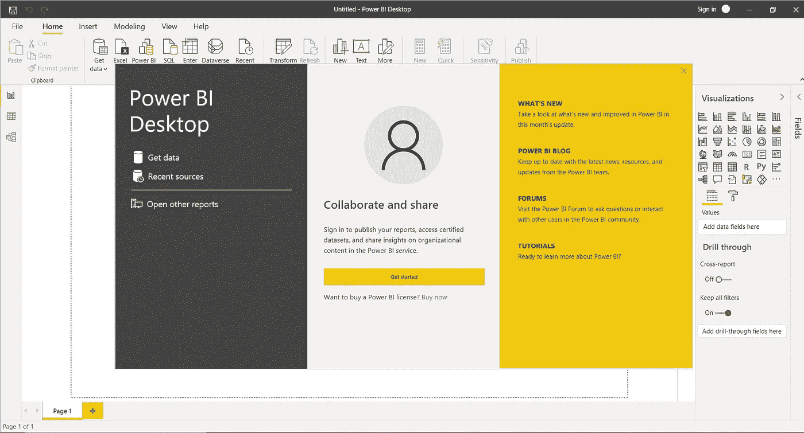
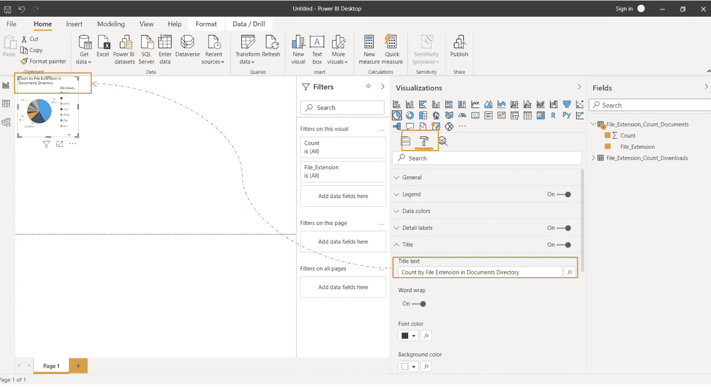

# 开始使用 Power BI Desktop —让我们创建饼图和圆环图！

> 原文：<https://medium.com/analytics-vidhya/getting-started-with-power-bi-desktop-lets-create-pie-donut-charts-3db00f276e4f?source=collection_archive---------8----------------------->

您是否刚刚开始使用 Power BI，不知道从哪里开始？
让我们创建一个饼图和圆环图来描述
各种文件扩展名及其在您电脑的两个目录中的分布。

让我们开始吧:

1.  下载并安装 PowerBI 桌面

[](https://powerbi.microsoft.com/en-us/desktop/) [## Power BI 桌面-交互式报告| Microsoft Power BI

### 利用触手可及的可视化分析，免费创建丰富的交互式报告。节省时间并使数据准备更容易…

powerbi.microsoft.com](https://powerbi.microsoft.com/en-us/desktop/) 

2.创建您的 csv 文件

以下是可以在 PowerShell 中执行的代码，用于创建 2 个 csv 文件，这些文件具有文件扩展名以及文件夹中该扩展名的文件数量。

```
cd C:\Users\user1\Documents# Getting to file extension count in Documents Folder 
$path_to_chk="C:\Users\user1\Documents"
$file_name=$path_to_chk -replace "C:\\Users\\user1\\", ""
$file_name = 'File_Extension_Count_' + $file_name + '.csv'
Get-Childitem $path_to_chk -Recurse | group Extension -NoElement | sort count -desc | select-object @{Name='File_Extension';Expression={$_.Name}},Count | export-csv -path $file_name | % {$_.Replace('"','')}
(Get-Content $file_name| Select-Object -Skip 1) | Set-Content $file_name# Getting to file extension count in Downloads Folder$path_to_chk="C:\Users\user1\Downloads"
$file_name=$path_to_chk -replace "C:\\Users\\user1\\", ""
$file_name = 'File_Extension_Count_' + $file_name + '.csv'
Get-Childitem $path_to_chk -Recurse | group Extension -NoElement | sort count -desc | select-object @{Name='File_Extension';Expression={$_.Name}},Count | export-csv -path $file_name | % {$_.Replace('"','')}
(Get-Content $file_name| Select-Object -Skip 1) | Set-Content $file_name
```

一旦执行了上面的代码，您应该能够看到生成了 2 个 csv 文件。


> 您可以跳过上述步骤，为您的 csv 文件创建模拟数据。这是你的自由意志。

2.启动您的 PowerBI 桌面



你可以选择签入或不签入，现在已经没有什么新奇的事情可以做了，所以你可以选择不签入。您可以关闭向导来开始。

3.选择数据源:获取数据→文本/CSV


4.选择文件并点按“打开”


5.一旦你点击“加载”，你应该可以看到一个新的表格


重复上述步骤导入另一个 csv 文件。一旦完成，您应该有 2 个表。


6.创建饼图和圆环图

双击饼图


将表中的字段拖放到如下所示的详细信息和值中。


适当修改标题文本。



同样，为另一个表创建一个圆环图。调整视觉效果的大小。


现在，您已经使用 PowerBI Desktop 创建了 2 个图表。

7.保存报告

