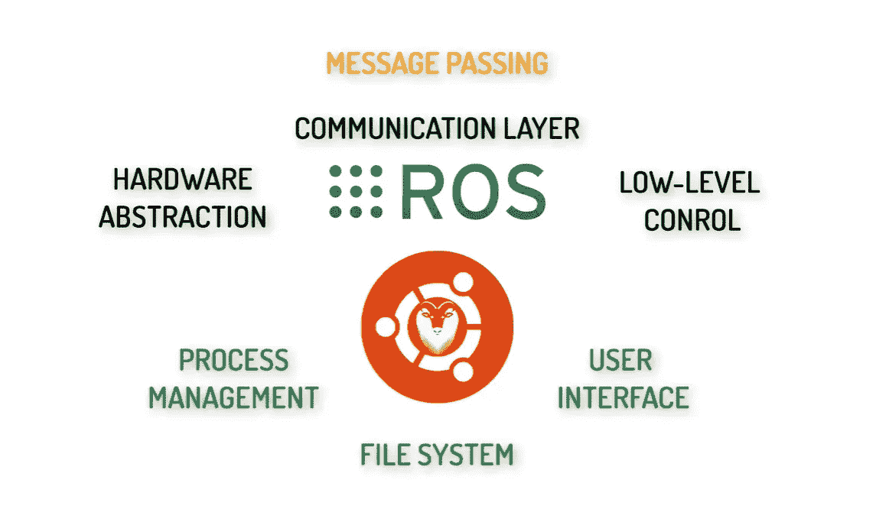
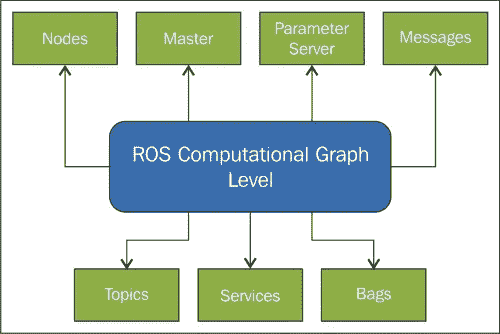
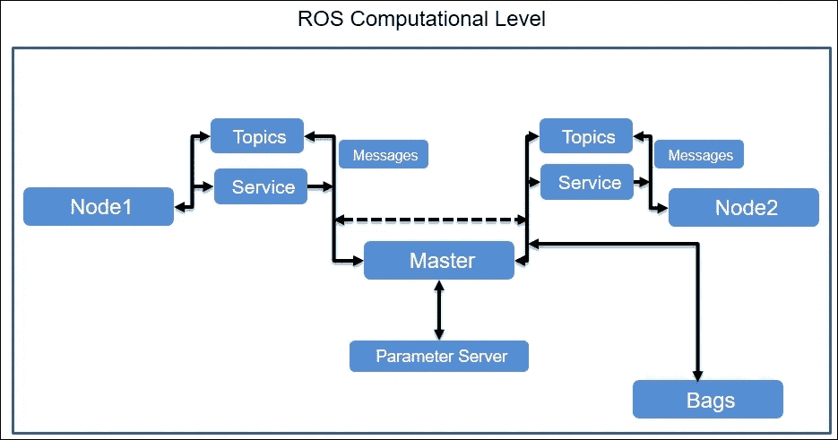

# 第 1 部分:ROS 入门——概述、安装和 ROS 计算图模型

> 原文：<https://medium.com/analytics-vidhya/getting-started-with-ros-overview-installation-and-ros-computational-graph-model-e94d7a16187f?source=collection_archive---------11----------------------->

# 概观

R **obot 操作系统(ROS)** 是一个用于编写机器人软件的灵活框架。这是一个由工具、库和约定组成的**集合**，其**旨在简化在各种机器人平台上创建复杂且健壮的机器人行为**的任务。

ROS 从 2007 年开始由柳树车库正式创建和开发。

ROS 目前由**开源机器人基金会**维护

机器人操作系统

在接下来的章节中，我们将讨论以下内容:

1.  ROS 的优势
2.  ROS 安装
3.  ROS 计算图模型

# ROS 的优势

## **1。ROS 充当元操作系统:**

*   典型的操作系统执行**调度**，即在需要时将 CPU、内存、磁盘空间、I/O 设备等资源分配给各种程序的角色，以及**硬件抽象**，即操作系统为软件提供一种访问硬件资源的简单方式，而无需了解硬件的内部细节。
*   在调度和硬件抽象方面，ROS 不是传统的 OS。然而，它**使用主机操作系统**(例如:Ubuntu)并促进进程间的通信。它是用于机器人软件开发的软件框架的集合，它提供了为异构计算机集群设计的服务，如硬件抽象、低级设备控制、常用功能的实现、进程间的消息传递和软件包管理。

ROS Meta OS(由 Surya Prakash via Udemy 提供)

## 2.代码重用和语言独立性

ROS 促进了代码重用，并非正式地支持各种语言，如 Python、C++、Lisp、Java 和其他语言。

## **3。开源**

ROS 是一个真正健壮的通用开源中间件套件，可以免费使用，任何人都可以为它的开发做出贡献。它是从底层建立起来的**鼓励协作机器人软件开发**

# ROS 安装

**先决条件:** Ubuntu OS

> **注意:**如果没有 Ubuntu OS，可以安装任何类似 Oracle 或 VM Ware 的虚拟盒子，然后安装 ROS。[点击此处](https://www.virtualbox.org/)下载甲骨文虚拟盒子

**ROS 安装:**根据你的 Ubuntu OS 版本不同，有不同的 ROS 发行版(版本)可用。

**比如:***ROS**Kinetic*distro 可以在 Ubuntu 16.04 上运行，*ROS**melody*可以在 Ubuntu 18.04 上运行， *ROS* *Noetic* 可以在 Ubuntu 20.04 上运行。

所以从这个 [**链接**](http://wiki.ros.org/ROS/Installation) **下载取决于你的 Ubuntu OS 版本的 ROS 发行版。**

自从有了 Ubuntu 18.04，我就按照这个 [**链接**](http://wiki.ros.org/melodic/Installation/Ubuntu) **的步骤下载了 ROS Melodic。你可以通过访问各个 ROS 发行版的链接来遵循这些步骤。**

> 在我们进入机器人软件的实际实现和编码之前，需要理解的最重要的事情之一是 ROS 计算图，并理解我们将广泛使用的各种组件。

# ROS 计算图模型

ROS 计算图是正在一起处理数据的 ROS 进程 **的**对等网络。ROS 的基本计算图组件是 **N *odes* 、 *Master* 、 *Parameter Server* 、M*messages*、S*services*、T *opics* 、**和 **B *ags*** ，它们都以不同的方式向图提供数据。****

ROS 计算图

*   [**节点**](http://wiki.ros.org/Nodes) :节点是**进程** **执行一些计算**。机器人控制系统通常由许多节点**组成，每个节点执行一项任务**。例如:一个节点控制激光测距仪，一个节点控制车轮电机，一个节点执行定位，一个节点执行路径规划等等。ROS 节点是使用 ROS 客户端库编写的，例如 roscpp 或 rospy。
*   [**主**](http://wiki.ros.org/Master):ROS 主是一个**服务器，跟踪所有节点的 IP 地址**。它为计算图的其余部分提供名称注册和查找。没有主节点，节点将无法找到彼此、交换消息或调用服务。
*   [**参数服务器**](http://wiki.ros.org/Parameter%20Server) :参数服务器允许数据通过密钥存储在一个中心位置。它目前是主文件的一部分。它基本上是一个常数仓库。
*   [**消息**](http://wiki.ros.org/Messages) :节点之间通过传递消息进行通信。**消息只是一种数据结构，由类型化字段**组成。标准原语类型(整数、浮点、布尔等。)和基元类型的数组。消息可以包括任意嵌套的结构和数组(很像 C 结构)。
*   [**主题**](http://wiki.ros.org/Topics) :消息通过具有发布/订阅语义的传输系统进行路由。节点通过将消息发布到给定的主题来发出消息。**主题是一个名称，用于识别消息**的内容。对某种数据感兴趣的节点将订阅适当的主题。**单个主题可能有多个并发发布者和订阅者，单个节点可能发布和/或订阅多个主题**。一般来说，发布者和订阅者并不知道彼此的存在。这个想法是把信息的生产和消费分离开来。从逻辑上来说，我们可以把一个主题想象成一个强类型的消息总线。每条总线都有一个名字，只要类型正确，任何人都可以连接到总线上发送或接收消息。
*   [**服务**](http://wiki.ros.org/Services) :发布/订阅模型是一种非常灵活的通信模式，但是在多对多通信的情况下，单向传输不适合请求/回复交互，而这在**分布式** **双向**系统中是经常需要的。因此，**请求/回复是通过服务完成的，服务由一对消息结构定义:一个用于请求，一个用于回复**。提供节点在一个名称下提供服务，客户通过发送请求消息并等待回复来使用该服务。ROS 客户端库通常向程序员呈现这种交互，就好像它是一个远程过程调用一样。
*   [**Bags**](http://wiki.ros.org/Bags) : Bags 是一种保存和回放 ROS 报文数据的格式。包是存储数据(如传感器数据)的重要机制，这些数据可能很难收集，但对于开发和测试算法是必要的。

> 现在我们已经看到了 ROS 计算图的不同组成部分，让我们来看看两个相互通信的节点的 ROS 计算图。

相互通信的两个节点的 ROS 计算图

# 摘要

通过这篇文章，我们介绍了以下内容:

*   ROS 概述
*   ROS 的优势
*   ROS 安装过程
*   ROS 计算图

# 资源

1.  [机器人操作系统—维基百科](https://en.wikipedia.org/wiki/Robot_Operating_System)
2.  [文档— ROS Wiki](http://wiki.ros.org/)
3.  [ROS/概念— ROS Wiki](http://wiki.ros.org/ROS/Concepts#:~:text=The%20Computation%20Graph%20is%20the%20peer-to-peer%20network%20of,provide%20data%20to%20the%20Graph%20in%20different%20ways.)
4.  [ROS 基础:程序机器人！| Udemy](https://www.udemy.com/course/ros-basics-program-robots/learn/lecture/8892586#overview)

# 反馈/建议:

如有任何反馈或建议，请在下面发表评论或发送邮件至**arsalan.anwar.7777@gmail.com**或通过 LinkedIn 联系我[www.linkedin.com/in/arsalananwar1998](http://www.linkedin.com/in/arsalananwar1998)