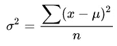
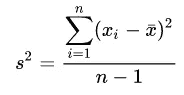

# 采样入门

> 原文：<https://medium.com/analytics-vidhya/getting-started-with-sampling-ca19265d2dc0?source=collection_archive---------13----------------------->

在这篇博客中，我们将会了解一些人口、样本和抽样的基本概念。:)

# 总体与样本

每次分析的开始都有数据。有时我们从可靠的来源获得数据，有时我们需要收集数据。但是不管是哪种情况，我们需要知道一些关于我们需要收集的数据的事情。人口和样本是其中一个重要的方面，就像我们需要一个样本还是整个人口。

## 人口

总体包括来自特定组的所有成员、所有可能的结果或感兴趣的度量。

**EX:** 如果要看 ABC 学校 w.r.t .身高的学生体重趋势，那么**人口**就是该校所有学生。

## 样品

它是通常通过随机选择值形成的总体的子集。

**EX:** 如果要看 ABC 学校 w.r.t .身高的学生体重趋势，那么**样本**就是该校的一组学生。

✔️✔️ **注:**应从总体中随机选择一个样本，以避免任何偏差并保持总体分布。

> 所以，所有与案件有关的数据都被认为是总体，我们必须始终追求总体。那我们什么时候去取样呢？

例如，我们需要关于印度人对议会法案的意见的数据。那我们就不会去问我们国家的每个人。对吗？在这种情况下，我们可能会去几个不同类别的人，如富人/穷人/中产阶级，不同职业和年龄类别的人等。所以，这里我们将有一个**样本**数据在最后，它有望代表总体。

## 🧐Questions 给你:

(决定我们应该选择样本还是总体)

1.  在你的州或国家，人们最喜欢什么，猫还是狗？
2.  你所在学校/学院的学生对某项活动的反馈。

## 取样❓的需要🤔

1.  人口太多了。因此，对非常大的数据应用统计将花费更多的时间和计算成本。
2.  统计程序也取决于我们是在研究样本还是总体。

例如，人口方差计算如下

从[这里得到公式](https://www.statsdirect.com/help/basics/degrees_of_freedom.htm#:~:text=The%20concept%20of%20degrees%20of,from%20an%20estimate%20of%20another.)

而样本的方差计算如下

这里 **n** =人口或样本的规模。我们可以看到，在样本的情况下，(n-1)是在分母([贝塞尔修正](https://en.wikipedia.org/wiki/Bessel%27s_correction))。

3.人口**不可及**。例如，如果我们想得到一个国家教师的工资，那么就很难接触到每个人并收集数据。除此之外，我们可以从附近机构的随机教师群体中收集数据。

4.使用适当的方法和足够大的样本量，从样本中获得的结果通常几乎与从总体中获得的结果一样准确。

✔️✔️ **注意:**我们处理的大部分数据都是样本数据。

> 在接下来的博客中，我们将讨论不同的抽样方法以及如何确定样本量。**敬请关注……..**

***附言*** *我开始了这个名为“统计入门”的博客，但是这个抽样话题本身变得如此之大，以至于现在我决定就此制作一个系列*😅*。*

请随意发表您的问题和反馈。 ***快乐数据科学！！*** 😇