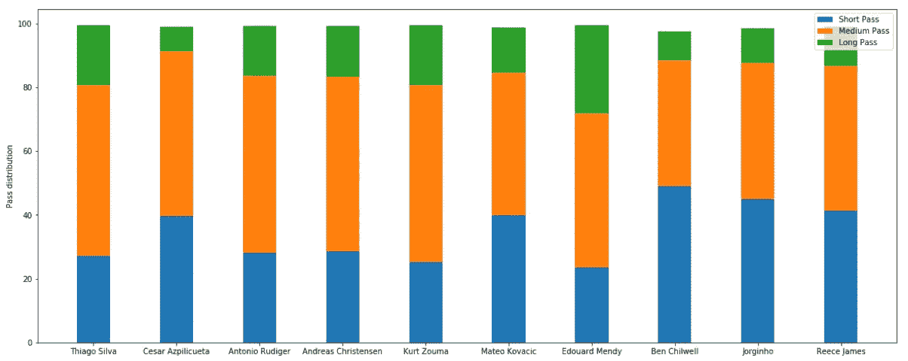
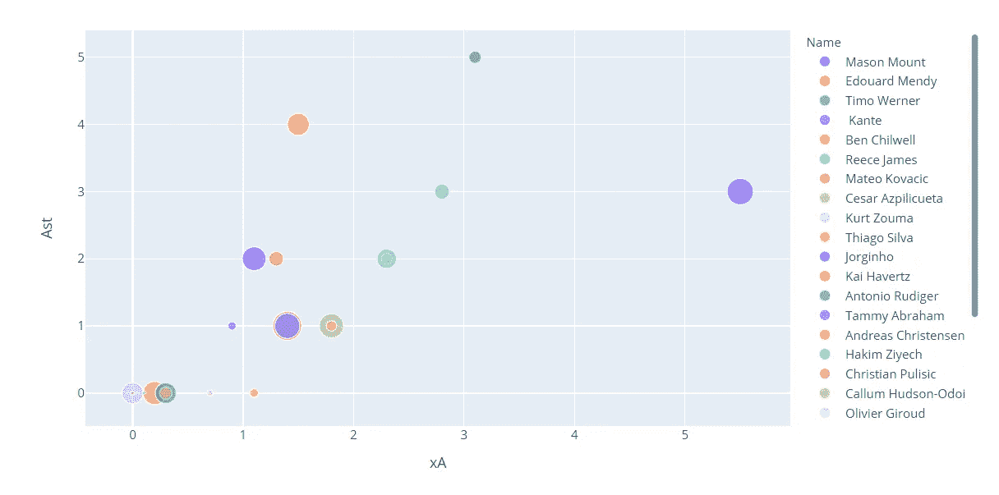
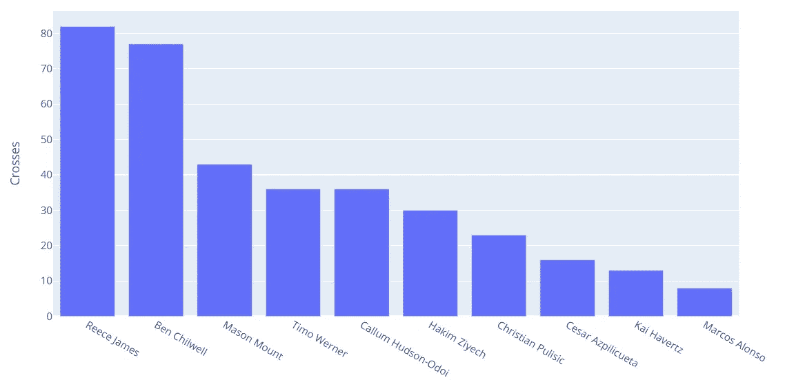

# 体育分析入门

> 原文：<https://medium.com/analytics-vidhya/getting-started-with-sports-analytics-88f4cf0b215e?source=collection_archive---------15----------------------->

大多数人都喜欢运动，他们试图找到一种职业，这种职业可以帮助他们与他们最喜爱的运动联系起来，这就是我一年多前开始从事数据科学的原因。我热爱足球，一直希望我的工作和我的日常生活与它相关，今天这是我尝试和深入足球分析世界的第一步。

我们将从分析我最喜欢的俱乐部切尔西俱乐部球员的传球数据开始。这些数据包含了 2020-21 赛季切尔西阵容中球员的信息。对于那些不了解切尔西的人来说，他们目前在英超联赛中排名第四，是欧洲最好的球队之一。现在开始有趣的部分，

数据包括比赛次数、尝试传球次数、完成传球次数、球员完成传球的身体部位等等。数据从 [Fbref](https://fbref.com/en/squads/cff3d9bb/Chelsea-Stats) 获得。

**假设给定的任务是从质量和数量上找出最佳传球者。**

1.在足球界，他们说你可以整天传球，但如果你不得分，你就不能赢，所以我们要看的第一件事是“渐进式传球”，即传球覆盖了朝向对手球门的一定距离，而不是向后或向侧面，现在完成传球也是一件重要的事情，因此我们也要考虑到这一点。

下图给出了传球的分布，即前 10 名球员的短、中和长传球，这些球员的传球进步最大，精确度最高。

最进步传球者的短传球、中传球和长传球的百分比

上图中的所有这些人都是后卫和防守型中场，考虑到他们比进攻者有更多的时间和空间，传球对他们来说更容易，这是正确的。

现在让我们给攻击者一个展示他们价值的机会。

2.最好的前锋球员真的会在对方的三分之一区域发光，这就是他们的价值所在。助攻进球的人得到了掌声，但创造机会的人呢？那些本该把握机会的人迷失了方向，不知何故错过了机会，正因为如此，预期助攻才被计算出来。

预期助攻数与助攻数

在上图中，圆圈的大小表示最后三分之一的通过次数。自然，我们希望攻击者有一个更大的圈子。右边的蓝色大圆圈代表梅森蒙特。我们希望他能有 5 次以上的助攻，但是由于其他人的帮助，他只有 3 次。在顶端的人，即蒂莫·韦尔纳有更多的助攻，即使他在对手三号位的传球比梅森蒙特少得多。

3.另一种重要的传球是“传中”。边路的球员一般都是需要擅长的。让我们来识别球的顶部交叉。

切尔西球员的传中

里斯·詹姆斯和本·奇尔威尔是切尔西的后卫，你不需要太多的足球知识就能从上图中看出他们喜欢向前传球。另一方面，马科斯·阿隆索(右边的小横杆)也是一名后卫，但他非常了解头球，并且身高 6 英尺 2 英寸，因此他自己进入了禁区。

希望你得到了一些足球知识！将为您带来更多的体育分析…