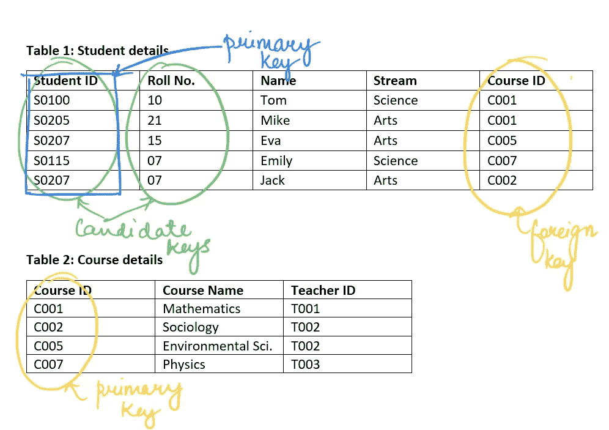

# SQL 入门！(第一部分)

> 原文：<https://medium.com/analytics-vidhya/getting-started-with-sql-part-1-b5ae9cc474ed?source=collection_archive---------7----------------------->


克里斯蒂娜·朗普夫在 [Unsplash](https://unsplash.com?utm_source=medium&utm_medium=referral) 上拍摄的照片

作为数据科学家或数据分析师，分析和预测是次要任务，最重要的技能是管理、理解和处理数据。SQL 是与数据和数据库交朋友的一种方式。SQL 帮助我们快速获取和理解复杂的数据。这个博客将帮助你开始学习 SQL 的基础知识。

*首先，让我们通过一些必须知道的术语来更好地理解数据库管理系统..*

*   **数据**是文本、数字、图片、音频或视频形式的事实或一组值的集合。数据在任何组织中都是非常重要的一部分，因此需要安全且易于访问。
*   数据库被称为数据仓库。有各种类型的数据库，我们感兴趣的是关系数据库。
*   **数据库管理系统(DBMS)** 是一个用来管理数据库的应用。
*   **关系数据库**以关系或表格的形式存储数据。表由表示实体属性的列组成，行是记录或观察结果。
*   **关系型数据库管理系统****【RDBMS】**顾名思义就是用来管理关系型数据库的应用，可以查询。
*   **模式**是数据库的逻辑结构，表示数据如何存储和组织，以及数据库实体如何相关。模式并不在物理上存储数据，而只是给我们一个数据的形状、约束和关系的概述。
*   **键**是应用于表格列的约束或限制。它们用于唯一地标识和从表中获取记录。
    1。**候选关键字-** 可以唯一标识记录并被视为主键的列。
    2。**主键-** 对每条记录都有唯一值的键/列。它不能有空值。每个表只能有一个主键，因为它为每个记录提供了唯一的标识。
    3。**备选关键字-** 未被用作主键的候选关键字。
    4。**外键-** 引用其他表的主键的一个表的列。



来源:作者

**结构化查询语言(SQL)** 是与关系数据库管理系统交互的标准语言。

SQL 命令可以分为:

*   **数据定义语言—** DDL 命令帮助定义数据库或其对象的结构。它们包括创建、修改或删除数据库或表等操作。**创建、更改、删除、重命名、截断**
*   **数据操作语言—** DML 命令用于修改数据库。**插入、删除、更新**
*   **数据查询语言—** DQL 语句用于对数据执行查询，或者只是根据需要的条件提取数据。**选择**
*   **数据控制语言—** 处理数据库系统的权限。DCL 命令帮助授予或收回数据库用户的访问权限。**授予，撤销**
*   **事务控制语言—** TCL 命令处理数据库中的事务，只能与 DML 命令一起使用。**提交、回滚、保存点**

让我们继续学习 SQL 命令的一些基本实现..

1.  **创建数据库**

```
**CREATE DATABASE** database_name**;**
```

要检查数据库是否已创建，或者检查哪些数据库已经存在，请使用以下命令-

```
**SHOW DATABASES;**
```

创建数据库后，运行以下查询，以便在后续查询中利用特定的数据库-

```
**USE** database_name**;**
```

**3。创建表格**

可以在数据库中创建一个或多个表。

```
**CREATE TABLE** table_name(column_name_1 data_type1 constraint1,
                        column_name_2 data_type2 constraint2,
                        column_name_3 data_type3 constraint3,
                        ... 
                        );
```

数据类型定义将存储在列中的值的类型。我们可以使用像 int、float、decimal、double、char、varchar、datetime、year 等数据类型。
约束是对列的限制，用于限制可以存储在其中的值的类型。常用的约束有-非空、唯一、主键、外键、默认值、索引

若要检查该表是否已创建，或检查数据库中的可用表，请使用以下查询-

```
**SHOW TABLES;**
```

**2。插入数值**

```
**INSERT INTO** table_name (column_name1, column_name2, column_name3..)
                **VALUES** (value1, value2, value3..); 
```

上面提到的是向表中插入新记录的一种方法。下面给出了另一种方法，不使用列名。使用此方法时，请确保使用与表中列相同的顺序。

```
**INSERT INTO** table_name **VALUES** (value1, value2, value3..);
```

**3。选择查询**

```
**SELECT * FROM** table_name;
```

这里， ***** 用于选择或查看表格中的所有列。
要查看表中的特定列，请使用-

```
**SELECT** column_name1, column_name2.. **FROM** table_name;
```

**4。描述表**

```
**DESCRIBE** table_name**;**
**DESC** table_name**;**
```

该命令为我们提供了表结构的概述—列/字段的名称、存储在列中的数据类型、列是否可以存储空值、键类型

**5。更新记录**

要修改表中的现有记录，我们可以使用 update 语句。

```
**UPDATE** table_name **SET** column_name1 = value1, column_name2 =value2,.. **WHERE** condition**;**
```

上述语句中的 WHERE 子句指定需要更新哪些记录。如果您需要一些特定的更改，不要忘记 WHERE 子句，否则它将更新该列中的所有记录。

**6。删除记录**

```
**DELETE FROM** table_name **WHERE** condition**;**
```

这将根据指定的条件从表中删除现有记录。

*编写 SQL 查询时要记住的几点:*

*   每个查询都应该以一个**分号**(；)
*   SQL**不区分大小写**

*感谢您的阅读！请继续关注下一篇博客，我们将了解如何使用 SQL 检索和过滤数据。*

*连接:*linkedin.com/in/akshada-gaonkar-9b8886189