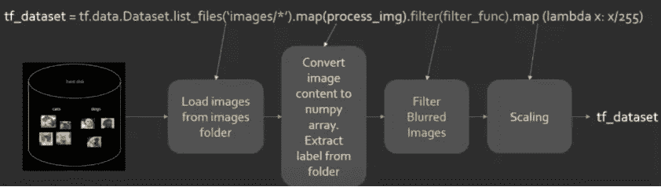
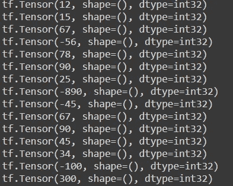
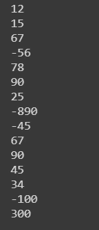
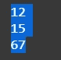
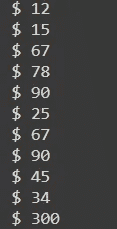
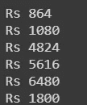
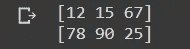
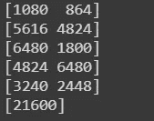

# Tensorflow 输入管道入门

> 原文：<https://medium.com/analytics-vidhya/getting-started-with-tensorflow-input-pipeline-aa0f31eea74a?source=collection_archive---------4----------------------->

TensorFlow 输入管道入门指南(tf.data.dataset)

# 介绍

嘿大家好，

这是一篇关于如何使用 **Tensorflow 的输入管道的相对快速简单的文章。对于许多人来说，它仍然是一个黑匣子，因为它的文档不太友好，类和不同 API 的复杂性但是我觉得它相对容易。在这里，我们不打算探究本质和细节，相反，我们将看看如何使用它，并且我们还将编写一些代码来获得实践经验**。**此外，如果您有任何疑问，请在下面的评论区提问，我会尽快回复。**

# 议程

文章分为两部分:

- ***理论部分*** :快速直观地涵盖所有要点，让您快速入门

- ***编码部分*** :用于一些动手练习。我们将在基础上工作，并将它们应用到图像数据集(猫和狗)。

**我会敦促你按照你的编码部分，建立概念。**

# 第 1 部分-理论

# 什么是张量流输入管道

输入管道是`tf.data` *api* 中提供的一个快速简单的工具，可以用简单的可重用代码和几行代码创建复杂的输入管道。它还允许处理大量数据，从而使低端机器在计算数据方面具有优势。

它通过将数据包装到 `tf.data.dataset`类中并对其执行一系列操作来实现，这些操作称为 ETL - **提取、转换、加载。**

# 有什么好处

使用它的好处如下:

1.**加载数据:**数据以`tf.data.dataset` 结构或批处理的方式分块加载，允许在保留内存空间的同时管理和加载大量数据。此外，它允许支持不同的数据格式和类型，包括云存储(S3)。

2.**数据处理/扩充:-** 一般来说，这是通过`Pandas, Numpy -`文本/表格/数字数据，或`Keras ImageDataGenerator / OpenCV-`图像数据来完成的。**但是在这里，它可以在输入管道本身中执行，从而在编码的同时允许更快和快速的原型制作**。*过滤、贴图、调整大小、裁剪*等等。

3.**最后一行:**所有这些都可以在一行代码中完成，从而节省内存空间。下面是它的一个简短片段和解释:



通用输入管道

4.它支持企业的分布式和并行计算，这对于云计算和大数据至关重要。

注意:- Tensors 是`tf.data.dataset`背后的底层数据结构，所以它不同于 **NumPy 数组或 Pandas dataframe。不要弄错了😉。**

# 第 2 部分-编码

# 1.基础

现在，让我们来看一些我们需要开始的基本材料。所以“首先”加载我们的数据。

# 加载数据

我们可以使用的最基本的东西是使用`tf.data.dataset.from_tensor_slices(list)` 从 python 列表中加载数据，如下所示:

```
# importing library
**import** tensorflow **as** tf # creating a list object- monthly expenses in dollars 
dataset = [12,15,67,-56,78,90,25,-890,-45,67,90,45,34,-100,300]

# creating tf.data.dataset object  
tf_dataset = tf.data.Dataset.from_tensor_slices(dataset) tf_dataset
```

# 查看内容

由于`tf_dataset`是一个张量数据类型，我们可以遍历它来查看它的所有内容:

```
# view the content by iterating
for i in tf_dataset:
    print(i)# retunrs
```



上述代码的结果

很明显，这个内容视图并不是很有用，因为它包含了许多其他对用户不友好的元素。所以我们可以做的一件简单的事情就是调用`no.numpy()`或`tf_dataset.as_numpy_iterator()`将数据转换成一个 **NumPy** 数组并只打印元素。它可以实现为:

```
# Converting the tensor to numpy object using ```numpy()```
for i in tf_dataset:
    print(i.numpy())or # Or use tf_dataset.as_numpy_iterator  
for i in tf_dataset.as_numpy_iterator():     
    print(i)# Returns
```



仅以 Numpy 数组的形式返回值

如您所见，以这种格式查看数据要方便得多。**注意这只对数字数据类型有效，对字符串无效！**

我们也可以使用`take(no)`方法只查看指定数量的数据点**()。T** *他的代码位看起来是这样的:*

```
# Converting the tensor to numpy object using ```numpy()```
for i in tf_dataset.as_numpy_iterator():     
    print(i)# Returns
```



仅返回 3 个元素

# 过滤数据

我们在数据集中有许多**负值(-ve)** 值，所以一个显而易见的事情是只过滤 ***正值(+ve)*** 的数据。使用 i *nput 管道 api* ，可以使用`tf_dataset.filter(custom_fn)`来完成:

```
# lambda x : x>0 - fn to return the positivetf_dataset = tf_dataset.filter(lambda x : x>0)for i in tf_dataset.as_numpy_iterator():
    print('$ '+str(i))#returns 
```



返回大于 0 的值

可以看出，只有正值被返回，所以我们的过滤器工作得很好，是一种快速过滤数据集的便捷方式。

# 映射数据

通常我们需要**在整个数据集**上处理某个过程，一个接一个地做有点乏味。想想用户的 tensorflow 提供了一个`map()`方法，可以在数据集上调用它，并在一行代码中完成我们的工作。**自定义函数被提供给**，它将该过程应用于整个数据集。我们可以这样做:

```
# using map fn 
# lambda x : x*72 - multiplies the value by 72for i in tf_dataset.map(lambda x : x*72):
    print('Rs '+str(i.numpy()))# returns
```



返回值为 Rs

在这里，我们使用等式 **₹ = $*72** 将数据从美元转换为₹，在`map`的帮助下，我们 ***将每个元素乘以 72*** 来进行转换。

# 洗牌数据

在进行图像分析甚至数据准备时，我们经常需要打乱数据集。这可以通过`tf_dataset.shuffle()` a 方法来实现，该方法将**缓冲区**作为参数，并根据*缓冲区获得的*个元素(窗口)来随机洗牌。

我们可以用它来洗牌，非常方便:

```
for i in tf_dataset.shuffle(3):
    print(i.numpy())# returns
```


返回混洗的值

可以看出，**一些值已经被打乱，从而使我们的数据集具有随机性，没有训练集所需的固定顺序**。

# 批处理数据

在进行图像分析甚至数据准备时，我们经常需要打乱数据集。这可以通过`tf_dataset.shuffle()`来实现，该方法以**缓冲区**为参数，并根据*缓冲区获取的【窗口】元素数量*随机洗牌数据集。

我们可以用它来洗牌，非常方便:

```
for i in tf_dataset.batch(3):
    print(i.numpy())# returns
```



数据分成大小为 2 的批，每批 3 个元素

**如图所示，数据集被分成大小为 2 的批次，每个批次包含 3 个元素**。*这允许高效地处理大型数据集，并在没有很多资源的机器上工作* —考虑一个 8Gb 的 ram，包含 100 万个数据样本🤓。

# 链接呼叫

关于 `tf.data` api 的一个好处是，它允许**链接**所有的方法，并在一行代码中完成所有上述步骤(*加载、过滤、映射、混排、批处理*，等等)。我们这样做的方法是使用一个`'.'`操作符

```
# one liner using '.
# reading + filtering + mapping + shuffling + batching in one  line
tf_dataset_new = tf.data.Dataset.from_tensor_slices(dataset).filter(lambda x: x>0).map(lambda a: a*72).shuffle(2).batch(2)for i in tf_dataset_new.as_numpy_iterator():
    print(i)#returns
```



返回已处理的数据集

*由于批处理时最后一个数据点是奇数，没有配对，对于 2 的混洗，对于* ***每个窗口，即*** *，除了最后一个以外，返回值为 2。更多信息请点击* 查看[](https://stackoverflow.com/questions/53514495/what-does-batch-repeat-and-shuffle-do-with-tensorflow-dataset)

*因此，这些是一些快速代码，您可以尝试，并启动和运行大多数输入管道任务。*

*接下来:通过为**猫&狗图像数据集**制作输入管道来应用我们的学习。*

# *参考*

*对于那些想了解更多内容的人，这里有一些很好的参考资料:*

**有关输入管道的更多信息，请访问[https://www.tensorflow.org/api_docs/python/tf/data/Dataset](https://www.tensorflow.org/api_docs/python/tf/data/Dataset)*

*   *代码笔记本:[基础知识](https://colab.research.google.com/drive/11dlXiEWDGw-YEsiKo8-JUE4BehRwy-RA?usp=sharing)*
*   *教程视频+通用输入管道图片致谢: [CodeBasics](https://youtu.be/VFEOskzhhbc)*

*谢谢😄*