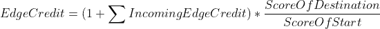
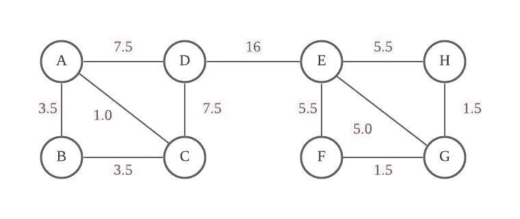

# 格文-纽曼——网络分析中的聚类技术第一部分

> 原文：<https://medium.com/analytics-vidhya/girvan-newman-the-clustering-technique-in-network-analysis-27fe6d665c92?source=collection_archive---------2----------------------->

在 [Unsplash](https://unsplash.com?utm_source=medium&utm_medium=referral) 上 [Merakist](https://unsplash.com/@merakist?utm_source=medium&utm_medium=referral) 拍摄的照片

格文-纽曼方法根据边的介数来分离网络。

# 介绍

如今，随着技术的进步，网络分析的重要性越来越受到人们的关注。许多系统都是以网络的形式出现的，我们可以在与网络相关的数据应用中使用网络分析。例如，我们可以在社交媒体平台(如脸书或 Twitter)的好友建议中使用网络分析。此外，我们还可以根据 CRM(客户关系管理系统)找到潜在客户。

格文-纽曼方法是经典的社区聚类技术之一。通过使用该算法，我们可以将网络划分为社区，社区发现可以作为数据预处理的一个良好开端。

> 参考:格文 M，纽曼 ME (2002)社会和生物网络中的社区结构。美国国家科学院学报 99(12):7821–7826

# 社区检测

格文-纽曼将在每次迭代中移除具有最大**边介数**的边。

> 边介数:通过该边的最短路径数。

图一。GN 示例

从图中可以看出，边{D，E}将具有最大的边介数。通过去除边缘，它将形成两个社区。

## **格文-纽曼迭代:**

首先，我们需要计算图中每条边的边介数

1.  选择一个节点 X，进行 BFS，找出从节点 X 到每个节点的最短路径数，并将这些数作为得分分配给每个节点。
2.  从叶节点开始，我们通过(1 +(节点的边信用的总和))*(目的节点的分数/起始节点的分数)来计算边的信用
3.  计算图 G 中所有边的边信用，并从步骤 1 开始重复。直到选择了所有的节点
4.  将我们在步骤 2 中计算的所有边信用值相加，然后除以 2，结果就是边的边介数。

接下来，我们移除具有最高介数的边，并且重复直到我们找到好的社区分裂。

5.移除中间值最高的边

6.计算社区分裂的模块性 Q

7.如果 Q 大于 0.3–0.7，从步骤 1 开始重复。

模块化公式

## 例子

我们将以下图为例。

图二。示例图表

首先，我们选择节点 H，找出从节点 H 到每个节点的最短路径数。

图 3。第一步

我们把图表重新排列成树状，这样更容易理解。

很明显，从节点 G 到 H 的最短路径只有一条，就是{GH}。因此，我们将 1 赋给节点 G 作为节点得分。

同样，从节点 F 有 2 条最短路径，它们是{FEH，FGH}。

边 EG 和 AC 可以被忽略，因为它们的节点在 BFS 树中处于相同的深度，并且在计算最短路径时不会被考虑在内。

接下来，我们需要使用下面的公式计算从叶节点(节点 B)开始的每条边的信用，其中分数是在步骤 1 中计算的。

图 4。第二步

我们从叶节点(节点 B)开始，没有到节点 B 的传入边，我们把最初的 1 拆分成两条边，所以 BA = BC = 0.5。根据公式，我们可以计算上图中的每个边缘信用。

接下来，我们选择一个不同的节点，并重复相同的过程，直到所有的节点都被选中。图 5 显示了选择节点 G 的情况。

图 5。选择节点 G

选择所有节点后，我们将步骤 2 中计算的所有边信用值(图中的红色数字)相加，然后除以 2。图 6 显示了图的结果边介数中心性。

图 6。边介数中心性

不出所料，DE 具有最高的边介数，从而我们去掉了边 DE，形成了两个社区。

接下来，我们需要计算模块性 Q，看看它是否是一个有效的分区。如果 Q 不满足模块化阈值，我们使用更新的图从第一步开始重复。

模块化公式

，在哪里

*   如果在原始图中节点 I 连接到节点 j，A_ij = 1
*   m =原始图中的边数
*   k_i，k_j =更新图中节点 I，j 的度

# 结论

聚类方法有很多，格文-纽曼聚类法是利用网络分析的经典划分聚类方法之一。在实践中，我们能够利用聚类技术来简化数据集，并进一步提高模型性能。

感谢您的阅读，祝您有美好的一天。

 [## 格文-纽曼——网络分析中的聚类技术第二部分

### 格文-纽曼方法根据边的介数来分离网络。

medium.com](/analytics-vidhya/girvan-newman-the-clustering-technique-in-network-analysis-part-2-a62dfdde11e)