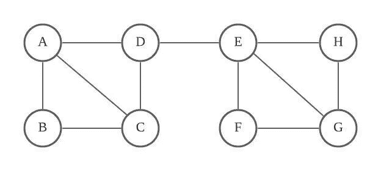
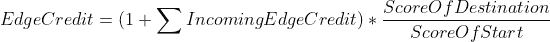
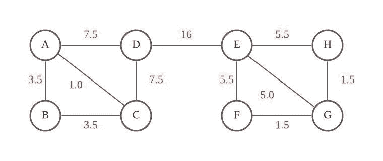
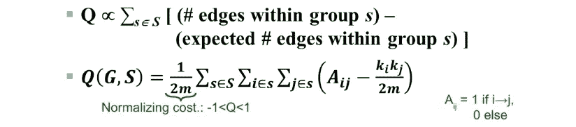
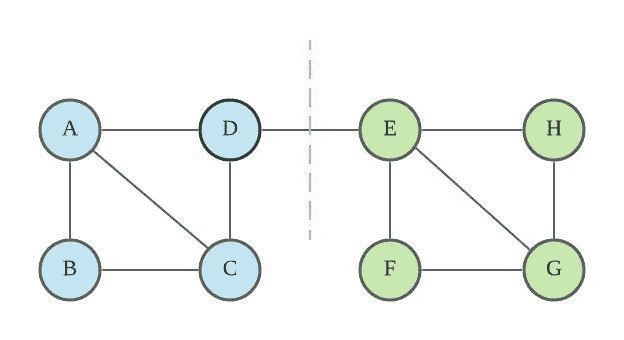
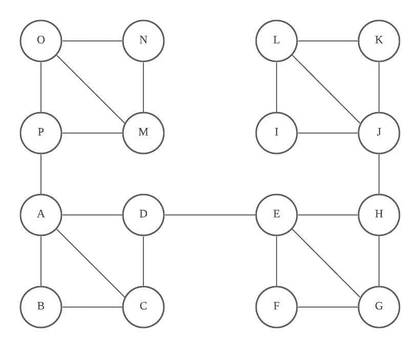
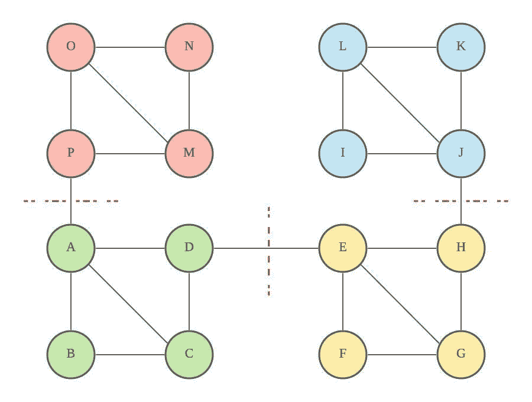

# 格文-纽曼——网络分析中的聚类技术第二部分

> 原文：<https://medium.com/analytics-vidhya/girvan-newman-the-clustering-technique-in-network-analysis-part-2-a62dfdde11e?source=collection_archive---------1----------------------->


约瑟夫·巴里恩托斯在 [Unsplash](https://unsplash.com?utm_source=medium&utm_medium=referral) 上拍摄的照片

格文-纽曼方法根据边的介数来分离网络。

# **简介**

格文-纽曼方法是一种经典的社区聚类技术，它根据边的介数来划分网络。通过使用该算法，我们可以将网络划分为社区，社区发现可以作为数据预处理的一个良好开端。

在这个例子中，我们将使用 Python 实现格文-纽曼聚类算法。请参考我以前的帖子，了解算法的详细信息。

所有代码都可以在 [github](https://github.com/chiang9/Medium_blog/blob/main/network_analysis/GN.ipynb) 上找到。

[](/analytics-vidhya/girvan-newman-the-clustering-technique-in-network-analysis-27fe6d665c92) [## 格文-纽曼——网络分析中的聚类技术

### 格文-纽曼方法根据边的介数来分离网络。

medium.com](/analytics-vidhya/girvan-newman-the-clustering-technique-in-network-analysis-27fe6d665c92) 

# 入门指南

首先，我们将使用 edge_dict 定义一个示例图，其中边字典包含边连接。我们将使用前一篇文章中的例子。



图一。样本图表

```
defaultdict(<function __main__.<lambda>()>,
            {'a': ['b', 'c', 'd'],
             'b': ['a', 'c'],
             'c': ['a', 'b', 'd'],
             'd': ['a', 'c', 'e'],
             'e': ['d', 'f', 'g', 'h'],
             'f': ['e', 'g'],
             'g': ['e', 'f', 'h'],
             'h': ['e', 'g']})
```

## 计算当前图形的介数值

我们使用下面的公式来计算边缘信用。通过遍历所有的顶点，我们可以通过对所有的边积分求和得到边的介数。



```
defaultdict(<function __main__.calculate_btw_and_communities.<locals>.<lambda>()>,
            {('e', 'f'): 5.5,
             ('e', 'g'): 5.0,
             ('e', 'h'): 5.5,
             ('d', 'e'): 16.0,
             ('a', 'b'): 3.5,
             ('a', 'c'): 1.0,
             ('a', 'd'): 7.5,
             ('c', 'd'): 7.5,
             ('b', 'c'): 3.5,
             ('g', 'h'): 1.5,
             ('f', 'g'): 1.5})
```



图二。边缘介数值

## 计算最佳社区

我们反复删除具有最高介数值的边，目的是优化模块性。



模块化公式

```
remove edges [('d', 'e')] with betweenness value around 16.0
update best modularity of community split -inf ---> 0.3016528925619835

remove edges [('a', 'b'), ('a', 'd'), ('c', 'd'), ('b', 'c'), ('e', 'f'), ('e', 'h'), ('g', 'h'), ('f', 'g')] with betweenness value around 1.5
modularity after split = 0.08677685950413223, which is lower than best split 0.3016528925619835
```

基于该结果，我们能够通过移除边缘(d，e)来获得最佳社区分裂。



图 3。最佳社区拆分

# 更复杂的网络

接下来，我们将生成一个更复杂的网络。



图 4。样本图表 2

```
remove edges [('d', 'e')] with betweenness value around 64.0
update best modularity of community split -inf ---> 0.2797731568998111

remove edges [('a', 'p'), ('h', 'j')] with betweenness value around 16.0
update best modularity of community split 0.2797731568998111 ---> 0.3648393194706995

remove edges [('a', 'b'), ('a', 'd'), ('c', 'd'), ('b', 'c'), ('e', 'f'), ('e', 'h'), ('g', 'h'), ('f', 'g'), ('j', 'k'), ('k', 'l'), ('i', 'j'), ('i', 'l'), ('m', 'n'), ('m', 'p'), ('o', 'p'), ('n', 'o')] with betweenness value around 1.5
modularity after split = 0.08506616257088848, which is lower than best split 0.3648393194706995
```

基于该结果，我们能够通过移除边(d，e)，(a，p)，(h，j)来获得最佳社区分裂。



图 5。拆分后的最佳社区

# 结论

网络分析是一种处理网络数据的有用技术。在实践中，我们可以将图论应用于各种场合，例如，社交网络或基于用户行为的推荐系统。

感谢您的阅读，祝您有美好的一天。